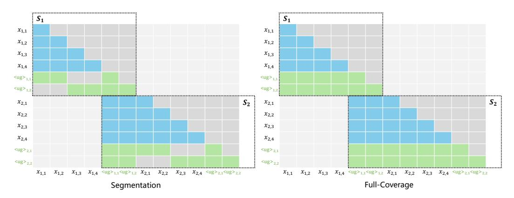
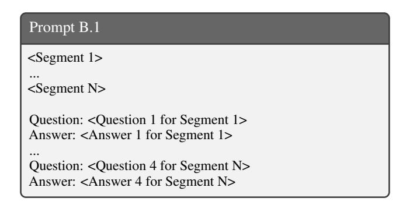

# References

- [1] Ntk-aware scaled rope, 2023.
- [2] Sharegpt, 2023.
- [3] Y. Bai, X. Lv, J. Zhang, H. Lyu, J. Tang, Z. Huang, Z. Du, X. Liu, A. Zeng, L. Hou, Y. Dong, J. Tang, and J. Li. Longbench: A bilingual, multitask benchmark for long context understanding. *arXiv preprint arXiv:2308.14508*, 2023.
- [4] A. Bulatov, Y. Kuratov, and M. S. Burtsev. Scaling transformer to 1m tokens and beyond with RMT. *CoRR*, abs/2304.11062, 2023.
- [5] S. Chen, S. Wong, L. Chen, and Y. Tian. Extending context window of large language models via positional interpolation. *arXiv preprint arXiv:2306.15595*, 2023.
- [6] Y. Chen, S. Qian, H. Tang, X. Lai, Z. Liu, S. Han, and J. Jia. Longlora: Efficient fine-tuning of long-context large language models. *arXiv preprint arXiv:2309.12307*, 2023.
- [7] A. Chevalier, A. Wettig, A. Ajith, and D. Chen. Adapting language models to compress contexts. In H. Bouamor, J. Pino, and K. Bali, editors, *Proceedings of the 2023 Conference on Empirical Methods in Natural Language Processing, EMNLP 2023, Singapore, December 6-10, 2023*, pages 3829–3846. Association for Computational Linguistics, 2023.
- [8] L. Dacheng, S. Rulin, X. Anze, S. Ying, Z. Lianmin, E. G. Joseph, S. Ion, M. Xuezhe, and Z. Hao. How long can open-source llms truly promise on context length?, June 2023.
- [9] D. Dai, C. Deng, C. Zhao, R. X. Xu, H. Gao, D. Chen, J. Li, W. Zeng, X. Yu, Y. Wu, Z. Xie, Y. K. Li, P. Huang, F. Luo, C. Ruan, Z. Sui, and W. Liang. Deepseekmoe: Towards ultimate expert specialization in mixture-of-experts language models, 2024.
- [10] T. Dao. Flashattention-2: Faster attention with better parallelism and work partitioning. *CoRR*, abs/2307.08691, 2023.
- [11] P. Dasigi, K. Lo, I. Beltagy, A. Cohan, N. A. Smith, and M. Gardner. A dataset of informationseeking questions and answers anchored in research papers, 2021.
- [12] A. Fabbri, I. Li, T. She, S. Li, and D. Radev. Multi-news: A large-scale multi-document summarization dataset and abstractive hierarchical model. In A. Korhonen, D. Traum, and L. Màrquez, editors, *Proceedings of the 57th Annual Meeting of the Association for Computational Linguistics*, pages 1074–1084, Florence, Italy, July 2019. Association for Computational Linguistics.
- [13] Y. Fu, R. Panda, X. Niu, X. Yue, H. Hajishirzi, Y. Kim, and H. Peng. Data engineering for scaling language models to 128k context, 2024.
- [14] L. Gao, S. Biderman, S. Black, L. Golding, T. Hoppe, C. Foster, J. Phang, H. He, A. Thite, N. Nabeshima, S. Presser, and C. Leahy. The pile: An 800gb dataset of diverse text for language modeling, 2020.
- [15] T. Ge, J. Hu, L. Wang, X. Wang, S.-Q. Chen, and F. Wei. In-context autoencoder for context compression in a large language model, 2024.
- [16] B. Gliwa, I. Mochol, M. Biesek, and A. Wawer. Samsum corpus: A human-annotated dialogue dataset for abstractive summarization. In *Proceedings of the 2nd Workshop on New Frontiers in Summarization*. Association for Computational Linguistics, 2019.
- [17] D. Guo, C. Xu, N. Duan, J. Yin, and J. McAuley. Longcoder: A long-range pre-trained language model for code completion, 2023.
- [18] E. J. Hu, Y. Shen, P. Wallis, Z. Allen-Zhu, Y. Li, S. Wang, L. Wang, and W. Chen. Lora: Low-rank adaptation of large language models. *arXiv preprint arXiv:2106.09685*, 2021.
- [19] L. Huang, S. Cao, N. Parulian, H. Ji, and L. Wang. Efficient attentions for long document summarization. In *Proceedings of the 2021 Conference of the North American Chapter of the Association for Computational Linguistics: Human Language Technologies*, pages 1419–1436, Online, June 2021. Association for Computational Linguistics.
- [20] A. Q. Jiang, A. Sablayrolles, A. Mensch, C. Bamford, D. S. Chaplot, D. de las Casas, F. Bressand, G. Lengyel, G. Lample, L. Saulnier, L. R. Lavaud, M.-A. Lachaux, P. Stock, T. L. Scao, T. Lavril, T. Wang, T. Lacroix, and W. E. Sayed. Mistral 7b, 2023.

- [21] H. Jiang, Q. Wu, C.-Y. Lin, Y. Yang, and L. Qiu. Llmlingua: Compressing prompts for accelerated inference of large language models. *arXiv preprint arXiv:2310.05736*, 2023.
- [22] H. Jiang, Q. Wu, X. Luo, D. Li, C.-Y. Lin, Y. Yang, and L. Qiu. Longllmlingua: Accelerating and enhancing llms in long context scenarios via prompt compression, 2023.
- [23] J.-H. Kim, J. Yeom, S. Yun, and H. O. Song. Compressed context memory for online language model interaction, 2024.
- [24] T. Kociský, J. Schwarz, P. Blunsom, C. Dyer, K. M. Hermann, G. Melis, and E. Grefenstette. ˇ The narrativeqa reading comprehension challenge, 2017.
- [25] W. Krysci ´ nski, N. Rajani, D. Agarwal, C. Xiong, and D. Radev. Booksum: A collection of ´ datasets for long-form narrative summarization, 2022.
- [26] J. Li, D. Li, S. Savarese, and S. Hoi. Blip-2: Bootstrapping language-image pre-training with frozen image encoders and large language models. In *International conference on machine learning*, pages 19730–19742. PMLR, 2023.
- [27] X. Li and D. Roth. Learning question classifiers. In *COLING 2002: The 19th International Conference on Computational Linguistics*, 2002.
- [28] T. Liu, C. Xu, and J. McAuley. Repobench: Benchmarking repository-level code autocompletion systems, 2023.
- [29] C. P. Michael Gschwind, Driss Guessous. Accelerated pytorch 2 transformers. [https://](https://pytorch.org/blog/accelerated-pytorch-2/) [pytorch.org/blog/accelerated-pytorch-2/](https://pytorch.org/blog/accelerated-pytorch-2/), 2023.
- [30] J. Mu, X. L. Li, and N. D. Goodman. Learning to compress prompts with gist tokens. *CoRR*, abs/2304.08467, 2023.
- [31] C. Packer, S. Wooders, K. Lin, V. Fang, S. G. Patil, I. Stoica, and J. E. Gonzalez. Memgpt: Towards llms as operating systems, 2024.
- [32] B. Peng, J. Quesnelle, H. Fan, and E. Shippole. Yarn: Efficient context window extension of large language models. *arXiv preprint arXiv:2309.00071*, 2023.
- [33] O. Press, N. A. Smith, and M. Lewis. Train short, test long: Attention with linear biases enables input length extrapolation. In *The Tenth International Conference on Learning Representations, ICLR 2022, Virtual Event, April 25-29, 2022*. OpenReview.net, 2022.
- [34] D. Soboleva, F. Al-Khateeb, R. Myers, J. R. Steeves, J. Hestness, and N. Dey. SlimPajama: A 627B token cleaned and deduplicated version of RedPajama. [https://www.cerebras.net/blog/](https://www.cerebras.net/blog/slimpajama-a-627b-token-cleaned-and-deduplicated-version-of-redpajama) [slimpajama-a-627b-token-cleaned-and-deduplicated-version-of-redpajama](https://www.cerebras.net/blog/slimpajama-a-627b-token-cleaned-and-deduplicated-version-of-redpajama), June 2023.
- [35] J. Su. Rectified rotary position embeddings. <https://github.com/bojone/rerope>, 2023.
- [36] J. Su, Y. Lu, S. Pan, B. Wen, and Y. Liu. Roformer: Enhanced transformer with rotary position embedding. *CoRR*, abs/2104.09864, 2021.
- [37] H. Touvron, T. Lavril, G. Izacard, X. Martinet, M.-A. Lachaux, T. Lacroix, B. Rozière, N. Goyal, E. Hambro, F. Azhar, et al. Llama: Open and efficient foundation language models. *arXiv preprint arXiv:2302.13971*, 2023.
- [38] H. Touvron, L. Martin, K. Stone, P. Albert, A. Almahairi, Y. Babaei, N. Bashlykov, S. Batra, P. Bhargava, S. Bhosale, et al. Llama 2: Open foundation and fine-tuned chat models. *arXiv preprint arXiv:2307.09288*, 2023.
- [39] H. Trivedi, N. Balasubramanian, T. Khot, and A. Sabharwal. Musique: Multihop questions via single-hop question composition, 2022.
- [40] Z. Yang, P. Qi, S. Zhang, Y. Bengio, W. W. Cohen, R. Salakhutdinov, and C. D. Manning. Hotpotqa: A dataset for diverse, explainable multi-hop question answering, 2018.
- [41] D. Zhu, N. Yang, L. Wang, Y. Song, W. Wu, F. Wei, and S. Li. Pose: Efficient context window extension of llms via positional skip-wise training. *CoRR*, abs/2309.10400, 2023.

> **[图片提取文字 (无描述)]:**
> ,...... ,,,,,,,,,,,,,,,,,,,,,,,,,,,,,,,,,,,,,,  $S_1$  $S_1$  $x_{1,1}$  $x_{1,1}$  $x_{1,2}$  $x_{1,2}$  $x_{1,3}$  $x_{1,3}$  $x_{1,4}$  $x_{1,4}$ <ug>1,1 \$-------------------------------------\*\*\*\*\*\*\*\*\*\*\*\*\*\*\*\*\*\*\*\*\*\*\*\*\*\*\*\*\*\*\*\*\*\*\*\*\*\*  $x_{2,1}$  $S_2$  $x_{2,1}$ X2.2  $x_{2,2}$  $x_{2,3}$  $x_{2,3}$  $x_{2,4}$  $x_{2,4}$ <ug>2.1 <ug>2.1 <ug>2,2 <ug>2,2  $x_{1,1} \quad x_{1,2} \quad x_{1,3} \quad x_{1,4} \quad < ug >_{1,1} < ug >_{1,2} \quad x_{2,1} \quad x_{2,2} \quad x_{2,3} \quad x_{2,4} < ug >_{2,1} < ug >_{2,2}$  $x_{1,1} \quad x_{1,2} \quad x_{1,3} \quad x_{1,4} \quad <\mathsf{ug}>_{1,1} <\mathsf{ug}>_{1,2} \quad x_{2,1} \quad x_{2,2} \quad x_{2,3} \quad x_{2,4} \quad <\mathsf{ug}>_{2,1} <\mathsf{ug}>_{2,2}$ Full-Coverage Segmentation

Figure 6: Other explored attention mechanisms in Cross-Attention. "Segmentation": the UltraGist tokens can sequentially attend to different parts of the context window; "Full-Coverage": the UltraGist tokens can attend to the entire context window.

## A Attention Patterns

Besides "Stepwise-Expansion" (Figure [2\)](#page-4-0), we also explore two other attention mechanisms for cross-attention. They are shown in Figure [6.](#page-12-1)

## B Training Data

In the pre-training phase, we use 2B tokens from SlimPajama. These tokens are per-source upsampled [\[13\]](#page-10-4) and mixed with the following portions. *commoncrawl* (52.2%); *c4* (26.7%); *github* (5.2%); *book* (4.2%); *arxiv* (4.6%); *wiki* (3.8%); *stackexchange* (3.3%). We pack documents in the same source to form the sequence of length 8192.

> **[图片提取文字 (无描述)]:**
> Prompt B.1 <Segment 1> <Segment N> Question: <Question 1 for Segment 1> Answer: <Answer 1 for Segment 1> Question: <Question 4 for Segment N> Answer: <Answer 4 for Segment N>

In the fine-tuning phase, we use three datasets. 1) LongAlpaca [\[6\]](#page-10-5), which contains long-context QA and summarization data; 2) BookSum [\[25\]](#page-11-13), which contains chapter-level summarization of books. 3) Synthesized QA dataset. This dataset contains 16K long-context question answering instances (13K for books and 3K for papers). Specifically, we split a given long context (a paper or a book) into short segments (a chunk with less than 4096 tokens) using the SemanticTextSplitter[6](#page-13-1) . For each segment, we prompt GPT-3.5-turbo to generate 4 question-answer pairs based on the segment. We then group continuous segments using Template [B.1,](#page-12-2) where we can control the resulted context length by concatenating different number of segments. The books are randomly sampled from Books3 corpus, and the papers are sampled from Arxiv, both coming from the Pile [\[14\]](#page-10-18). All the above fine-tuning data are formatted in the manner of multi-turn conversations and limit the context length up to 10240. To mitigate forgetting, we also include 5000 samples from the pre-train data.

Table 5: Evaluation results of UltraGist (Mistral) on various lengthy-context compression tasks.

| Method              | Document Comp. |      |      |       |      | Example Comp. |      | Code Comp. |      |      |
|---------------------|----------------|------|------|-------|------|---------------|------|------------|------|------|
|                     | NQA            | Qasp | HpQA | Musiq | Gov  | News          | TREC | SSum       | LCC  | Repo |
| Mistral-7B          | 21.6           | 29.1 | 37.5 | 18.7  | 31.7 | 23.9          | 71.0 | 43.4       | 57.1 | 54.4 |
| UltraGist (Mistral) | 26.3           | 36.6 | 47.6 | 22.2  | 28.6 | 23.1          | 70.0 | 42.6       | 51.8 | 52.7 |

## C Results of Mistral

We apply UltraGist on Mistral-7B-Instruct (v0.2) as well. The implementation and training settings are roughly the same as Llama-2. However, we increase the segment size w to 2048, and train it using 16K-length data for pre-training and 20K-length data for fine-tuning.

We evaluate the model on MSC dataset. The performance of the backbone LLM, i.e. Mistral-7B-Instruct, is considered as the oracle because it can take in the entire conversation history without compression. The results are shown in Table [6.](#page-13-2) It can be observed that UltraGist is able to achieve fine-grained compression of the context, exhibiting little compression loss in compaison with the oracle performance. It also performs well when adopting various compression ratios

Table 6: Evaluation of long-term memory on MSC.

| Method              | Compression Ratio |      |      |      |  |  |  |
|---------------------|-------------------|------|------|------|--|--|--|
|                     | 4 8            |      | 16   | 24   |  |  |  |
| Mistral-7B (Oracle) |                   |      | 42.3 |      |  |  |  |
| UltraGist (Mistral) | 41.4              | 38.1 | 32.6 | 30.1 |  |  |  |

(especially at ×4 and ×8 compression), validating the flexibility of our approach. However, as the compression ratio grows to ×16 and ×24, UltraGist's performance drops faster than UltraGist applied on Llama-2 (see Table [1\)](#page-6-1). This may be because Mistral-7B uses grouped query attention to reduce KV cache size, which results in limited space for further compression. Therefore, we encourage future research to investigate the combinative effect of compressing KV *head-wise* (e.g. GQA), *dimension-wise* (e.g. MLA [\[9\]](#page-10-19)), and *sequence-wise* (e.g. UltraGist).

In addition, we report the model's performance on various tasks that require compressing lengthy context in Table [5.](#page-13-3) Note that Mistral-7B itself take in the 32K context without compression. It can be observed that UltraGist achieves competitive performance against the performance of Mistral-7B when compressing documents and few-shot examples, verifying its high-quality compression effect for lengthy context. Surprisingly, it even outperforms Mistral-7B on several tasks such as NarrativeQA and Qasper, which implies the high potential of UntraGist to improve the long-context utilization of the LLM. However, there is information loss when compressing code. We conjecture this degradation is due to the lack of code-related data during fine-tuning.

## D Broader Impact

UltraGist achieves fine-grained and flexible context compression effect, which may benefit many real-world scenarios involving lengthy context, such as long document understanding/summarization, and lifelong chatbot with long-term memory. Besides, it can reduce the KV cache of LLMs and improve inference efficiency for the backbone LLM, leading to significant resource savings and contributes to environmental sustainability. As a downside, since UltraGist is applied to the LLM as a plug-in, it inherits the internal biases of the LLM. Consequently, there is a risk of generating unreliable or harmful content, which underscores the need for careful monitoring.

6 https://github.com/benbrandt/text-splitter