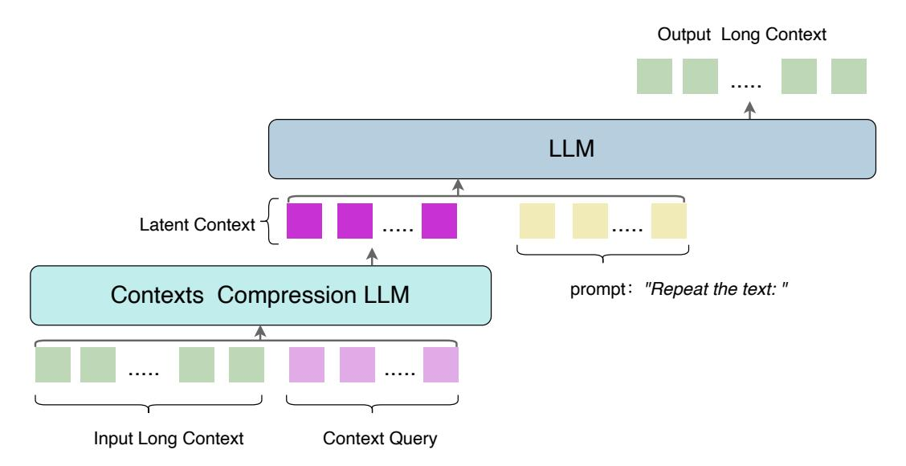

# 2 Related Work

In recent years, Large Language Models (LLMs) have demonstrated remarkable capabilities. However, their core component, the self-attention mechanism, exhibits quadratic computational and memory complexity with respect to the input sequence length. This has severely limited the context length that models can effectively handle. To overcome this bottleneck, both academia and industry have explored various techniques for long-context processing and compression. Our work is primarily related to context compression, with a specific focus on the emerging field of contexts optical compression.

Contexts Compression. Handling long contexts is a frontier in current LLM research. Existing methods can be broadly categorized as follows:

Efficient Attention Mechanisms: A significant body of research focuses on optimizing the attention mechanism at an architectural level to reduce its quadratic complexity. For instance, sparse attention methods, such as Longformer [\[Beltagy et al.,](#page-9-5) [2020\]](#page-9-5) and BigBird [\[Zaheer et al.,](#page-9-6) [2020\]](#page-9-6), reduce computational load by limiting the attention scope of each token. Other approaches, like Linear Attention [\[Katharopoulos et al.,](#page-9-7) [2020\]](#page-9-7) and State-Space Models (e.g., Mamba [\[Dao and Gu,](#page-9-8) [2023\]](#page-9-8)), attempt to approximate the performance of standard attention with linear or near-linear complexity. Although effective, these methods often require fundamental architectural modifications and may trade off some performance on certain tasks.

Retrieval-Augmented Generation: RAG [\[Lewis et al.,](#page-9-3) [2021\]](#page-9-3) adopts a different strategy by storing long contexts in an external knowledge base (e.g., a vector database) and retrieving only the most relevant snippets to inject into the model's input at inference time. This approach excels in informationretrieval tasks but is inherently a "loss" compression method, as it relies on the accuracy of the retrieval step and may lose global context or inter-snippet relationships.

Pluggable Module: Drawing parallels to modules like Q-Former in VLMs, some prior work has also explored prepending a carefully designed external module to reduce the length of input tokens for the main LLM. Notable examples include [\[Ge et al.,](#page-9-9) [2023,](#page-9-9) [Wang et al.,](#page-9-10) [2024\]](#page-9-10). However, these modules have generally demonstrated severely limited compression performance.

Memory and Summarization: Other works have attempted to compress context by generating intermediate summaries or memory tokens. For example, some models periodically generate summaries of long texts to represent historical information [\[Bulatov et al.,](#page-9-11) [2022\]](#page-9-11). Our work, C3, shares a philosophy similar with these methods in that it generates a compact representation of the context.

> **[图片提取文字 (无描述)]:**
> Output Long Context LLM Latent Context prompt: "Repeat the text: " Contexts Compression LLM Input Long Context Context Query

Figure 3: An overview of the C3, which utilizes a cascaded two-LLM design. A smaller encoder LLM compresses a variable-length Input Long Context into a fixed-length Latent Context guided by learnable Context Query tokens. Subsequently, a larger decoder LLM uses this compact Latent Context and a prompt to perform the downstream task, such as reconstructing the original text.

However, C3 is distinct in its approach: rather than generating a human-readable text summary, we train a dedicated encoder LLM to directly distill textual information into a fixed-length set of noninterpretable latent tokens. This end-to-end, latent-space compression paradigm potentially preserves richer semantic information and provides a more direct and efficient input for the downstream decoder compared to generative summarization.

Contexts Optical Compression. Using the visual modality as a compression medium for text is a novel and promising research direction, which we term "Contexts Optical Compression." [\[Wei et al.,](#page-9-4) [2025\]](#page-9-4)

The core idea is to render long text into one or more images and then leverage a powerful visual encoder to compress the high-dimensional pixel information into a series of visual tokens. The theoretical basis for this approach is that visual encoders have demonstrated exceptional ability in extracting dense features from complex images, and a text-rendered image can be viewed as a highly structured visual signal.

The most recent representative work in this area are DeepSeek-OCR [\[Wei et al.,](#page-9-4) [2025\]](#page-9-4), Glyph [\[Cheng](#page-9-12) [et al.,](#page-9-12) [2025\]](#page-9-12). This model employs the OCR task as a bridge between vision and language, compressing long text by rendering it into images. It achieves a token compression rate of up to 10x while maintaining high decoding accuracy, proving the feasibility of the optical compression pathway. Our work, C3, offers new insights and improvements upon this paradigm.

