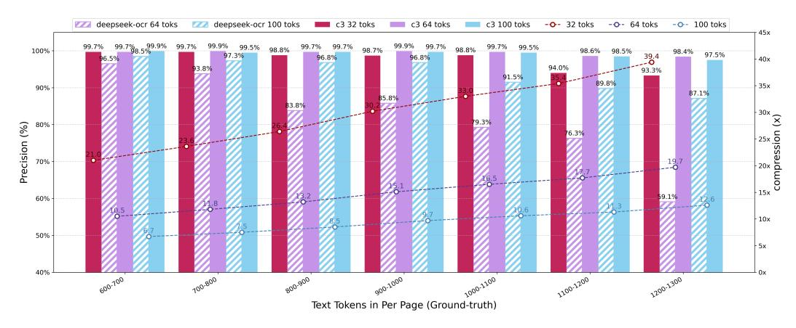
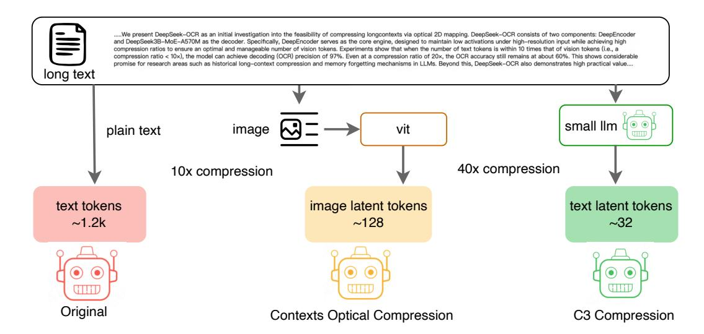

# Abstract

Million-level token inputs in long-context tasks pose significant computational and memory challenges for Large Language Models (LLMs). Recently, DeepSeek-OCR conducted research into the feasibility of Contexts Optical Compression and achieved preliminary results. Inspired by this, we introduce Context Cascade Compression (C3) to explore the upper limits of text compression. Our method cascades two LLMs of different sizes to handle the compression and decoding tasks. Specifically, a small LLM, acting as the first stage, performs text compression by condensing a long context into a set of latent tokens (e.g., 32 or 64 in length), achieving a high ratio of text tokens to latent tokens. A large LLM, as the second stage, then executes the decoding task on this compressed context. Experiments show that at a 20x compression ratio (where the number of text tokens is 20 times the number of latent tokens), our model achieves 98% decoding accuracy, compared to approximately 60% for DeepSeek-OCR. When we further increase the compression ratio to 40x, the accuracy is maintained at around 93%. This indicates that in the domain of context compression, C3 Compression demonstrates superior performance and feasibility over optical character compression. C3 uses a simpler, pure-text pipeline that ignores factors like layout, color, and information loss from a visual encoder. This also suggests a potential upper bound for compression ratios in future work on optical character compression, OCR, and related fields. Codes and model weights are publicly accessible at [https://github.com/liufanfanlff/C3-](https://github.com/liufanfanlff/C3-Context-Cascade-Compression) [Context-Cascade-Compression](https://github.com/liufanfanlff/C3-Context-Cascade-Compression)

> **[图片提取文字 (无描述)]:**
> deepseek-ocr 64 toks deepseek-ocr 100 toks c3 32 toks c3 64 toks c3 100 toks -O- 32 toks -O- 64 toks -O- 100 toks 45x 99.7% 99.7% 99.7% 99.5% 98.8% 98.8% 98.7% 98.6% 100% 98.5% 98.4% 97.5% 39.4 96.8% 96.8% 40x 94.0% 93.3% 91.5% 89.8% 35x 90% 87.1% 83.8% 1 30x € Precision (%) 25x 25x 20x dwo 20x dwo 15x 76.3% 19.7 60% 59.1% 10x 50% -5x 40% Text Tokens in Per Page (Ground-truth)

Figure 1: Reconstruction precision and compression ratio of C3 versus Deepseek-OCR on the Fox benchmark. Bars represent precision (left axis), while lines indicate the compression ratio (right axis). C3 (solid bars) demonstrates significantly higher precision than Deepseek-OCR (striped bars) across all tested latent token counts (32, 64, and 100).

> **[图片提取文字 (无描述)]:**
> .....We present DeepSeek-OCR as an initial investigation into the feasibility of compressing longcontexts via optical 2D mapping. DeepSeek-OCR consists of two components: DeepEncoder and DeepSeek3B-MoE-A570M as the decoder. Specifically, DeepEncoder serves as the core engine, designed to maintain low activations under high-resolution input while achieving high compression ratios to ensure an optimal and manageable number of vision tokens. Experiments show that when the number of text tokens is within 10 times that of vision tokens (i.e., a compression ratio < 10x), the model can achieve decoding (OCR) precision of 97%. Even at a compression ratio of 20x, the OCR accuracy still remains at about 60%. This shows considerable promise for research areas such as historical long-context compression and memory forgetting mechanisms in LLMs. Beyond this, DeepSeek-OCR also demonstrates high practical value.... long text small Ilm vit image plain text 40x compression 10x compression text tokens image latent tokens text latent tokens ~1.2k ~128 ~32 Original Contexts Optical Compression C3 Compression

Figure 2: Conceptual comparison of context compression pipelines. The figure contrasts three methods: (1) Original: The baseline tokenization of plain text, leading to a large token count (~1.2k). (2) Contexts Optical Compression: An indirect method where text is converted to an image and encoded by a ViT, achieving ~10x compression into ~128 latent tokens. (3) C3 Compression: Our proposed direct method, where a small LLM compresses the text into a minimal set of ~32 latent tokens, achieving ~40x compression.

