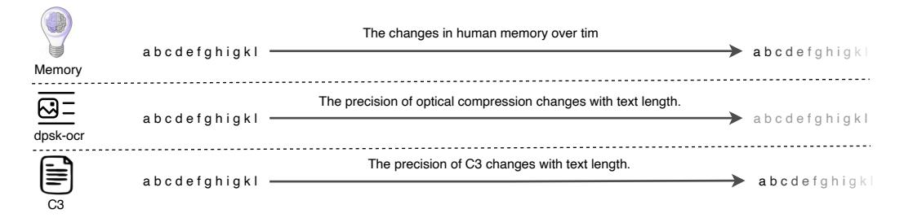

# b. Chinese long text text token len: 743, latent token len:32, compression: 23x a. English long text text token len: 902, latent token len: 32, compression: 28x

*"Repeat the text: "*

#### c. Disordered english text text token len: 209, latent token len:32, compression: 6x

#### d. Disordered chinese text text token len: 185, latent token len:32, compression: 5x

#### e. Large compression factor text token len: 1701, latent token len:32, compression: 53x

Figure 4: Qualitative results of text reconstruction using C3 at an extreme compression level (32 latent tokens). Each panel displays the original long text on the left and the model's reconstructed output on the right. The examples showcase the model's high-fidelity performance across diverse scenarios, including: (a) standard English prose, (b) classical Chinese, (c) English text containing non-semantic random characters, and (d) structurally disordered Chinese text. The near-perfect reconstruction in all cases highlights C3's capability for near-lossless compression. Furthermore, we present an analysis of failure cases that occur under extreme compression ratios. (e) A key observation is that in these "bad cases", reconstruction errors tend to be concentrated in the latter half of the original text.

> **[图片提取文字 (无描述)]:**
> The changes in human memory over tim abcdefghigkl abcdefghigkl Memory The precision of optical compression changes with text length. abcdefghigkl abcdefghigkl dpsk-ocr The precision of C3 changes with text length. abcdefqhiqkl abcdefghigkl C3

Figure 5: An analogy of information loss patterns. This figure contrasts two failure modes. Optical compression (middle) leads to a uniform 'blurring' of the entire context. In contrast, C3's information loss is sequential (bottom), fading from the end, which is analogous to the process of human memory decay (top).

