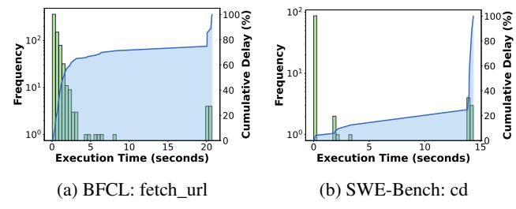

# 2.2 Limitations of Existing Methods

Previous works fail to handle this emerging complex workload due to three main reasons:

Fixed Workflow: One line of work focused on scheduling agentic workflows with pre-defined, static computation graphs. Teola [\[66\]](#page-15-2) decomposes applications into primitivelevel dataflow graphs and then applies graph-level optimizations. Alto [\[62\]](#page-14-2) focuses on streaming and pipelined execution across distributed components. Parrot [\[46\]](#page-14-3) exposes

> **[图片提取文字 (无描述)]:**
> LLM:"I have to locate the LLM:"I need to examine the specific LLM:"I have to edit the buggy LLM:"I have to run tests to LLM: "All tasks are pytest grep problematic code..." code sections..." verify the fix..." complete. I did .." 2134ms 137ms 3265ms 8ms 5217ms 10ms 4875ms 13981ms 1347ms

Figure 2: Illustrative example of a SWE-Agent. The agent resolves a software engineering bug step by step with tool calls in the middle. These tool calls have different durations and breaks the continuity of the LLM inference.

application-level context to LLM services through Semantic Variables, enabling the engine to infer data dependencies across consecutive LLM requests. One shared limitation of Teola, Parrot, and Alto is that they all assume static or deterministically defined DAGs and **could not work with dynamic agent workloads** like ReAct-styled ones whose dependency graphs evolve at runtime. This limits these work from optimizing for the wide variety of agents in practice [9, 45, 74].

No Consideration for Tool Calls: Autellix [51] introduces Program-Level Attained Service (PLAS) scheduling that prioritizes requests with less cumulative service time of the agentic program. Tempo [84] proposes a scheduler to satisfy the SLOs when facing different types of requests (chat, agent, reasoning), while our focus is particularly on agentic workloads with many-turn and variable tool calls. These work fail to consider the unique characteristics of tool calls in agentic workloads, such as their variable durations and the impact on KV cache management. This oversight can lead to suboptimal scheduling decisions and increased latency, as we demonstrate later in Sec 3.2.

**Insufficient KV Cache Retention Strategies:** Some previous work observed the challenge of KV cache reuse for agent workloads. InferCept [2] introduces a "preserve" operation that pins the KV cache between tool calls. However, their policy overlooks the multi-turn nature of requests. When KV cache is evicted between turn, this will cause additional queueing time per turn for the program when they come back. In multi-turn scenarios, the queueing time can accumulate for each turn. Ignoring such effects makes them not preserve KV cache in GPU even when there are significant benefits. Moreover, their preserve operation is fixed and could not adapt to tool use in real time. If the actual tool call time is much longer than predicted, blindly "preserving" the KV cache can cause significant inefficiency. This makes it impractical for real-world deployment. Pie [25] introduces a programmable serving system that decomposes the generation loop into finegrained handlers. It delegates control to user programs, allowing for custom tool call handling. However, it requires developers to manually design scheduling for each agent. and provides no actual method to adapt to dynamic tool-call latencies or multi-turn dependencies.

| Method    | Retains KV Cache | Includes Per-Turn Queueing Delay | Bounds Retention Time |  |
|-----------|---------------------|-------------------------------------|--------------------------|--|
| vLLM      | Х                   | Х                                   | Х                        |  |
| Autellix  | X                   | ×                                   | ×                        |  |
| Pie       | ✓                   | ×                                   | ×                        |  |
| InferCept | ✓                   | ×                                   | ×                        |  |
| Continuum | ✓                   | ✓                                   | ✓                        |  |

Table 1: Continuum comparison with representative baselines.

> **[图片提取文字 (无描述)]:**
> SWE-bench BFCL Median Median 80000 25-75% 25-75% 60000 40000 20000 2.5 12.5 15.0 10.0 10 **Current Step Current Step**

Figure 3: Workload characteristics of agentic workloads SWE-Bench and BFCL as used in Sec 6. As the number of steps increase, the requests are closer to finish.

#### 3 Motivation

## 3.1 Agentic Traces

We begin by analyzing the characteristics of modern agentic workloads. We collect and analyze 100 traces from mini-sweagent [45] running SWE-Bench [33] and 100 traces from BFCL V4 Web Search [53], both running GPT-5 as the base model. Figure 2 presents an illustrative shortened example trace from SWE-Bench, demonstrating how the agent solves a software engineering task step by step.

The takeway is three-fold. First, there are many turns for these novel agentic programs. This increase in turn numbers adds additional scheduling difficulty. Second, the tool call times have varying time distribution, but many are short. Although the request will be considered finished after these short tool calls are generated, the next request will arrive soon after the tool call completes, reusing the KV cache.

Last but not least, as shown in Figure 3, the program approaches completion, the expected number of future tokens overall reduces for both worloads. This indicates that later turns have shorter expected finish time. This suggests that prioritizing requests that came earlier (program-level FCFS) or

| Dataset   | No. of Turns | Tool Time(ms)  | Token Per Program |
|-----------|--------------|----------------|-------------------|
| SWE-Bench | (10.9, 2.1)  | (925, 3,550)   | (70,126, 19,732)  |
| BFCL v4   | (6.3, 2.3)   | (1,923, 2,133) | (93,256, 68,687)  |

Table 2: Statistics from two collected datasets. Reported numbers are in format of (mean, standard deviation).

> **[图片提取文字 (无描述)]:**
> InferCept **VLLM** Ours 1500 1000 Waiti 500 0. 40 20 60 80 100 Jobs

Figure 4: Per-program queueing delay under CPU offloading. InferCept's preserve decision ignores queueing cost, so evicted programs still accumulate substantial waiting time across turns—comparable to vanilla vLLM despite InferCept's reload savings.

have executed more turns could be a good approximation for the theoretically optimal but clairvoyant shortest remaining time first (SRTF) scheduling policy. But it is non-trivial to maintain such ordering when tool calls are involved, as we will discuss later in 3.2.

### 3.2 Challenges for Agentic Workloads

**Turn-based Eviction:** Although these tool calls can be short, inference engines treat them as homogeneous gaps between LLM requests. vLLM or SGLang will evict a request's KV cache as soon as decoding finishes, implicitly assuming the request is complete. However, if the KV cache has been evicted, the engine must either redo the full prefill or reload the KV cache from DRAM when offloading is enabled, incurring additional delay. Most systems fall short in handling these scenarios efficiently.

Figure 1 illustrates this effect: the tool call creates a pause that triggers KV cache eviction, leading to prefill or KV reload on return. Thus, it is important to have a KV cache retention policy that considers tool calls to avoid such overheads.

**Per-Turn Queueing Delay:** The multi-turn nature agent programs also introduces a new challenge for scheduler that prior work have critically overlooked. While the current agent program is waiting on the tool, if the scheduler allocates the GPU memory to other requests to maximize throughput, the KV cache for the current program will be removed from GPU memory. When the program's tool call returns and the following LLM request is sent to the scheduler, it must wait behind ongoing prefill/decoding of other requests for free GPU space.

> **[图片提取文字 (无描述)]:**
> 102 1003 Frequency  $_{10_1}$ 80 Frequency 101 100 100 20 10 10 15 **Execution Time (seconds) Execution Time (seconds)** (a) BFCL: fetch\_url (b) SWE-Bench: cd

Figure 5: Functions' execution time can be extremely long-tailed. Slowest 10% of fetch\_url account for 52.5% of the total delay, while slowest 10% of cd account for 94.1%.

This waiting period produces a gap in the execution of the agent program regardless whether the KV cache is stored in a CPU DRAM location. As shown by Figure 1, this gap also contributes to the delay induced by the tool call besides the previous prefill/loading cost, accumulating over turns and causing substantial delays for each program. Moreover, it also breaks the continuity of the program execution and schedules requests with earlier arrival times after later ones. Notice that even if we give the highest priority to the new request in the waiting queue, it still will be blocked by the ongoing computation of the other requests already in GPU.

Existing works do not consider per-turn queueing delay in their retention policies. InferCept [2]'s KV "preserve" operation is invoked only when the CPU offloading cost exceeds the estimated GPU occupation cost during the tool call. Crucially, this decision only accounts for the reload cost of the immediate next turn—it entirely ignores the queueing delay that an evicted program will experience when it re-enters the waiting queue behind other active requests. With fast asynchronous CPU offloading provided by engines like LMCache [15], the reload cost becomes small, so InferCept's preserve operation is rarely invoked. Yet the queueing delay persists regardless of offloading speed: even with instant KV reload, the returning request must still wait for GPU memory occupied by other requests to be freed. Since this queueing cost is incurred at every turn, the total accumulated delay grows proportionally with the number of turns per program—precisely the regime where agentic workloads operate.

We demonstrate the performance degradation brought by this lack of consideration for multi-turn scheduling in Figure 4. We profile the total eviction overhead experienced by each request for vanilla vLLM and the InferCept algorithm. The x-axis represents each agentic program in order of arrival time, while the y-axis denotes the total bubble time for each agentic job — the total idle period a request experiences in the waiting queue before execution. Even with InferCept's KV retention, bubbles still persist and causes delay increase despite its throughput improvement over vLLM.

**Variable Tool Call:** Current KV cache retention policy also fail under greatly varying tool calls. For example, InferCept's approach pins the KV cache in GPU memory until

> **[图片提取文字 (无描述)]:**
> ! TTL Expires TTL Too Tool Prefill/Queuing LLM Request LLM Short TTL Expires TTL Too LLM Request Tool . . . Long

Figure 6: *Time-to-live needs to be well set to balance between memory usage and the prefill plus per-turn queueing delay.*

the next request arrives after a tool call. This methods works fine under stable tool call latencies. However, as shown in Figure [5,](#page-3-2) many tool calls exhibit high variability in execution time. When the tool call takes much longer than expected, the pinned KV cache could occupy GPU memory for a long time. Similar patterns are observed in database agents, as external tool calls are more complex. This leads to inefficient memory usage and even potential deadlocks when retained KV cache fully occupies the GPU. Thus, a static retention policy lacks robustness in practical scenarios.

