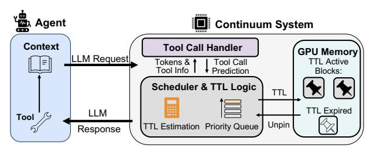

# 4.3 Scheduling Priority

In order to keep the scheduling compatible with the TTL algorithm, we need to re-define the request priority in inference

> **[图片提取文字 (无描述)]:**
> Agent Continuum System Context Tool Call Handler **GPU Memory** LM Request TTL Active Tokens & Tool Call Tool Info Prediction Blocks: Scheduler & TTL Logic TTL TTL Expired LLM Tool Unpin TTL Estimation Priority Queue Response

Figure 7: *System Overview of Continuum*

engines. Continuum introduces a TTL-aware priority that elevates pinned requests within TTL to preserve continuity while still preserving program-level FCFS ordering. Specifically, the scheduler assigns each request *r* in the waiting queue *Q* a multi-key priority tuple and ranks requests according to the following criteria (in order):

- Preempted status: Same as the original engine, preempted requests (due to running queue contention) are prioritized over non-preempted ones.
- TTL status: In other requests, requests retained within the TTL window are prioritized over unpinned ones.
- Program-level arrival order: Finally, within each category, requests are ordered by their program-level arrival time to maintain FCFS fairness.

