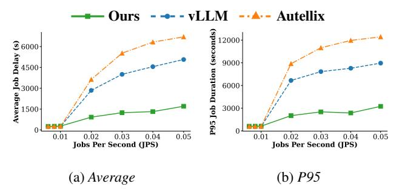
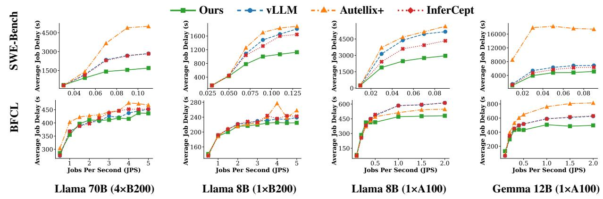

# 5.1 Tool Call Handler

The tool call handler is a separate class invoked by the main scheduler after the arrival or at the finish of a request. This decoupled structure ensures that tool handling logic remains isolated from the core scheduling loop, ensuring extensibility for future parsers or tool-aware policies.

Identifying the Tool Call: When the scheduler completes request, it forwards the response to the tool-call handler, which

determines whether the response includes a tool invocation. The handler parses the message according to the function call schema, as the LLM outputs frequently adopt a standardized tool call structure such as the OpenAI schema:

```
{
  "id": "fc_0",
  "call_id": "call_0",
  "type": "function_call",
  "name": "get_weather",
  "arguments": {"location": "Paris"}
}
```

For this example schema, the handler checks each returned message block's type; if it indicates a function/tool call, the handler extracts the call's name and uses this as the tool call type. In SWE-Bench, it is guaranteed that each LLM's response containing a function call will include exactly one bash function call. We extract the string within the bash block and use the first word afterwards as the tool call name.

More function call format examples for different LLMs [47, 60] can be found in Appendix B. Continuum can be easily extended to these with a parser similar to Appendix A.

**Recording the tool finish time:** For each LLM request i in a program identified by a program ID p, the handler records a server-side completion timestamp  $t_{\rm finish}^{p,i}$  along with tool call name when scheduler records a finished request with tool call output. When the next request i+1 with the same p arrives, we observe its server-side arrival timestamp  $t_{\rm arrive}^{p,i+1}$  and compute the inter-request interval  $t_{\rm arrive}^{p,i+1} - t_{\rm finish}^{p,i}$ . We record this interval as the execution time of the tool call this time to store for TTL computation in the future.

#### <span id="page-7-0"></span>5.2 Efficient Pin with TTL in Scheduler

After the tool call handler gives the TTL value, the scheduler will need to execute the pin operation.

Request Pining: If the step is not signified to be the last step (ex. parsed to contain a tool call), the scheduler calls the tool-call handler to obtain the TTL value  $\tau^*$  and, if not zero, invokes pin\_request (request,  $\tau^*$ ). This records a pair of request and its expiration time current\_timestamp +  $\tau^*$  in a dictionary pinned\_requests and deliberately skips freeing the request's KV blocks. The pinned\_requests will also be passed to the waiting queue to prioritize the scheduling of the next request in the same program.

Request Unpinning: At the beginning of every scheduling step, the scheduler runs unpin\_requests(). It scans pinned\_requests and unpins entries whose TTL have expired and whose program\_id does not currently appear in the waiting queue. This prevents premature eviction when a follow-up request has already arrived at the inference engine but scheduler has not been able to schedule it. Additionally,

when a program's last step finishes, the scheduler proactively unpins any remaining pins with the same program\_id, as no KV cache reuse is expected in the near future.

**Prevention of deadlocks:** Pinned requests can accumulate and potential deadlock could occur when all the GPU memory is occupied by the pinned requests. Since the pinned requests would be preserved if the next request of the same program is still in the waiting queue, the entire scheduling loop could be stuck and no new requests can be scheduled to run due to the lack of space.

Thus, we need a mechanism to unpin the requests when the such a deadlock occurs. In Continuum, when the scheduling logic fails to schedule a new request due to space contention, it will check if there are any pinned requests in pinned\_requests. If there are, we iteratively selects victims from pinned\_requests with the latest program arrival time to unpin and free the space until the first request can be scheduled to run. The chosen request will be removed from its queue, its KV cache is freed, and it is re-queued as needed, ensuring that subsequent allocations can proceed to run. This prevents deadlock even when many pins are present.

**Offline Profile:** In order to predict the prefill time and reloading time (Prefill-Reload(r)) based on context size as needed in Sec 4.1, we perform an offline profile on each hardware and model pair for online estimation. We profile for two purposese: (1) GPU-CPU bandwidth for CPU offloading cases. We measure by taking the average CPU offloading throughput. (2) Prefill vs context length curve for estimating prefill cost. We measure this by doing prefill for chunk sizes {1000, 2000, 4000, ...max\_context\_length} and fit a quadratic curve on the data. Admittedly, there could be some pages for the request remaining in GPU memory that does not need recomputation. But these remaining pages are usually small when memory is contended and we approximate by the full prefill time with little error. Profiling takes less than 10 minutes for each hardware model pair.

### 5.3 Implementation

We implemented Continuum on top of vLLM with about 1k lines of Python. Besides the above pinning operations added to the scheduler class, we use three functions from tool call handler in vLLM's original scheduler:

- func\_call\_finish(tool, timestamp): When request finishes and parsed to contain tool call, this function informs tool call handler to record the tool call starting time.
- update\_tool\_call\_time (program\_id, timestamp):
   When a new request arrives, it denotes the tool call from previous request finished so we record the time.
- set\_up\_ttl(request, tool): Based on previous tool call information and the system setup, give best TTL value for the scheduler to this finished request.

<span id="page-8-1"></span>> **[图片提取文字 (无描述)]:**
> ----- Autellix € 5000<sub>1</sub> @ 4000<sub>1</sub> 6000 4500 12000-**4**000 3000-4500-9000 3000-<u> 출</u>3000-2000-6000-2000-1500-1000-3000-000-0.025 0.050 0.075 0.100 0.125 0.04 0.06 0.08 0.10 0.02 0.02 0.04 0.06 0.08 0.04 0.08 S 4401 900 g 600 450 **Delay** 400-À 250 € 360-90 300 -150 -**9**<sub>200</sub>-호<sub>300</sub> ₹320-150-50 Jobs Per Second (JPS) Jobs Per Second (JPS) Jobs Per Second (JPS) Jobs Per Second (JPS) Llama 70B (4×B200) Llama 8B (1×B200) Llama 8B (1×A100) Gemma 12B (1×A100)


Figure 8: Continuum outperforms against baseline schedulers across different model sizes, hardware configurations, and datasets.

<span id="page-8-2"></span>> **[图片提取文字 (无描述)]:**
> Ours --- vLLM --- Autellix P95 Job Duration (seconds) 2000-Average Job Delay (s) 9000-6000 3000-0.05 0.05 0.01 0.03 0.04 0.01 0.04 0.02 0.02 0.03 Jobs Per Second (JPS) Jobs Per Second (JPS) (b) P95 (a) Average


Figure 9: Continuum achieves best performance on Open-Hands with Llama-8B on average and P95 delays with H100.

## <span id="page-8-0"></span>6 Evaluation

Our key takeaways from the evaluation are:

- **Delay Reduction:** Continuum achieves significant delay reduction improvements over baseline schedulers through intelligent KV cache pinning
- **Robust Improvement:** Continuum outperforms baselines across turn number and different offloading scenarios.
- Out of Box Usability: Continuum can be used to run real agent faster without quality drop.

### 6.1 Setup

**Model and Hardware:** We evaluate Continuum with Llama-3.1-8B, Llama-3.1-70B, and Gemma-3-12B. We use A100-SXM GPU from Runpod, H100 from AWS and Tensormesh, and B200 GPU from on-prem servers.

**Datasets:** For results other than the real SWE-Bench experiments in Figure 12, we evaluate on two collected workloads running GPT-5 <sup>1</sup> and using poisson distribution for the arrival

pattern of agent programs:

- SWE-Bench [34]: We run mini-swe-agent [45] <sup>2</sup> on SWE-Bench. We keep requests within the context window.
- Berkeley Function Calling Leaderboard [53]: We used the latest version of BFCL V4 (Web Search category). This includes agents answering questions with web browsing tools. We scaled down the workload by 0.4 to fit at least 100 request in the context window of llama-3.1 (128k tokens).
- OpenHand [68]: OpenHands is a popular open-source coding agent. We run the multi-SWE-bench [83] example in the official repo for the Go language.

### **Main Baselines:**

- *Vanilla vLLM* We use the stable release of vllm 0.10.2 with default setting, where chunk size is enabled with size 2048.
- *CPU DRAM offloading* We use vllm 0.10.2 with LMCache 0.3.7 [15]. For A100 GPUs, we set the DRAM size used in offloading to be 100GB; For B200 and H100 GPUs, we set the DRAM size used in offloading to be 200GB per GPU. We also apply this on top of algorithms below.
- Autellix We implemented the algorithm of PLAS from Autellix [51] on top of vllm. We extend Autellix to CPU offloading cases by enabling LMCache (Autellix+).
- *InferCept* We implemented the selectively preserve, swap, or evict algorithm of InferCept [2] on top of vllm + Imcache. Since the CPU offloading in LMCache is non-blocking (better than original InferCept), we update the cost estimation accordingly.
- Distributed Inference For real agent experiments, we compare with other open-source solutions including SGLang 0.5.5.post3 [63] with native cache-aware routing and Nvidia Dynamo 0.7.0.post1 [5] configured with 1P1D for PD Disaggregation.

<sup>&</sup>lt;sup>1</sup>We use GPT-5 for the better model capabilities to ensure that the work-flow generated are mostly correct. Base small models often fail to accomplish the task

<sup>&</sup>lt;sup>2</sup>SWE-bench official agent that rank #5 on leaderboard by Apr 13th

<span id="page-9-1"></span>> **[图片提取文字 (无描述)]:**
> ----- Autellix+ ··· • · · · InferCept  $\odot$ 4500-0 1200 **k** 4500-₹16000 12000 1200 3000-**3000** 8000 1500-1500 4000 0.025 0.050 0.075 0.100 0.125 0.02 0.06 0.08 ± 280. Delay (s 450 Delay 400-Delay 240-**2** 600-<u> 출</u> 200-**2**400-160-150 Jobs Per Second (JPS) Jobs Per Second (JPS) Jobs Per Second (JPS) Jobs Per Second (JPS) Llama 70B (4×B200) Gemma 12B (1×A100) Llama 8B (1×B200) Llama 8B (1×A100)


Figure 10: Continuum achieves consistent improvement when DRAM offloading is enabled. It improves over systems with smart DRAM offloading logic like InferCept by considering tool-call and multi-turn together.

<span id="page-9-2"></span>> **[图片提取文字 (无描述)]:**
> - - - vLLM - - Autellix+ ··· InferCept Ours (spuo<sub>2400</sub>) P90 Job Duration (seconds) 2400-1800 P95 Job Duration 1800 200 1200-600-600 0.125 0.1250.0250.050 0.075 0.100 0.025 0.050 0.075 0.100 Jobs Per Second (JPS) Jobs Per Second (JPS) (a) p90(b) p95


Figure 11: Continuum achieves better P90 and P95 latency for running SWE Bench trace with Llama-8B model.

<span id="page-9-0"></span>> **[图片提取文字 (无描述)]:**
> -- A-- SGLang --- Ours ···• Dynamo 8, 81 § 600 € 950-300-150-3.0 Ours SGLang Dynamo Jobs Per Second (JPS) Inference Solutions


Figure 12: Continuum improves delay under the pass rate for real SWE-agents in distributed settings.

