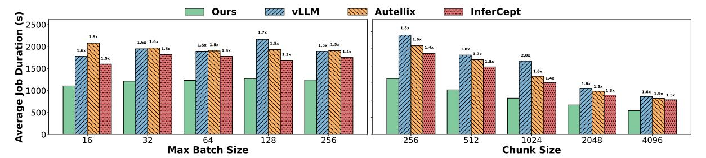
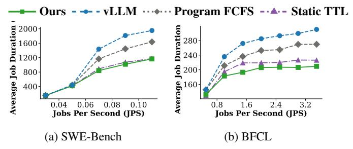

# **6.2** End-to-End Experiments

We conduct the trace replay experiments for SWE-Bench, BFCL, and OpenHands workloads. Figure 8, Figure 10, and Figure 9 demonstrate the end-to-end improvement of Continuum. We show significant improvements in both average response time and throughput across both the BFCL and SWE-Bench workloads. For instance, with the Llama-3.1-8B model, Continuum achieves up to a 2x reduction in average response time compared to the vanilla vLLM baseline. The performance gains are consistent across different model sizes and hardware configurations, demonstrating the effectiveness of our approach in diverse scenarios. Although Autellix outperforms baselines in BFCL, it underperforms in SWE-Bench due to its false assumption that requests have longer expected

finish time if they execute for longer. Note that the job per second rates are less than job per second reported in previous LLM serving papers. This is because agentic workloads are much more complex and can often involve more than 10 LLM inferences requests, incurring higher computational load.

We also extended our evaluation to other practical agents. As demonstrated in Figure 9, we achieve better delay running OpenHands agent with Llama 8B on one H100 GPU from AWS. Since the average turn number count is higher, our improvement is even more significant due to the deterioration of baselines under high turn numbers.

Moreover, we observe that Continuum consistently outperforms CPU offloading baselines. On the other hand, PLAS's gain on CPU offloading diminished compared with baseline. This demonstrates Continuum's robust performance improvement on scheduling bubble reduction that is orthogonal to DRAM offloading techniques.

In Figure 11, we show that Continuum achieves better P90 and P95 latency due to its ability to reduce the per-turn queueing delay compared with baselines. The setup for each individual point is running Llama-8B model with a single B200 with CPU offloading set as 200GB per GPU.

Real SWE-Agent in Distributed Setting: In order to fully evaluate Continuum's performance in real-world deployment scenarios at scale. We test Continuum running real SWE agent for 500 tasks in SWE-Bench-Verified in Tensormesh's internal H100 testbed. We set up our agent client environment by adding a job distributor for the SWE-Bench platform that distributes agents in poisson distribution. We use a simple session aware routing for Continuum and compare against other distributed inference solutions. We measure the per-job finish time and collect the pass rate of each agent program for their generated results on SWE-bench after generation.

As demonstrated by Figure 12, Continuum consistently outperforms baselines in terms of average delay when pass rates are equal. Notice that Continuum actually has higher pass rate than baselines. This is due to SWE-Bench's time limit for

> **[图片提取文字 (无描述)]:**
> VLLM 11111 Autellix \*\*\*\*\*\*\* InferCept Ours ® 2500 1.8x 1.7x 1.9x 1.6x 1.6x 1.5x 1.5x 1.5x 1.5x 2000 1.8x 1.6x 2.0x Ճ 1500∤ **9** 1000-1.6x 1.5x 1.6x 1.5x 1.5x 500 4096 16 32 128 256 256 512 1024 2048 Max Batch Size **Chunk Size**

Figure 13: Continuum improves delay across different max batch-size and chunk-size configurations.

> **[图片提取文字 (无描述)]:**
> 3.7x **⊙** 3500 **Autellix** Ours VLLM InferCept 2.8x 3000 2.3x 2500 2.1x 1.9x 2000 **§** 1500, 1000 500 2x 3x 5x 1x 4x (10.9 turns) (20.8 turns) (30.8 turns) (40.7 turns) (50.6 turns) Number of turn multiplier

Figure 14: Continuum shows higher improvement as the number of turns increases, while the delay time remains stable.

> **[图片提取文字 (无描述)]:**
> - - - vLLM - - Autellix+ · · · · · InferCept Ours 2000-2000-1500-1500-1000-1000-500-500-0.025 0.050 0.075 0.100 0.125 0.025 0.050 0.075 0.100 0.125 (a) SSD Size = 400G(b) SSD Size = 800G

Figure 15: Continuum reduces delay when we extend offloading device to SSDs beyond CPU offloading.

environment dockers to prevent hanging. When the baseline's running time exceeds 15 minutes it will be preempted and treated as failure case. This proves Continuum's usability in real production settings.

## **6.3** Sensitivity Analysis

Varying Inference Engine Configuration: In order to show that Continuum is robust to varying inference engine configurations, we evaluate Continuum with different configurations of the inference engine. In Figure 13, we set the job per second to be 0.13 and vary the maximum batch size to compare Continuum with different baselines. As we can see, Continuum's improvement remains stable across different batch sizes. Moreover, in Figure 13, we vary the number of chunk size from 256 to 4096. We observe similar improvements across different chunk sizes. This demonstrates the robustness of our approach to different inference engine configurations.

> **[图片提取文字 (无描述)]:**
> Ours - - - vLLM · · · · · · Program FCFS - · · · · Static TTL 2000+ 280 1600 240 1200-200-Average Job 800-Average 160 400-0.06 0.08 0.100.8 2.4 3.2 Jobs Per Second (JPS) Jobs Per Second (JPS) (a) SWE-Bench (b) BFCL

Figure 16: Contributions of individual ideas to Continuum. Program-level FCFS prioritize requests with earlier program arrival instead of request. Static TTL uses fixed TTL threshold calculated from cold start handling mechanism.

Scaling Law for Turn Numbers: Figure 14 evaluates our scheduler's robustness in multi-turn scenarios. We simulate more-turn scenarios on SWE-Bench by repeating the trace  $(1 \times to 5 \times)$  while inversely scaling the token lengths to emulate more turns but make total token fit within the context window. With a request rate of 0.13 JPS and 200 GB for DRAM offloading, the results show that the baseline methods degrade as the number of turns increases. This is because the increased number of turns leads to more tool calls and longer overall execution times, exacerbating the scheduling challenges faced by traditional methods. In contrast, our approach maintains stable, low-latency performance, demonstrating its effectiveness for complex, many-turn agentic interactions.

SSD Offloading: Similar to CPU offloading, SSD offloading offers bigger space but slower loading. We evaluate Continuum with extended SSD storage layer beyond CPU offloading using LMCache on SWE-bench workload with llama-8B on B200. As shown in Figure 15, Continuum consistently improves average delay compared with baselines when also utilizing disks of different sizes.

## 6.4 Ablation Studies and Microbenchmarking

**Ablation Study:** We conduct an ablation study to analyze the impact of our cost modeling on Continuum's overall performance. In Figure 16, we compare Continuum with baselines that only applies part of the optimizaions. Program-Level FCFS changes the original request-level FCFS in vLLM into

| System    | No CPU Offload | CPU Offload |
|-----------|----------------|-------------|
| vLLM      | 0.95 ms        | 2.33 ms     |
| Autellix  | 0.82 ms        | 2.18 ms     |
| InferCept | N/A            | 2.25 ms     |
| Ours      | 0.96 ms        | 2.30 ms     |

Table 4: Continuum introduces minor scheduling latency overhead comparison under different DRAM offloading settings.

|                            | vLLM | ThunderAgent | Continuum |
|----------------------------|------|--------------|-----------|
| Throughput (Steps Per Min) | 93.4 | 114.8        | 144.9     |

Table 5: Continuum achieves better performance on Open-Hands rollout than concurrent work.

priority based on program arrival. Static TTL builds upon program-level FCFS to utilize fixed TTL threshold estimated cold-start handling. As demonstrated, different ideas of Continuum gradually improves performance.

**Scheduler Overhead:** As shown in Table 4, our approach introduces a minor scheduling overhead compared to the baselines. However, this overhead is on the order of single-digit milliseconds, which is negligible compared to the GPU execution time for LLM inference. The significant end-to-end performance improvements from our scheduling strategy far outweigh this small increase in scheduling latency.

Application to Reinforcement Learning: We also conducted a micro-benchmark for potential reinforcement learning use of Continuum. We tested the OpenHands Agent with GLM-4.5-fp8 training on Multi-SWE bench [83] for rollout generation. The hardware setup is an 8xH100 node. We compared with the concurrent RL work ThunderAgent [36] on inference steps per minute, as reported by the original paper. As demonstrated by Table 5, Continuum achieves higher throughput for single node rollout.

### 7 Related Work

LLM Inference Systems: There have been many research papers on improving LLM inference. Serving engines including vLLM [40] and SGLang [85] achieves state of the art inference by adapting paged attention design and optimized kernels. Besides the wide range of kernel-level optimizations that improve GPU execution speed [20, 80, 87], researchers have also proposed many optimizations on resource management: continuous batching [81], chunked prefill [4], skip-join multi-level scheduling [70]. Many of them have been ported into the inference engine. Previous work have also explored efficient offloading to CPU DRAM and disks [15,22,49,73,77]. For distributed inference, people have adopted session aware routing [41,65], KV-cache aware routing [72], and prefill-decode disaggregation [86]. Building upon these work, Continuum extends LLM inference into long-horizon multi-turn

agentic workloads and improves resource management when resources are competed by different requests.

Time-to-live Mechanisms in Computer Systems: Timeto-live (TTL) is a longstanding abstraction in computer systems design, widely used in DNS resolvers, distributed caches, CDN edge nodes, and consistency protocols to bound staleness and prevent unbounded resource retention [10, 18, 31, 32, 35, 39, 44, 55, 56, 76]. In these settings, TTL acts as a coarse-grained validity window that balances freshness, load, and robustness under unpredictable update or fetch latencies. We build on this lineage but extend TTL to a new domain: fine-grained resource management inside LLM inference engines. Unlike traditional TTL uses, where entries are independent and correctness constraints are semantic rather than performance-critical, KV caches interact tightly with GPU memory pressure, prefill costs, and scheduling fairness in LLM serving engines. To our knowledge, Continuum is the first system to use TTL to regulate LLM KV cache as a function of predicted tool-call durations, scheduling-side delay propagation, and workload pattern.

Generality Beyond ReAct-Style Agents: The current design of Continuum are optimized for ReAct-style, tool-interleaving agents where each LLM step returns a clear tool invocation followed by a gap before the next step. Continuum naturally extends to parallel tool calls since it still follows the sequential "reason -> tool -> reason" rhythm. Some emerging agent frameworks, however, could involve non-linear control flows: speculative branches, asynchronous multi-agent coordination, and context folding. Although such workloads are mostly experimental and yet to be tested in real production workloads, their inference pattern may violate the sequential flow and requires future change. Extending Continuum to support such workloads is an important direction for future work. More discussions are available in Appendix C.1.

#### 8 Conclusion

Agentic workloads introduce new scheduling challenges for LLM serving systems due to frequent tool calls, highly variable inter-step delays, and the need to preserve multi-turn continuity. We present Continuum, a KV cache retention and scheduling system that balances both the benefit of cache reuse and the cost of blocking GPU memory through a timeto-live mechanism. By integrating TTL-based pinning with program-level FCFS, Continuum reduces unnecessary prefills, mitigates per-turn queueing delays, and robustly adapts to unpredictable tool-call latencies. Our implementation on top of vLLM shows consistent improvements in end-to-end job completion time across model sizes, hardware configurations, and real-world agent workloads. Continuum demonstrates that principled, tool-aware KV management is essential for efficient multi-turn agent serving. We hope it lays the groundwork for future systems to deeply integrate agent workload into LLM inference engines.

