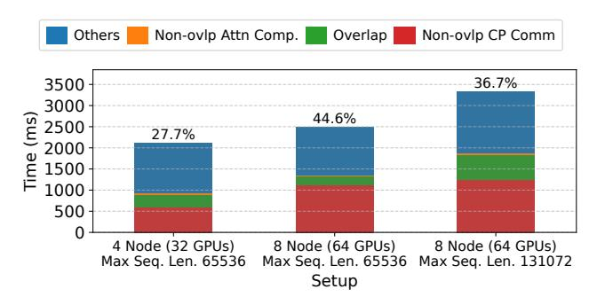
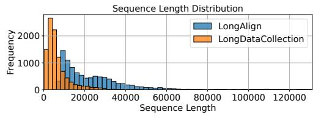

# 1 INTRODUCTION

State-of-the-art AI systems have achieved remarkable performance across a diverse range of tasks [\[4,](#page-14-0) [11,](#page-14-1) [19,](#page-14-2) [22,](#page-14-3) [32\]](#page-14-4). A notable trend in modern large models is the increasing context length (number of tokens as input), meant for enhancing deep learning models' capacity in processing extensive amounts of information (e.g., long documents and code-bases). For example, GPT-4o supports a 128K context window [\[32\]](#page-14-4); Claude 3.5 Sonnet extends the context window size to 200K [\[4\]](#page-14-0); Gemini 2.5 Pro scales the context window to 2M tokens [\[19\]](#page-14-2). The increased context length greatly raises the memory and computation requirements of state-of-theart large generative models, making them significantly more expensive to train.

To address this challenge, recent approaches adopt context parallelism (CP), which partitions each sequence in the training data evenly across all devices [\[14,](#page-14-5) [20,](#page-14-6) [23,](#page-14-7) [28\]](#page-14-8). These methods reduce memory consumption and enable training with longer context lengths, but incur additional communication overhead [\[13,](#page-14-9) [47\]](#page-15-1). Notably, this communication cost increases with the size of the training cluster (Fig. [1\)](#page-1-0). As both model sizes and context lengths continue to grow, the communication overhead is expected to increase significantly.

Existing CP approaches uniformly apply a fixed parallelization configuration (data partitioning and placement) for all batches. Such static partitioning methods fail to account for the inherent dynamism in training data, which we categorize into: 1. the variance in input sequence lengths,

> **[图片提取文字 (无描述)]:**
> Others Non-ovlp Attn Comp. Overlap Non-ovlp CP Comm 36.7% 3500 3000 44.6% 2500 27.7% 2000 1500 1000 500 4 Node (32 GPUs) 8 Node (64 GPUs) 8 Node (64 GPUs) Max Seg. Len. 65536 Max Seq. Len. 65536 Max Seg. Len. 131072 Setup

Figure 1: CP communication overhead when training a 8B GPT model on an Amazon EC2 p4d. 24xlarge cluster (400Gbps interconnect between nodes) with 4-way tensor and 16-way context parallelism, using the LongAlign [5] dataset. Overlap: overlapping CP communication and attention computation. Communication overhead fraction (vs. total iteration time) is shown above each bar.

and 2. the variance in token relationships within each sequence. As a result, these methods miss key opportunities for optimization.

Variance in input sequence lengths. Modern training datasets often exhibit a highly skewed distribution of sequence lengths, especially in long-context settings, where shorter sequences are significantly more common than longer ones [18, 24]. For instance, during the supervised fine-tuning phase of Llama 3 training, long-context samples constitute only 0.11% of the dataset [13]. Similar patterns can be observed in other datasets (see Fig. 2). Larger pre-training datasets, such as The Pile [16], also exhibit similar document length distributions. Static parallelization can introduce redundant communication when processing shorter sequences, thereby increasing overall execution time.

Variance in token relationships (attention patterns). In modern LLMs, token relationships are typically expressed through attention masks. Existing static context parallelization schemes are primarily designed for causal attention [14, 20, 28]. However, recent studies have advocated the use of diverse attention masks to accelerate training or address novel training scenarios. For example, in reinforcement learningbased post-training, a shared question mask can eliminate redundant computation between a question and its multiple answers [43]. Sliding-window or lambda-shaped masks [21, 27] are widely used to significantly sparsify attention and reduce required computation. These sparse or structured attention masks break the assumptions on attention workload distribution that static methods rely on. As a result, applying static partitioning in such settings leads to severe load imbalance and redundant communication, which undermines performance.

> **[图片提取文字 (无描述)]:**
> Sequence Length Distribution LongAlign € 2000 LongDataCollection 1000 20000 40000 60000 80000 100000 120000 Sequence Length

Figure 2: Sequence length distribution of LongAlign [5] and LongDataCollection [41] datasets, capped at 131072.

To address the limitations of static parallelization configurations in current context parallelism approaches, we propose a dynamic context parallelism approach that constructs a different parallelization configuration for each training iteration. We systematically model context-parallel training by partitioning attention inputs and outputs into fine-grained data blocks and constructing computation blocks that capture attention patterns. These blocks can be flexibly assigned to different devices, enabling customized parallelism and data/computation placement configurations tailored to each sequence. We optimize the placement of data and computation blocks in each iteration by formulating it as a hypergraph partitioning problem, aiming to minimize communication costs while satisfying memory and compute balance constraints. We also automatically generate computation and communication schedules for the blocks assigned to each device, forming pipelines to overlap their execution. This dynamic planning is managed by a data loader wrapper, which pre-fetches data and serializes device-specific schedules using five distinct instructions prior to the corresponding iteration. A custom executor efficiently executes these instructions using fused kernels, minimizing the overhead associated with fine-grained parallelism.

We summarize our contributions as follows:

- ▶ We devise a representation for both data and computation that explicitly captures the effect of input dynamism in context parallelism, allowing us to systematically define fine-grained parallelization configurations for each training iteration.
- ▶ We formulate the problem of optimizing the parallelization configuration with hypergraph partitioning, enabling efficient solutions using established algorithms [38].
- ▶ We provide an end-to-end framework implementation (i.e., DCP) that enables long context training with dynamic context parallelism, minimizing planning and runtime overheads.
- ▶ We perform an extensive evaluation against state-of-the-art CP frameworks including TransformerEngine [30] and LoongTrain [20]. Micro-benchmarks show that DCP achieves 1.19x~2.45x speed-up with causal, and 2.15x~3.77x with sparse attention masks for individual attention layers. End-to-end experiments show a 0.94x~1.16x speed-up with causal mask, and 1.00x~1.46x with sparse attention masks.

#### 2 BACKGROUND AND MOTIVATION

## 2.1 Block-wise attention computation

Attention is one of the central components in transformer-based large models [42]. The standard masked self-attention is:

$$\mathbf{O}_{bh::} = \text{RowWiseSoftmax}(\frac{(\mathbf{Q}_{bh::}\mathbf{K}_{bh::}^T) \odot \mathbf{M}_{b::}}{\sqrt{D}})\mathbf{V}_{bh::}$$

where Q (query), K (key), V (value), O (attention output) are 4-dimensional tensors of shape [B, H, L, D]. B is the input batch size, H is the number of attention heads, L is the input sequence length and D is head dimension size. Subscripts bh:: are indices into the respective dimensions, i.e.,  $Q_{bh::}$  is a slice (matrix of shape [L, D]) of the tensor **Q** at index b in the first dimension (B) and h in the second dimension (H). M is a boolean mask of shape [B, L, L], zeroing out unwanted interactions between tokens during attention computation (i.e., the attention mask). Using the online softmax trick [10, 34], attention can be computed block-wise, with each block processed in parallel. Suppose that we divide each tensor into  $\mathcal{B}_b$  blocks along the batch dimension and  $\mathcal{B}_h$  blocks along the head dimension; then, along the sequence length dimension, we divide Q into  $\mathcal{B}_q$  blocks, and K, V into  $\mathcal{B}_{kv}$ blocks, the parallel attention computation can be expressed in pseudo code as:

