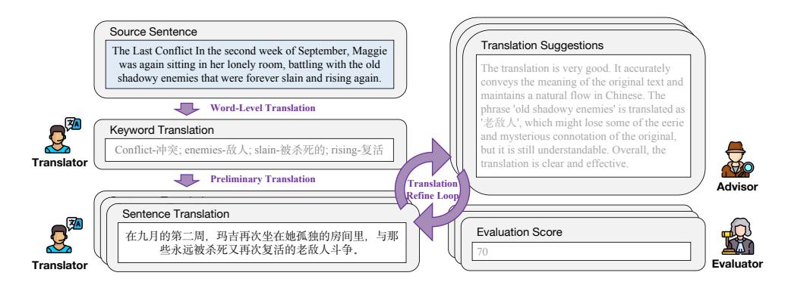
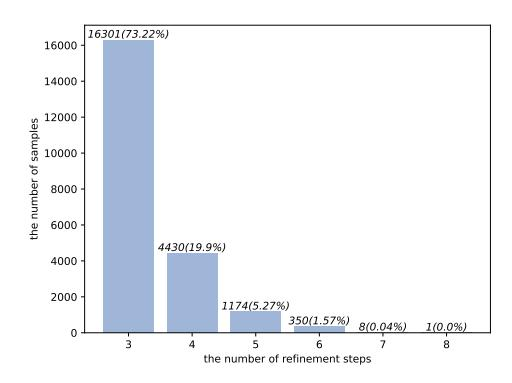
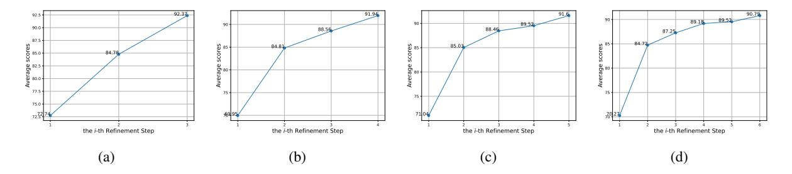
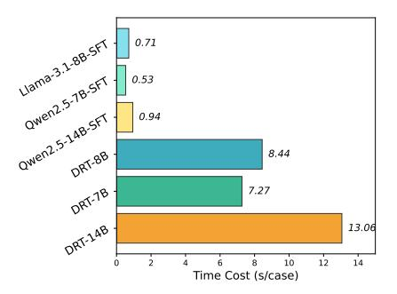

# 2.1 Literature Book Mining

Following [Kryscinski et al.](#page-8-3) [\(2022\)](#page-8-3), we leverage the literature books from the Project Gutenberg publicdomain book repository[4](#page-1-2) , where the books are typically more than fifty years old and their copyrights have expired. About 400 English books are used to mine sentences with similes or metaphors.

First, we extract all sentences from these books, and filter out too short or too long sentences, *i.e.*, less than 10 words or more than 100 words, resulting in 577.6K literature sentences. Second, for each sentence, we use Qwen2.5-72B-Instruct [\(Yang](#page-9-6) [et al.,](#page-9-6) [2024a\)](#page-9-6) to judge whether the sentence involves similes or metaphors, and discard the sentences that do not contain any ones. Third, for the remaining sentences, we let Qwen2.5-72B-Instruct literally translate them to Chinese, and then judge

3Although we focus on English-to-Chinese translation in this work, the methods we introduced can be trivially applied to other languages or translation directions.

4<https://www.gutenberg.org/>

> **[图片提取文字 (无描述)]:**
> Source Sentence Translation Suggestions The Last Conflict In the second week of September, Maggie was again sitting in her lonely room, battling with the old The translation is very good. It accurately shadowy enemies that were forever slain and rising again. conveys the meaning of the original text and maintains a natural flow in Chinese. The Word-Level Translation phrase 'old shadowy enemies' is translated as '老敌人', which might lose some of the eerie Keyword Translation and mysterious connotation of the original, Conflict-冲突; enemies-敌人; slain-被杀死的; rising-复活 but it is still understandable. Overall, the Translator translation is clear and effective Preliminary Translation Translation\ Advisor Refine Loon Sentence Translation Evaluation Score 在九月的第二周, 玛吉再次坐在她孤独的房间里, 与那 些永远被杀死又再次复活的老敌人斗争。 Evaluator Translator

Figure 1: The illustration of the multi-agent framework to synthesize long-thought MT samples. (a) A translator iteratively produces translations under the suggestions provided by an advisor; (b) An advisor reviews the translation results and gives suggestions; (c) An evaluator assesses the translation results and gives an overall score to indicate the translation quality.

whether the translation satisfies native Chinese people. If the answer is negative, the corresponding sentence will be reserved, and regarded as "suitable to translate via long thought". For prompt details, please refer to Appendix A.1. Consequently, we collect 63K (out of 577.6K) literature sentences involving similes or metaphors whose literal translations have flaws, called *pre-collected sentences*.

### 2.2 Multi-Agent Framework

For each pre-collected sentence (denoted as s), we design a multi-agent framework to translate it via long thought. As shown in Figure 1, our multi-agent framework includes three agents: a translator, an advisor, and an evaluator, each of which use Qwen2.5-72B-Instruct as the backbone. The synthetic process is illustrated as follows:

- (1) Word-level Translation. The translator first identifies the keywords that lie in the sentence, and then provides their translations under the consideration of the context. The keywords are denoted as  $\mathcal{W}^{\text{src}} = \{w_1^{\text{src}}, w_2^{\text{src}}, ..., w_k^{\text{src}}\}, \text{ where } w_i^{\text{src}} \text{ indicates the } i\text{-th keyword in } s, \text{ and } k \text{ is the number of keywords.}$  The translation of keywords is denoted as  $\mathcal{W}^{\text{tgt}} = \{w_1^{\text{tgt}}, w_2^{\text{tgt}}, ..., w_k^{\text{tgt}}\}. \text{ This step enables the model to identify potential challenges in translating the entire sentence by breaking it down into sub-problems (i.e., word-level translation).}$
- (2) Preliminary Translation. The translator then provides a preliminary sentence translation  $(t^0)$  conditioned on both the source sentence (s) and its keyword bilingual pairs  $(\langle \mathcal{W}^{\rm src}, \mathcal{W}^{\rm tgt} \rangle)$ .
- (3) Translation Refine Loop. In the refine loop, three agents work together to refine the translation iteratively. In each iteration step k (start from k=1), the advisor first evaluates the translation in

the previous step, *i.e.*,  $t^{k-1}$ , and provides detailed feedback  $f^{k-1}$  for polishing it. Then, the evaluator gives an overall score of  $t^{k-1}$  conditioned on both pre-defined scoring criteria and  $f^{k-1}$ , and the score is denoted as  $s^{k-1}$ . In the last of the iteration step, the translator takes its previous translation  $t^{k-1}$ , the corresponding feedback  $f^{k-1}$  and overall score  $s^{k-1}$  into account to provide a new translation  $t^k$ . The translation refine loop will stop when the overall score reaches a pre-defined threshold or the number of iteration steps meets the maximum. For prompt details of the translator, advisor and evaluator, please refer to Appendix A.2.

## 2.3 Long Thought Reformulation

After the multi-agent collaboration, we obtain a long thought process:

$$\mathcal{P}(s): s \Rightarrow \langle \mathcal{W}^{\text{src}}, \mathcal{W}^{\text{tgt}} \rangle \Rightarrow \langle t^0, f^0, s^0 \rangle$$
$$\Rightarrow \langle t^1, f^1, s^1 \rangle \Rightarrow \dots \Rightarrow \langle t^m, f^m, s^m \rangle$$
(1)

where  $\mathcal{P}(s)$  denotes the multi-agent thought process for s, and m is the number of iteration steps. To emphasize the valid thought process, translations without score change will be removed. That is, if  $s^i$  is equal to  $s^{i-1}$  (i=1,2,...,m), we will discard  $\langle t^i, f^i, s^i \rangle$  in  $\mathcal{P}(s)$ , resulting in:

$$\mathcal{P}'(s): s \Rightarrow \langle \mathcal{W}^{\text{src}}, \mathcal{W}^{\text{tgt}} \rangle \Rightarrow \langle t^0, f^0, s^0 \rangle$$
  
 
$$\Rightarrow \langle t^{r_1}, f^{r_1}, s^{r_1} \rangle \Rightarrow \dots \Rightarrow \langle t^{r_n}, f^{r_n}, s^{r_n} \rangle$$
 (2)

where  $1 \le r_1 < r_2 < ... < r_n \le m$ , and n is the number of remaining steps. If n < 3, we will discard the whole sample, *i.e.*,  $\mathcal{P}(s)$ .

For the remaining samples, we follow Qin et al. (2024), and leverage GPT-40 (OpenAI, 2024a) to modify and polish  $\mathcal{P}'(s)$  into a self-reflection

[Source Sentence] Passing by the tower with her husband on the path to the gate she could feel the vibrant air humming round them from the louvred belfry in the circle of sound, and it matched the highly-charged mental atmosphere in which she was living.

[Thought During Translation] I start by identifying and translating the key terms from the English sentence: 'tower' as '塔', 'husband' as '丈夫', 'gate' as '大门', 'vibrant' as '充满活力的', 'humming' as '嗡嗡作响', 'louvred' as '有百叶窗的', 'belfry' as '钟楼', 'circle' as '圆圈', 'sound' as '声音', 'highly-charged' as '高度紧张的', 'mental' as '精神的', and 'atmosphere' as '氛围'.

With these translations in mind, I attempt my first translation: 经过塔时,她和丈夫走在通往大门的路上,能感受到有百叶窗的钟楼在声音的圆圈中发出的充满活力的空气在他们周围嗡嗡作响,这与她所处的高度紧张的精神氛围相匹配。

I reflect on this attempt and realize that while it is generally accurate, the phrasing could be improved for better fluency and clarity. The segment 有百叶窗的钟楼在声音的圆圈中发出的充满活力的空气' feels cumbersome and could be simplified. Additionally, '高度紧张的精神氛围' might not fully capture the nuance of 'highly-charged mental atmosphere.'

I revise my translation: 经过塔时,她和丈夫走在通往大门的路上,感受到从有百叶窗的钟楼传来的充满活力的空气在他们周围轻轻回响,这与她所处的高度活跃的精神氛围相契合。

This revision feels more fluent and natural, effectively conveying the original meaning. The phrase '轻轻回啊' improves the flow and captures the sense of the air humming around them. The term '高度活跃的精神氛围' seems a better fit for 'highly-charged mental atmosphere,' making the translation more accurate and easier to understand for a Chinese reader.

I make another revision: 经过塔时,她和丈夫走在通往大门的路上,感受到从有百叶窗的钟楼传来的充满活力的气息在他们周围轻轻回荡,这与她内心的高度活跃氛围相契合。

This version is very smooth and natural, effectively conveying the original meaning. The use of '轻轻回荡' is particularly apt, capturing the sense of the air humming around them. The phrase '高度活跃的精神氛围' accurately reflects the 'highly-charged mental atmosphere,' making the translation both precise and fluent. There are no significant issues that would hinder understanding for a Chinese reader.

Finally, I decide on the final translation: 经过塔时,她和丈夫走在通往大门的路上,感受到从有百叶窗的钟楼传来的充满活力的气息在他们周围轻轻回荡,这与她内心的高度活跃氛围相映成趣。

Figure 2: An example of long thought synthesized by the designed multi-agent framework and GPT-40 reformulation.

|                                                              | # Sample | Query | Thought | Output |
|--------------------------------------------------------------|----------|-------|---------|--------|
| o1-journey                                                   | 327      | 41.53 | 486.05  | 3.41   |
| Marco-O1 CoT data                                            | 10,000   | 52.73 | 673.98  | 52.73  |
| DRT data (training) DRT data (validation) DRT data (testing) | 19,264   | 37.25 | 527.64  | 44.67  |
|                                                              | 1,000    | 37.43 | 531.36  | 44.98  |
|                                                              | 2,000    | 37.19 | 525.44  | 44.70  |

Table 1: The number of samples and average tokenlevel length of query, thought and output. "Query" and "Output" in DRT data mean the source sentences and the translated outputs, respectively.

description (the used prompt is provided in Appendix A.3). Finally, we obtain 22,264 MT samples with long thought. Figure 2 gives an example sample to illustrate the synthetic results.

It is also worth noting that during the GPT-40 reformulation, we specify the translation with the highest score  $s^{r_j}$  as the final translation. Thus, the final translation is not necessarily the last one during refinement, *i.e.*,  $t^{r_n}$ .

### 2.4 Data Statistics and Data Analyses

We split the collected 22,264 samples into training, validation and testing sets with 19,264, 1,000 and 2,000 samples, respectively. Table 1 shows the data statistics of DRT data and previous O1-like data. For Marco-O1 CoT data (Zhao et al., 2024), since it is not fully released, we use its demo data to calculate the data statistics.5 As we can see, the average number of tokens in our synthesized

> **[图片提取文字 (无描述)]:**
> 16301(73.22%) 16000 14000 12000 the number of samples 10000 8000 6000 4430(19.9%) 4000 2000 1174(5.27%) 350(1.57%) 8(0.04%) 1(0.0%) 0 3 8 the number of refinement steps

Figure 3: The distribution of the number of refinement steps in DRT data.

thought reaches 500+ tokens, showing the long thought process in our data.

Refine Loop Analyses. Figure 3 shows the number of refinement steps in the DRT data, which ranges from 3 to 8 steps. We can find that most samples (73.22%) involve 3 refinement steps, while only one sample involves 8 steps. Furthermore, to provide a deeper understanding of the refinement process, we calculate the average edit distance before and after each refinement step. Specifically, the first three refinement steps cause 21.44, 13.16 and 10.90 character-level edit distance. This observation is consistent with intuition. As the refinement progresses, the magnitude of the modification gradually decreases. To further understand the improvement brought by the translation refine loop, we calculate the average overall scores (provided

5https://github.com/AIDC-AI/Marco-o1

> **[图片提取文字 (无描述)]:**
> 92.37 91.94 89.18 89.52 89.52 88.56 88.46 84.72 85.03 84,78 0,80 75.0 the i-th Refinement Step the i-th Refinement Step the i-th Refinement Step the i-th Refinement Step (a) (c)

Figure 4: Trends in average scores (provided by the evaluator agent) over the refinement steps. The trends for samples with three, four, five, and six refinement steps are illustrated in (a), (b), (c), and (d), respectively.

| Metric                                 | ACC. (%) |  |  |
|----------------------------------------|----------|--|--|
| CometKiwi                              | 56.0     |  |  |
| Evaluator Agent (Qwen2.5-72B-Instruct) | 92.5     |  |  |
| Evaluator Agent (GPT-40)               | 93.5     |  |  |

Table 2: Accuracy of automatic metrics for translation quality estimation (ACC.: accuracy).

by the evaluator agent) along with each refinement step. As shown in Figure 4, as the number of refinement steps increases, the average score generally increases, demonstrating that the refine loop could iteratively increase the quality of translations.

### 2.5 Quality Analyses

The Effectiveness of the Evaluator Agent. Previous work has shown that the state-of-the-art LLMs can be used as evaluators for various text generation tasks (Kocmi and Federmann, 2023; Wang et al., 2023; Li et al., 2024). To figure out the effectiveness of our evaluator agent, we randomly select 200 source sentences from DRT data, and for each of them, we further select its two translations as well as scores (provided by the evaluator agent) during refinement. We next employ human annotators to compare the two translations of each source sentence, and judge which translation is better, or two translations are similar in quality (annotation details can be found in Appendix B). After obtaining the quality labels, we calculate the accuracy of the evaluator agent according to its evaluation score. For comparison, we also calculate the accuracy of CometKiwi (Rei et al., 2022) and GPT-40 evaluator agent. As shown in Table 2, our evaluator agent achieves a high accuracy (92.5%), demonstrating its effectiveness in evaluating literature translation quality. Besides, the widely-used CometKiwi metric only achieves 56.0% accuracy. Thought CometKiwi is powerful in the general domain (e.g., news) (Kocmi and Federmann, 2023), its effectiveness in the literature domain is limited and unreliable, which is also pointed out by Karpinska and Iyyer (2023). Furthermore, the GPT-40 evaluator agent slightly outperforms the origin evaluator agent (with Qwen2.5-72B-Instruct backbone). Considering the tradeoff between cost and effectiveness, we finally decide to use Qwen2.5-72B-Instruct as our evaluator agent.

Translation Quality. Based on the effectiveness of the evaluator agent and the observation that evaluation scores of final translations typically reach 90.0 (c.f., Figure 4), we can ensure a high level of translation quality in the constructed data. According to the pre-defined scoring criteria of the evaluator agent (c.f., Appendix A.2), a score of 90.0 indicates excellent translations.

## 3 Experiments

### 3.1 Experimental Setups

Metrics. Following previous work, we adopt "BLEU" (Papineni et al., 2002), "CometKiwi" and "CometScore" (Rei et al., 2022) to evaluate the model translations. Among them, BLEU evaluates n-grams overlap between model translations and references, while CometScore evaluates the semantic similarity of model translations against references. CometKiwi uses a language model to judge whether a model translation conveys the semantics of the source sentence.

As pointed out by Karpinska and Iyyer (2023), BLEU and COMET may be ineffective for evaluating literature translation. Meanwhile, recent studies also show the strong ability of LLMs in NLP evaluation (Li et al., 2024). Therefore, we use evaluators implemented using GPT-40 in reference-based and reference-free styles, which we refer to as "GRB" and "GRF", respectively. The evaluation prompts borrow from Kocmi and Federmann (2023), and are illustrated in Appendix C. Further-

| Model                                    | reference-free     |                    |                    | reference-based    |                    |                    |  |
|------------------------------------------|--------------------|--------------------|--------------------|--------------------|--------------------|--------------------|--|
| Model                                    | GEA                | GRF                | CometKiwi          | GRB                | BLEU               | CometScore         |  |
| Vanilla LLMs                             |                    |                    |                    |                    |                    |                    |  |
| Llama-3.1-8B-Instruct                    | 59.58              | 79.25              | 70.14              | 73.30              | 18.55              | 74.58              |  |
| Qwen2.5-7B-Instruct                      | 66.21              | 81.53              | 70.36              | 77.92              | 27.02              | 76.78              |  |
| Qwen2.5-14B-Instruct                     | 70.86              | 84.74              | 72.01              | 80.85              | 30.23              | 78.84              |  |
| Marco-o1-7B                              | 64.24              | 82.41              | 71.62              | 77.50              | 29.48              | 77.41              |  |
| QwQ-32B-preview                          | 75.50              | 86.31              | 71.48              | 83.08              | 27.46              | 78.68              |  |
| DeepSeek-R1-Distill-Llama-8B             | 56.89              | 76.31              | 67.13              | 69.49              | 15.83              | 71.82              |  |
| DeepSeek-R1-Distill-Qwen-7B              | 43.66              | 65.16              | 63.49              | 58.13              | 10.99              | 69.21              |  |
| DeepSeek-R1-Distill-Qwen-14B             | 70.64              | 83.92              | 71.01              | 80.29              | 25.55              | 77.66              |  |
| DeepSeek-R1-Distill-Qwen-32B             | 71.88              | 84.78              | 71.93              | 81.59              | 29.36              | 78.93              |  |
| SFT LLMs (w/o CoT)                       |                    |                    |                    |                    |                    |                    |  |
| Llama-3.1-8B-SFT                         | 69.33              | 84.10              | 70.25              | 80.18              | 30.03              | 78.26              |  |
| Qwen2.5-7B-SFT                           | 72.29              | 85.06              | 71.03              | 81.72              | 35.44              | 80.10              |  |
| Qwen2.5-14B-SFT                          | 74.53              | 85.66              | <u>72.08</u>       | <u>83.08</u>       | 37.63              | 80.82              |  |
| DRT                                      |                    |                    |                    |                    |                    |                    |  |
| DRT-8B (Backbone: Llama-3.1-8B-Instruct) | 69.65 † | 84.49 ‡ | 70.85 † | $80.80^{\dagger}$  | 32.67 † | 78.81 † |  |
| DRT-7B (Backbone: Qwen2.5-7B-Instruct)   | $75.05^{\dagger}$  | 85.57 ‡ | $71.78^{\dagger}$  | $82.38^{\dagger}$  | 35.54              | $80.19^{\ddagger}$ |  |
| DRT-14B (Backbone: Qwen2.5-14B-Instruct) | $77.41^{\dagger}$  | $87.19^{\dagger}$  | 72.11              | $83.20^{\ddagger}$ | <u>36.46</u>       | <u>80.64</u>       |  |

Table 3: Experimental results on literature translation. The **bold** and the <u>underline</u> denote the best and second-best performances, respectively. " $\dagger$ " and " $\ddagger$ " denote statistically significant better than the corresponding SFT LLMs (w/o CoT) with t-test p < 0.01 and 0.05, respectively.

more, as demonstrated in § 2.4, the GPT-40 evaluator agent achieves great accuracy in literature translation. We also leverage it as the evaluation metric in experiments, which is referred to as "*GEA*". Since GRB, GRF and GEA need the API costs, we randomly select 400 samples to conduct evaluation.

**Backbones.** We adopt the following three LLMs as the backbones of our DRT: Llama-3.1-8B-Instruct (Dubey et al., 2024), Qwen2.5-7B-Instruct and Qwen2.5-14B-Instruct (Yang et al., 2024b). All model checkpoints are publicly available.

For evaluation toolkits and the implementation details of all models, please refer to Appendix D.

#### 3.2 Comparison Models

Vanilla LLMs. We leverage vanilla Llama-3.1-8B-Instruct, Qwen2.5-7B-Instruct and Qwen2.5-14B-Instruct (Yang et al., 2024a) as the comparison models. Besides, six O1-like LLMs are also conducted as baselines: Marco-o1-7B (Zhao et al., 2024), QwQ-32B-preview (Qwen, 2024), DeepSeek-R1-Distill-Qwen-7B, DeepSeek-R1-Distill-Llama-8B, DeepSeek-R1-Distill-Qwen-32B (Guo et al., 2025).

SFT LLMs (w/o CoT). We also fine-tune LLMs with only paired sentences of DRT training data (without thought). This setting allows LLMs to learn the mapping from source literature sentences to the corresponding Chinese translations directly. We

denote the fine-tuned LLMs as Llama-3.1-8B-SFT, Qwen2.5-7B-SFT and Qwen2.5-14B-SFT, serving as strong baselines in the experiments.

#### 3.3 Main Results

Table 3 shows the experimental results, we analyze the performance from the following aspects:

SFT LLMs (w/o CoT) vs. Vanilla LLMs. After instruction tuning on the paired sentences of our training data, SFT LLMs (w/o CoT) significantly outperform the corresponding vanilla LLMs. For example, Llama-3.1-8B-SFT outperforms Llama-3.1-8B-Instruct by 9.75 GEA, 4.85 GRF and 6.88 GRB. Qwen2.5-7B-SFT outperforms Qwen2.5-7B-Instruct by 6.08 GEA, 3.53 GRF and 3.80 GRB. This finding demonstrates the effectiveness of our multi-agent framework and the quality of the synthesized translation. Please also note that the final translations are synthesized by Qwen2.5-72B-Instruct, indicating that we can leverage off-theshelf open-source LLMs to collect high-quality literation translation data. And the data could help smaller LLMs (such as 7B and 14B ones) to boost their literature translation skills.

**DRT vs. Vanilla LLMs.** After fine-tuning on the long-thought MT training data, our DRT-series LLMs also significantly outperform the corresponding vanilla backbones. Particularly, DRT-14B outperforms QwQ-32B-preview and DeepSeek-R1-

| Model                | Flu.   | Sem.   | Lit.   |  |
|----------------------|--------|--------|--------|--|
| Qwen2.5-14B-Instruct | -0.353 | -0.363 | -0.442 |  |
| QwQ-32B-Preview      | -0.063 | 0.022  | -0.007 |  |
| Qwen2.5-14B-SFT      | 0.103  | 0.108  | 0.087  |  |
| DRT-14B              | 0.313  | 0.233  | 0.362  |  |

Table 4: Human evaluation results in terms of fluency, semantic accuracy and literary quality.

Distill-Qwen-32B in terms of all metrics, showing its effectiveness in literature MT.

DRT vs. SFT LLMs (w/o CoT). Using Llama-3.1-8B-Instruct and Qwen2.5-7B-Instruct as backbones, LLMs tuned with long thought achieve better performance than those tuned without long thought in terms of all metrics. For example, DRT-7B outperforms Qwen2.5-7B-SFT by 2.76 GEA, 0.51 GRF, 0.75 CometKiwi, 0.66 GRB, 0.10 BLEU and 0.09 CometScore. When using Qwen2.5-14B-Instruct as the backbone, we find that DRT-14B outperforms Qwen2.5-14B-SFT in terms of GEA, GRF, CometKiwi and GRB, but underperforms in terms of BLEU and CometScore. In detail, BLEU and CometScore evaluate the translations from the perspective of similarity between model translations and golden references. We conjecture that the higher BLEU and CometScore performance of Qwen2.5-14B-SFT is due to the model's ability to quickly learn domain-specific translations through tuning without long thoughts, allowing it to adapt to the literature translation more straightforwardly. However, training without long thoughts might lead the model to a sub-optimal solution, like learning shortcuts. When adopting evaluation metrics that are not significantly dependent on the golden references (i.e., GEA, GRF, CometKiwi and GRB), DRT-14B shows its superior performance. Note that although GRB is a reference-based metric, it does not assess the model translations simply based on how similar they are to the golden references.

**DRT vs. Commercial LLMs.** To give a deeper understanding of our DRT models' performance, we further compare DRT models with GPT-40 (OpenAI, 2024a) and o1-preview (OpenAI, 2024b). The experimental results and corresponding analyses are provided in Appendix E.

#### 3.4 Human Evaluation

We conduct human evaluation to further evaluate the performance of DRT-14B and strong baselines (Qwen2.5-14B-Instruct, QwQ-32B-Preview and Qwen2.5-14B-SFT). We randomly select 200 sam-

> **[图片提取文字 (无描述)]:**
> Nama-3.1.88-587 0.71 0.53 Owen25-148-5FT) 0.94 DRT-8B 8.44 DRT-14B 7.27 13.06 10 12 14 Time Cost (s/case)

Figure 5: Time cost during inference on the testing set.

ples from our test set, and employ three human evaluators with high levels of fluency in English and Chinese to assess the generated translations from three aspects: fluency (Flu.), semantic accuracy (Sem.) and literary quality (Lit.). Following the Best-Worst Scaling method (Kiritchenko and Mohammad, 2017), evaluators are asked to select the best and the worst generated translation on each aspect. The result scores are calculated based on the percentage of times each model is selected as best minus the times it is selected as worst. Thus, the final scores should range from -1 (worst) to 1 (best). As shown in Table 4, DRT-14B significantly outperforms these strong baselines, especially in the aspect of literary quality. These results demonstrate the superiority of our DRT models. The Fleiss' Kappa scores (Fleiss, 1971) of Flu., Sem. and Lit. are 0.75, 0.69 and 0.85, respectively, indicating a good inter-agreement among evaluators.

### 3.5 Inference Time Analysis

During evaluating LLMs' literature translation performance on our test set, we leverage vLLM to accelerate the model generation. A single NVIDIA A100 GPU (40G) is used to deploy each LLM. As shown in Figure 5, the average time costs of DRT models are significantly higher than LLMs (w/o CoT). This is because DRT models should first generate the long thought and then provide the final translation, thus needing more inference time ( $\times 11.9 \sim 13.9$ ). This also indicates that the O1-like LLMs may not be applicable to some scenarios with high real-time requirements.

### 3.6 Case Study

Table 5 provides some literature translation cases of Qwen2.5-14B-Instruct, QwQ-32B-Preview, Qwen2.5-14B-SFT and DRT-14B. With the help of long thought, the translations of DRT-14B align

| Source Sentence                                                                                                                                                                                                                                                                                 | Qwen2.5-14B-Instruct                                                       | QwQ-32B-Preview                                                                                                      | Qwen2.5-14B-SFT                                                                             | DRT-14B                                                                      |
|-------------------------------------------------------------------------------------------------------------------------------------------------------------------------------------------------------------------------------------------------------------------------------------------------|----------------------------------------------------------------------------|----------------------------------------------------------------------------------------------------------------------|---------------------------------------------------------------------------------------------|------------------------------------------------------------------------------|
| And if their words had taken another turnif he himself had been less fastidious about intrud- ing on another man's secretsit was cruel to think how thin a film had shut out rescue from all this guilt and misery.                                                           | 而如果他们的言辞转向了 另一个方向如果他自己对侵扰他人秘密不那么介意                                      | 而且, <mark>假如他们的谈话走向不同</mark> 假如他自己不对干涉他人私事如此谨慎那时他会意识到,只要一层薄尊的屏障就阻隔了救援,使得所有这些罪恶和痛苦无法解脱,这真是残忍。                         | 如 果他 们 的 言 辞 稍 有 不同,若他不那么介意侵扰别人的隐私,想到那层薄纱如何隔绝了救援,真是残忍。                                      | 若他们的言辞稍作转变若他本人不那么介意侵入他人的心扉想到这层薄薄的隔阂竟将所有内疚与痛苦隔离于救援之外,实为残忍。                    |
| This cold officer upon a mon- ument, who dropped epithets unconcernedly down, would be finer as a dead man, he thought.                                                                                                                                                                | 他认为,这个站在纪念碑 上的冷漠官员,若死了会更 好,他不带任何感情地抛下 了一些称呼。                      | 这个冷冰冰的官员站在纪念碑上,毫不在意地抛下一些称号,他想,如果作为一个死人会更出色。                                                                          | 这位冷酷的官员站在纪念碑上,随意地抛出贬义词,他觉得,作为死人会更显尊贵。                                                       | 纪念碑上的冷淡官员,漫不 经心地吟咏那些修饰语,他 心想,若化为亡者,或许更 显尊贵。                         |
| I see on your cheek two tears which I know are hot as two sparks, and salt as two crystals of the sea.                                                                                                                                                                                          | 我看见你脸颊上有两滴泪 水,我知道它们像两簇火花 一样滚烫,像两颗海水结晶 一样咸。                        | 我见你面颊两颗泪,温热如 火花,咸涩如海晶。                                                                                            | 我见你脸颊上两颗泪珠,热 如火花,咸似海盐。                                                                   | 我看见你脸颊上的两滴眼泪,它们既如两簇火花般炽热,又似两粒海盐般咸涩。                                          |
| The night wore out, and, as he stood upon the bridge listening to the water as it splashed the river-walls of the Island of Paris, where the picturesque confusion of houses and cathedral shone bright in the light of the moon, the day came coldly, looking like a dead face out of the sky. | 夜深了,当他站在桥上,听着水花拍打巴黎岛河岸的声音,月光下房屋与教堂错落有致的景象闪耀着光芒时,冷冰冰的白天来临了,仿佛是从天空中露出的一张死人脸。 | 夜晚消逝了,当他站在桥 上,聆听水流拍打着巴黎与 大美丽的房屋,那里的房屋而又 繁堂构成了一幅混乱而又 哪的图景,在月光下闪耀酷 明亮的光芒,而白天则冷酷 地到来,仿佛是天空中一张 死人脸。 | 夜幕渐渐消散,他站在桥上,聆听水花轻拍巴黎岛的河岸。月光下,岛上房屋与河岸。月光下,岛上房屋与大教堂交织成一幅迷人的画卷,显得格外明亮。清晨悄然而至,宛如从天际浮现的一张冷峻的脸庞。 | 夜色渐渐消逝,他站在桥上,倾听河水轻拍巴黎城岛的河岸。月光下,房屋看迷大教堂精蓉交织,闪耀着迷人的光辉。白日冷冰冰地降临,宛如从天际浮现的一张死寂的脸。 |

Table 5: Case Studies of literature translation. Green indicates good translations, while red indicates bad ones.

more closely with the conventions of the Chinese language and exhibit a greater literary quality. In addition to DRT-14B, some translation snippets of other LLMs can also show a great performance (marked in green). This indicates that vanilla LLMs might have the capability to translate literature, and long thought could further activate this capability.

## 4 Related Work

O1-like LLMs. Recently, O1-like LLMs have shown great performance in reasoning tasks, especially math and coding tasks. After the emergency of OpenAI O1 model (OpenAI, 2024b), many efforts are given in reproducing OpenAI O1. For example, Qin et al. (2024) propose journey learning, a training paradigm, to encourage LLMs to learn not just shortcuts, but the complete exploration process. Huang et al. (2024) explore the data distillation from existing O1-like models, and show the effectiveness of data distillation. Zhang et al. (2024) leverage Monte Carlo Tree Search (MCTS) to synthesize reasoning-enhanced code data, and train O1-Coder. Marco-o1 (Zhao et al., 2024) is proposed to deal with open-ended text generation. More recently, DeepSeek-R1 (Guo et al., 2025) and Kimi K1.5 (Team et al., 2025) are proposed, and show their promising reasoning ability.

**Literature Translation.** Different from translating standard MT corpora (*e.g.*, news articles), translating literature books is more difficult since it often requires equivalence beyond the word level (Thai et al., 2022). Besides, it is also difficult to evaluate literature translation using automatic metrics,

and previous literature translation work typically relies on human evaluation (Fonteyne et al., 2020; Karpinska and Iyyer, 2023). Due to its difficulty, early work is limited to small-scale attempts (Genzel et al., 2010; Jones and Irvine, 2013; Besacier and Schwartz, 2015; Toral et al., 2018). Recently, Karpinska and Iyyer (2023) utilize LLMs to perform literature translation, and show that discourse-level LLM translators achieve better performances compared with sentence-level approaches. Thai et al. (2022) introduce Par3 to benchmark LLMs' literature translation capability from non-English languages to English.

#### 5 Conclusion

In this paper, we introduce DRT, an attempt to bring the success of long-thought reasoning to neural machine translation (MT). Specifically, we synthesize the machine translation long-thought samples by a designed multi-agent framework and GPT-40 reformulation. To collect the source sentences that are suitable for translation via long thought, we mine sentences with similes or metaphors from existing literature books. To synthesize the long thought machine translation process for these sentences, a translator, an advisor and an evaluator collaborate to translate the source sentence iteratively. Based on the synthesized data, we train DRT models. Extensive experiments on literature translation demonstrate the effectiveness of DRT models in terms of automatic evaluation. Case study and human evaluation further verify their superiority.

