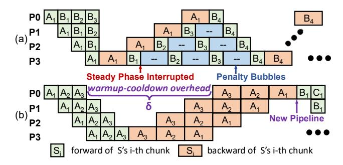
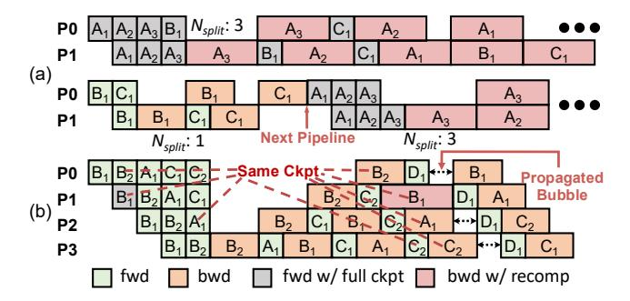
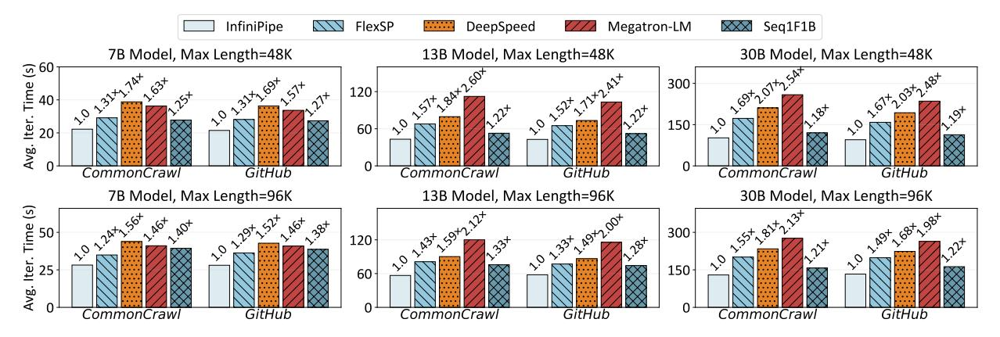
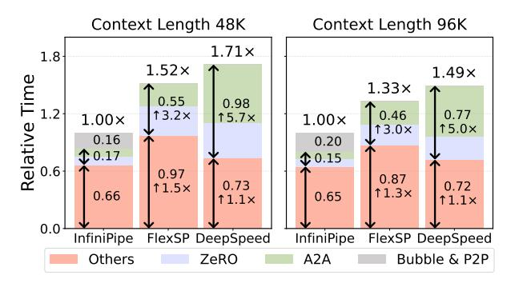
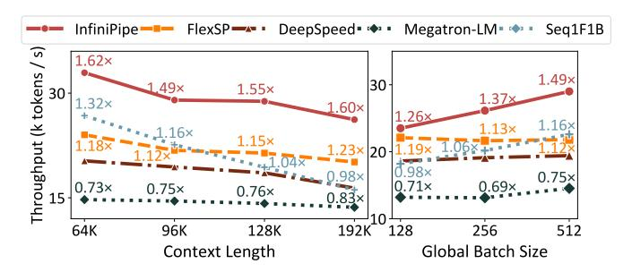
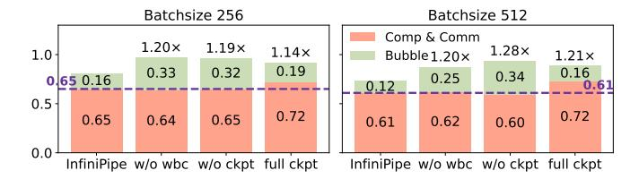
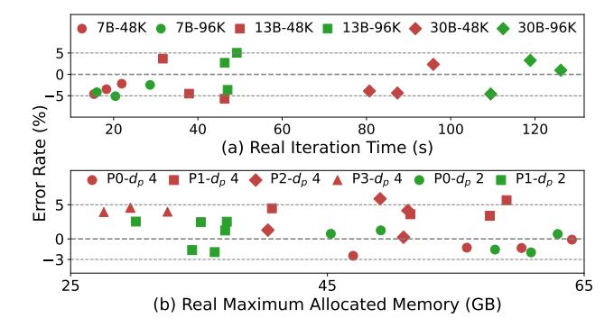
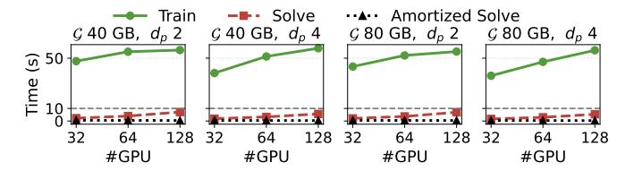
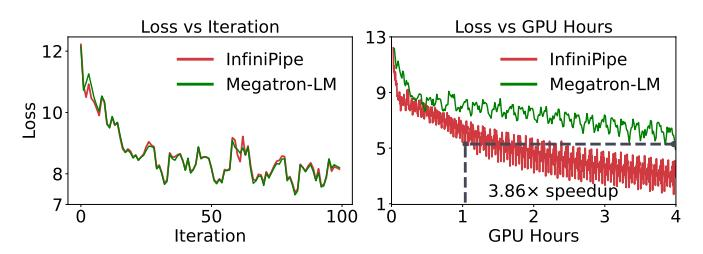

# Algorithm 1: Workload-Balanced Sequence Chunking

```
Input: Cost model \mathcal{M}, token capacity \mathcal{C}, sequence lengths
             S, slice number K.
    Output: Chunks \{(C_k, S_k) \mid k \le n\}, where n is the
                number of chunks.
 1 mesh, \mathcal{T}_t, \mathcal{T}_m \leftarrow \mathcal{M}.split(\max(S), K);
 split\_chunks, tail\_slices, short_seqs \leftarrow split(S, mesh);
    // a sorted_list with metric \frac{tot\_time}{tot\_tokens}
 3 \mathcal{B} \leftarrow \text{initialize\_buckets(tail\_slices)};
 4 M.descend_sort_by_time(short_seqs);
 5 while \neg short\_seqs.is\_empty() do
         short\_seq, flag \leftarrow short\_seqs.pop(0), False;
         if \min_{b \in \mathcal{B}} b.tot\_tokens + short\_seq.tokens > \mathcal{T}_m then
             B.create_new_bucket(short_seq);continue;
 8
 9
         for bucket \in \mathcal{B} do
              if bucket.tot_time + short_seq.time \leq \mathcal{T}_t &
10
                bucket.tot\_tokens + short\_seq.tokens \leq \mathcal{T}_m then
11
                    bucket.combine(short_seq);flag \leftarrow True;
         if \neg flag then
13
             \mathcal{T}_t \leftarrow \min_{b \in \mathcal{B}} b.\text{tot\_time} + \text{short\_seq.time}; \textbf{goto} 9;
15 batched\_chunks, hybrid\_chunks \leftarrow transform(\mathcal{B});
16 return split\_chunks \cup batched\_chunks \cup hybrid\_chunks
```

concrete expression omitted). To co-optimize the balance of time cost and chunk length, we prioritize putting the longest short sequence into the bucket with the minimum  $\frac{tot\_time}{tot\_tokens}$  (Line 3, 9-12), where the metric indicates the proportion of long sequences in the bucket.  $\mathcal{T}_t$  is loosened when  $\mathcal{T}_m$  can not be met in the BFD process (Line 14).

The sequence processor demonstrates a time complexity of  $O(n^2|S|^2)$ , introducing negligible overhead.

#### <span id="page-4-1"></span>C. Chunk Scheduler

In this section, we first define our scheduling space through careful trade-off discussions and then present our two-level approach that jointly optimizes pipeline schedule (via *sequence grouping*, § III-C2) and checkpointing configuration (via *stage-aware chunk-level adaptive checkpointing*, § III-C3).

1) Solving Space Definition: It's non-trivial to solve a sophisticated schedule plan due to the vast optimization space:

1) There exist numerous basic scheduling patterns [2], [13], [22], [29] with each exhibiting distinct memory footprint and bubble characteristics. 2) The execution order of varied-length sequences needs to be determined. 3) A checkpointing mechanism tailored for EPP is required to efficiently integrate checkpointing. We begin by introducing some key insights, based on which the solving space is then confined.

To begin with, *1F1B* is taken as the basic schedule pattern. GPipe [2] features forward-then-backward schedule, which is not memory efficient because it needs to accommodate all micro-batches. Chimera [22] proposes bidirectional PP while it duplicates model states and needs synchronization of gradients. Other 1F1B schedule patterns [23], [27], [29], [31] are also proposed. However, most improvements in these works stem from reducing the bubble of warmup and cooldown

<span id="page-5-1"></span>> **[图片提取文字 (无描述)]:**
> B₄ P1 (a)  $B_3$ ۱B»۰ **P3** Steady Phase Interrupted **Penalty Bubbles** warmup-cooldown overhead В₁ **New Pipeline P3** forward of S's i-th chunk backward of S's i-th chunk


Fig. 5: Illustration of pipeline scheduling space. (a) Explanation of sequences' execution order in a 1F1B pipeline. (b) To avoid OOM error, multiple 1F1B pipelines are scheduled, with each introducing an identical warmup-cooldown overhead  $\delta$ .

phases. As the number of micro-batches increases, the benefits diminish because the steady phase with negligible bubbles dominates the total execution. Most importantly, the number of micro-batches can be adjusted by controlling the splitting granularity of the sequence processor (hyper-parameter K of Alg. 1), which is optimized in the solving process. To this end, 1F1B schedule [31] is taken as our basic schedule pattern as we focus on training throughput.

Moreover, it's feasible to schedule one or multiple 1F1B pipelines, within which longer sequences are prioritized to execute. To begin with, the longest sequences should be scheduled first within a 1F1B pipeline. As illustrated in Fig. 5(a), sequence A with one chunk is scheduled before sequence B with three chunks. We observe that the steady phase is interrupted due to the unavailability of a backward schedule, introducing severe penalty bubbles. To address this, we prioritize longer sequences in a 1F1B pipeline and enforce this as a fundamental scheduling rule. Moreover, scheduling of multiple 1F1B pipelines is necessary when sequences cannot be scheduled in a single 1F1B pipeline altogether. As shown in Fig. 5(b), sequences B and C cannot be co-scheduled with sequence A due to the limited memory capacity, forcing a new pipeline to be scheduled. Gradient accumulation is enabled among these 1F1B pipelines to ensure optimization consistency. We do not exploit pipeline bubbles to overlap these 1F1B pipelines, as typically no more than two 1F1B pipelines are scheduled by our solver, offering marginal benefits but complicating the solving process.

Furthermore, *employing stage-aware chunk-level adaptive checkpointing*. Firstly, naively disabling checkpointing causes performance degradation: 1) for long sequences, the extreme sequence sharding granularity required to alleviate the memory overhead harms hardware utilization, and 2) a number of 1F1B pipelines have to be scheduled for multiple such sequences, leading to prohibitive warmup-cooldown overhead. However, directly applying full checkpointing introduces unnecessary recomputation overhead. Furthermore, the memory footprint disparity across chunks and pipeline stages renders suboptimal performance of a uniform and static checkpointing strategy. Specifically, different pipeline stages have varying

requirements for checkpointing, and applying checkpointing on longer chunks reduces more activation footprint at the same recomputation cost if chunks are workload-balanced. The trade-offs above inspire us to employ a *stage-aware adaptive* checkpointing strategy at chunk granularity.

In summary, we define our solving space as follows: for pipeline schedule, we group sequences and assign sequences of each group to a distinct 1F1B pipeline P, formulating a set  $\mathcal{P}$ ; for checkpointing, we apply a customized checkpointing layer ckpt(p,k) for each chunk  $\{C_k,S_k\}$  at each pipeline stage p. Let  $\mathcal{S}[i]$  represents the set of sequences divided into i chunks, the problem can be formulated as:

<span id="page-5-2"></span>minimize 
$$\sum_{P \in \mathcal{P}} T(P)$$
  
s.t.  $\bigcup_{P \in \mathcal{P}} \mathcal{S}_P = \mathcal{S}[:],$  (12)

where  $\mathcal{S}_P$  represents the sequences scheduled in P and T(P) denotes the total execution time of P. Thanks to the workload-balanced manner InfiniPipe processes sequences, we ignore the pipeline bubbles in the steady phase and simplify Eq. 12 as a summation of recomputation cost  $T_{ckpt}(P)$  and warmup-cooldown overhead  $\delta$ :

<span id="page-5-3"></span>
$$minimize \sum_{P \in \mathcal{P}} \delta + T_{ckpt}(P),$$
 (13)

where  $\delta$  is a constant approximated as  $(d_p - 1) \cdot avg(T_{tot})$ . The optimal pipeline schedule  $\mathcal{P}_0$  along with checkpointing configuration  $ckpt_0(p,k)$ , is co-optimized, with detailed methodology provided in § III-C2 and § III-C3, respectively.

<span id="page-5-0"></span>2) Sequence Grouping: An interference of pipeline schedule and gradient checkpointing is observed in Fig. 6(a). Indicated by Eqs. 7,8, the pipeline's memory footprint is related to  $N_{split}$ , i.e., the number of chunks the longest sequence in a sequence group is split into. Accordingly, when short sequences B and C are grouped with long sequence A, they are forced to apply a tighter checkpointing setup than they are scheduled separately due to the enlarged  $N_{split}$ , introducing more recomputation overhead. Therefore, 1) sequences of similar lengths should be grouped together 2) scheduling more 1F1B pipelines is potential to reduce recomputation cost  $\sum_{P\in\mathcal{P}}T_{ckpt}(P)$  of Eq. 13 at the cost of severer warmupcooldown overhead  $\delta \cdot |\mathcal{P}|$ , forming the trade-off when optimizing sequence grouping strategy.

We employ a dynamic programming method to resolve the optimal sequence grouping strategy. Let dp[i] represent the minimum cost to schedule sequences with at most i chunks. The state transition equation can be deduced as:

$$dp[i+1] = \min_{0 \le k \le i} \{ dp[k] + \delta + T_{ckpt}(P) \}, \tag{14}$$

where sequences in S[k+1:i+1] is scheduled by pipeline P and  $T_{ckpt}(P)$  is obtained by applying stage-aware chunk-level adaptive checkpointing (§ III-C3) on P. By tracking state transitions to dp[N], we derive both the sequence grouping and its corresponding checkpointing configuration.

<span id="page-6-1"></span>> **[图片提取文字 (无描述)]:**
> $N_{split}$ : 3 P0 P1 B₁ (a) P0 B₁ P1 **Next Pipeline**  $N_{split}$ : 3 N<sub>split</sub>: 1 =Same Ckpt -P0 Propagated Bubble P1 (b) **P3** fwd w/ full ckpt bwd w/ recomp bwd


Fig. 6: Illustrations of insights about co-optimizing checkpointing with pipeline schedule. (a) Checkpointing configuration is coupled with the grouping strategy. (b) Checkpointing setups of different pipeline stages have dependencies.

<span id="page-6-0"></span>3) Stage-Aware Chunk-Level Adaptive Checkpointing: In this section, we elaborate on how we apply optimal checkpointing configuration for a given 1F1B pipeline P assigned n chunks.

To begin with, we analyze the impact of checkpointing on PP and introduce a constraint on ckpt(p,k). As illustrated in Fig. 6(b), full checkpointing is applied to  $B_1$  of the second stage. We observe that checkpointing affects not only the second stage, introducing propagated bubbles of identical size in all the other stages. A key insight is that applying full checkpointing to the marked chunks  $B_2$ ,  $A_1$ , and  $C_2$  exploits the propagated bubble and maintains the total execution time unchanged. Let ckpt'(p,k) represent the number of checkpointed layers for the chunk executing the  $k^{th}$  backward pass in the  $p^{th}$  pipeline stage (the execution order differs between forward and backward passes). Based on this insight, we yield the following constraint:

$$ckpt'(p,k) = ckpt'(p+i,k+i) = \mathcal{C}[k+d_p-p], \tag{15}$$

where C is a set containing  $d_p - 1 + n$  independent integer variables. Let f2b[k] map the forward execution order to the backward execution order, we have:

<span id="page-6-4"></span>
$$ckpt(p,k) = ckpt'(p, f2b[k]) = \mathcal{C}[f2b[k] + d_p - p]$$
 (16)

This formulation reduces the number of optimization variables from  $n \cdot d_p$  of ckpt(p,k) to  $d_p-1+n$  of  $\mathcal{C}$ , significantly reducing solving overhead.

Afterward, a solution based on ILP is introduced, as outlined in Alg. 2. Fig. 6(b) reveals that recomputation cost  $T_{ckpt}(P)$  is related to  $\mathcal C$  with:

<span id="page-6-3"></span>
$$T_{ckpt}(P) = \hat{F} \cdot \sum_{c \in C} c, \tag{17}$$

where  $\hat{F}$  denotes the estimated forward execution time of a model layer. The optimal checkpointing strategy aims to minimize the recomputation cost  $T_{ckpt}(P)$  (Eq. 17) with peak

**Algorithm 2:** Stage-Aware Chunk-Level Adaptive Checkpointing Solving Based on ILP

<span id="page-6-2"></span>**Input:** Chunks  $\{S_k|k\leq n\}$ , GPU memory capacity  $\mathcal{G}$ , chunks windows  $W_p(t)$ 

Output: Checkpointing configuration  $\mathcal{C}$  and minimum recomputation cost  $T_{ckpt}$ 

$$\begin{array}{ll} \textbf{1 for } k \leq n \ \textbf{do} \\ \textbf{2} &$$

12 return  $C, T_{ckpt}$ 

memory  $M_{tot}(p,t)$  (Eq. 8) not exceeding hardware capacity limit  $\mathcal{G}$ , formulated as:

<span id="page-6-5"></span>s.t. 
$$M_{ms}(p) + \sum_{k \in W_p(t)} M_{act}(p, S_k) \leq \mathcal{G} \quad \forall (p, t), p \leq d_p$$

$$c \leq \frac{L}{d_p}, \forall c \in \mathcal{C}$$

$$(18)$$

Combining Eqs. 9,10,16, we derive a linearity:

$$M_{act}(p, S_k) = \mathcal{I}_p[k] - \mathcal{F}[k] \cdot \mathcal{C}_{p,k}, \tag{19}$$

where the coefficients  $(\mathcal{I}_p[k], \mathcal{F}[k])$  and  $\mathcal{C}_{p,k}$  are defined explicitly in Alg. 2. To this end, constraint 18 is further reformulated as a system of linear inequalities in terms of  $\mathcal{C}$  and the ILP is finally expressed as:

$$\underset{\mathcal{C} \in \mathbb{N}^{n+d_p-1}}{\arg \min} \sum_{c \in \mathcal{C}} c$$
s.t. 
$$\sum_{k \in W_p(t)} \mathcal{I}_p[k] - \mathcal{F}[k] \cdot \mathcal{C}_{p,k} \leq \mathcal{G} - M_{ms}(p) \quad \forall (p,t), p \leq d_p$$

$$c \leq \frac{L}{d_p}, \forall c \in \mathcal{C}$$
(20)

After optimizing C and  $T_{ckpt}$ , the optimal checkpointing configuration  $ckpt_0(p,k)$  can be obtained by Eq. 16.

#### IV. IMPLEMENTATION

We implement InfiniPipe in approximately 5K lines of code using Python, CUDA, and Triton [33]. The SCIP [6] library is leveraged to solve the ILP problems. Built on PyTorch, InfiniPipe integrates the flash-attn [9], [10] library for variable-length sequence packing and adopts NCCL [1] as the communication backend. Additionally, several key points in our implementation are highlighted as follows.

*Tailored FSDP for Elastic Pipeline Parallelism.* FSDP operates orthogonally to SP and is commonly combined with SP to reduce model state memory overhead. Although PyTorch FSDP [\[38\]](#page-12-7) serves as the most widely-used implementation, its native version is not compatible with pipeline parallelism with gradient accumulation. InfiniPipe's runtime engine seamlessly integrates PyTorch FSDP with EPP, allowing ZeRO communication to be overlapped with computation when a dynamic pipeline schedule of EPP is adopted.

*Fused In-Place Cross-Entropy.* The peak memory usage during LLM training typically occurs at the beginning of the backward pass, i.e., when the cross-entropy loss starts its backward computation, where the logits' gradients as well as some intermediate tensors are materialized, introducing non-negligible estimation bias on peak memory. We adopt Megatron-LM [\[30\]](#page-12-8)'s fused in-place cross-entropy operator to eliminate the materialization of other tensors, aligning the peak memory usage with our cost model.

## V. EXPERIMENTS

## *A. Experiment Setup*

*Environments:* Our testbed consists of four GPU servers, each equipped with 8 NVIDIA A800-80GB GPUs interconnected via NVLink (400 GB/s bandwidth). Inter-node communication is handled by a 400 Gb/s InfiniBand network. The software stack includes PyTorch 2.9.0 and CUDA 12.8.

*Baseline Systems:* We compare InfiniPipe against four stateof-the-art distributed training systems: Megatron-LM, Deep-Speed, FlexSP [\[35\]](#page-12-4), and Seq1F1B [\[31\]](#page-12-1). Megatron-LM is the current general-purpose SOTA featuring 4D parallelism comprising TP (equipped with Megatron-style SP), DP (ZeRO-1), CP, and PP. DeepSpeed integrates ZeRO of three stages and Ulysses-style SP. Seq1F1B, featuring the 1F1B pipeline schedule, is included as a token-level PP baseline. The original approach of Seq1F1B divides sequences into a uniform number of chunks, which is not compatible and efficient in varied-length corpora. For fair comparison, Seq1F1B denotes splitting and packing sequences into fixed-sized chunks as well as employing a static checkpointing strategy. FlexSP extends DeepSpeed, representing the previous SOTA training system on varied-length corpora.

*Workloads:* We evaluate InfiniPipe to train LLaMA-series models (7B, 13B, 30B) on two famous real-world datasets: *CommonCrawl* and *GitHub*. The sequence length and token distribution of these two datasets are presented in Fig. [1](#page-1-1) (b). Excessively long sequences that exceed the context length are truncated.

*Protocols:* InfiniPipe and Seq1F1B employs Ulysses-style SP intra-node and PP inter-node. For Megatron-LM and DeepSpeed, we manually tune the best parallelism strategies according to specific workload requirements: 1) for Megatron-LM, the TP degree is fixed to 8 and the CP degree is set to 2 for the 7B model, while 4 for the others; 2) for DeepSpeed, SP degree is set to 16 for the 7B model and 32 for the others. All systems use activation checkpointing configurations optimized for a 96K context length: 1) for Megatron-LM, we checkpoint 10, 20, 55 layers for 7B, 13B, and 30B models, respectively; 2) for DeepSpeed and FlexSP, we checkpoint 36 layers for 30B model and none for the other model sizes. Evaluation metrics such as iteration time and token throughput are averaged during 20 training iterations. Global batch size refers to the number of sequences in a training iteration.

## *B. End-to-End Performance*

We evaluate the performance of InfiniPipe by measuring the average end-to-end time of a training iteration with global batch size fixed to 512, as shown in Fig. [7.](#page-8-0) Experiments are conducted across various datasets, model sizes, and context lengths. Comprehensive results demonstrate that InfiniPipe consistently outperforms baselines, achieving a maximum speedup of 1.69× compared to FlexSP, 2.07× compared to DeepSpeed, and 2.60× compared to Megatron-LM.

The performance gains of InfiniPipe on baseline systems except Seq1F1B primarily stem from the high communication efficiency of EPP. Specifically, DeepSpeed and FlexSP adopt Ulysses-style SP, where FSDP (ZeRO-3) is required to be applied on the whole cluster to shard the parameters and reduce gradients, resulting in frequent inter-node gather and scatter communications. Moreover, the sequence parallelism pattern of DeepSpeed and Megatron-LM introduces costly inter-node communication overhead and harms training efficiency, which has been discussed in § [II-A.](#page-1-0) In contrast, InfiniPipe restricts SP and FSDP communication intra-node by applying PP inter-node, significantly reducing the inter-node communication overhead.

FlexSP leverages heterogeneous sequence parallel groups to reduce the communication overhead of static Ulysses-style SP, where shorter sequences are scheduled with smaller SP groups with efficient intra-node communication. To this end, FlexSP accelerates DeepSpeed and Megatron-LM up to 1.33× and 1.66× respectively. However, this approach introduces workload unbalance across SP groups, and a longer sequence also necessitates being processed by a larger SP group, where the introduced inter-node communication overhead can not be ignored. This drawback is exacerbated when training larger models with limited resources. Correspondingly, the speedup of InfiniPipe compared to FlexSP increases as model size scales, ranging from 1.31× to 1.69× on *CommonCrawl* dataset with context length of 48K.

Seq1F1B suffers from pipeline bubbles resulting from workload unbalance across chunks. As context length scales, the unbalance of workload becomes more pronounced due to the enlarged variance of sequence lengths. As a result, InfiniPipe achieves a maximum speedup of 1.27× and 1.40× at a context length of 48K and 96K, respectively. Moreover, Seq1F1B adopts a non-optimal and uniform checkpointing configuration to accommodate the longest sequence, introducing more unnecessary computation when handling relatively small models. The adaptive chunk-level checkpointing pattern of InfiniPipe reduces unnecessary recomputation overhead and further enhances training efficiency.

<span id="page-8-0"></span>> **[图片提取文字 (无描述)]:**
> Megatron-LM InfiniPipe FlexSP ..... DeepSpeed Seq1F1B 7B Model, Max Length=48K 13B Model, Max Length=48K 30B Model, Max Length=48K ত 60 300-Time 120 10 232+ 40 <u>흥</u> 20 20 150-60 Avg. GitHub CommonCrawl CommonCrawl GitHub CommonCrawl GitHub 7B Model, Max Length=96K 13B Model, Max Length=96K 30B Model, Max Length=96K (s) 2, 149+2,00+ آ<u>ن</u> 50 -70 7397 300-120 70 7:33<sup>+</sup> ... 20 25 150-60 Avg. CommonCrawl GitHub CommonCrawl GitHub GitHub CommonCrawl


Fig. 7: Average end-to-end time of a training iteration under different settings of model sizes, context lengths, and datasets with speedup ratio of InfiniPipe compared to baselines presented.

<span id="page-8-1"></span>> **[图片提取文字 (无描述)]:**
> Context Length 48K Context Length 96K 1.71× 1.8 1.52× 1.49× е Н Н 1.2 1.33× 0.55 0.98 13.2× 0.46 0.77 15.7× 1.00× 1.00× Relative 90 13.0× 15.0× 0.16 0.20 10.17 **1** 0.15 0.97 0.87 0.73 0.72 11.5× ↑1.3× 0.66 0.65 ↑1.1× ↑1.1× 0.0 InfiniPipe FlexSP DeepSpeed InfiniPipe FlexSP DeepSpeed Bubble & P2P Others ZeRO A2A


Fig. 8: Case Study. End-to-end time breakdown of an iteration to train the 13B model with a fixed batch size of 512. The relative time and corresponding speedup of each component are indicated.

#### C. Case Study

To better understand InfiniPipe's performance advantages more in depth, we breakdown the end-to-end training time into several components: "ZeRO" (gather and scatter communications of ZeRO-3 that are not overlapped), "A2A" (All-to-All communication in Ulysses-style SP), "Bubble & P2P" (time for PP's p2p communication and idle time of devices resulted from pipeline bubbles) and "Others" (computation, optimizer step and e.t.c). The profiled time cost of each component is shown in Fig. 8.

To begin with, InfiniPipe exhibits a similar performance in computation against DeepSpeed with a 1.11× improvement but outperforms FlexSP from 1.33× to 1.46× which is attributed to the unbalanced workload introduced by heterogeneous SP groups in FlexSP. Furthermore, "ZeRO" and "A2A" overhead are the main bottlenecks of baselines. However, these overheads account only for 17% of the total end-to-end training time of InfiniPipe. By employing efficient intra-node communication, InfiniPipe reduces these overheads significantly by up to 3.2× compared to FlexSP and 5.7× compared to DeepSpeed. Last but not least, the bubble ratio is maintained at a relatively low level, less than 20%, thanks to the workload-balanced chunking method and efficient pipeline schedule of InfiniPipe.

<span id="page-8-2"></span>> **[图片提取文字 (无描述)]:**
> InfiniPipe -FlexSP ---DeepSpeed• ••••• Megatron-LM \* \* \* Seq1F1B Throughput (k tokens / s) 1.62× 1.49× 30 1.49× 1.55× 30 1.37x 1.60× 1.26×  $1.23 \times 20$ 0.75× 0.73× 0.75× 0.76× 0.83× 15 64K 96K 128K 192K 128 256 512 Context Length Global Batch Size


Fig. 9: Scalability study. Token throughput to train a 13B model under different context lengths and global batch sizes. Indicated improvements are normalized to DeepSpeed.

The advantages above lead to overall speedup of 1.52× and 1.71× compared to FlexSP and DeepSpeed, respectively.

### D. Scalability Study

As shown in Fig. 9, token throughput under different settings of context length and batch size is measured to assess the scalability of InfiniPipe.

Scalability w.r.t. context length: InfiniPipe consistently achieves superior performance against baseline systems when context length is extended from 64K to 192K, achieving a speedup from 1.30× to 1.37× compared to FlexSP and from 1.23× to 1.63× compared to Seq1F1B. As context length scales, the throughput of all systems tends to decrease, attributed to the increased computation overhead per token. Megatron-LM exhibits the least degradation because the quadratic complexity self-attention operator is overlapped in CP's P2P kernel, resulting in similar processing time per token. On the contrary, Seq1F1B appears to be the most sensitive to context length as the increasing variance of sequence lengths results in a more pronounced unbalance of workload across chunks, leading to severe pipeline bubbles.

Scalability w.r.t. global batch size: As global batch size ranges from 128 to 512, InfiniPipe consistently outperforms baselines and its performance exhibits a growing trend with throughput improved by up to 1.18×. In contrast, the through-

<span id="page-9-0"></span>> **[图片提取文字 (无描述)]:**
> Batchsize 256 Batchsize 512 Comp & Comm 1.20× 1.19× 1.28× 1.14× Bubble 1.20 x 1.0 1.21× 0.32 0.19 0.33 0.16 0.34 0.25 0.65 0.16 0.12 0.5 0.72 0.72 0.65 0.64 0.65 0.62 0.61 0.60 0.0 InfiniPipe w/o wbc w/o ckpt full ckpt InfiniPipe w/o wbc w/o ckpt full ckpt


Fig. 10: Ablation study. End-to-end time and bubble overhead to train a 13B model with a 64K context length. The times presented are all normalized to the end-to-end time of FlexSP.

put of baseline systems remains almost the same due to a similar computation overhead per token. Benefited from the lowered bubble ratio with more sequences, InfiniPipe delivers a 1.33× and 1.49× throughput improvement compared to FlexSP and DeepSpeed, respectively.

#### E. Ablation Study

To validate the effectiveness of InfiniPipe's key components, i.e., workload-balanced chunking and the co-optimization approach of pipeline schedule and checkpointing, we compared InfiniPipe with three ablated versions. Specifically, "w/o wbc" denotes evenly splitting long sequences and packing short sequences into fixed-length chunks, "w/o ckpt" refers to disabling gradient checkpointing, and "full ckpt" represents applying full checkpointing.

As shown in Fig. 10, the variants exhibit distinct computation and pipeline bubble overhead. Despite introducing no recomputation overhead, "w/o ckpt" brings limited computational benefits compared to InfiniPipe due to the degradation of hardware utilization resulting from the finer granularity of a micro-batch. Moreover, the bubble ratios of all methods except "w/o ckpt" decrease as the global batch size scales. This occurs as an increasing number of excessively long sequences forces scheduling of more 1F1B units, introducing severe warmup-cooldown overhead. "w/o wbc" suffers from bubble overhead caused by workload unbalance while "full ckpt" incurs higher computation overhead due to suboptimal checkpointing configuration. Thanks to the co-optimization approach (§ III-C), InfiniPipe consistently outperforms these variants with relatively low bubble ratio and computation overhead.

#### F. Solver Accuracy and Scalability

We train a 13B model under a 64K context length to verify the solver's accuracy and light overhead.

Accuracy of Cost Model: The deviations between the cost model's simulation and real profiled statistics are assessed under various settings of model sizes, context length, PP stages, and degrees. As shown in Fig. 11, the error rates on both time cost and memory footprint are typically below 5%, verifying the effectiveness of our cost model (§ III-A).

Overhead and Scalability of Solver: We evaluate the average time of a training iteration and the solver's solving within an optimality gap of 2% for the ILP problem (configurable in SCIP [6]), and present the statistics in Fig. 12. The amortized

<span id="page-9-1"></span>> **[图片提取文字 (无描述)]:**
> 7B-48K ● 7B-96K ■ 13B-48K ■ 13B-96K ◆ 30B-48K ◆ 30B-96K Error Rate (%) 20 40 100 120 60 80 (a) Real Iteration Time (s) P1-d<sub>p</sub> 4 P2-d<sub>p</sub> 4 A P3-d<sub>p</sub> 4 P0-d<sub>p</sub> 2 | 25 (b) Real Maximum Allocated Memory (GB)


Fig. 11: Accuracy of Cost Model. The upper indicates the error rate of estimation on end-to-end time, while the bottom presents the error rate on the memory footprint of each pipeline stage. Experiments conducted on a fixed cluster size of 32, i.e,  $d_s \times d_p$ .

<span id="page-9-2"></span>> **[图片提取文字 (无描述)]:**
> Train ·· · · Amortized Solve --- Solve G 40 GB,  $d_p$  2 G 40 GB,  $d_0$  4  $G 80 \text{ GB}, d_p 2$ G 80 GB,  $d_p$  4 ⊙ 50 \*\*\*\*\*\*\*\*\*\*\*\*\*\*\*\*\*\*\*\*\*\*\*\*\*\*\*\*\*\*\*\*\*\*\*\*\*\* -----128 32 128 32 64 64 #GPU #GPU #GPU #GPU


Fig. 12: The actual training time, solving time, and amortized solving time, i.e., solving time / (#GPU / 8), under various cluster scales, hardware memory capacities ( $\mathcal{G}$ ), and PP degrees ( $d_p$ ).

solving time is also included due to the increased available CPU resources when deployed on larger-scale clusters. The global batch size scales proportionally to cluster size, i.e., #GPU, and is set to 512 initially for a cluster containing 32 GPUs. The results demonstrate that the solver's ability to scale to larger clusters and its overhead can be fully **overlapped** with the training process.

### G. Training Convergence

We randomly sampled 25,600 sequences from the *GitHub* dataset and trained a 1B-parameter model from scratch using an AdamW optimizer. The *per-token loss* of InfiniPipe compared with the reference implementation, Megatron-LM, with respect to iteration and GPU hours is presented in Fig. 13. The results demonstrate that InfiniPipe follows the same optimization trajectory as Megatron-LM while achieving a 3.86× reduction in GPU hours.

<span id="page-9-3"></span>> **[图片提取文字 (无描述)]:**
> Loss vs Iteration Loss vs GPU Hours 13 12 InfiniPipe InfiniPipe Megatron-LM Megatron-LM SS 10 5 8 3.86× speedup 100 50 Iteration **GPU Hours**


Fig. 13: The training loss of InfiniPipe and Megatron-LM.

