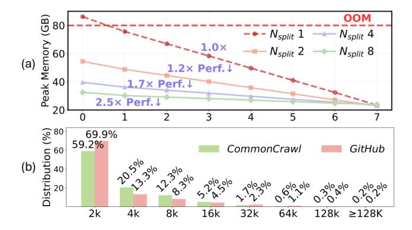
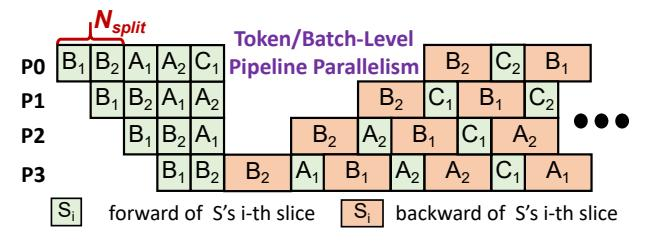

# I. INTRODUCTION

Large language models (LLMs) [\[3\]](#page-11-0), [\[4\]](#page-11-1), [\[8\]](#page-11-2), [\[11\]](#page-11-3), [\[24\]](#page-11-4), [\[34\]](#page-12-0) have achieved remarkable progress and have transformed a wide range of applications. Recent frontier models increasingly support longer contexts, drawing growing attention to efficient long-context training.

Current long-context training techniques, such as Sequence Parallelism (SP) [\[7\]](#page-11-5), [\[17\]](#page-11-6), [\[21\]](#page-11-7), [\[25\]](#page-11-8) and Token-Level Pipeline Parallelism (token-level PP), employ *sequence splitting* to reduce the substantial activation memory overhead. Specifically, SP distributes a sequence spatially and incurs communication at each layer, whereas token-level PP schedules sequence slices' execution temporally, introducing negligible communication overhead. Modern clusters exhibit *bandwidth heterogeneity*: intra-node bandwidth is substantially higher than that of inter-node. As a result, SP is often bottlenecked by inefficient inter-node communication (see § [II-A\)](#page-1-0), and token-level PP could be utilized to optimize communication overhead.

However, how to efficiently unleash the potential of PP is a non-trivial problem, and is highly *workload-related*. On the one hand, the trade-off between memory footprint and computation efficiency needs to be balanced, as shown in Fig. [1](#page-1-1) (a). Batch-level PP (e.g., DAPPLE [\[13\]](#page-11-9)) employs *sequence packing* to batch short sequences into a micro-batch. Yet for long sequences, enlarged micro-batch granularity magnifies stage-wise memory imbalance, frequently leading to out-ofmemory errors (OOM). Token-level PP, such as Seq1F1B [\[31\]](#page-12-1), mitigates memory imbalance by *sequence splitting*, but its finer-grained micro-batches reduce computational intensity and lead to performance degradation. On the other hand, a low bubble ratio, indicating high device occupancy, is crucial for PP's efficiency. The *sequence splitting* technique can be leveraged to increase the number of micro-batches and reduce the bubble ratio when there are few micro-batches. However, though sequences are evenly split, the workload between slices is not balanced due to the quadratic computation complexity of self-attention, which also harms efficiency.

Moreover, the skewed distribution of sequence lengths further exposes the limitation of monolithic and static PP granularity. As shown in Fig. [1](#page-1-1) (b), real-world datasets such as *GitHub* contain highly skewed input sequences: the majority of sequences are under 16K in length, with less than 0.6% exceeding 64K. Recent LLMs [\[12\]](#page-11-10), [\[20\]](#page-11-11), [\[37\]](#page-12-2) explicitly adopt mixtures of short and long sequences. LLaMA3 [\[12\]](#page-11-10) indicates that mixing 0.1% of long-context data with short-context data optimizes performance across both short-context and longcontext benchmarks. This *long-tail* nature of sequence lengths reveals the dynamic characteristic of workload, motivating an *adaptive* and *hybrid* PP granularity: use *sequence packing* for short sequences while adaptively adjusting the granularity of *sequence splitting* for long sequences to tackle the complex trade-off among memory footprint, hardware utilization, and pipeline bubbles.

Although orchestrating sequence packing and sequence splitting provides a promising path to adapt PP to heterogeneous workloads, it remains underexplored. Existing systems either ignore the skewed length distribution, relying on expertlevel manual tuning to determine a static splitting granularity [\[23\]](#page-11-12), [\[31\]](#page-12-1), or consider only sequence packing and overlook sequence splitting [\[14\]](#page-11-13), [\[36\]](#page-12-3), suffering from severe memory overhead. The methodologies above fail to generalize, lead to sub-optimal performance, and exhibit limited applicability in long-context training scenarios.

In this paper, we propose *Elastic Pipeline Parallelism* (EPP) that features: 1) workload-balanced and adaptive sequence

> **[图片提取文字 (无描述)]:**
> OOM Peak Memory (GB) 80  $- - N_{split} 1 \longrightarrow N_{split} 4$ Nsplit 8 60 (a) 1.2× Perf.↓ 40 1.7× Perf.↓ 2.5× Perf.↓ 20 6 Distribution (%) 69.9% 59.2% CommonCrawl GitHub 2k 4k 8k 16k 32k 64k 128k

Fig. 1: (a) Impact of *sequence splitting* on memory footprint and computation efficiency, where performance degradation is presented. (b) Length distribution of real-world datasets.

splitting and packing, which is fully *automatic*, eliminating the need of manually tuning, 2) *heterogeneous* micro-batch (*Sequence Chunk* in Fig. 4) different from *homogeneous* micro-batch of monolithic PP (as shown in Fig. 2), and 3) *dynamic pipeline schedule*, which is necessitated by heterogeneous micro-batches of EPP. To the best of our knowledge, this is the **first** work that optimizes scheduling for adaptive and hybrid granularity PP, which is successfully employed in varied-length long-context training workloads.

However, there are **four primary challenges** to fully unleash its potential:

- Precise Cost Estimation. The workload balance of Sequence Chunks is crucial for lowering the pipeline bubble ratio, requiring a precise cost estimation on computation and communication. Moreover, PP's imbalanced memory footprint across stages, as well as the variable-length chunks, pose a risk of OOM errors and GPU memory fragmentation, requiring a fine-grained GPU memory management. Current cost models [35] for varied-length workloads do not consider sequence splitting and PP's stage-wise memory footprint imbalance.
- Workload-Balance of Heterogeneous Micro-Batches. Micro-batches generated from sequence splitting and sequence packing should reach similar workloads. However, prior works either only consider workload balance of sequence splitting for homogeneous sequences, ignoring workload heterogeneity [23], [31], or focus on balance of sequence packing [14], [35] and do not consider sequence splitting.
- Dynamic Pipeline Schedule. The hybrid granularity, as well as the dynamic workload, render monolithic granularity PP's static pipeline schedule ineffective. Token-level PP introduces inter-micro-batch dependencies (§II-A), and the data-centric PP granularity further increases scheduling complexity. Suboptimal pipeline schedules either fail to identify that dependency or suffer from severe pipeline bubbles and low device occupancy.
- Efficient Gradient Checkpointing. The variety of sequence length makes uniform gradient checkpointing schemes inefficient. Naively disabling or applying full checkpointing

> **[图片提取文字 (无描述)]:**
> Token/Batch-Level **Pipeline Parallelism** P2 **P3** forward of S's i-th slice backward of S's i-th slice

Fig. 2: Illustration of DAPPLE  $(N_{split}=1)$  and Seq1F1B's  $(N_{split}>1)$  schedule, where sequences are divided uniformly into  $N_{split}$  slices, forming *homogeneous* micro-batches.

degrades computation efficacy. Approaches [5], [16], [18], [32] employing a uniform configuration assume a homogeneous sequence length and ignore workload heterogeneity.

To tackle these challenges, we build InfiniPipe, a distributed training system that integrates three novel techniques:

- An Effective Cost Model (§ III-A). We establish a sophisticated and effective cost model that estimates: 1) the computation and communication overhead of the heterogeneous micro-batch, 2) the stage-wise memory footprint of EPP, 3) the impact of gradient checkpointing on the time and memory overhead, with an error rate of less than 5%.
- A Workload-Balanced and Resource-Aware Sequence Processor (§ III-B). Leveraging the cost model, we devise a sequence chunking algorithm that generates workloadbalanced heterogeneous micro-batches.
- A Chunk Scheduler that Co-Optimizes Pipeline Schedule
  with Gradient Checkpointing (§ III-C). A co-optimization
  methodology is devised to tackle the challenges of pipeline
  scheduling and gradient checkpointing. Notably, we propose
  a new checkpointing mechanism called <u>Stage-Aware Chunk-Level Adaptive Checkpointing</u> tailored for EPP. InfiniPipe
  automatically derives the optimal pipeline schedule and
  checkpointing configuration, introducing minimum recomputation overhead and bubble ratio.

Extensive experiments conducted on various workloads demonstrate that InfiniPipe achieves a speedup of up to 1.69× compared to existing SOTA work. The key contributions of this work can be summarized as follows:

- We identify the limitations of existing long-context training approaches and propose *Elastic Pipeline Parallelism* as a solution.
- We firstly co-optimize the pipeline schedule with checkpointing and propose a new mechanism named Stage-Aware Chunk-Level Adaptive Checkpointing.
- We develop InfiniPipe, a brand new distributed LLM training system for varied-length corpora.
- We comprehensively evaluate InfiniPipe to indicate that InfiniPipe has state-of-the-art performance.

