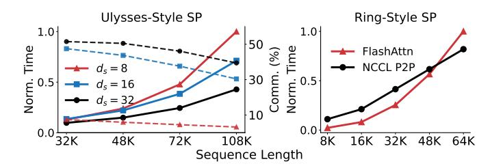
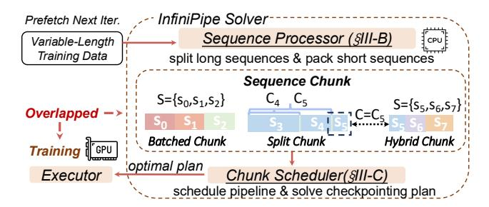

# II. PRELIMINARIES

A. Parallelism Strategies of Distributed LLM Training

**Sequence Parallelism.** Sequence Parallelism (SP) partitions sequences into multiple slices, introducing communication

> **[图片提取文字 (无描述)]:**
> Ulysses-Style SP Ring-Style SP 1.0 1.0 Norm. Time 5.0 FlashAttn NCCL P2P Norm. 0.5 0.0 108K 48K 32K 48K 64K Sequence Length

Fig. 3: Communication Overhead of SP. The left presents the total time (solid) and proportion of all-to-all communication (dashed) of USP under different context lengths and parallel degrees  $(d_s)$ . The right indicates the time of flash-attn and NCCL's P2P kernels.

for self-attention operations, based on which SP is typically categorized into two variants: Ulysses-style SP (USP) and Ring-style SP (RSP). USP [17] introduces four all-to-all communications to transform query, key, value, and all-to-all communications are costly, accounting for a large portion of end-to-end time (Fig. 3,  $d_s > 8$ ). In contrast, RSP [7], [21], [25] performs a multi-step online self-attention, where the keys and values of different slices are exchanged via point-to-point (p2p) communication, which is overlapped with the attention operation. However, the overlapping is only achievable for sequences longer than 48K (Fig. 3), which is minor in real-world datasets (Fig. 1 (b)).

Pipeline Parallelism. Pipeline Parallelism (PP) horizontally partitions a model into several stages that execute sequentially, requiring transmission of activation between two neighboring parts. This transmission introduces negligible communication overhead as it occurs only once. To enhance device occupancy, PP partitions training inputs into micro-batches, which categorizes PP into two variants: 1) batch-level PP [2], [13], [22], [27] that divides input samples, and 2) token-level PP [23], [31] that further splits a sequence into slices. Various batch-level pipeline schedules [2], [13], [22], [27] have been proposed. Fig. 2 illustrates DAPPLE and Seq1F1B's schedule consisting of three distinct stages: warmup, steady, and cooldown. For the token-level PP's schedule, it's worth noting that an inter-micro-batch schedule dependency is introduced: for each slice, the forward pass must be scheduled after its preceding slices, while the backward pass must be scheduled after its subsequent slices. This is because the query of a token accesses only preceding tokens' keys and values in the forward pass. Consequently, gradients of key and value of a token rely on those of subsequent tokens in the backward pass. Token-level PP exhibits a lower memory footprint compared to batch-level PP but may introduce a performance degradation, as shown in Fig. 1(a).

**Fully Sharded Data Parallelism.** Fully sharded data parallelism (FSDP) partitions model states to alleviate the overhead of duplicate model states of traditional data parallelism. Accordingly, gather and scatter communications are introduced to obtain complete parameters required for LLM's execution and reduce gradients, respectively. The gather and scatter

> **[图片提取文字 (无描述)]:**
> InfiniPipe Solver Prefetch Next Iter. Sequence Processor (§III-B) Variable-Length CPU Training Data split long sequences & pack short sequences Sequence Chunk  $S = \{s_0, s_1, s_2\}$  $S = \{s_5, s_6, s_7\}$ Overlapped **Batched Chunk** Split Chunk Hybrid Chunk **Training** optimal plan Chunk Scheduler(§III-C) Executor schedule pipeline & solve checkpointing plan

Fig. 4: InfiniPipe System Overview.

communications in SDP can overlap with computation.

#### B. Sequence Packing

Techniques such as *padding* or *packing* are used to deal with sequences of varying lengths. Padding pads or truncates sequences to the same length, employing an activation layout of [B, max(S), D], introducing unnecessary computation overhead. In contrast, sequence packing [19], which concatenates multiple input sequences into a single sequence and adopts a [sum(S), D] layout, effectively eliminates redundant computation overhead.

#### C. Gradient Checkpointing

Gradient checkpointing trades computation for activation memory footprint reduction through freeing intermediate activations after the forward pass and recomputing them in the backward pass for gradient computation.

#### D. Gradient Accumulation

Gradient accumulation updates parameters once using the accumulated gradients from multiple micro-batches, yielding the same optimization trajectory as training at a large batch size under limited memory capacity.

