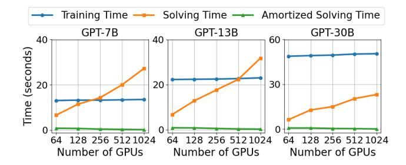

# 6.6 Complexity and Scalability of FlexSP Solver

We demonstrate that the MILP problem solving in FlexSP solver scales well and can be fully overlapped by the training. Due to the sequence bucketing, the MILP solving time (Eq. (17)) is mainly affected by the number of GPUs (N) and the number of buckets. Since the number of buckets is small, we focus on the scalability against N. When there are more GPUs, the problem solving for each iteration takes longer, while the training time maintains at a similar level (as it is common to scale the batch size proportionally to N). However, recall that FlexSP disaggregates the problem solving on CPUs and the training on GPUs (§5). In modern clusters, using more GPUs also indicates more CPUs are available to solve the MILP for different batches concurrently, so the solving time can be amortized and we can still overlap the problem solving well. To elaborate, we conduct a simulation experiment in Fig. 8 to assess the time cost with GPU counts varying from 64 to 1024. We show the estimated training time, solving time and amortized solving time below (solving time divided by the number of GPU nodes, i.e., N/8) per iteration in seconds. We find that the estimated training

> **[图片提取文字 (无描述)]:**
> Training Time — Solving Time — Amortized Solving Time GPT-7B GPT-13B GPT-30B 40 40 60 Time (seconds) 20 20 30 128 256 512 1024 64 128 256 512 1024 64 128 256 512 1024 Number of GPUs Number of GPUs Number of GPUs

Figure 8. Estimated per-iteration training time, solving time and amortized solving time (solving time divided by the number of GPU nodes, i.e., /8) of FlexSP Solver.

time does remain similar. Although the per-iteration solving time may exceed training time when ≥ 256, the amortized solving time is much lower, and is fully overlappable.

More Experimental Results. Due to the space limitation, we put more results and analysis in the Appendix, including more details of our experimental setups in Appendix [B,](#page-16-4) estimation accuracy of cost models in Appendix [C,](#page-16-0) performance analysis of SOTA systems in Appendix [D,](#page-16-5) discussion about integrating context parallelism in Appendix [E.](#page-16-6) Please refer to our Appendix for more details.

