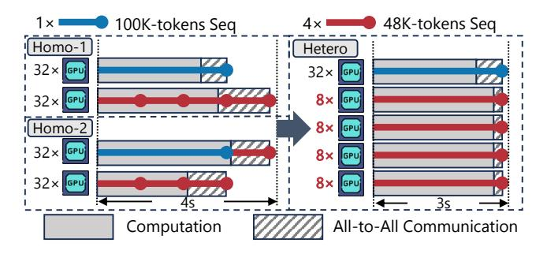

# 1 Introduction

Large Transformer models [\[12,](#page-13-0) [26,](#page-13-1) [35,](#page-14-0) [40,](#page-14-1) [45\]](#page-14-2), represented by Large Language Models (LLMs) [\[3,](#page-12-0) [7,](#page-12-1) [36,](#page-14-3) [37,](#page-14-4) [42,](#page-14-5) [43,](#page-14-6) [49,](#page-14-7) [50,](#page-14-8) [54\]](#page-15-0), have made astonishing achievements in the field of artificial intelligence (AI). Recently, there is an increasing need to extend the context length of LLMs, which represents the maximum supported sequence length of the LLMs [\[11,](#page-13-2) [15,](#page-13-3) [47\]](#page-14-9). Therefore, long-context LLM training has garnered extensive attention from both the academia and industry [\[4,](#page-12-2) [6,](#page-12-3) [8,](#page-12-4) [24,](#page-13-4) [27,](#page-13-5) [29,](#page-13-6) [48\]](#page-14-10).

It is well known that training LLMs with longer context lengths demands increasingly more device (e.g., GPU) memory, and a promising paradigm is to parallelize the training inputs over multiple devices. Particularly, sequence parallelism (SP) [\[6,](#page-12-3) [19,](#page-13-7) [22,](#page-13-8) [24,](#page-13-4) [27,](#page-13-5) [29\]](#page-13-6) has emerged as a pivotal technique for long-context LLM training. In a nutshell, SP splits each training input in the sequence dimension and scatters different shards onto multiple devices to amortize the memory consumption. In order to carry out the training, it necessitates communication among the devices to exchange the intermediate results during the forward and backward propagation. By nature, if we wish to support longer training

∗School of Computer Science & Key Lab of High Confidence Software Technologies (MOE), Peking University

† Institute of Computational Social Science, Peking University (Qingdao)

inputs, we shall increase the SP degree[1](#page-1-0) (usually accompanied by a decrease in the data parallelism degree) to avoid encountering out-of-memory errors, while the communication overhead increases in the meantime, leading to efficiency degradation.

Although SP delivers a method to support long-context LLM training, existing systems assume the training inputs are homogeneous in terms of their lengths and apply the same SP degree to all data parallel model replicas, yet such a fixed-length assumption does not hold in practice. Typically, the training samples of LLMs are usually organized as sequences of tokens, and a training corpus consists of varied-length sequences. In order to address the discrepancy between the fixed-length assumption and the varied-length characteristic, sequence packing is a widely used data preprocessing technique. Specifically, denote as the maximum number of tokens supported for each model replica. Sequence packing concatenates multiple sequences into a longer one and ensure that the length of the packed sequence does not exceed . (A sequence will be truncated if it exceeds by itself.) Meanwhile, the attention masks and position indices are adjusted accordingly to avoid cross-contamination among the sequences. By this means, the training inputs[2](#page-1-1) can be (nearly) homogeneous in terms of their lengths, and the model gradients computed over a packed input are identical to that computed over the original, unpacked sequences.

Nevertheless, we find that the aforementioned approach sacrifices the efficiency of short sequence processing to accommodate the memory requirement of long-sequence processing. Fig. [1](#page-1-2) showcases an example, where there are 64 devices in total and the context length of the training task is 192K. Using the aforementioned approach, it necessitates an SP degree of 32, resulting in two SP=32 groups. Assume the current training step needs to process five sequences with lengths of 100K, 48K, 48K, 48K, and 48K, respectively. Due to the homogeneous parallelism designs of existing works, no matter how we pack the sequences (Case Homo-1 or Homo-2 in left side of Fig. [1\)](#page-1-2), the short sequences (48K) must be processed with an SP degree of 32, and the All-to-All communication time and computation time of four 48K sequences are 1.2s and 2.8s, respectively. However, if we allow for heterogeneous SP groups (i.e., allow groups to have non-unique SP degrees), we can form one SP=32 group to process the long sequence (100K) and four SP=8 groups to process the short sequences (48K) separately (Case Hetero in right side of Fig. [1\)](#page-1-2). By doing so, the computation time of four 48K sequences remains 2.8s, while the communication time decreases to only 0.2s,and the processing of the short sequences can be accelerated (from 4s to 3s in the example) due to the

> **[图片提取文字 (无描述)]:**
> 48K-tokens Seq 100K-tokens Seq Homo-1 Hetero Homo-2 8× 32× GPU Computation All-to-All Communication

Figure 1. An example of heterogeneity-adaptive SP improving training efficiency for varied-length sequences.

reduction in communication overhead. As we will detail in [§3,](#page-3-0) common LLM training corpora follow long-tail distributions, i.e., there are very few long sequences while the short ones dominate the corpora. Consequently, by adjusting the SP groups, we can accelerate the training of most sequences, provisioning performance improvement.

Inspired by this, this work develops FlexSP, a Flexible Sequence Parallelism for the efficient training of LLMs over varied-length sequences. Unlike existing systems that organize training sequences to fit the homogeneous parallelism, FlexSP adapts to the heterogeneous workloads of variedlength sequences by dynamically adjusting the parallelism. Essentially, FlexSP puts forward two key innovations:

- Heterogeneous Sequence Parallel Groups: As aforementioned, processing long sequences necessitates a higher SP degree to avoid out-of-memory errors, while processing short sequences has a better efficiency if we use a lower SP degree. Consequently, for each training step, FlexSP adaptively forms multiple heterogenous SP groups so that sequences with diverse lengths can be processed with different groups, making a good tradeoff between memory consumption and training efficiency.
- Time-Balanced Sequence Assignment: To minimize the processing time of each sequence individually, a naïve approach is to assign each sequence to the smallest SP group that can handle it. However, due to the long-tail distribution of datasets, short sequences dominate, and such a naïve assignment causes small groups to handle too many workloads, causing a bottleneck. This leads to workload imbalances across the SP groups, where faster groups are forced to wait for slower ones in idle. To deal with this problem, FlexSP meticulously controls which SP group each sequence should be assigned to, striking a good balance across the heterogeneous SP groups.

FlexSP co-optimizes these two factors adaptively according to the sequence length variation of each training step. Specifically, given the sequences with diverse lengths, we formulate a joint optimization problem to maximize training efficiency, which determines how to form the heterogeneous SP groups and how to assign each sequence to the most

1For simplicity, we use the abbreviation "SP degree" to denote the parallelism degree of SP. This terminology extends naturally to other parallelism strategies (e.g., data parallelism degree).

2To avoid ambiguity, by saying "training inputs", we always mean the packed sequences that are fed into the training process.

suitable group. To solve this problem, we transform it into a Mixed-Integer Linear Programming (MILP) problem by accurately modeling the computation cost, communication cost, and memory consumption of training over varied-length sequences. Subsequently, we decrease the complexity of the MILP problem via a sequence bucketing algorithm based on dynamic programming, making it efficient to solve for practical considerations.

In addition, to resolve the potential issue that there are too many sequences that cannot be processed at once, we manage to chunk the sequences into micro-batches. In particular, we establish a series of propositions based on theoretical analysis and empirical observations. Based on this, a micro-batch chunking algorithm is devised, which aims to minimize the total training time of all micro-batches.

We implement FlexSP on top of PyTorch and conduct experiments with various model sizes, training datasets, and context lengths. Empirical results show that FlexSP outperforms state-of-the-art LLM training systems by up to 1.98×, demonstrating the effectiveness of flexible sequence parallelism in long-context LLM training.

The contribution of this work are summarized as follows: (1) New System. We introduce FlexSP, a brand new distributed training LLM system for varied-length corpora. (2) New Perspective. To the best of our knowledge, FlexSP is the first to adaptively adjust the parallelism strategies given the diverse lengths, matching the heterogeneous workloads caused by varied-length sequences with heterogeneous parallelism. Existing homogeneous systems overlook the heterogeneous workloads of varied-length contexts, and typically pack sequences to similar lengths, sacrificing the efficiency of short sequences. In contrast, FlexSP is based on first principles, supporting heterogeneous parallelisms that match the diverse workloads, proposing a new perspective of redesigning systems for more efficient training of powerful models (e.g., training over varied-length images/videos). (3) State-ofthe-art Performance. Extensive experimental results verify that FlexSP consistently achieves the best training efficiency compared to existing works.

