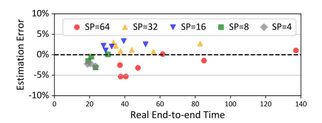

# C Estimation Accuracy of Cost Models

We evaluate the accuracy of the cost estimator (§4.1.2) utilized in FlexSP across diverse configurations (as shown in Tab. 1), including sequence parallelism degree, batch size, and sequence length. Fig. 9 compares the deviation of the estimated cost and the empirical execution time. As can be seen, our overhead estimator adeptly approximates the execution overhead, with discrepancies consistently remaining below 5%. The accurate estimations rendered by the estimator facilitates performance of our system.

> **[图片提取文字 (无描述)]:**
> 10% **Estimation Error** SP=32 ▼ SP=16 ■ SP=8 SP=64 SP=4 5% -0% -5% -10% 20 40 80 100 120 140 60 Real End-to-end Time

Figure 9. Estimation accuracy.

