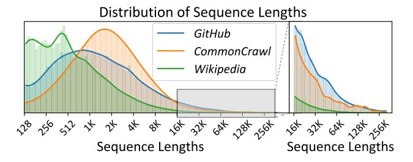

# 3 Observation and Opportunities

In this section, we introduce our observations, and illustrate the optimization opportunities.

Observation 1: Long sequences require large parallelism groups, which leads to inefficiency. As mentioned in [§1,](#page-0-0) existing works simply assume a homogeneous sequence length and therefore apply a homogeneous SP degree in each training task. To better illustrate the drawbacks of homogeneous SP design, we conduct a small testbed to assess its efficiency when facing different levels of sequence lengths. Tab. [1](#page-3-1) presents the end-to-end execution time along with the proportion of All-to-All communication. Particularly, for each row in Tab. [1,](#page-3-1) we generate fixed-length sequences until the total token number has reached 4 million, and train these sequences with divergent SP degrees. Firstly, we find that long sequences require larger parallelism groups due to memory constraint. For instance, a 32K sequence can be handled by SP groups with a degree of 8, whereas a 128K sequence requires a degree of at least 32 to fit within device memory. Secondly, larger parallelism groups can result in inefficiencies, primarily because of increased communication overhead. Smaller groups tend to perform better. For example, with 512 sequences of 8K, an SP group with a degree > 8 leads to communication time exceeding 31.4% (9.1s) due to the slow inter-node bandwidth. In contrast, groups with a degree of 8 reduce communication to just 7.8% (1.6s), benefiting from the high-bandwidth intra-node connection. In this case, the computation time remains unchanged (approximately 19s) for variable-degree SP groups, as expected, and the communication is much more efficient on smaller parallelism groups.

> **[图片提取文字 (无描述)]:**
> Distribution of Sequence Lengths GitHub CommonCrawl Wikipedia 多多的的水水水水水水水水水水 が が が がら Sequence Lengths Sequence Lengths

**Figure 2.** Distribution of sequence lengths across different datasets. The height of each bar represents the percentage of sequences in the corresponding length range. Details of excessively long sequences are expanded into the right panel.

Observation 2: Real-world datasets present skewness in sequence length distribution, exhibiting a long-tail distribution. Fig. 2 illustrates the sequence length distribution for three popular LLM training datasets, which are *GitHub*, *CommonCrawl*, and *Wikipedia*. We observe that all three datasets exhibit a pronounced uni-modal long-tail distribution, with the majority of sequences falling below 8K in length, while only a small fraction of sequences exceed 32K. *GitHub* contains the largest number of excessively long sequences, followed by *CommonCrawl*, with *Wikipedia* having the fewest. Consequently, the sequence lengths in real-world datasets demonstrate a notable skewness, following a long-tailed distribution.

