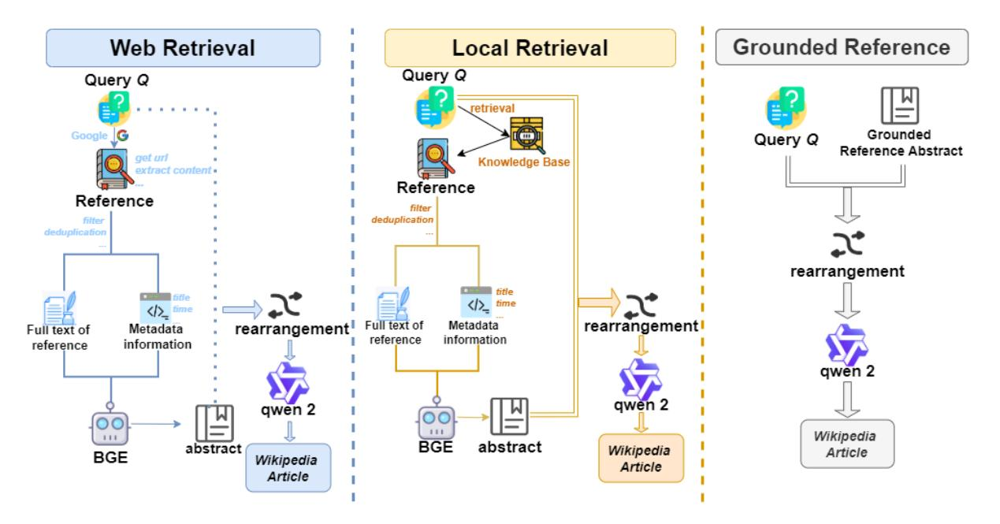

# 4.1 LFAG baselines

We propose three LLM-based baselines, each optimized for different retrieval and generation strategies within a unified framework.

*Web Retrieval*: This baseline integrates real-time web retrieval with a generation model to obtain the latest information. We utilize the Google SERPER API[3](#page-4-1) as the retrieval engine and the Qwen2-7b-Scribe model, trained on the DeFine dataset, for generation. Both components are modular and can be replaced if necessary, ensuring high timeliness and dynamic data integration into generated articles.

*Local Retrieval*: This baseline retrieves references from a high-quality internal knowledge base built from Wikipedia articles. It identifies relevant

3 https://google.serper.dev/search

> **[图片提取文字 (无描述)]:**
> **Grounded Reference** Web Retrieval Local Retrieval Query Q Query Q retrieval Grounded Google Query Q Reference Abstract get uri Knowledge Base extract content \* Reference Reference deduplication filter deduplication rearrangement title Full text of Metadata rearrangement Metadata rearrangement Full text of information reference information reference qwen 2 qwen 2 qwen 2 Wikipedia BGE abstract abstract Wikipedia Article BGE Wikipedia Article Article

Figure 4: Overview of the three baselines. Each baseline performs distinct tasks: the *Web Retrieval* baseline integrates real-time web retrieval with a generation model to provide up-to-date information; the *Local Retrieval* baseline retrieves references from a pre-built knowledge base and generates articles based on these references; the *Grounded Reference* baseline directly uses original article abstracts to generate content. Notably, the relationship extraction model in all baselines uses the trained *BGE-M3 model*, and both the generation model and the relationship extraction model are interchangeable, allowing for flexible adaptation to different research needs.

content based on the article's topic and subheadings, extracts key information, and uses the model to generate detailed articles.

*Grounded Reference*: This baseline directly inputs the article's topic, subheadings, and original Wikipedia abstracts into the generation model, without retrieval, to generate the complete content.

