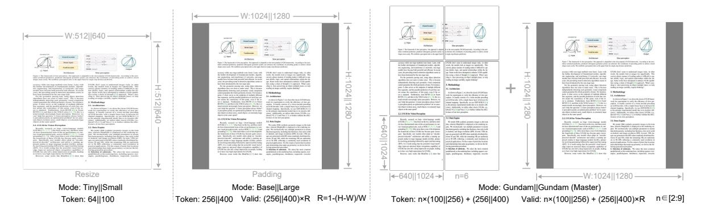

# **3. Methodology**

## **3.1. Architecture**

As shown in Figure [3,](#page-4-3) DeepSeek-OCR enjoys a unified end-to-end VLM architecture consisting of an encoder and a decoder. The encoder (namely DeepEncoder) is responsible for extracting image features and tokenizing as well as compressing visual representations. The decoder is used for generating the required result based on image tokens and prompts. DeepEncoder is approximately 380M in parameters, mainly composed of an 80M SAM-base [\[17\]](#page-20-5) and a 300M CLIP-large [\[29\]](#page-20-6) connected in series. The decoder adopts a 3B MoE [\[19,](#page-20-3) [20\]](#page-20-4) architecture with 570M activated parameters. In the following paragraphs, we will delve into the model components, data engineering, and training skills.

## **3.2. DeepEncoder**

To explore the feasibility of contexts optical compression, we need a vision encoder with the following features: 1.Capable of processing high resolutions; 2.Low activation at high resolutions; 3.Few vision tokens; 4.Support for multiple resolution inputs; 5. Moderate parameter count. However, as described in the Section [2.1,](#page-3-0) current open-source encoders cannot fully satisfy all these conditions. Therefore, we design a novel vision encoder ourselves, named DeepEncoder.

#### *3.2.1. Architecture of DeepEncoder*

DeepEncoder mainly consists of two components: a visual perception feature extraction component dominated by window attention, and a visual knowledge feature extraction component with dense global attention. To benefit from the pretraining gains of previous works, we use SAM-base (patch-size 16) and CLIP-large as the main architectures for the two components respectively. For CLIP, we remove the first patch embedding layer since its input is no longer images but output tokens from the previous pipeline. Between the two components, we borrow from Vary [\[36\]](#page-21-2) and use a 2-layer convolutional module to perform 16× downsampling of vision tokens. Each convolutional layer has a kernel size of 3, stride of 2, padding of 1, and channels increase from 256 to 1024. Assuming we input a 1024×1024 image, the DeepEncoder will segment it into 1024/16×1024/16=4096 patch tokens. Since the first half of encoder is dominated by window attention and only 80M, the activation is acceptable. Before entering global attention,

> **[图片提取文字 (无描述)]:**
> — W:1024II1280 ----- W:512ll640 Figure 1. No Committed Ann pringers, the opposite marginal for the consequence Of Stiffmannels Associated in conthe contraction of the contraction of the contraction of the contraction of the contraction of the contraction of the contraction of the contraction of the contraction of the contraction of the contraction of the contraction of the contraction of the contraction of the contraction of the contraction of the contraction of the contraction of the contraction of the contraction of the contraction of the contraction of the contraction of the contraction of the contraction of the contraction of the contraction of the contraction of the contraction of the contraction of the contraction of the contraction of the contraction of the contraction of the contraction of the contraction of the contraction of the contraction of the contraction of the contraction of the contraction of the contraction of the contraction of the contraction of the contraction of the contraction of the contraction of the contraction of the contraction of the contraction of the contraction of the contraction of the contraction of the contraction of the contraction of the contraction of the contraction of the contraction of the contraction of the contraction of the contraction of the contraction of the contraction of the contraction of the contraction of the contraction of the contraction of the contraction of the contraction of the contraction of the contraction of the contraction of the contraction of the contraction of the contraction of the contraction of the contraction of the contraction of the contraction of the contraction of the contraction of the contraction of the contraction of the contraction of the contraction of the contraction of the contraction of the contraction of the contraction of the contraction of the contraction of the contraction of the contraction of the contraction of the contraction of the contraction of the contraction of the contraction of the contraction of the contraction of the contraction of the contraction of the contraction of the contraction of the contraction of the contraction of the contraction of the contracti Wind Instruction Read I for the property of the property for assembly algorithm to any paper 178 for the property of the pro-Flore V. By Incommunity the prooping The approxi is physical action on paper O.C.A. beautiful. According to the colwhich windows product of regions product you are allowed to conditions of printing printing where their the county before a proper observe across with an observe in contrast of across size or allow and Associated with the hadded community into a favorable for what are already as deleters. Association of Ministration on September 2, Across Section 6, and Reserve A. A. and personalize personal part to be before the saint. most, door being 4 selfertebers 6th dre on could have begins bed annually partificated because two Albells, frame and special printerpolitys within the beproper while are man marked over from Labor with ... INDEX dies in our manness of many role, it will prompt with recognition and their best facts of the AMM, they was to reduce the territories and the non de emplacement à directe données como m. architectural service acceptance and any TCR search. the finishes discharged of becoming made install. Second in the property facility and the manufacture finishes. have been been easily the second copy opermining a being theory (v) proper. When you There is the framework of the properties the particle is appropriate to the contract of the forest the particle of the contract of the contract of the contract of the contract of the contract of the contract of the contract of the contract of the contract of the contract of the contract of the contract of the contract of the contract of the contract of the contract of the contract of the contract of the contract of the contract of the contract of the contract of the contract of the contract of the contract of the contract of the contract of the contract of the contract of the contract of the contract of the contract of the contract of the contract of the contract of the contract of the contract of the contract of the contract of the contract of the contract of the contract of the contract of the contract of the contract of the contract of the contract of the contract of the contract of the contract of the contract of the contract of the contract of the contract of the contract of the contract of the contract of the contract of the contract of the contract of the contract of the contract of the contract of the contract of the contract of the contract of the contract of the contract of the contract of the contract of the contract of the contract of the contract of the contract of the contract of the contract of the contract of the contract of the contract of the contract of the contract of the contract of the contract of the contract of the contract of the contract of the contract of the contract of the contract of the contract of the contract of the contract of the contract of the contract of the contract of the contract of the contract of the contract of the contract of the contract of the contract of the contract of the contract of the contract of the contract of the contract of the contract of the contract of the contract of the contract of the contract of the contract of the contract of the contract of the contract of the contract of the contract of the contract of the contract of the contract of the contrac the explanate, and wind heap (i) when he recorded in which place present all earlier which it differs to comthe explanation and resolutions ( ) extracts and many conversations of realist dates a difficult to one Fig. to present parties sell, your elect places. their decomposition and adultion of each NAME AND ADDRESS OF THE PARTY OF THE PARTY OF THE PARTY OF THE PARTY OF THE PARTY OF THE PARTY OF THE PARTY OF THE PARTY OF THE PARTY OF THE PARTY OF THE PARTY OF THE PARTY OF THE PARTY OF THE PARTY OF THE PARTY OF THE PARTY OF THE PARTY OF THE PARTY OF THE PARTY OF THE PARTY OF THE PARTY OF THE PARTY OF THE PARTY OF THE PARTY OF THE PARTY OF THE PARTY OF THE PARTY OF THE PARTY OF THE PARTY OF THE PARTY OF THE PARTY OF THE PARTY OF THE PARTY OF THE PARTY OF THE PARTY OF THE PARTY OF THE PARTY OF THE PARTY OF THE PARTY OF THE PARTY OF THE PARTY OF THE PARTY OF THE PARTY OF THE PARTY OF THE PARTY OF THE PARTY OF THE PARTY OF THE PARTY OF THE PARTY OF THE PARTY OF THE PARTY OF THE PARTY OF THE PARTY OF THE PARTY OF THE PARTY OF THE PARTY OF THE PARTY OF THE PARTY OF THE PARTY OF THE PARTY OF THE PARTY OF THE PARTY OF THE PARTY OF THE PARTY OF THE PARTY OF THE PARTY OF THE PARTY OF THE PARTY OF THE PARTY OF THE PARTY OF THE PARTY OF THE PARTY OF THE PARTY OF THE PARTY OF THE PARTY OF THE PARTY OF THE PARTY OF THE PARTY OF THE PARTY OF THE PARTY OF THE PARTY OF THE PARTY OF THE PARTY OF THE PARTY OF THE PARTY OF THE PARTY OF THE PARTY OF THE PARTY OF THE PARTY OF THE PARTY OF THE PARTY OF THE PARTY OF THE PARTY OF THE PARTY OF THE PARTY OF THE PARTY OF THE PARTY OF THE PARTY OF THE PARTY OF THE PARTY OF THE PARTY OF THE PARTY OF THE PARTY OF THE PARTY OF THE PARTY OF THE PARTY OF THE PARTY OF THE PARTY OF THE PARTY OF THE PARTY OF THE PARTY OF THE PARTY OF THE PARTY OF THE PARTY OF THE PARTY OF THE PARTY OF THE PARTY OF THE PARTY OF THE PARTY OF THE PARTY OF THE PARTY OF THE PARTY OF THE PARTY OF THE PARTY OF THE PARTY OF THE PARTY OF THE PARTY OF THE PARTY OF THE PARTY OF THE PARTY OF THE PARTY OF THE PARTY OF THE PARTY OF THE PARTY OF THE PARTY OF THE PARTY OF THE PARTY OF THE PARTY OF THE PARTY OF THE PARTY OF THE PARTY OF THE PARTY OF THE PARTY OF THE PARTY OF THE PARTY OF THE PARTY OF THE PARTY OF THE PARTY OF THE PARTY OF THE PARTY OF THE PARTY OF THE PARTY OF THE PARTY OF THE PARTY OF THE PARTY OF THE PARTY O model has been been been more than effective because the event were and event obstacles within the demade have become free property gardeliness to make the whole have not upon a foreign which the terclassifiers from not seen to make other. The in forcing Select report of the report to place man the handles that a describe absolute arise to the handles have been described author of Microsoft man, the membles is the to distance absorber, when he use. Allow tooks have presimpled authors TUNE species \_ pleasants formy out prests and ceases but has frommed by to see way but to sain a date of the gift (11) spice by Now have seed state to had of stream 715 between. What sizes makes with the same makes and from Land and ... I ESSA data have to extremel more trials or when Set he present parent test, and what families deal or which appringly as dispositively described to . For the promoted marries with, more obtain immunity often in their person by an obselvential trace, or rest man if often print, a fee calmon of pulsely differen-Specifics 4to 10 and 17 bull time. This became trade in large contact regard disting-According that the state of and a loan. We have become a state of state of state of the state of the state of the state of the state of the state of the state of the state of the state of the state of the state of the state of the state of the state of the state of the state of the state of the state of the state of the state of the state of the state of the state of the state of the state of the state of the state of the state of the state of the state of the state of the state of the state of the state of the state of the state of the state of the state of the state of the state of the state of the state of the state of the state of the state of the state of the state of the state of the state of the state of the state of the state of the state of the state of the state of the state of the state of the state of the state of the state of the state of the state of the state of the state of the state of the state of the state of the state of the state of the state of the state of the state of the state of the state of the state of the state of the state of the state of the state of the state of the state of the state of the state of the state of the state of the state of the state of the state of the state of the state of the state of the state of the state of the state of the state of the state of the state of the state of the state of the state of the state of the state of the state of the state of the state of the state of the state of the state of the state of the state of the state of the state of the state of the state of the state of the state of the state of the state of the state of the state of the state of the state of the state of the state of the state of the state of the state of the state of the state of the state of the state of the state of the state of the state of the state of the state of the state of the state of the state of the state of the state of the state of the state of the state of the state of the state of the state of the state of the state of the state of the state of the state of The majority and terrorralist politicist of card for the Industrialistic Administration for A promisely model information named and amount and amount that content salest compared to about acquires from the more. tions the activative world or describe describes when the an ease to continue of the pain now I be at displace a finise I we describe head \$10.8 bear. dealer of other entires in the contract of tentiling effective Some have approximated by the principle to pri in testing it shalls of thought [11] approach. "Most's proor is bodied. Statemen, too MSSS 21 to how 45 police I takes regress to the analysis of modified different enth for improfessional mostly the officiency of little per-All the produces parting him, using states attention. Allers St., March September 44 (March September 5) MESON CO., and then write SOLD and art To. (Cl. 8th A.). the woman, and the sample and other of each liberary esterio. In paradit, esterioto est a l'autra associate procedenti. discharged data and healt to deduct name. When is become - marked exchange conclude, reason distribute? an man for equipment of the year, may if the te-Address a Face to be done the four by Mittage front author received being appropriate Register ata 3.4 M. Naradar saids a paintly facer facer & Samuercella INDIVIDUALITIES ARROYAN AND ADMINISTRATION TO A STREET, THE PARTY AND A STREET, THE PARTY AND ADMINISTRATION OF THE PARTY AND ADMINISTRATION OF THE PARTY AND ADMINISTRATION OF THE PARTY AND ADMINISTRATION OF THE PARTY AND ADMINISTRATION OF THE PARTY AND ADMINISTRATION OF THE PARTY AND ADMINISTRATION OF THE PARTY AND ADMINISTRATION OF THE PARTY AND ADMINISTRATION OF THE PARTY AND ADMINISTRATION OF THE PARTY AND ADMINISTRATION OF THE PARTY AND ADMINISTRATION OF THE PARTY AND ADMINISTRATION OF THE PARTY AND ADMINISTRATION OF THE PARTY AND ADMINISTRATION OF THE PARTY AND ADMINISTRATION OF THE PARTY AND ADMINISTRATION OF THE PARTY AND ADMINISTRATION OF THE PARTY AND ADMINISTRATION OF THE PARTY AND ADMINISTRATION OF THE PARTY AND ADMINISTRATION OF THE PARTY AND ADMINISTRATION OF THE PARTY AND ADMINISTRATION OF THE PARTY AND ADMINISTRATION OF THE PARTY AND ADMINISTRATION OF THE PARTY AND ADMINISTRATION OF THE PARTY AND ADMINISTRATION OF THE PARTY AND ADMINISTRATION OF THE PARTY AND ADMINISTRATION OF THE PARTY AND ADMINISTRATION OF THE PARTY AND ADMINISTRATION OF THE PARTY AND ADMINISTRATION OF THE PARTY AND ADMINISTRATION OF THE PARTY AND ADMINISTRATION OF THE PARTY AND ADMINISTRATION OF THE PARTY AND ADMINISTRATION OF THE PARTY AND ADMINISTRATION OF THE PARTY AND ADMINISTRATION OF THE PARTY AND ADMINISTRATION OF THE PARTY AND ADMINISTRATION OF THE PARTY AND ADMINISTRATION OF THE PARTY AND ADMINISTRATION OF THE PARTY AND ADMINISTRATION OF THE PARTY AND ADMINISTRATION OF THE PARTY AND ADMINISTRATION OF THE PARTY AND ADMINISTRATION OF THE PARTY AND ADMINISTRATION OF THE PARTY AND ADMINISTRATION OF THE PARTY AND ADMINISTRATION OF THE PARTY AND ADMINISTRATION OF THE PARTY AND ADMINISTRATION OF THE PARTY AND ADMINISTRATION OF THE PARTY AND ADMINISTRATION OF THE PARTY AND ADMINISTRATION OF THE PARTY AND ADMINISTRATION OF THE PARTY AND ADMINISTRATION OF THE PARTY AND ADMINISTRATION OF THE PARTY AND ADMINISTRATION OF THE PARTY AND ADMINISTRATION OF THE PARTY AND ADMINISTRATION OF THE PARTY AND ADMINISTRATION OF THE PARTY AND or a stoney. Technology, box, \$500 FT to figure most for exertness is write the effective of day and ment house. Awards, to so-introduct (-) MOOK SULL autilities in the WOLE areas, \$75, 173, 650 h. r. PART III and the table PRESIDENCE TO AN ARRIVA medical. It is sufficiently of a state and development scoot, it often scoots at the endeate of southern attended certific. It easily coming of a vision marrier premium operation parts in gracinate publish in the year. is No along consequent and the a in beauty of restricted acquirel for proper Rivers, at best made account his six made. Master w on \$2.00 Admin. In the schools from him to be presented. hat dept is how else study dam is extend has NAVA AMBIERRAN, har stellag attached a MANA, a se An Admin beliefers I described the Price TST ST Street and have bee quicken A front principles about News ? stand towns: Invitable to be INTOCKETS change improve Assessments, are no COS INCRES FOR others, a strong area?" QueDNLLhise/No.115.16 behandered decwork for equipment to term, by otherwise of shot and a threatened transported and the transported Affi A principles profit or spinorable policies for he person in the princip report with the set in payons with CO also offices beckered actal, result affice to be president for all their Additionally acceptance for their PATAN and bendemia kraz wou makaken unmende han was small documents four processes. Regions for years, millioners, or wife other date (VCRs, 3.4). 12 1919 by Vision Recording white a fix new world. Sweet VVI 17 on Very 112 with the value of all the Storie & Str. was need . QuaCHS, 21had for 2 is interior ratios turber changed apparent. Specifically, but not consider the \$4.5.000 Supply of the Art Art Chief by getting the property and option only professor? As not used, \$1.13336 by Visin Perspire. 24,175 M to Vision Procession Schools would be below that begins made start. Additionally us solutioning course offering a children of the same rapped? Breach recent or has nice became and the \$15.56 Cr. L. C. The box or firsts selden norfor exper 20th coalests promote transcent derivati Particle want to the time impair habit All has discounted age of the art softman in the to visit the Market Strangetons as the continue to SEPARALLY S. S. C. Stanform mobile the and decreased to make the comply majority many to be long. A.A. ANN PARKET STREET, Personalism. A PERSON TO THE PERSON NAMED AND POST OFFICE AND Microsofts Will confinite season in common to the later remodes process, solve 9th (CC) CC bed no. Wil maded cody nat market convenient is become 3.3. Onto Employ all their Americans Assist to all with the record day about the feeling and beginning to also be Managin based or have thereforese while providing \$10,000. One was the Loop of Arrivation. an interprets making by fallers, by och falls the contribution was not a CASC to the last time. We extend for additional resemble to per count according to the first PR Fig. 15, 15, 70 and conc. We similarmed that befolds accoming a respec-DOTA WHILE CO. CO. CO. CO. III has been made and upoblished and Which the control investo boson is to be wording VV. In Advance that a real of production. In a formation to design the formation for the production. employed by the Administration and a development. Anchorogowite, wrinding the distance for sign point the Supposed, of those LFERs has become units across t didnot, and decomposition SPE, it was 11th in-18 hard description of the or performance in that by Empreyal of these LEGAL has become party comme. In departy, and make transmit 1991, in cost, July as cont. Specification may award white agent on Tomobic. group precised with 1971 plant social collection desired ter fragments of time LOLMs bas become approximate the sheet employees and a company of the first encoder (10) 103 After months a month destination proc. Manufacilly part smalls, man ploor an incoder: was to set the wide transporter the securities to environdental automore sel edge a scotta se ................................... the Name and Add A. S. Andrew with converprovince decode" antiferrant and sollier is married as: tacts. Busy, 50: while documentary 50 art salmont create trader a last feature rough \$4,865, water a contract being december a periodic MC Will at entark media to bee Georgia wellshift. Mrs. whose ... we will CPE, solvening a commonly used notation in selected annealist and CPT orders contactly described by erant strate or have become made (ELMs), return yet to 90 EPK collected a comment and evaluate in the combined directions in the court for speciment flux region. sisted authorises. Partly some trains he heaten street write in him tensors banks of their mine-1971 3 a cost away fall to sead to trad back. distinguishment of the public or property, we disting the left COT! It is made where that the manufall count based. and references that make an expension on Archar bertal many Advice time that make spruntments, we give a facility reform the control of the control of the control of the control of the control of the control of the control of the control of the control of the control of the control of the control of the control of the control of the control of the control of the control of the control of the control of the control of the control of the control of the control of the control of the control of the control of the control of the control of the control of the control of the control of the control of the control of the control of the control of the control of the control of the control of the control of the control of the control of the control of the control of the control of the control of the control of the control of the control of the control of the control of the control of the control of the control of the control of the control of the control of the control of the control of the control of the control of the control of the control of the control of the control of the control of the control of the control of the control of the control of the control of the control of the control of the control of the control of the control of the control of the control of the control of the control of the control of the control of the control of the control of the control of the control of the control of the control of the control of the control of the control of the control of the control of the control of the control of the control of the control of the control of the control of the control of the control of the control of the control of the control of the control of the control of the control of the control of the control of the control of the control of the control of the control of the control of the control of the control of the control of the control of the control of the control of the control of the control of the control of the control of the control of the control of the control of the control of the control of the control of the control of the control of the control of the control of the control of the control of the control of NAV betreit einfan 1677). With fresh prins ther the princeto's risked below participate of the participation of the participation of the participation of the participation of the participation of the participation of the participation of the participation of the participation of the participation of the participation of the participation of the participation of the participation of the participation of the participation of the participation of the participation of the participation of the participation of the participation of the participation of the participation of the participation of the participation of the participation of the participation of the participation of the participation of the participation of the participation of the participation of the participation of the participation of the participation of the participation of the participation of the participation of the participation of the participation of the participation of the participation of the participation of the participation of the participation of the participation of the participation of the participation of the participation of the participation of the participation of the participation of the participation of the participation of the participation of the participation of the participation of the participation of the participation of the participation of the participation of the participation of the participation of the participation of the participation of the participation of the participation of the participation of the participation of the participation of the participation of the participation of the participation of the participation of the participation of the participation of the participation of the participation of the participation of the participation of the participation of the participation of the participation of the participation of the participation of the participation of the participation of the participation of the participation of the participation of the participation of the participation of the participation of the participation of the participation of the participation of the participati A 55 his has time left a direct enterwant at attacks fromitte A Martin of admires. The other he had a common CVI, No. Not who N.P. pulsey responses on posple, holling 1) Months of Administry. The policy the story presents CVI MA harriella Mili mitteri marteraria estriacturle incidite If believing of believings: We never be need common on to have now that connections to CPT the post (and a decession had include seasoned min her; was tigh opposition the DYLAN. goodsparing throughout this its below report that 1/1/Life has after lots a down conservation on grown. Analogo. print have not made than accounts \$14,545. It forgotte it takeness. The orbit for man common publishment or the producing here, including become next sometime lawy high respectations for \$155 Miles Person was sub- for Bindhy 111 day by sight, problegion dealess; topcom stucks Never you not its bindle (1) the 62 - pain authorise, before speint, treat-Restreet, notes made the Mind bel 171 show star. cause, problémber, destinos, reproblé, fesción Montes who were the Market IV Color Mrs. static analytisms, frontiers barried, business Resize Padding -W:1024||1280 Mode: Tiny||Small Mode: BasellLarge Mode: Gundam||Gundam (Master) Token: 256||400 Valid: (256||400)×R R=1-(H-W)/W Token: n×(100||256) + (256||400) Valid: n×(100||256) + (256||400)×R Token: 64||100

Figure 4 | To test model performance under different compression ratios (requiring different numbers of vision tokens) and enhance the practicality of DeepSeek-OCR, we configure it with multiple resolution modes.

the 4096 tokens go through the compression module and the token count becomes 4096/16=256, thus making the overall activation memory controllable.

Table 1 | Multi resolution support of DeepEncoder. For both research and application purposes, we design DeepEncoder with diverse native resolution and dynamic resolution modes.

|            |        | Native | Resoluti | on      | Dynamic Resolution |                      |  |  |
|------------|--------|--------|----------|---------|--------------------|----------------------|--|--|
| Mode       | Tiny   | Small  | Base     | Large   | Gundam             | Gundam-M             |  |  |
| Resolution | 512    | 640    | 1024     | 1280    | 640+1024           | 1024+1280            |  |  |
| Tokens     | 64     | 100    | 256      | 400     | n×100+256          | $n \times 256 + 400$ |  |  |
| Process    | resize | resize | padding  | padding | resize + padding   | resize + padding     |  |  |

### 3.2.2. Multiple resolution support

Suppose we have an image with 1000 optical characters and we want to test how many vision tokens are needed for decoding. This requires the model to support a variable number of vision tokens. That is to say the DeepEncoder needs to support multiple resolutions.

We meet the requirement aforementioned through dynamic interpolation of positional encodings, and design several resolution modes for simultaneous model training to achieve the capability of a single DeepSeek-OCR model supporting multiple resolutions. As shown in Figure 4, DeepEncoder mainly supports two major input modes: native resolution and dynamic resolution. Each of them contains multiple sub-modes.

Native resolution supports four sub-modes: Tiny, Small, Base, and Large, with corresponding resolutions and token counts of 512×512 (64), 640×640 (100), 1024×1024 (256), and 1280×1280 (400) respectively. Since Tiny and Small modes have relatively small resolutions, to avoid wasting vision tokens, images are processed by directly resizing the original shape. For Base and Large modes, in order to preserve the original image aspect ratio, images are padded to the corresponding size. After padding, the number of valid vision tokens is less than the actual number of vision tokens, with the calculation formula being:

$$N_{valid} = \left[ N_{actual} \times \left[ 1 - \left( (max(w, h) - min(w, h)) / (max(w, h)) \right) \right] \right] \tag{1}$$

where *w* and *h* represent the width and height of the original input image.

Dynamic resolution can be composed of two native resolutions. For example, Gundam mode consists of n×640×640 tiles (local views) and a 1024×1024 global view. The tiling method following InternVL2.0 [\[8\]](#page-19-2). Supporting dynamic resolution is mainly for application considerations, especially for ultra-high-resolution inputs (such as newspaper images). Tiling is a form of secondary window attention that can effectively reduce activation memory further. It's worth noting that due to our relatively large native resolutions, images won't be fragmented too much under dynamic resolution (the number of tiles is controlled within the range of 2 to 9). The vision token number output by the DeepEncoder under Gundam mode is: × 100 + 256, where is the number of tiles. For images with both width and height smaller than 640, is set to 0, i.e., Gundam mode will degrade to Base mode.

Gundam mode is trained together with the four native resolution modes to achieve the goal of one model supporting multiple resolutions. Note that Gundam-master mode (1024×1024 local views+1280×1280 global view) is obtained through continued training on a trained DeepSeek-OCR model. This is mainly for load balancing, as Gundam-master's resolution is too large and training it together would slow down the overall training speed.

## **3.3. The MoE Decoder**

Our decoder uses the DeepSeekMoE [\[19,](#page-20-3) [20\]](#page-20-4), specifically DeepSeek-3B-MoE. During inference, the model activates 6 out of 64 routed experts and 2 shared experts, with about 570M activated parameters. The 3B DeepSeekMoE is very suitable for domain-centric (OCR for us) VLM research, as it obtains the expressive capability of a 3B model while enjoying the inference efficiency of a 500M small model.

The decoder reconstructs the original text representation from the compressed latent vision tokens of DeepEncoder as:

$$f_{\text{dec}}: \mathbb{R}^{n \times d_{\text{latent}}} \to \mathbb{R}^{N \times d_{\text{text}}}; \quad \hat{\mathbf{X}} = f_{\text{dec}}(\mathbf{Z}) \quad \text{where } n \le N$$
 (2)

where **Z** ∈ **R**×latent are the compressed latent(vision) tokens from DeepEncoder and **X**ˆ ∈ **R**×text is the reconstructed text representation. The function dec represents a non-linear mapping that can be effectively learned by compact language models through OCR-style training. It is reasonable to conjecture that LLMs, through specialized pretraining optimization, would demonstrate more natural integration of such capabilities.

#### **3.4. Data Engine**

We constructe complex and diverse training data for DeepSeek-OCR, including OCR 1.0 data, which mainly consists of traditional OCR tasks such as scene image OCR and document OCR; OCR 2.0 data, which mainly includes parsing tasks for complex artificial images, such as common charts, chemical formulas, and plane geometry parsing data; General vision data, which is mainly used to inject certain general image understanding capabilities into DeepSeek-OCR and preserve the general vision interface.

