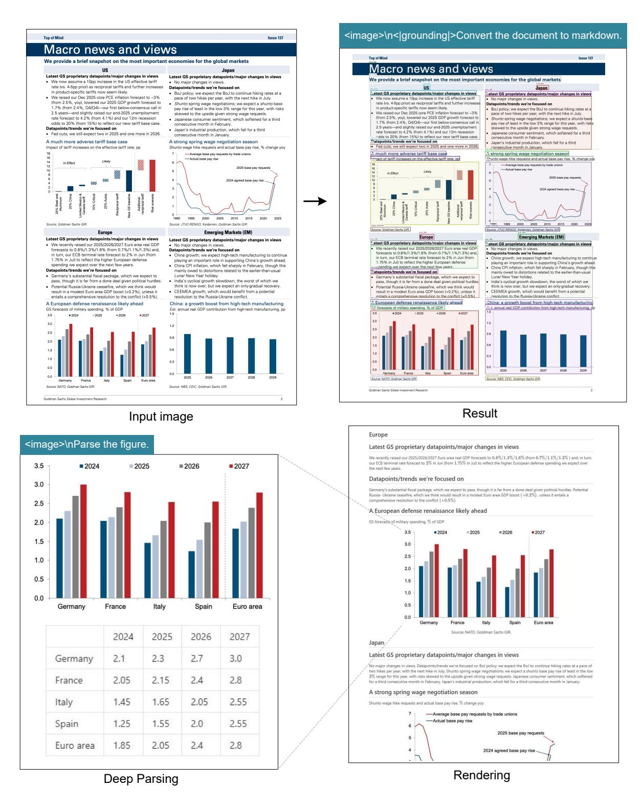
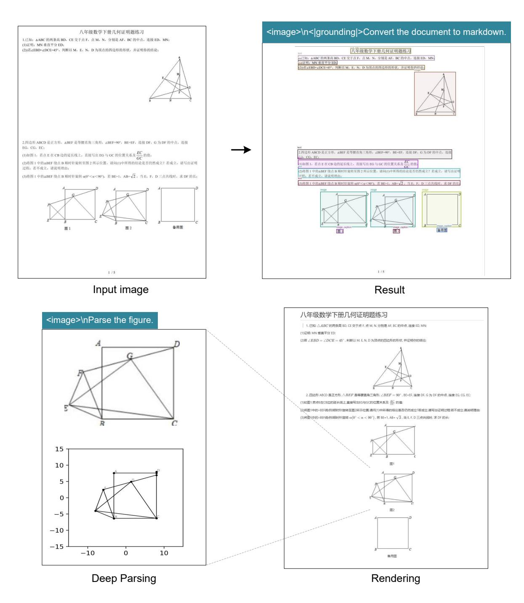
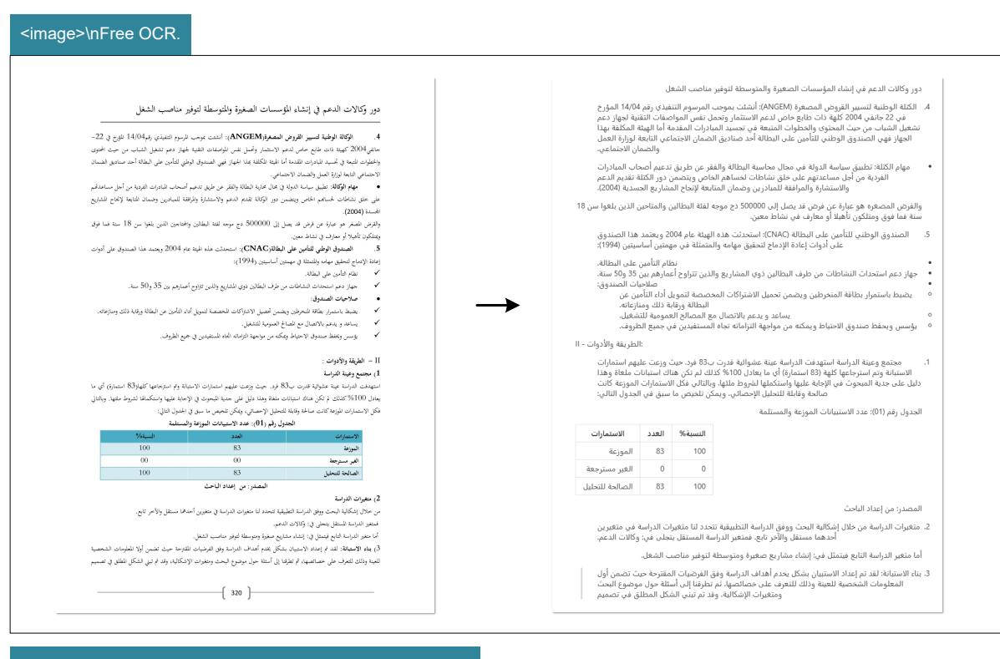
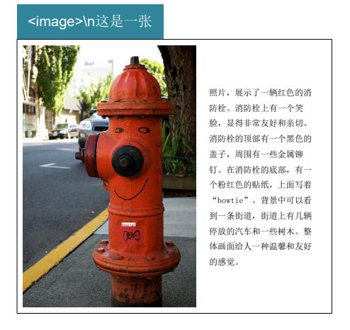

# **4. Evaluation**

#### **4.1. Vision-text Compression Study**

We select Fox [\[21\]](#page-20-0) benchmarks to verify DeepSeek-OCR's compression-decompression capability for text-rich documents, in order to preliminarily explore the feasibility and boundaries of contexts optical compression. We use the English document portion of Fox, tokenize the ground truth text with DeepSeek-OCR's tokenizer (vocabulary size of approximately 129k), and select documents with 600-1300 tokens for testing, which happens to be 100 pages. Since the number of text tokens is not large, we only need to test performance in Tiny and Small modes, where Tiny mode corresponds to 64 tokens and Small mode corresponds to 100 tokens. We use the prompt

Table 3 | We use OmniDocBench [\[27\]](#page-20-1) to test the performance of DeepSeek-OCR on real document parsing tasks. All metrics in the table are edit distances, where smaller values indicate better performance. "Tokens" represents the average number of vision tokens used per page, and " †200dpi" means using *fitz* to interpolate the original image to 200dpi. For the DeepSeek-OCR model, the values in parentheses in the "Tokens" column represent valid vision tokens, calculated according to Equation [1.](#page-5-2)

|                      |                        | English |       |                   |             | Chinese |       |       |       |                                                                   |  |
|----------------------|------------------------|---------|-------|-------------------|-------------|---------|-------|-------|-------|-------------------------------------------------------------------|--|
| Model                | Tokens                 |         |       |                   |             |         |       |       |       | overall text formula table order overall text formula table order |  |
| Pipline Models       |                        |         |       |                   |             |         |       |       |       |                                                                   |  |
| Dolphin [11]         | -                      | 0.356   | 0.352 | 0.465             | 0.258       | 0.35    | 0.44  | 0.44  | 0.604 | 0.367 0.351                                                       |  |
| Marker [1]           | -                      | 0.296   | 0.085 | 0.374             | 0.609 0.116 |         | 0.497 | 0.293 | 0.688 | 0.678 0.329                                                       |  |
| Mathpix [2]          | -                      | 0.191   | 0.105 | 0.306             | 0.243 0.108 |         | 0.364 | 0.381 | 0.454 | 0.32 0.30                                                      |  |
| MinerU-2.1.1 [34]    | -                      | 0.162   | 0.072 | 0.313             | 0.166 0.097 |         | 0.244 | 0.111 | 0.581 | 0.15 0.136                                                     |  |
| MonkeyOCR-1.2B [18]  | -                      | 0.154   | 0.062 | 0.295             | 0.164 0.094 |         | 0.263 | 0.179 | 0.464 | 0.168 0.243                                                       |  |
| PPstructure-v3 [9]   | -                      | 0.152   | 0.073 | 0.295             | 0.162 0.077 |         | 0.223 | 0.136 | 0.535 | 0.111 0.11                                                     |  |
|                      |                        |         |       | End-to-end Models |             |         |       |       |       |                                                                   |  |
| Nougat [6]           | 2352                   | 0.452   | 0.365 | 0.488             | 0.572 0.382 |         | 0.973 | 0.998 | 0.941 | 1.00 0.954                                                     |  |
| SmolDocling [25]     | 392                    | 0.493   | 0.262 | 0.753             | 0.729 0.227 |         | 0.816 | 0.838 | 0.997 | 0.907 0.522                                                       |  |
| InternVL2-76B [8]    | 6790                   | 0.44    | 0.353 | 0.543             | 0.547 0.317 |         | 0.443 | 0.29  | 0.701 | 0.555 0.228                                                       |  |
| Qwen2.5-VL-7B [5]    | 3949                   | 0.316   | 0.151 | 0.376             | 0.598 0.138 |         | 0.399 | 0.243 | 0.5   | 0.627 0.226                                                       |  |
| OLMOCR [28]          | 3949                   | 0.326   | 0.097 | 0.455             | 0.608 0.145 |         | 0.469 | 0.293 | 0.655 | 0.652 0.277                                                       |  |
| GOT-OCR2.0 [38]      | 256                    | 0.287   | 0.189 | 0.360             | 0.459 0.141 |         | 0.411 | 0.315 | 0.528 | 0.52 0.28                                                      |  |
| OCRFlux-3B [3]       | 3949                   | 0.238   | 0.112 | 0.447             | 0.269 0.126 |         | 0.349 | 0.256 | 0.716 | 0.162 0.263                                                       |  |
| GPT4o [26]           | -                      | 0.233   | 0.144 | 0.425             | 0.234 0.128 |         | 0.399 | 0.409 | 0.606 | 0.329 0.251                                                       |  |
| InternVL3-78B [42]   | 6790                   | 0.218   | 0.117 | 0.38              | 0.279 0.095 |         | 0.296 | 0.21  | 0.533 | 0.282 0.161                                                       |  |
| Qwen2.5-VL-72B [5]   | 3949                   | 0.214   | 0.092 | 0.315             | 0.341 0.106 |         | 0.261 | 0.18  | 0.434 | 0.262 0.168                                                       |  |
| dots.ocr [30]        | 3949                   | 0.182   | 0.137 | 0.320             | 0.166 0.182 |         | 0.261 | 0.229 | 0.468 | 0.160 0.261                                                       |  |
| Gemini2.5-Pro [4]    | -                      | 0.148   | 0.055 | 0.356             | 0.13        | 0.049   | 0.212 | 0.168 | 0.439 | 0.119 0.121                                                       |  |
| MinerU2.0 [34]       | 6790                   | 0.133   | 0.045 | 0.273             | 0.15        | 0.066   | 0.238 | 0.115 | 0.506 | 0.209 0.122                                                       |  |
| dots.ocr†200dpi [30] | 5545                   | 0.125   | 0.032 | 0.329             | 0.099       | 0.04    | 0.16  | 0.066 | 0.416 | 0.092 0.067                                                       |  |
|                      | DeepSeek-OCR (end2end) |         |       |                   |             |         |       |       |       |                                                                   |  |
| Tiny                 | 64                     | 0.386   | 0.373 | 0.469             | 0.422 0.283 |         | 0.361 | 0.307 | 0.635 | 0.266 0.236                                                       |  |
| Small                | 100                    | 0.221   | 0.142 | 0.373             | 0.242 0.125 |         | 0.284 | 0.24  | 0.53  | 0.159 0.205                                                       |  |
| Base                 | 256(182)               | 0.137   | 0.054 | 0.267             | 0.163 0.064 |         | 0.24  | 0.205 | 0.474 | 0.1 0.181                                                      |  |
| Large                | 400(285)               | 0.138   | 0.054 | 0.277             | 0.152 0.067 |         | 0.208 | 0.143 | 0.461 | 0.104 0.123                                                       |  |
| Gundam               | 795                    | 0.127   | 0.043 | 0.269             | 0.134 0.062 |         | 0.181 | 0.097 | 0.432 | 0.089 0.103                                                       |  |
| Gundam-M†200dpi      | 1853                   | 0.123   | 0.049 | 0.242             | 0.147 0.056 |         | 0.157 | 0.087 | 0.377 | 0.08 0.085                                                     |  |

without layout: "<image>\nFree OCR." to control the model's output format. Nevertheless, the output format still cannot completely match Fox benchmarks, so the actual performance would be somewhat higher than the test results.

As shown in Table [2,](#page-9-3) within a 10× compression ratio, the model's decoding precision can reach approximately 97%, which is a very promising result. In the future, it may be possible to achieve nearly 10× lossless contexts compression through text-to-image approaches. When the compression ratio exceeds 10×, performance begins to decline, which may have two reasons: one is that the layout of long documents becomes more complex, and another reason may be that long texts become blurred at 512×512 or 640×640 resolution. The first issue can be solved by rendering texts onto a single layout page, while we believe the second issue will become

a feature of the forgetting mechanism. When compressing tokens by nearly 20×, we find that precision can still approach 60%. These results indicate that optical contexts compression is a very promising and worthwhile research direction, and this approach does not bring any overhead because it can leverage VLM infrastructure, as multimodal systems inherently require an additional vision encoder.

Table 4 | Edit distances for different categories of documents in OmniDocBench. The results show that some types of documents can achieve good performance with just 64 or 100 vision tokens, while others require Gundam mode.

| Type Mode | Book  | Slides | Financial Report | Textbook | Exam Paper | Magazine | Academic Papers | Notes | Newspaper | Overall |
|--------------|-------|--------|---------------------|----------|---------------|----------|--------------------|-------|-----------|---------|
| Tiny         | 0.147 | 0.116  | 0.207               | 0.173    | 0.294         | 0.201    | 0.395              | 0.297 | 0.94      | 0.32    |
| Small        | 0.085 | 0.111  | 0.079               | 0.147    | 0.171         | 0.107    | 0.131              | 0.187 | 0.744     | 0.205   |
| Base         | 0.037 | 0.08   | 0.027               | 0.1      | 0.13          | 0.073    | 0.052              | 0.176 | 0.645     | 0.156   |
| Large        | 0.038 | 0.108  | 0.022               | 0.084    | 0.109         | 0.06     | 0.053              | 0.155 | 0.353     | 0.117   |
| Gundam       | 0.035 | 0.085  | 0.289               | 0.095    | 0.094         | 0.059    | 0.039              | 0.153 | 0.122     | 0.083   |
| Guandam-M    | 0.052 | 0.09   | 0.034               | 0.091    | 0.079         | 0.079    | 0.048              | 0.1   | 0.099     | 0.077   |

#### 4.2. OCR Practical Performance

DeepSeek-OCR is not only an experimental model; it has strong practical capabilities and can construct data for LLM/VLM pretraining. To quantify OCR performance, we test DeepSeek-OCR on OmniDocBench [27], with results shown in Table 3. Requiring only 100 vision tokens (640×640 resolution), DeepSeek-OCR surpasses GOT-OCR2.0 [38] which uses 256 tokens; with 400 tokens (285 valid tokens, 1280×1280 resolution), it achieves on-par performance with state-of-the-arts on this benchmark. Using fewer than 800 tokens (Gundam mode), DeepSeek-OCR outperforms MinerU2.0 [34] which needs nearly 7,000 vision tokens. These results demonstrate that our DeepSeek-OCR model is powerful in practical applications, and because the higher tokens compression, it enjoys a higher research ceiling.

As shown in Table 4, some categories of documents require very few tokens to achieve satisfactory performance, such as slides which only need 64 vision tokens. For book and report documents, DeepSeek-OCR can achieve good performance with only 100 vision tokens. Combined with the analysis from Section 4.1, this may be because most text tokens in these document categories are within 1,000, meaning the vision-token compression ratio does not exceed 10×. For newspapers, Gundam or even Gundam-master mode is required to achieve acceptable edit distances, because the text tokens in newspapers are 4-5,000, far exceeding the 10× compression of other modes. These experimental results further demonstrate the boundaries of contexts optical compression, which may provide effective references for researches on the vision token optimization in VLMs and context compression, forgetting mechanisms in LLMs.

#### 4.3. Qualitative Study

#### 4.3.1. Deep parsing

DeepSeek-OCR possesses both layout and OCR 2.0 capabilities, enabling it to further parse images within documents through secondary model calls, a feature we refer to as "deep parsing". As shown in Figures 7,8,9,10, our model can perform deep parsing on charts, geometry, chemical formulas, and even natural images, requiring only a unified prompt.

> **[图片提取文字 (无描述)]:**
> <image>\n<|grounding|>Convert the document to markdown. Top of Mind Issue 137 Macro news and views Issue 137 We provide a brief snapshot on the most important economies for the global markets Macro news and views Latest GS proprietary datapoints/major changes in views Latest GS proprietary datapoints/major changes in views We provide a brief snapshot on the most important economies for the global markets We now assume a 10pp increase in the US effective tariff No major changes in views. rate (vs. 4-5pp prior) as reciprocal tariffs and further increases Datapoints/trends we're focused on in product-specific tariffs now seem likely. atest GS proprietary datapoints/major changes in views
> 
> • We now assume a 10pp increase in the US effective tariff . BoJ policy: we expect the BoJ to continue hiking rates at a 'atest GS proprietary datapoints/major changes in views pace of two hikes per year, with the next hike in July. We raised our Dec 2025 core PCE inflation forecast to ~3% (from 2.5%, yoy), lowered our 2025 GDP growth forecast to Shunto spring wage negotiations; we expect a shunto base pay rise of least in the low 3% range for this year, with risks rate (vs. 4-5pp prior) as reciprocal tariffs and further increases Datapoints/trends we're focused on in product-specific tariffs now seem likely.
> 
> We raised our Dec 2025 core PCE inflation forecast to -3% 1.7% (from 2.4%, Q4/Q4)—our first below-consensus call in BoJ policy; we expect the BoJ to continue hixing rates at a 2.5 years—and slightly raised our end-2025 unemployment skewed to the upside given strong wage requests. pace of two hikes per year, with the next hike in July. rate forecast to 4.2% (from 4.1%) and our 12m recession odds to 20% (from 15%) to reflect our new tariff base case. (from 2.5%, yoy), lowered our 2025 GDP growth forecast to 1.7% (from 2.4%, Q4/Q4)—our first below-consensus call in 2.5 years—and slightly raised our end-2025 unemployment Shunto spring wage negotiations; we expect a shunto base pay rise of least in the low 3% range for this year, with risk Japanese consumer sentiment, which softened for a third consecutive month in February. skewed to the upside given strong wage requests. Japanese consumer sentiment, which softened for a third consecutive month in February. Datapoints/trends we're focused on Japan's industrial production, which fell for a third rate forecast to 4.2% (from 4.1%) and our 12m recession . Fed cuts; we still expect two in 2025 and one more in 2026. adds to 20% (from 15%) to reflect our new tariff base case. A much more adverse tariff base case A strong spring wage negotiation season Japan's industrial production, which fell for a third consecutive month in January. Fed cuts, we still expect two in 2025 and one more in 2026. Shunto wage hike requests and actual base pay rise, % change yoy A much more adverse tariff base case A strong spring wage negotiation season --- Average base pay requests by trade unions -Actual base pay rise moact of tariff increases on the effective tariff rate, po hunto wage hike requests and actual base pay rise. % change you In Effect --- Average base pay requests by trade unions In Effect 2 1990 1995 2000 2005 2010 2015 2020 Source: JTUC-RENGO, Keidanren, Goldmen Sechs GIF Source: Goldman Sector (0)R Europe Emerging Markets (EM) Emerging Markets (EM) Europe Latest GS proprietary datapoints/major changes in views Latest GS proprietary datapoints/major changes in views stest GS proprietary datapoints/major changes in views \* atest GS proprietary datapoints/major changes in views We recently raised our 2025/2026/2027 Euro area real GDP No major changes in views.
>  Datapoints/trends we're focused on We recently raised our 2025/2026/2027 Euro area real GDF forecasts to 0.8%/1.3%/1.6% (from 0.7%/1.1%/1.3%) and, Datapoints/trends we're focused on
> 
> China growth; we expect high-tech manufacturing to continue forecasts to 0.8%/1.3%/1.6% (from 0.7%/1.1%/1.3%) and, in turn, our ECB terminal rate forecast to 2% in Jun (from China growth; we expect high-tech manufacturing to continue in turn, our ECB terminal rate forecast to 2% in Jun (from 1.75% in Jul) to reflect the higher European defense 1.75% in Juli to reflect the higher European defense playing an important role in supporting China's growth ahead. playing an important role in supporting China's growth ahead spending we expect over the next few years China CPI inflation, which fell sharply in February, though this China CPI inflation, which fell sharply in February, though this mainly owed to distortions related to the earlier-than-usual pending we expect over the next few years. Datapoints/trends we're focused on mainly owed to distortions related to the earlier-than-usual atapoints/trends we're focused on Lunar New Year holiday. Germany's substantial fiscal package, which we expect to pass, though it is far from a done deal given political hurdles. Germany's substantial fiscal package, which we expect to Lunar New Year holiday. India's cyclical growth slowdown, the worst of which we India's cyclical growth slowdown, the worst of which we think is now over, but we expect an only-gradual recovery pass, though it is far from a done deal given political hurdles think is now over, but we expect an only-gradual recovery. Potential Russia-Ukraine ceasefire, which we think would Potential Russia-Ukraine ceasefire, which we think would result in a modest Euro area GDP boost (+0.2%), unless it result in a modest Euro area GDP boost (+0.2%), unless it CEEMEA growth, which would benefit from a potential CEEMEA growth, which would benefit from a potential resolution to the Russia-Ukraine conflict. ntails a comprehensive resolution to the conflict (+0.5%). resolution to the Bussia-Ukraine conflict. entails a comprehensive resolution to the conflict (+0.5%). China: a growth boost from high-tech manufacturing A European defense renaissance likely ahead A European defense renaissance likely ahead China: a growth boost from high-tech manufacturing annual real GDP contribution from high tech manufacturing, p Est. annual real GDP contribution from high-tech manufacturing, pp CS forecasts of military spending, % of GDP GS forecasts of military spending, % of GDP 3.0 2.5 Source: NBS, CEIC, Goldman Sachs GIR. Goldman Sachs Global Investment Research Goldman Sachs Global Investment Research Result Input image <image>\nParse the figure. Latest GS proprietary datapoints/major changes in views We recently raised our 2025/2026/2027 Euro area real GDP forecasts to 0.8%/1.3%/1.6% (from 0.7%/1.1%/1.3%) and, in turn. our ECB terminal rate forecast to 2% in Jun (from 1.75% in Jul) to reflect the higher European defense spending we expect over 3.5 ■ 2024 2025 **2026 2027** Datapoints/trends we're focused on 3.0 Germany's substantial fiscal package, which we expect to pass, though it is far from a done deal given political hurdles. Potential Russia: Ultraine ceasefrie, which we think would result in a modest Euro area GDP boost (+0.2%), unless it entails a comprehensive resolution to the conflict (+0.5%)2.5 A European defense renaissance likely ahead GS forecasts of military spending, % of GDP 2.0 = 2025 =2026 **2027** 1.5 3.0 2.5 1.0 2.0 0.5 1.5 1.0 0.0 Germany France Italy Spain Euro area 0.5 0.0 Germany Italy Spain France Source: NATO, Goldman Sachs GIR. 2024 2025 2026 2027 Japan, Latést GS proprietary datapoints/major changes in views 2.3 2.7 3.0 Germany 2.1 No major changes in views. Datapoints/trends we're focused on BoJ policy; we expect the BoJ to continue hiking rates at a pace of two hikes per year, with the next hike in July. Shunto spring wage negotiations: we expect a shunto base pay rise of least in the low 3% range for this year, with risks skewed to the upside given strong wage requests. Japanese consumer sentiment, which softened for a third consecutive month in February, Japan's industrial production, which fell for a third consecutive month in January. 2.05 2.4 2.8 France 2.15 A strong spring wage negotiation season 1.45 2.05 2.55 1.65 Italy Shunto wage hike requests and actual base pay rise. % change yoy ----Average base pay requests by trade unions -Actual base pay rise 1.25 1.55 2.0 2.55 Spain 2025 base pay requests Euro area 1.85 2.05 2.4 2.8 2024 agreed base pay rise Rendering Deep Parsing

Figure 7 | In the field of financial research reports, the deep parsing mode of DeepSeek-OCR can be used to obtain structured results of charts within documents. Charts are a crucial form of data representation in finance and scientific fields, and the chart structured extraction is an indispensable capability for future OCR models.

> **[图片提取文字 (无描述)]:**
> <image>\n<|grounding|>Convert the document to markdown. Storybook Reading Storybook for Young Reading Dual Language for Young Learners Dual Language Learners Cristina Gillanders and Dina C. Castro Cristina Gillanders and Dina C. Castro In a community of practice meeting, teach-RESEARCHERS WIDELY RECOMMEND happens when the children are read ers discuss their experiences reading storybook reading for promoting the to in a language they are just beginaloud to dual language learners. early language and literacy of young ning to learn? What happens when In a community of practice meeting, teach RESEARCHERS WIDELY RECOMMEND happens when the children are read children. By listening to stories, chilan English-speaking teacher reads Susan: When I am reading a story, the ers discuss their experiences reading storybook reading for promoting the to in a language they are just begindren learn about written syntax and a story to a group of children who Latino children in my class just sit there. afoud to dual language learners. early language and literacy of young ning to learn? What happens when vocabulary and develop phonologiare learning English as a second They look at me, but you can tell that they children. By listening to stories, chilan English-speaking teacher reads Susan: When I am reading a story, the cal awareness and concepts of print, a story to a group of children who are not engaged in the story. dren learn about written syntax and Latino children in my class just sit there. all of which are closely linked to As illustrated in the vignette at the vocabulary and develop phonologiare learning English as a second They look at me, but you can tell that the Lisa: That happens in my class too. The learning to read and write (National beginning of this article, teachers cal awareness and concepts of print are not engaged in the story. little girls play with their hair, and the Early Literacy Panel 2008). Teachers often describe young dual language all of which are closely linked to As illustrated in the vignette at the boys play with their shoes. Lisa: That happens in my class too. The usually know a read-aloud experilearners in their class as distracted learning to read and write (National beginning of this article, teachers little girls play with their hair, and the often describe young dual language Beverly: And when you ask questions Early Literacy Panel 2008), Teachers ence has been effective because and unengaged during read-aloud oys play with their shoes learners in their class as distracted about the story, children who speak they see the children maintain their sessions in English. In this article. usually know a read-aloud experi-Beverly: And when you ask questions English take over and you can't get an ence has been effective because and unengaged during read-aloud we describe teaching strategies that interest in the story, relate different about the story, children who speak they see the children maintain their sessions in English. In this article. answer from the Latino children. English-speaking teachers can use aspects of the story to their own English take over and you can't get an interest in the story, relate different we describe teaching strategies that experiences, describe the illustrawhen reading aloud to young dual Facilitator: What do you think is happening an pawer from the Lating children aspects of the story to their own English-speaking teachers can use tions, and ask questions about the language learners. These strategies here? experiences, describe the illustrawhen reading aloud to young dual Facilitator: What do you think is happening are part of the Nuestros Niños Early characters and plot. tions, and ask questions about the language learners. These strategies Lisa: I think they just don't understand However, listening to a story read Language and Literacy Program, a maracters and plot. are part of the Nuestros Niños Early what the story is about. Lisa: I think they just don't understand aloud can be a very different experiprofessional development interven-Language and Literacy Program, a However, listening to a story read Facilitator: How can we help them underence for children who speak a lantion designed to improve the quality aloud can be a very different experi professional development intervenstand the story so they can participate? guage other than English. What of teaching practices in prekin-Facilitator: How can we help them under ence for children who speak a lantion designed to improve the quality stand the story so they can participate dergarten classrooms to support guage other than English, What of teaching practices in prekindergarten classrooms to support Spanish-speaking dual language Cristina Gillanders, PhD, is a researcher at the FPG Child Development Institute at the learners (Castro et al. 2006). The Spanish-speaking dual language University of North Carolina-Chapel Hill. She was an investigator in the Nuestros Niños Cristina Gillanders, PhD, is a researcher at the FPG Child Development Institute at the learners (Castro et al. 2006). The study, and has worked with dual language learners as a bilingual preschool teacher, intervention was developed and University of North Carolina-Chapel Hill. She was an investigator in the Nuestros Niños intervention was developed and study, and has worked with dual language learners as a bilingual preschool teacher. teacher educator, and researcher, cristina.gillanders@unc.edu evaluated in a study funded by cher educator, and researcher, cristina gillanders@unc.edu evaluated in a study funded by Dina C, Castro, PhD, is a senior scientist at the FPG Child Development Institute, She the US Department of Education. Dina C. Castro, PhD. is a senior scientist at the FPG Child Development Institute. She the US Department of Education. was the principal investigator for the Nuestros Niños study. Her research focuses on Teachers from the North Carolina was the principal investigator for the Nuestros Niños study. Her research focuses on Teachers from the North Carolina improving the quality of early education for children from diverse cultural and linguistic More at Four Pre-Kindergarten improving the quality of early education for children from diverse cultural and linguistic More at Four Pre-Kindergarten backgrounds. dina.castro@unc.edu beim prounds, dina castro@unc.edu Photos courtesy of the authors. tritotos courtesy of the authors A study guide for this article will be available in mid-January online at www.naeyc.org/yc. A study quide for this article will be available in mid-January online at www.naeyc.org/yo Reprinted from Young Children - January 2011 Reprinted from Young Children - January 2011

> **[图片提取文字 (无描述)]:**
> Result Input image

> **[图片提取文字 (无描述)]:**
> <image>\nParse the figure. Storybook Reading for Young Dual Language Learners Cristina Gillanders and Dina C. Castro In a community of practice meeting, teachers discuss their experiences reading aloud to dual language learners. Susan: When I am reading a story, the Latino children in my class just sit there. They look at me, but you can tell that they are not engaged in the story. Lisa: That, happens in my class too. The little girls play with their hair, and the boys play with their shoes. The image depicts an indoor classroom setting with a group of children and an adult. The children are seated on the floor, facing a woman who is standing and Beverly: And when you ask questions about the story, children who speak English take over and you can't get an answer from the Latino children. appears to be reading or presenting to them. The woman is wearing a brown sweater and blue jeans. The children are dressed in various colors, with some Eacilitator: What do you think is happening here? wearing short pants and others in long pants. Lisa: I think they just don't understand what the story is about. The classroom has a green wall with educational posters and a bulletin board. Facilitator: How can we help them understand the story so they can participate? The floor is covered with a gray carpet. To the left, there is a wooden dresser with RESEARCHERS WIDELY RECOMMEND storybook reading for promoting the early language and literacy of young children. By a drawer partially open, and a chair is visible behind it. On the right side of the listening to stories, children learn about written syntax and vocabulary and develop phonological awareness and concepts of print. image, there is a purple bean bag chair. all of which are closely linked to learning to read and write (National Early Literacy Panel 2008), Teachers usually know a readaloud experience has been effective because they see the children maintain their interest in the story, relate different aspects of the story to their own experiences, describe the illustrations, and ask questions about the characters and plot. The children are engaged with the woman, with some looking at her and others looking down or away. The room is well-lit, and the overall atmosphere seems to However, listening to a story read aloud can be a very different experience for children who speak a language other than English. be one of attentiveness and learning. happens when the children are read to in a language they are just beginning to learn? What happens when an English- speaking The text "BIBLIOTECA" is visible on the wall, suggesting that the room may be teacher reads a story to a group of children who are learning English as a second language? part of a library or a section dedicated to books. The presence of educational As illustrated in the vignette at the beginning of this article, teachers often describe young dual language learners in their class as materials and the organized layout of the room indicate that this is a space distracted and unengaged during read- aloud sessions in English. In this article, we describe teaching strategies that Englishdesigned for learning and reading. speaking teachers can use when reading aloud to young dual language learners. These strategies are part of the Nuestros Niños

Rendering Deep Parsing

Figure 8 | For books and articles, the deep parsing mode can output dense captions for natural images in the documents. With just a prompt, the model can automatically identify what type of image it is and output the required results.

> **[图片提取文字 (无描述)]:**
> WO 2013/171642 PCT/IB2013/053771 <image>\n<|grounding|>Convert the document to markdown. WO 2013/171642 PCT/IB2013/053771 [00369] The title compound was prepared in an analogous fashion to that described in Stage 22.1 using 5-bromo-6-chloro-N-(4-(chlorodifluoromethoxy)phenyl)nicotinamide (Stage The title compound was prepared in an analogous fashion to that described in 22.2) and 2-methylamino-ethanol to afford a white crystalline solid. HPLC (Condition 4) tR = 5.72 Stage 22.1 using 5-bromo-6-chloro-N-(4-(chlorodifluoromethoxy)phenyl)nicotinamide (Stage min, UPLC-MS (Condition 3)  $t_R = 1.14 \text{ min, m/z} = 452.2 \text{ [M+H]}^+$ . 22.2) and 2-methylamino-ethanol to afford a white crystalline solid. HPLC (Condition 4) tp = 5.72 Example 24 min, UPLC-MS (Condition 3) tR = 1.14 min, m/z = 452.2 [M+H]+. N-(4-(Chlorodifluoromethoxy ')phenvn-6-(ethyl(2-hvdroxyethyl ')amino')-5-(lH-pyrazol-5-Example 24 vDnicotinamide N-(4-(Chlorodifluoromethoxy ')phenvn-6-(ethyl(2-hvdroxyethyl ')amino')-5-(IH-pyrazol-5vDnicotinamide [00370] The title compound was prepared in an analogous fashion to that described in [00370] The title compound was prepared in an analogous fashion to that described in Example 26 using 5-bromo-N-(4-(chlorodifluoromethoxy)phenyl)-6-(ethyl(2-Example 26 using 5-bromo-N-(4-(chlorodifluoromethoxy)phenyl)-6-(ethyl(2hydroxyethyl)amino)nicotinamide (Stage 24.1) and 1-(tetrahydro-2H-pyran-2-yl)-5-(4,4,5,5hydroxyethyl)amino)nicotinamide (Stage 24.1) and 1-(tetrahydro-2H-pyran-2-yl)-5-(4,4,5,5tetramethyl-1,3,2-dioxaborolan-2-yl)-IH-pyrazole to afford a yellow solid. UPLC-MS (Condition tetramethyl-1,3,2-dioxaborolan-2-yl)-IH-pyrazole to afford a yellow solid. UPLC-MS (Condition 3)  $t_R = 1.02 \text{ min}, \text{ m/z} = 452.2 \text{ [M+H]}^+, \text{ m/z} = 450.1 \text{ [M-H]}^-; {}^1\text{H-NMR} (400 \text{ MHz}, \text{DMSO-d}_6) \delta$ 3)  $t_p = 1.02 \text{ min}, m/z = 452.2 [M+H]^+, m/z = 450.1 [M-H]^-; {}^1H-NMR (400 MHz, DMSO-d_c) \delta$ ppm 0.93 (t, J = 7.09 Hz, 3 H) 3.17 - 3.27 (m, 2 H) 3.35 - 3.43 (m, 2 H) 3.43 - 3.53 (m, 2 H) 4.59 ppm 0.93 (t, J = 7.09 Hz, 3 H) 3.17 - 3.27 (m, 2 H) 3.35 - 3.43 (m, 2 H) 3.43 - 3.53 (m, 2 H) 4.59 (br. s, 1H) 6.53 (d, J = 1.96 Hz, 1H) 7.33 (d, J = 9.05 Hz, 2H) 7.76 (br. s, 1H) 7.82 - 7.95 (m, 2 (br. s, 1H) 6.53 (d, J = 1.96 Hz, 1H) 7.33 (d, J = 9.05 Hz, 2H) 7.76 (br. s, 1H) 7.82 - 7.95 (m, 2 H) 8.13 (d, J = 2.45 Hz, 1 H) 8.72 (d, J = 2.45 Hz, 1 H) 10.29 (s, 1 H) 12.98 (br. s, 1 H). H) 8.13 (d, J = 2.45 Hz, 1H) 8.72 (d, J = 2.45 Hz, 1H) 10.29 (s, 1H) 12.98 (br. s, 1H). [00371] Stage 24.1 5-Bromo-N-(4-(chlorodifluoromethoxy)phenyl)-6-(ethyl(2-[00371] Stage 24.1 5-Bromo-N-(4-(chlorodifluoromethoxy)phenyl)-6-(ethyl(2hydroxyethyl)amino)nicotinamide hydroxyethyl)amino)nicotinamide The title compound was prepared in an analogous fashion to that described in [00372] [00372] The title compound was prepared in an analogous fashion to that described in Stage 22.1 using 5-bromo-6-chloro-N-(4-(chlorodifluoromethoxy)phenyl)nicotinamide (Stage Stage 22.1 using 5-bromo-6-chloro-N-(4-(chlorodifluoromethoxy)phenyl)nicotinamide (Stage Input image Result [00369] The title compound was prepared in an analogous fashion to that described in Stage 22.1 using 5-<image>\nParse the figure. bromo- 6- chloro- N- (4- (chlorodifluoromethoxy)phenyl)nicotinamide (Stage 22.2) and 2- methylamino- ethanol to afford a white crystalline solid. HPLC (Condition 4)  $t_{\rm R}=5.72$  min, UPLC- MS (Condition 3)  $t_R = 1.14 min, m/z = 452.2 [M + H]^+$ . Example 24 N- (4- (Chlorodifluoromethoxy)phenvn- 6- (ethyl(2- hvdroxyethyl)amino)- 5- (IH- pyrazol- 5- vDnicotinamide [00370] The title compound was prepared in an analogous fashion to that described in Example 26 using 5bromo- N-(4- (chlorodifluoromethoxy)phenyl)- 6- (ethyl(2- hydroxyethyl)amino)nicotinamide (Stage 24.1) and 1- (tetrahydro- 2H- pyran- 2- yl)- 5- (4,4,5,5- tetramethyl- 1,3,2- dioxaborolan- 2- yl)- 1H- pyrazole to afford a yellow solid, UPLC- MS (Condition 3)  $t_R = 1.02 min, m/z = 452.2 [M+H]^+, m/z = 450.1 [M-H]^-; {}^1H - NMR \ (400 \ \text{MHz. DMSO- d6}) \ \delta \ \text{ppm}$ 0.93 (t, J = 7.09Hz, 3H) 3.17 - 3.27 (m, 2 H) 3.35 - 3.43 (m, 2 H) 3.43 - 3.53 (m, 2 H) 4.59 (br. s, 1 H) 6.53 (d, J = 1.96 Hz, 1H ) 7.33 (d, J = 9.05 Hz, 2H ) 7.76 (br. s, 1 H) 7.82 - 7.95 (m, 2 H) 8.13 (d, J = 2.45 Hz, 1H ) 8.72 (d, J = 2.45Hz, 1H) 10.29 (s, 1 H) 12.98 (br. s, 1 H). [00371] Stage 24.1 5- Bromo- N- (4- (chlorodifluoromethoxy)phenyl)- 6- (ethyl(2hydroxyethyl)amino)nicotinamide [00372] The title compound was prepared in an analogous fashion to that described in Stage 22.1 using 5bromo- 6-chloro- N- (4- (chlorodifluoromethoxy)phenyl)nicotinamide (Stage Rendering Deep Parsing

Figure 9 | DeepSeek-OCR in deep parsing mode can also recognize chemical formulas within chemical documents and convert them to SMILES format. In the future, OCR 1.0+2.0 technology may play a significant role in the development of VLM/LLM in STEM fields.

> **[图片提取文字 (无描述)]:**
> <image>\n<|grounding|>Convert the document to markdown. 八年级数学下册几何证明题练习 1.已知: AABC 的两条高 BD、CE 交于点 F。点 M。N。分别是 AF、BC 的中点、连接 ED。MN; (1)证明: MN 垂直平分 ED: (2))若∠EBD-∠DCE-45°, 判断以 M, E, N, D 为项点的四边形的形状, 并证明你的结论: 八年级数学下册几何证明题练习 iCl知:ΔABC 的两条高 BD。CE 交干点 F、点 M、N、分别是 AF、BC 的中点,连接 ED、MN。 2.周边形 ABCD 是正方形。ABEF 是等腰直角三角形。ZBEF=90°、BE=EF、连接 DF、G 为 DF 的中点、连接 2.四边形 ABCD 是正方形、ΔBEF 是等额直角三角形、ΔBEF-40°、BE-4F、连接 DF、G 为 DF 前中点、连接 (1) 知图 1. 若点 E 在 CB 边的延长线上,直接写出 EG 与 GC 的位置关系及  $\frac{EC}{GC}$  的值: (2)特图 1 中的ABEF 绕点 B 顺时针旋转至图 2 所示位置,请问(1)中所得的结论是否仍然成立? 若成立。请写出证明 (1)如图 1. 若点 E  $\hat{\alpha}$  CB 边的延长线上。直接写出 EG 与 GC 的位置关系及 $\frac{EC}{C}$  的他 过程; 若不成立, 请说明理由; (2)得图 1 中的ABEF 统点 B 顺时针窦转至图 2 所示位置。请何(1)中所得的结论是否仍然成立? 若成立。请与由证明 过程, 若不成立, 请说明理由; (3)将图 1 中的 $\Delta$ BEF 绕点 B 顺时针旋转  $\alpha$ (0°< $\alpha$ <90°)。若 BE=1。AB= $\sqrt{2}$  、当 E、F、D 三点共线时。求 DF 的长, 175 Input image Result 八年级数学下册几何证明题练习 <image>\nParse the figure. 1. 已知: △.A.B.C 的两条高 BD, CE 交于点 F, 点 M, N, 分别是 AF, BC 的中点, 连接 ED, MN: (1)证明: MN 重直平分 ED: (2)若  $\angle EBD = \angle DCE = 45^\circ$ ,判断以 M. E. N. D. 为顶点的四边形的形状,并证明你的结论 2. 四边形 ABCD 基正方形, $\land$  BEF 是等腰直角三角形, $\angle$  BEF  $= 90^\circ$ ,BE=EF,连接 DF, G 为 DF 的中点,连接 EG, CG, EC: (1)如图1.若点E在CB边的延长线上直接写出EG与GC的位置关系及 🔆 的值 (2)時間1中的-8EF姚卓8順时計算的至整2所示位置。请问(1)中所得的括论是否仍然成立?若成立.请写出证明过程是不成立.请说明理由: (3)將歐(中的-BEF條原則原對针旋時  $\alpha(0^\circ<\alpha<90^\circ)$ ,若 BE=1, AB=  $\sqrt{2}$ ,当 E, F, D 三原共統計,求 DF 的长: 15 10 0 -5-10-15-1010 0 Deep Parsing Rendering

Figure 10 | DeepSeek-OCR also possesses the capability to copy (structure) simple planar geometric figures. Due to the intricate interdependencies among line segments in geometric shapes, parsing geometry task is extremely challenging and has a long way to go.

#### *4.3.2. Multilingual recognition*

PDF data on the Internet contains not only Chinese and English, but also a large amount of multilingual data, which is also crucial when training LLMs. For PDF documents, DeepSeek-OCR can handle nearly 100 languages. Like Chinese and English documents, multilingual data also supports both layout and non-layout OCR formats. The visualization results are shown in Figure [11,](#page-16-0) where we select Arabic and Sinhala languages to demonstrate results.

> **[图片提取文字 (无描述)]:**
> <image>\nFree OCR. دور وكالات الدعم في إنشاء المؤسسات الصغيرة والمتوسطة لتوفير مناصب الشغل الكتلة الوطنية لتسيير القروض المصعرة (ANGEM): أنشئت بموجب المرسوم التنفيذي رقم 14/04 المؤرخ دور وكالات الدعم في إنشاء المؤسسات الصغيرة والمتوسطة لتوفير مناصب الشغل في 22 جانفي 2004 كلهة ذات طابع حاص لدعم الاستثمار وتحمل نفس المواصفات التقنية لجهاز دعم تشغيل الشباب من حيث المحتوى والخطوات المتبعة في تجسيد المبادرات المقدمة أما الهيئة المكلفة بهذا الوكالة الوطنية لتسيير القروض المصغرة(ANGEM): أنشنت عبرمب للرسوم التغيذي رقية14/04 للهرم في 22-الجهاز فهي الصندوق الوطني للتأمين على البطالة أحد صناديق الضمان الاجتماعي التابعة لوزارة العمل حالمي 2004 كهينة ذات طابع حاص لدهو الاستدار وقعل نفس المواصفات التقية لجهاز دهو تشغيل الشباب من حيث الهنوي والضمان الاجتماعي. والخطوات للتبعة في تحسيد للبادرات القدمة أما الهيئة المكلفة بملة الجهاز فهي الصندوق الوطني لتأمين على البطالة أحد صناديق الضمان مهام الكتلة: تطبيق سياسة الدولة في مجال محاسبة البطالة والفقر عن طريق تدعيم أصحاب المبادرات الاحتماعي التابعة لوزارة العمل والضمان الاحتماعي. الفردية من أحل مساعدتهم على خلق نشاطات لخساهم الخاص ويتضمن دور الكتلة تقديم الدعم مهام الوكافة: تطبيق سياسة الدولة في محال عاربة البطالة والفقر عن طبيق تدعيم أصحاب للبادرات الفردية من أجل مساهداتهم والاستشارة والمرافقة للمبادرين وضمان المتابعة لإنجاح المشاريع الجسدية (2004). على حلق نشاطات لحساهم الخاص ويتضمن دور الوكالة تقدم الدعم والاستشارة والمرافقة للمبادين وضمان المتابعة لإنجام المشاريع والقرض المصعره هو عبارة عن فرض قد يصل إلى 500000 دج موجه لقلة البطالين والمتاحين الذين بلعوا سن 18 سنة فما فوق ومثلكون تأهيلا أو معارف في نشاط معين. والترض المستر هو عبارة عن قرض قد يصل إلى 500000 دج موجه للته البطالين وافتاحين الذين بلغوا سن 18 سنة قما قوال الصندوق الوطني للتأمين على البطالة (CNAC): استحدثت هذه الهيئة عام 2004 ويعتمد هذا الصندوق ويمتلكون تأهيلا أو معارف في نشاط معين. على أدوات إعادة الإدمام لتحقيق مهامه والمتمثلة في مهمتين أساسيتين (1994): الصنفوق الوطني للتأمين على البطالة(CNAC): استحداث هذه المينة عام 2004 ويعتبد هذا الصندوق على أدوات إهادة الإدماج لتحليق مهامه والتمثلة في مهمتين أساسيتين (1994): نظام التأمين على البطالة. نظام التأمين على البطالة. جهاز دعم استحداث النشاطات من طرف البطالين ذوي المشاريع والذين تتراوح أعمارهم بين 35 و50 سنة. صلاحيات الصندوق: جهاز دعم استحداث النشاطات من طرف البطالين ذوي المشاريع والذين تتزاوم أعمارهم بين 35 و50 سنة. يضبط باستمرار بطاقة المتخرطين ويضمن تحميل الاشتراكات المحصصة لتمويل أداء التأمين عن البطالة ورقابة ذلك ومنازعاته. يضبط باستمرار بطاقة للنحرطين ويضمن تحصيل الاشتراكات للخصصة لنمويل أداء التأمين عن البطالة ورقابة ذلك ومنازعاته يساعد و يدعم بالاتصال مع المصالح العمومية للتشغيل. يساعد و يدعم بالالصال مع المصالح العمومية للتشغيل. يؤسس ويحفظ صندوق الاحتياط ويمكنه من مواجهة التزاماته تجاه المستفيدين في جميع الظروف. يؤسس وتعفظ صندوق الاحتياط وتمكنه من مواجهة التزاماته العاء المنتفيدين في جميع الطروف. :الطريقة والأدوات - اا 11 - الطريقة والأدوات : مجتمع وعينة الدراسة استهدفت الدراسة عينة عشوائية قدرت ب83 فرد. حيث وزعت عليهم استمارات الاستبانة وتم استرجاعها كلهة (83 استمارة) أي ما يعادل 100% كذلك لم تكن هناك استبانات ملعاة وهذا 1) مجتمع وعينة الدراسة دليل على جدية المبحوث في الإجابة عليها واستكملها لشروط ملئها. وبالتالي فكُل الاستمارات الموزعة كأنت استهدفت الدراسة عينة عشبالية قدرت ب83 فرد. حيث وزعت عليهم استمارات الاستيانة وتم استرجاعها كلهاو83 استمارق أي ما صالحة وقابلة للتحليل الإحصائي، ويمكن تلخيص ما سبق في الجدول التالي: يعادل 100% كذلك لم تكر هناك استبانات ملغاة وهذا دليل على حدية المحوث في الإحابة عليها واستكماقا لشروط ملتها. وبالتالي فكل الاستمارات الموزعة كانت صالحة وقابلة للتحليل الإحصائي، وتفكن تلجيص ما سبق في الجدول التالي: الجدول رقم (01)؛ عدد الاستبيانات الموزعة والمستلمة الجدول رقم (01): عدد الاستيانات الموزعة والمستلمة الاستمارات العدد النسبة% 1/62 1 100 83 الموزعة 83 100 الموزعة 00 الغير مسترجعة 0 0 العبر مسترجعة الصالحة للتحليل المصدر: من إعداد الباحث الصالحة للتحليل 100 2، متعدات الدراسة المصدر: من إعداد الباحث من علال إشكالية البحث ووفق الدراسة التطبيقية لتحدد لنا متغوات الدراسة في متغيرين أحدهما مستقل والأعم تابعر قبتغور الدراسة المنتقل يتحلى في: وكالات الدهبي 2. متغيرات الدراسة من خلال إشكالية البحث ووفق الدراسة التطبيقية تتحدد لنا متغيرات الدراسة في متغيرين أما متغور الدراسة التابع قيمثل في: إنشاء مشاريع صغرة ومتوسطة لتوفر مناصب الشغل. أحدهما مستقل والآخر تابع. فمتغير الدراسة المستقل يتجلى في: وكالات الدعم. 3) بناء الاستبالة: لقد أم إعداد الاستبيان بشكل يخدم أهداف الدراسة وفق الفرضيات المقارحة حيث تضمن أولا المعلومات الشحصية أما متغير الدراسة التابع فيتمثل في: إنشاء مشاريع صغيرة ومتوسطة لتوفير مناصب الشغل. للعبنة وذلك للتعرف على خصائصها، ثم تطرقنا إلى أسئلة حول موضوع البحث ومتغرات الإشكالية، وقد تم تيني الشكل الطلق في تصميم 3. بناء الاستبانة: لقد تم إعداد الاستبيان بشكل يحدم أهداف الدراسة وفق الفرضيات المقتوحة حيث تضمن أول المعلومات الشخصية للعينة وذلك للتعرف على خصائصها، ثم تطرقنا إلى أسئلة حول موضوع البحث ومتغيرات الإشكالية، وقد تم تبنى الشكل المطلق في تصميم

> **[图片提取文字 (无描述)]:**
> <image>\n<|grounding|>Convert the document to markdown. දින සිට ඉලෙක්ට් රෙනික ස්වරුපයෙන් සහ TRACES භම්නයෙන් නිකුත් කළ යුතු දින සිට දෛක්ට් රෙනික ස්වරාපයෙන් සහ TRACES භූචිතයෙන් නිකුත් කළ යන සහතිකයක් සහිතව එම රෙගලකියේ (ආ) (i) ලක්ෂ්යය. සහතිකයක් සහිතව එම රෙගලනියේ (පා) (i) අක්ෂ්යය. (5)එම මෙහෙයුම්කරුවන්, මෙහෙයුම්කරුවන්ගේ කණ්ඩනම් සහ අපනයනකරුවන් වෙත (5) එම මෙහෙයුම්කරුවත්, මෙහෙයුම්කරුවත්ගේ කණ්ඩසම් සහ අපනයනකරුවත් වෙත ලබාදෙන සහතික සුරක්ෂිත ක්රීම සඳහා එම සහතික නිකුත් කිරීම සඳහාසුදුසුකම් ලත් (|ref|>text<|/ref|><|det|>[[137, 84, 806, 120]]<|/det|> අඛයෙන සහතික සරක්ෂිත කිරීම සහෝඑම සහතික නිකත් කිරීම සහෝසදසකම් අත් දින සිට ලෙදක්වී ෙරන්ක ස්වරැපෙයන් සහ TRACES හඬනෙයන් නිකුත් කළ යුතු සහනිකයක් ඉඳෙක්ට්රෙන්ක මුද්රවක් භුවිතක්රීම හඳුන්වයීම සදසය, සදසකම් අත් සහිතව එම රගුලකියෙන් (ක) (1) ලක්ෂ්යය. ඉඳෙක්ට්රෙනික මුද්රවක් භවිතාක්රීම හඳුන්වාමීම සදසය, සුදුසුකම් අත් ඉලෙක්ට්රෙනික මුද්රව සඳහාබඳවාගනීම අවසන් කිරීමට අදුළු සියලම නළුවන්ට අඩ ඉලෙක්ට්රෙනික බුද්රව සඳහාබඳවගන්ම අවසන් කිරීමට අදුද, සියලම නළුවන්ට අඩ <[ref|>text(|/ref|>(|det|>[[117, 132, 875, 264]](|/det|> සලසීම සඳහානන්වන රටවල ක්රියකරුවන්, ක්රියකරුවන්ගේ කණ්ඩයම් සහ (t) එම ෙමෙහයුම්කරුවන්. ෙමෙහයුම්කරුවන්ෙග් කණ්ඩමම් මහ අපනයනකරුවන් වන ලබාදන සලසීම සඳහානන්වන රටවල ක්රියකරුවන්, ක්රියකරුවන්ගේ කණ්ඩනම් සහ සහන්ක සුරක්ෂිත ක්රීම සඳහාජම සහන්ක නිකුත් ක්රීම සඳහාසුදුසුකම් ලත් ඉෙලක්විෙරන්න අපනයනකරුවන් සදහාසහතිකය 2023 ජුලි 1 සිට සැසකම් ලත් ඉලෙක්ට්රෙනික අපනයනකරුවන් සඳහාසහතිකය 2023 ජලී 1 සිට සදසකම් ලත් ඉලෙක්ට්රෙනික මුද්ධවක් හඬිනාකිරීම හදුන්රුදීම සුදුසුය. සුදුසුකම් ලත් ඉෙල්ක්රිෙරන්ක මුද්ධව මද්රවක් තිබිය යන බව අබාදීම අවශ්ය වේ. මුද්රවක් නිහිය යන බව අබාදීම අවශ්ය වේ. සඳහාබඳවාගුණීම අවසන් කිරීමට අදළ සියලුම නජවන්ට ඉඩ සඳසීම සඳහනුන්වන රටවල ක්රියකරුවන්, ක්රියකරුවන්ෙන් කළුවලිම් සහ පෙනයනකරුවන් සඳහාසහනිකය 2023 ජලි 1 (6)එබවින් රෙගුලකි (EU) 2021/1378 ක් රියක්මක කිරීම ඒ අනුව සංශෙඛනය කළ යුතුය. සිට සුදුසුකම් ලත් ලෙලක්විෙරන්ක මුද්ධවික් නිකිය යුතු බව ලබාදීම අවශ්ය ෙවී. (6)එබවින් රෙගලකි (EU) 2021/1378 ක් රියක්මක කිරීම ඒ අනුව සංශෝධනය කළ යුතුය. <!ref!>text(|/pef|)<|det|>[[117, 278, 840, 293]]<|/det|> (7)පරික්ෂක්රීමේ කඩදුසි සහතිකය සහ පරීක්ෂණ සහතිකවල කඩදුසි උපටගනීම (7)පරික්ෂණිරීමේ කඩදසි සහතිකය සහ පරික්ෂණ සහතිකවල කඩදසි උපුටගනීම (6) එබඩින් ෙරගුලසි (EU) 2021/1378 ක් රියන්මක කිරීම ඒ අනුව සංගෙයේකය කළ යුතුය. සම්බන්ධයෙන්, නෙම්මන් සභාපවරන උද රෙගුලසි (EU) 2021/2306 (6), කෙම්මන් සභා සම්බන්ධයෙන්, කෙම්නේ සභාපවරක ලද පරගලකි (EU) 2021/2306 (6), කෙම්නේ සභා (|ref|>text<|/ref|><|det|>[[117, 384, 870, 567]]<|/det|> පවරණති රෙගුලකි (EU) 2022/2238 () අනුව අත් අත්සනක් සහිත කඩදකි මත අනුමත පවරඇති රෙගුලකි (EU) 2022/2238 () අනුව තේ හෝසනක් සහිත කඩදකි මත අනුමත (7) පරීක්ෂාකිරීමේ කඩදුන් සහනිකය සහ පරීක්ෂණ සහනිකවල කඩදුන් උපුවාහුම කරන ලද පරීක්ෂණ සහනිකවල කඩදසි සුණය සම්බන්ධයෙන්, සුදුසුකම් ලන් සම්බන්ධයයේ, කොම්ෂන් හොංචනය ලද යරගුලම (BU) 2021/2306 (6). කොම්ෂන් හො කරන අද පරීක්ෂණ සහතිකවල කඩදුම් සුවිය සම්බන්ධයෙන්, සුදුසුකම් ලන් පවරාංෂාන් යරගුලයි (EII) 2022/2238 (T) අනුව අන් අන්සනක් සහිත නඩදුස් මත අනුමත කරන ඉලෙක්ට්රෙන්ක සදහාබදවගන්ම අවසන් කිරීමට අදුළු සියලු නළුවන්ට ඉඩ සළසීම ඉලෙක්ට්රෙනික සදහාබදවාගුනීම අවසන් කිරීමට අදුළු සියලු නළුවන්ට අඩ සළසීම ලද පරීක්ෂණ නගනිකරල කඩදුන් නොය සම්බන්ධයයේ. නුදුනුකම් ලත් ඉලක්වියරෝක සඳහාසංක්රන්ති විධිවිධන 2022 නෙවම්බර් 30 දක්වදීර්ඝ කරන ලදී. සීල් එක. කෙමිෂන් සඳහාබඳවානුම අවසන් ක්රීමට අදළ සියලු නජවන්ට ඉඩ සලසිම සඳහාංක්රෝන් විසිවිධාන 2022 යනහම්බර් 30 දක්වැදිර්ණ කරන ලදි. මිල් එක. යනම්ෂන් සහති ක් රියෂ්මක කිරීයම් යරගුලම සඳහාසංක්රත්ති විධිවිධක 2022 නෙවම්බර් 30 දක්වදීර්ඝ කරන ලදී. සීල් එක. කෙමිෂන් සභාව ක් රියන්මක කිරීමේ රෙගලකි (EU) 2021/2307 (8) හි ලබාදී ඇති පරීක්ෂණ සභාව ක් රියක්මක කිරීමේ රෙගලකි (EU) 2021/2307 (8) හි ලබාදී ඇති පරීක්ෂණ (BI) 2021/2307 (B) හි ලබාදී ඇති පරීක්ෂණ සහනිකයේ සහයේ ආකෘතිය සම්පූර්ණ නිර්ම සහතිකයේ සළයේ ආකුතිය සම්පූර්ණ කිරීම සදහාවන සටහන් වල මෙම දිගුව පිළිබිණි. සඳහාවන සටහන් වල යමම දිගුව පිළිබිඹු විය යුතුය. පවරන ලද යරගුලම (EII) 2022/2238 ද 30 සහතිකයේ සක්යේ ආකතිය සම්පූර්ණ කිරීම සදහාවන සටහන් වල මෙම දිගුව පිළිබිඹු යනගම්බර් 2022 දක්වැදීර්ණ කරන ලදී. මුදුමුකම් ලත් ඉලක්වියරෝක මුද්ධවිකින් සමන්වින විය යුතුය. පවරන ලද රෙගුලකි (EU) 2022/2238 ද 30 නෙඩම්බර් 2022 දක්වදීර්ඝ කරන විය යුතුය. පවරන ලද රෙගුලකි (EU) 2022/2238 ද 30 නෙඩම්බර් 2022 දක්වාදීර්ඝ කරන යනතින පළාත අධිකාරියක් යහෝ පළාත ආයතනයක යුක්යර්නයේ පිනිවි බලයලත් ලදී. සුදුසකම් ලත් ඉලෙක්ට්රෙනික මුද්රවකින් සමන්විත නෙවන පලන අධිකරීයක් හෝ සුද්ගලයයකුට එහි යකමුව 18 හි සුදුසුකම් ලත් ඉලක්වියරෝක මුද්ධවික් යයදීමකින් යනහව ලදී, සුදුසුකම් ලත් ඉලෙක්ට්රෙනික මුද්රවකින් සමන්විත නෙවන පළක අධිකරියක් හෝ පළක ආයතනයක යුක්රේනයේ පිහිටි බලයලත් පුද්ගලයෙකුට එහි කෙඩුව 18 හි ඉලක්වියරෝක ආකෘතියයන් පරීක්ෂාක්රීයම් සහන්කය නිෂ්පදනය කිරීමට සහ ඉදිරිපත් කිරීමට පළක ආයතනයක යුක්රේනයේ පිහිටි බලයලත් පුද්ගලයෙකුට එහි කෙඩුව 18 හි සදසකම් අත් ඉලෙක්ට්රෙනික මුද්රවක් යෙදීමකින් තෙරව ඉලෙක්ට්රෙනික සුදුසුකම් ලත් ඉලෙක්ට්රෙනික මුද්රවක් යෙදීමකින් නෙවුව ඉලෙක්ට්රෙනික ([ref|)text([/ref|>(|det|>[[117, 578, 844, 595]]<[/det|> ආකතියෙන් පරීක්ෂාකිරීමේ සහතිකය නිෂ්පදනය කිරීමට සහ ඉදිරිපත් කිරීමට ඇති ආකුතියෙන් පරීක්ෂාකිරීමේ සහතිකය නිෂ්පදනය කිරීමට සහ ඉදිරිපත් කිරීමට ඇති (8) එබඩින් ෙරගුලම් (80) 2021/2307 ක් රියන්මක කිරීම ඒ අනුව සංදෙශාවීනය කළ යුතුය. (|xef|)text(|/pef|)<|det|)[[117, 608, 797, 663]]<|/det|)</pre> (9) කඩදුස් සහනික සඳහාසංක්රන්ති කළය අවසන් වීම සහ 2022 ජුන් 30 වන දින යුක්රීනය (8) එබවින් රෙගලකි (EU) 2021/2307 ක් රියක්මක කිරීම ඒ නොව සංශෝධනය කළ යනය. (8)එබවින් රේගලසි (EU) 2021/2307 ක් රියන්මක කිරීම ඒ අතව සංශෝනය කළ යනය. සඳහාවේ කිරීම සහේතුවෙන්, මෙම සංශ්විතය 2022 ස්ථි 1 වන විට ප්රතිශම්ව සදහ විය යනය. (9) කඩදුණි සහතික සදහාසංක්රත්ති කළය අවසන් වීම සහ 2022 ජනි 30 වන දින (9) කඩදුනි සහතික සදහයාකේරන්ති කළය අවසන් වීම සහ 2022 ජුනි 30 වන දින ([ref|)text(|/ref|)<|det|)[[117, 675, 794, 710]]<|/det|)</pre> යුක්රේනය සඳහාඅඩු කිරීම හේතුවෙන්, මෙම සංශෝණය 2022 ජූලි 1 වන විට (10) ෙමම රෙගලමයෙන් දක්වියෝන් ක් රියමේග කඩන්ක නිෂ්පදන කම්වුෙම් මතයට අනුකුලෙවි. යුක්රේනය සඳහාඅඩු කිරීම හේතුවෙන්, මෙම සංශේඛනය 2022 ජූලි 1 වන විට ප්රතිශම්ව අදද, විය යනය. <|ref|>text<|/ref|><|det|>[[117, 723, 393, 738]]<|/det|> ප්රතිගම්ව පළද විය යනය. ෙමම රගලසි සම්මත කර ඇත: (10)මෙම රෙගලසියේ දක්වලැති ක් රියමර්ග කඩනික නිෂ්පදන කමිටුවේ මනයට (10)මෙම රේගලුණියේ දක්වලැති ක් රියමුණ්ග කමනික නිෂ්පදන කම්ටුවේ මතයට (|ref|>text(|/ref|>(|det|)[[118, 751, 256, 765]](|/det|) අනුකුලුවේ, අනකලවේ මෙම රෙගුලුනි සම්මත කර ඇත: <[ref|>sub\_title<|/ref|><|det|>[[157, 779, 645, 796]]<|/det|> සමම පරගලසි සම්මත කර ඇත. av ෙරගලම (80) 2021/2119 ක් රියන්මක කිරීමෙ සංගෙන්නය 1 වන වගන්නිය t Dan Planedallica clref|>text(|/ref|>(|det|>[[117, 808, 752, 825]]<|/det|> ෙරගලකි (80) 2021/2119 ක් රියක්මක කිරීම පහත පරිදි සංගෙන්කය කෙර් රෙගලකි (EU) 2021/2119 ක් රියන්මක කිරීමේ සංශේඛනය රෙගලකි (EU) 2021/2119 ක් රියන්මක කිරීමේ සංශෝනය ([ref])text([/ref])<[det])[[117, 837, 839, 853]]<[/det])</pre> රෙගලකි (EU) 2021/2119 ක් රියන්මක කිරීම පහත පරිදි සංශෝධනය කෙරේ: (1) 1 වන වගන්නිගේ පහත ෙජ්යෙ එකත කර ඇත රෙගලකි (EU) 2021/2119 ක් රියන්මක කිරීම පහත පරිදි සංශෝඛනය කෙරේ (1)1 වන වගන්තියේ පහත ඡේදය එකතු කර ඇත: (1)1 වන වගන්නියේ පහත ඡේදය එකත කර ඇත; Translated by GCL International Ltd. Translated by GCL International Ltd.

Figure 11 | To endow the capability of processing widely crawled PDFs (multilingual data), we train our model with OCR capabilities for nearly 100 languages. Minority language documents can also support both layout and non-layout outputs through different prompts.

#### *4.3.3. General vision understanding*

We also provide DeepSeek-OCR with a certain degree of general image understanding capabilities. The related visualization results are shown in Figure [12.](#page-17-1)

> **[图片提取文字 (无描述)]:**
> <image>\nLocate <|ref|>11-2=<|/ref|> in the image. <image>\nDescribe this image in detail. A green plastic container labeled for food storage purposes. The lid is yellow and appears slightly worn out. On the front label: - At the top left corner, some Chinese characters. In bold black letters near the center-top reads "6月香" (June Fragrance). - Below that, smaller white font states "鲜甜咸香" which translates roughly to "Fresh Sweet Salty Fragrant.\* - Dominating the middle part of the label is large lettering stating "豆瓣酱," meaning "Bean Paste Sauce " Additional Information includes: - A small circular logo indicating quality assurance ("优质品"). - An illustration showing what seems like a dish made using bean paste sauce. - Text below the main title says "专注25年,只做原酿酱" translating to "Focusing since 1998, only making authentic fermented bean paste." On the bottom right side, additional product specifications include "净含量: 500g". Overall Style/Type: It looks like commercial packaging designed specifically for preserving food items within the jar. It has clear labeling intended for easy identification and understanding among consumers who read Mandarin. Note: There might be slight variations due to handwriting styles but overall maintains readability regarding brand identity and contents description.

> **[图片提取文字 (无描述)]:**
> <image>\nLocate <|ref|>the teacher<|/ref|> in the image. @ MAZK ANDERSON WWW.ANDERTOONS.COM the teacher "I like how Bonnie's not stepping on my last nerve."

> **[图片提取文字 (无描述)]:**
> <image>\nldentify all objects in the image and output them in bounding boxes.

> **[图片提取文字 (无描述)]:**
> <image>\n这是一张 照片,展示了一辆红色的消 防栓。消防栓上有一个等 脸,显得非常友好和亲切。 消防栓的顶部有一个黑色的 盖子,周围有一些金属铆 钉。在消防栓的底部,有一 个粉红色的贴纸, 上面写着 "howtie"。背景中可以看 到一条街道,街道上有几辆 停放的汽车和一些树木。整 体画面给人一种温馨和友好 的感觉。

> **[图片提取文字 (无描述)]:**
> <image>\n<|grounding|>OCR the image. Bountiful Potential Potential

,奔流到海不复回。君不见,高堂明镜悲白发, 朝如青丝暮成雪。人生得意须尽欢,莫使金樽空 对月。天生我材必有用,千金散尽还复来。烹羊 宰牛且为乐,会须一饮三百杯。岑夫子,丹丘 生,将进酒,杯莫停。与君歌一曲,请君为我倾 耳听。钟鼓馔玉不足贵,但愿长醉不愿醒。古来 圣贤皆寂寞,惟有饮者留其名。陈王昔时宴平 乐,斗酒十千恣欢谑。主人何为言少钱,径须沽 取对君酌。五花马,千金裘,呼儿将出换美酒, 与尔同销万古愁。

君不见,黄河之水天上来

Figure 12 | We retain DeepSeek-OCR's capabilities in general visual understanding, mainly including image description, object detection, grounding, etc. Meanwhile, due to the inclusion of text-only data, DeepSeek-OCR's language capabilities are also retained. Note that since we do not include SFT (Supervised Fine-Tuning) stage, the model is not a chatbot, and some capabilities need completion prompts to be activated.

