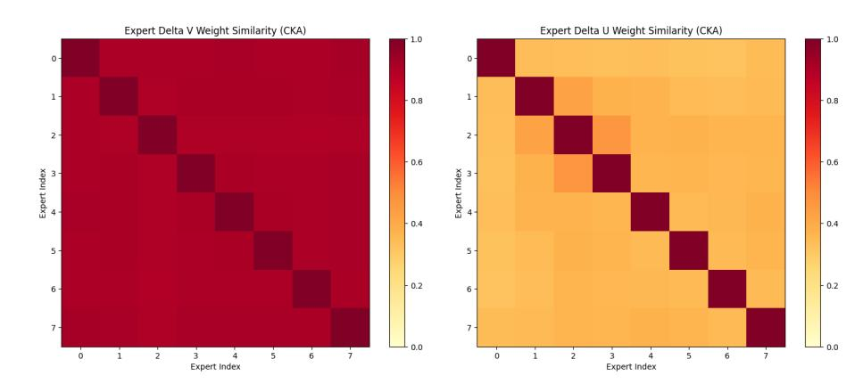
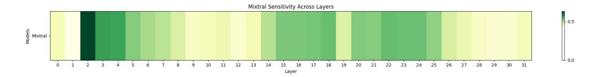

# References

- Amini, A., Gabriel, S., Lin, S., Koncel-Kedziorski, R., Choi, Y., and Hajishirzi, H. Mathqa: Towards interpretable math word problem solving with operation-based formalisms. In *NAACL-HLT (1)*, pp. 2357–2367. Association for Computational Linguistics, 2019.
- Bisk, Y., Zellers, R., Bras, R. L., Gao, J., and Choi, Y. PIQA: reasoning about physical commonsense in natural language. In *AAAI*, pp. 7432–7439. AAAI Press, 2020.
- Cai, W., Jiang, J., Wang, F., Tang, J., Kim, S., and Huang, J. A survey on mixture of experts. *arXiv preprint arXiv:2407.06204*, 2024.
- Chen, I., Liu, H.-S., Sun, W.-F., Chao, C.-H., Hsu, Y.-C., Lee, C.-Y., et al. Retraining-free merging of sparse mixture-of-experts via hierarchical clustering. *arXiv preprint arXiv:2410.08589*, 2024.
- Clark, P., Cowhey, I., Etzioni, O., Khot, T., Sabharwal, A., Schoenick, C., and Tafjord, O. Think you have solved question answering? try arc, the AI2 reasoning challenge. *CoRR*, abs/1803.05457, 2018.
- DeepSeek-AI et al. Deepseek-v3 technical report. *arXiv preprint arXiv:2412.19437*, 2024.
- Frantar, E. and Alistarh, D. SparseGPT: Massive language models can be accurately pruned in one-shot. *arXiv preprint arXiv:2301.00774*, 2023.
- Gao, L., Tow, J., Abbasi, B., Biderman, S., Black, S., DiPofi, A., Foster, C., Golding, L., Hsu, J., Le Noac'h, A., Li, H., McDonell, K., Muennighoff, N., Ociepa, C., Phang, J., Reynolds, L., Schoelkopf, H., Skowron, A., Sutawika, L., Tang, E., Thite, A., Wang, B., Wang, K., and Zou, A. A framework for few-shot language model evaluation, 12 2023. URL [https://zenodo.org/records/](https://zenodo.org/records/10256836) [10256836](https://zenodo.org/records/10256836).
- He, S., Dong, D., Ding, L., and Li, A. Demystifying the compression of mixture-of-experts through a unified framework. *arXiv preprint arXiv:2406.02500*, 2024.

- Hwang, R., Wei, J., Cao, S., Hwang, C., Tang, X., Cao, T., and Yang, M. Pre-gated moe: An algorithm-system codesign for fast and scalable mixture-of-expert inference. In *2024 ACM/IEEE 51st Annual International Symposium on Computer Architecture (ISCA)*, pp. 1018–1031. IEEE, 2024.
- Isik, B., Kumbong, H., Ning, W., Yao, X., Koyejo, S., and Zhang, C. Gpt-zip: Deep compression of finetuned large language models. In *Workshop on Efficient Systems for Foundation Models@ ICML2023*, 2023.
- Jin, X., Ren, X., Preotiuc-Pietro, D., and Cheng, P. Dataless knowledge fusion by merging weights of language models. *arXiv preprint arXiv:2212.09849*, 2022.
- Li, P., Zhang, Z., Yadav, P., Sung, Y.-L., Cheng, Y., Bansal, M., and Chen, T. Merge, then compress: Demystify efficient smoe with hints from its routing policy. *arXiv preprint arXiv:2310.01334*, 2023a.
- Li, P., Zhang, Z., Yadav, P., Sung, Y.-L., Cheng, Y., Bansal, M., and Chen, T. Merge, then compress: Demystify efficient smoe with hints from its routing policy. *arXiv preprint arXiv:2310.01334*, 2023b.
- Li, P., Zhang, Z., Yadav, P., Sung, Y.-L., Cheng, Y., Bansal, M., and Chen, T. Merge, then compress: Demystify efficient SMoe with hints from its routing policy. In *The Twelfth International Conference on Learning Representations*, 2024. URL [https://openreview.net/](https://openreview.net/forum?id=eFWG9Cy3WK) [forum?id=eFWG9Cy3WK](https://openreview.net/forum?id=eFWG9Cy3WK).
- Li, Y., Yu, Y., Zhang, Q., Liang, C., He, P., Chen, W., and Zhao, T. Losparse: Structured compression of large language models based on low-rank and sparse approximation. In *International Conference on Machine Learning*, pp. 20336–20350. PMLR, 2023c.
- Liu, E., Zhu, J., Lin, Z., Ning, X., Blaschko, M. B., Yan, S., Dai, G., Yang, H., and Wang, Y. Efficient expert pruning for sparse mixture-of-experts language models: Enhancing performance and reducing inference costs. *arXiv preprint arXiv:2407.00945*, 2024a.
- Liu, J., Xiao, G., Li, K., Lee, J. D., Han, S., Dao, T., and Cai, T. Bitdelta: Your fine-tune may only be worth one bit. *arXiv preprint arXiv:2402.10193*, 2024b.
- Lu, X., Liu, Q., Xu, Y., Zhou, A., Huang, S., Zhang, B., Yan, J., and Li, H. Not all experts are equal: Efficient expert pruning and skipping for mixture-of-experts large language models, 2024a.
- Lu, X., Liu, Q., Xu, Y., Zhou, A., Huang, S., Zhang, B., Yan, J., and Li, H. Not all experts are equal: Efficient expert pruning and skipping for mixture-of-experts large language models. *arXiv preprint arXiv:2402.14800*, 2024b.

- Marcus, M. P., Santorini, B., and Marcinkiewicz, M. A. Building a large annotated corpus of english: The penn treebank. *Comput. Linguistics*, 19(2):313–330, 1993.
- Matena, M. S. and Raffel, C. A. Merging models with fisherweighted averaging. *Advances in Neural Information Processing Systems*, 35:17703–17716, 2022.
- Merity, S., Xiong, C., Bradbury, J., and Socher, R. Pointer sentinel mixture models. In *ICLR (Poster)*. OpenReview.net, 2017.
- Mihaylov, T., Clark, P., Khot, T., and Sabharwal, A. Can a suit of armor conduct electricity? A new dataset for open book question answering. In *EMNLP*, pp. 2381–2391. Association for Computational Linguistics, 2018.
- MiniMax, Li, A., Gong, B., Yang, B., Shan, B., Liu, C., Zhu, C., Zhang, C., Guo, C., Chen, D., Li, D., Jiao, E., Li, G., Zhang, G., Sun, H., Dong, H., Zhu, J., Zhuang, J., Song, J., Zhu, J., Han, J., Li, J., Xie, J., Xu, J., Yan, J., Zhang, K., Xiao, K., Kang, K., Han, L., Wang, L., Yu, L., Feng, L., Zheng, L., Chai, L., Xing, L., Ju, M., Chi, M., Zhang, M., Huang, P., Niu, P., Li, P., Zhao, P., Yang, Q., Xu, Q., Wang, Q., Wang, Q., Li, Q., Leng, R., Shi, S., Yu, S., Li, S., Zhu, S., Huang, T., Liang, T., Sun, W., Sun, W., Cheng, W., Li, W., Song, X., Su, X., Han, X., Zhang, X., Hou, X., Min, X., Zou, X., Shen, X., Gong, Y., Zhu, Y., Zhou, Y., Zhong, Y., Hu, Y., Fan, Y., Yu, Y., Yang, Y., Li, Y., Huang, Y., Li, Y., Huang, Y., Xu, Y., Mao, Y., Li, Z., Li, Z., Tao, Z., Ying, Z., Cong, Z., Qin, Z., Fan, Z., Yu, Z., Jiang, Z., and Wu, Z. Minimax-01: Scaling foundation models with lightning attention, 2025. URL <https://arxiv.org/abs/2501.08313>.
- Ping, B., Wang, S., Wang, H., Han, X., Xu, Y., Yan, Y., Chen, Y., Chang, B., Liu, Z., and Sun, M. Delta-come: Training-free delta-compression with mixed-precision for large language models. In *Thirty-eighth Conference on Neural Information Processing Systems*, 2024.
- Raffel, C., Shazeer, N., Roberts, A., Lee, K., Narang, S., Matena, M., Zhou, Y., Li, W., and Liu, P. J. Exploring the limits of transfer learning with a unified text-to-text transformer. *J. Mach. Learn. Res.*, 21:140:1–140:67, 2020.
- Sakaguchi, K., Bras, R. L., Bhagavatula, C., and Choi, Y. Winogrande: An adversarial winograd schema challenge at scale. In *AAAI*, pp. 8732–8740. AAAI Press, 2020.
- Song, Y., Mi, Z., Xie, H., and Chen, H. Powerinfer: Fast large language model serving with a consumer-grade gpu, 2023.
- Tang, P., Liu, J., Hou, X., Pu, Y., Wang, J., Heng, P.-A., Li, C., and Guo, M. Hobbit: A mixed precision expert offloading system for fast moe inference. *arXiv preprint arXiv:2411.01433*, 2024.

- Xie, Y., Zhang, Z., Zhou, D., Xie, C., Song, Z., Liu, X., Wang, Y., Lin, X., and Xu, A. Moe-pruner: Pruning mixture-of-experts large language model using the hints from its router. *arXiv preprint arXiv:2410.12013*, 2024.
- Yadav, P., Tam, D., Choshen, L., Raffel, C. A., and Bansal, M. Ties-merging: Resolving interference when merging models. *Advances in Neural Information Processing Systems*, 36, 2024.
- Yang, C., Sui, Y., Xiao, J., Huang, L., Gong, Y., Duan, Y., Jia, W., Yin, M., Cheng, Y., and Yuan, B. Moe-i2: Compressing mixture of experts models through interexpert pruning and intra-expert low-rank decomposition. *arXiv preprint arXiv:2411.01016*, 2024.
- Yao, X. and Klimovic, A. Deltazip: Multi-tenant language model serving via delta compression. *arXiv preprint arXiv:2312.05215*, 2023.
- Yuan, Z., Shang, Y., Song, Y., Wu, Q., Yan, Y., and Sun, G. Asvd: Activation-aware singular value decomposition for compressing large language models. *arXiv preprint arXiv:2312.05821*, 2023a.
- Yuan, Z., Shang, Y., Song, Y., Wu, Q., Yan, Y., and Sun, G. ASVD: activation-aware singular value decomposition for compressing large language models. *CoRR*, abs/2312.05821, 2023b.
- Zellers, R., Holtzman, A., Bisk, Y., Farhadi, A., and Choi, Y. Hellaswag: Can a machine really finish your sentence? In *ACL (1)*, pp. 4791–4800. Association for Computational Linguistics, 2019.
- Zhong, S., Liang, L., Wang, Y., Wang, R., Huang, R., and Li, M. Adapmoe: Adaptive sensitivity-based expert gating and management for efficient moe inference. *arXiv preprint arXiv:2408.10284*, 2024.

## Appendix

This appendix provides additional details and analyses to complement the experiments and methodology described in the main paper. We first present an extended discussion of experimental results, including comparisons with other methods, analyses of compression efficiency, and the impact of the calibration dataset. Next, we provide detailed information about our experimental setups, including the evaluated Mixture-of-Experts (MoE) models, datasets, hyperparameters, and experimental configurations. Finally, we include algorithmic tables and pseudo-code for key components of the D2 -MoE framework to ensure clarity and reproducibility of our approach.

## A. More Discussion and Experimental Results

## A.1. Detail Analysis of Main Results

Our experimental results demonstrate the superior performance of D2 -MoE across different MoE models and compression ratios. On Mixtral-8×7B, our method consistently outperforms existing approaches across all compression ratios (20%, 40%, and 60%). At 20% compression, D2 -MoE achieves an average score of 0.60, maintaining 95.2% of the original model's performance (0.63), while NAEE and MoE-I2 only achieve 0.58 and 0.57 respectively. Notably, even at aggressive 60% compression, D2 -MoE maintains a competitive average score of 0.52, significantly surpassing NAEE (0.36) and MoE-I2 (0.36). The advantages of D2 -MoE are further validated on models with more experts. For DeepSeek-MoE-16B-Base, our method maintains stable performance across different compression ratios, achieving average scores of 0.54, 0.49, and 0.41 at 20%, 40%, and 60% compression respectively. This represents a significant improvement over baseline methods, particularly in perplexity metrics (WikiText-2↓, PTB↓, and C4↓) where our method shows orders of magnitude better results compared to MoE-I2 . Similar patterns are observed in Phi-3.5-MoE and Qwen2-57B-A14B, where D2 -MoE consistently maintains higher performance scores while achieving target compression ratios. Most remarkably, our method exhibits exceptional stability in maintaining model performance across different evaluation tasks. For instance, on downstream tasks such as ARC-e, WinoG, and PIQA, D2 -MoE consistently preserves close to 90% of the original model's performance at 20% compression across all tested models. This demonstrates that our compression method not only achieves high compression ratios but also preserves the model's general language understanding and reasoning capabilities.

## A.2. Comparison with Other Methods

Our experimental results demonstrate the superior effectiveness of D2 -MoE in compressing the Mixtral-8x7B model at a 20% compression ratio, outperforming various state-of-the-art compression methods across multiple metrics, as shown in Table [3.](#page-6-0) Specifically, we compare our method against three categories of compression approaches: (1) pruning-based methods (SparseGPT, NAEE), (2) SVD-based methods (ASVD, MoE-I2 ), and (3) hybrid methods that combine multiple compression techniques (LoSparse, MC-SMoE, MoE-Compress). D2 -MoE achieves the best overall performance with an average score of 0.60, maintaining 95.2% of the original model's capabilities (0.63). In perplexity evaluations, our method achieves competitive scores on WikiText-2 (4.65), PTB (16.32), and C4 (8.59), matching or outperforming pure pruning methods like NAEE and SparseGPT. Notably, our approach significantly outperforms SVD-based methods such as ASVD and MoE-I2 , which achieve average scores of 0.51 and 0.57 respectively. For downstream tasks, D2 -MoE demonstrates remarkable performance, particularly in reasoning tasks such as ARC-e (0.80) and WinoG (0.75), surpassing all baseline methods. The hybrid methods (LoSparse and MC-SMoE) show significant degradation in performance, especially in perplexity metrics, while our method maintains stable performance across all evaluation dimensions. This comprehensive comparison validates that D2 -MoE effectively preserves model capabilities while achieving the desired compression ratio, striking an optimal balance between model efficiency and performance.

#### A.3. Analysis of Runtime SpeedUp and Memory Usage

Table [4](#page-6-1) demonstrates significant hardware inference acceleration across high compression ratios. We evaluate the inference efficiency of various methods on Mixtral-8×7B with a batch size of 64 under high compression settings (60%, 70%, and 80%). Our D2 -MoE achieves superior throughput while maintaining the lowest TFLOPs among all compared methods. At 60% compression (18.68B parameters, 34.8G memory), D2 -MoE achieves 277.72 tokens/sec throughput while requiring only 481 TFLOPs, matching NAEE's computational efficiency but with 2.1% higher throughput. In contrast, MoE-I2 and LoSparse require substantially higher computational resources (838 and 1150 TFLOPs respectively) while delivering lower throughput. The efficiency advantages of D2 -MoE become more pronounced at higher compression ratios. At 80% compression (9.33B parameters, 17.3G memory), our method achieves 313.29 tokens/sec, outperforming NAEE by 12.5% and MoE-I2 by 6.5% in throughput while maintaining the lowest TFLOPs (290). Notably, LoSparse, despite using 4.6× more TFLOPs (1330), achieves only 198.04 tokens/sec, demonstrating the superior efficiency of our approach. While achieving these significant speedups, D2 -MoE maintains reasonable model performance. The perplexity scores on WikiText-2 at 60%, 70%, and 80% compression ratios are 6.35, 8.15, and 12.95 respectively, showing a gradual and controlled degradation even at extreme compression levels. These results highlight that D2 -MoE not only achieves better compression quality but also delivers practical benefits in terms of inference speed and computational efficiency, making it particularly attractive for real-world deployments where both model size and inference speed are critical considerations.

#### A.4. Computational Cost Discussion of D2 -MoE

We present a detailed computational cost analysis for each stage of our compressing procedure. The D2 -MoE merging approach encompasses two principal stages: 1.Metric calculate and 2.Merging expert weights. To begin with, the Fisher metric is calculated by feeding a calibration dataset through the model and computing gradients with respect to each weight parameter. Secondly, Expert weights merging is performed through Fisher-weighted averaging, where the Fisher metric of each parameter serves as its importance weight in the merging process. This Process spends 11mins when conducting on Mixtral-8x7B. Then, we compute the scale matrix for SVD and decompose the delta weights using Singular Value Decomposition (SVD). In terms of computational cost, collecting the scale matrix through calibration takes 19 minutes, while performing SVD decomposition on delta weights requires 25 minutes on Mixtral models. These two steps constitute the main computational overhead of our method. Time of other models are shown in Table [10.](#page-11-1)

| Table 10. Compressing time and memory used of different models |  |  |  |
|----------------------------------------------------------------|--|--|--|
|                                                                |  |  |  |

| Stage   | Metric      | Mixtral-8x7B | DeepSeekMoE-16B-Base | Phi3.5-MoE | Qwen2-57B-A14B |
|---------|-------------|--------------|----------------------|------------|----------------|
|         | Time Cost   | 11 mins      | 8 mins               | 13 mins    | 23 mins        |
| Merging | Memory Cost | 131.01 GB    | 34.6 GB              | 118.27 GB  | 127.21 GB      |
|         | Time Cost   | 44 mins      | 15 mins              | 35 mins    | 59 mins        |
| SVD     | Memory Cost | 109.45 GB    | 52.9 GB              | 117.41 GB  | 126.41 GB      |

## A.5. Additional Results on Compression Ratios between Base Weights and Delta Weights

In Table [7,](#page-7-0) we provide additional results for Mixtral-8x7B across a range of compression ratios. These results highlight the flexibility of D2 -MoE in balancing compression and performance. For example, at the 40% compression ratio, D2 -MoE achieves a WikiText-2 perplexity of 5.28, significantly lower than competing methods. We ultimately selected a 10% pruning ratio for the Base weights and a corresponding SVD decomposition ratio for the Delta weights to preserve performance, as the Base weights contain more shared knowledge across all experts. Additionally, a 60% pruning ratio for the Base weights is chosen when prioritizing throughput efficiency.

#### A.6. Pushing the Limit of Compressing Delta Weight

Based on the CKA (Centered Kernel Alignment) similarity analysis demonstrated in Figure [5](#page-12-2) of delta weights among V matrices and U matrices in the Mixtral-8x7B model, we observe that all V matrices exhibit extremely high CKA similarity scores of approximately 0.9. This significant finding motivates us to share a single V matrix among experts to further compress the delta weights. Furthermore, the U matrices demonstrate moderate CKA similarity scores around 0.3, indicating considerable redundancy among them. This observation suggests that we can merge the U matrices in a manner similar to base weight compression(*e.g.*fisher merge), thereby achieving additional parameter reduction in U matrices. Refer to Table [11](#page-11-2) to see the results.

| Methods                 | WikiText-2↓ | PTB↓  | C4↓   | Tokens/sec |
|-------------------------|-------------|-------|-------|------------|
| ShareV 80% ratio        | 12.95       | 33.30 | 17.14 | 337.82     |
| MergeU 80% ratio        | 13.21       | 40.07 | 19.50 | 290.55     |
| ShareV+MergeU 85% ratio | 18.93       | 61.18 | 24.94 | 328.04     |

Table 11. Perplexity and Throughput of ShareV and MergeU methods on extremly high compression ratio

> **[图片提取文字 (无描述)]:**
> Expert Delta V Weight Similarity (CKA) Expert Delta U Weight Similarity (CKA) 1.0 0-0-0.8 0.8 2 -2 -0.6 0.6 Expert Index Expert Index 0.4 0.4 5 -0.2 0.2 6 6 -0.0 2 5 6 5 6 Expert Index Expert Index

Figure 5. CKA of Delta V weights and Delta U weights of Mixtral-8x7B

> **[图片提取文字 (无描述)]:**
> Mixtral Sensitivity Across Layers

Figure 6. layer wise sensitivity of Mixtral-8x7B

## A.7. Adaptive Compression Ratio for Delta Weight

Given the observed layer-wise sensitivity shown in Figur[e6](#page-12-3) in the importance of delta weights, we propose an adaptive compression strategy that allocates more parameters to sensitive layers while maintaining the same total parameter budget. As illustrated in Figure [6,](#page-12-3) our analysis reveals significant variations in layer sensitivity, with layer 2 exhibiting the highest sensitivity to compression while layer 1 showing the least sensitivity. Based on these findings, we implement an adaptive parameter allocation strategy where layer 2 receives the largest parameter budget, and layer 1 is assigned the smallest share of parameters, optimizing the distribution of compression ratios according to layer-wise sensitivity. This approach optimizes the distribution of parameters across layers based on their relative importance, potentially leading to better performance compared to uniform compression across all layers.

## B. More Detailed Experimental Details

## B.1. Details of Delta Weights Trimming

Figure [4](#page-7-1) provides insights into the impact of delta weights trimming of D2 -MoE's performance. We utilize expert frequency as the criterion for trimming decisions, every time the lowest router sampling frequency expert's delta weight is trimed. The results show a general trend of raising perplexity as the number of trimmed delta weights increases, indicating a trade-off between model size reduction and performance retention. However, our method achieves significant compression ratios, ranging from 43% to 81%, while maintaining relatively low perplexity scores compared to baseline methods. For instance, with 1 trimming delta weight, we achieve a 43% compression ratio with a WikiText-2 perplexity of 6.43, which is competitive with non-trim compressed model. Even at higher compression ratios, such as 75% with 7 trimming experts, our method maintains a reasonable perplexity of 14.71 on WikiText-2, demonstrating its robustness. This highlights the advantage of our approach in balancing model efficiency and performance, making it suitable for resource-constrained environments without substantial degradation in language modeling quality.

## B.2. Motivation of CKA Similarity between experts and Single Value energy Retention

The CKA Similarity between experts reflects the redundancy among experts, which motivates us to merge their base weights to capture shared knowledge, as formulated in Equation [11.](#page-13-0) Energy-Retention quantifies the amount of information preserved after singular value truncation in the SVD decomposition process. As formulated in Equation [12,](#page-13-1) where k represents the number of largest singular values retained, this metric helps us evaluate the effectiveness of our compression while maintaining essential information.

$$CKA(W_1, W_2) = \frac{tr(HKHL)}{\sqrt{tr(HKHK)tr(HLHL)}}$$
(11)

Energy-Retention = 
$$\frac{\sum_{i=1}^{k} \lambda_i}{\sum_{i=1}^{n} \lambda_i}$$
, where  $\lambda_i = \sigma_i^2$  (12)

| Hyperparameter                           | 20% ratio           | 40% ratio       | 60% ratio       | 70% ratio       | 80% ratio       |
|------------------------------------------|---------------------|-----------------|-----------------|-----------------|-----------------|
| Pruning ratio for Performance            | 10% of Base weights |                 |                 |                 |                 |
| Pruning ratio for Throughput             | 60% of Base weights |                 |                 |                 |                 |
| SVD Truncation Threshold for Performance | preserve 68.05%     | preserve 47.34% | preserve 26.62% | preserve 16.26% | preserve 5.93%  |
| SVD Truncation Threshold for Throughput  | preserve 74.30%     | preserve 53.58% | preserve 32.86% | preserve 22.54% | preserve 12.18% |
| Static Pruning Sparsity for Performance  | 5% of Base weights  |                 |                 |                 |                 |
| Dynamic Pruning Sparsity for Performance | 5% of Base weights  |                 |                 |                 |                 |
| Static Pruning Sparsity for Throughput   | 30% of Base weights |                 |                 |                 |                 |
| Dynamic Pruning Sparsity for Throughput  | 30% of Base weights |                 |                 |                 |                 |
| Calibration Dataset Size                 | 512 samples         |                 |                 |                 |                 |
| Batch Size                               | 128                 |                 |                 |                 |                 |

Table 12. Hyperparameter Settings for  $D^2$ -MoE Experiments.

#### **B.3.** Evaluated MoE Models and Datasets

We evaluate  $D^2$ -MoE on a range of common MoE large language models (LLMs), including:

- **Mixtral-8x7B**: A state-of-the-art MoE model developed by Mistral AI, featuring 8 experts with each expert containing 7 billion parameters represent large experts MoE model in our experiment. It employs a top-2 routing mechanism where two experts are activated for each token, demonstrating strong performance across various tasks while maintaining computational efficiency.
- **DeepSeekMoE-16B-Base**: An advanced MoE architecture with 16 experts and a shared expert, where each expert contains 1 billion parameters represent small and fine-grained experts MoE model in our experiment. The model incorporates a shared expert mechanism to capture common knowledge across tasks, while specialized experts focus on domain-specific features. Its routing strategy dynamically selects the most relevant experts for each input token.
- **Phi-3.5-MoE**: Developed by Microsoft, this model features 16 experts, each containing 3.5 billion parameters. It implements a unique expert configuration that balances model capacity and computational efficiency. The model utilizes a sophisticated routing mechanism to effectively distribute computational load across experts.
- **Qwen2-57B-A14B**: A large-scale MoE model developed by Alibaba, comprising 64 experts and a shared expert, with a total of 57 billion parameters (14B active). The model employs an advanced sparse gating mechanism that activates only a small subset of experts for each token, achieving remarkable parameter efficiency despite its scale. The shared expert serves as a knowledge hub while specialized experts capture domain-specific features.

These models represent different design philosophies in MoE architecture, varying in their number of experts, parameter distribution, and routing strategies, providing a comprehensive testbed for evaluating our compression method.

We test these models on 10 datasets, including 3 language modeling datasets (WikiText-2, PTB, and C4) and 7 common-sense reasoning datasets (OpenbookQA, WinoGrande, HellaSwag, PIQA, MathQA, ARC-easy, and ARC-challenge).

#### **B.4.** Calibration Dataset

We use WikiText-2 as the primary calibration dataset, selecting 512 random samples for all experiments. To assess the effect of calibration data type, we also use samples from C4. As shown in Table 9, WikiText-2 consistently outperforms C4 in terms of compression quality. The calibration data size plays an important role in our method's performance. While increasing calibration samples generally improves results, we observe that using 2048 samples leads to a slight performance degradation. Therefore, considering the trade-off between performance and computational efficiency, we choose 512 samples as our optimal calibration set size.

## B.5. Hyperparameters and Experimental Configurations

Table [12](#page-13-2) lists the key hyperparameters used in our experiments, including the target compression ratios, SVD truncation thresholds, and sparsity levels for static and dynamic pruning.