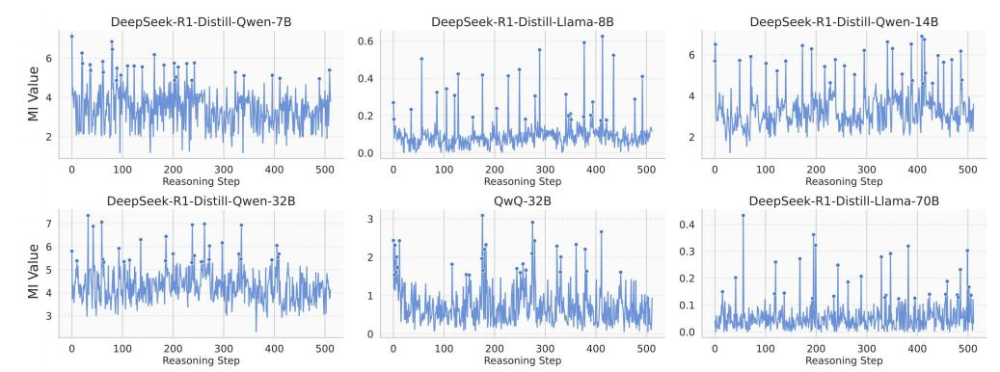
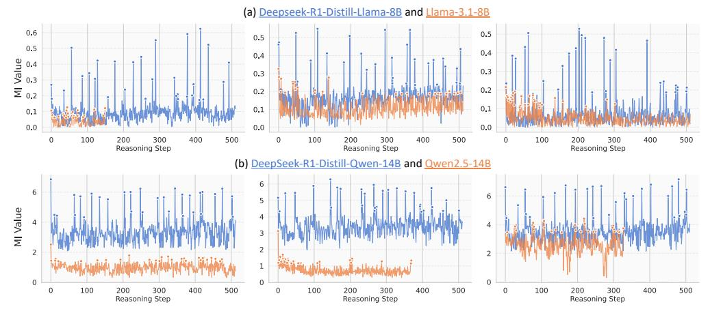

# Demystifying Reasoning Dynamics with Mutual Information: Thinking Tokens are Information Peaks in LLM Reasoning

Chen Qian1,2\*, Dongrui Liu2\*, Haochen Wen3, Zhen Bai4, Yong Liu1†, Jing Shao2†

1 Gaoling School of Artificial Intelligence, Renmin University of China

2 Shanghai Artificial Intelligence Laboratory

#### Abstract

Large reasoning models (LRMs) have demonstrated impressive capabilities in complex problem-solving, yet their internal reasoning mechanisms remain poorly understood. In this paper, we investigate the reasoning trajectories of LRMs from an information-theoretic perspective. By tracking how mutual information (MI) between intermediate representations and the correct answer evolves during LRM reasoning, we observe an interesting MI peaks phenomenon: the MI at specific generative steps exhibits a sudden and significant increase during LRM's **reasoning process.** We theoretically analyze such phenomenon and show that as MI increases, the probability of model's prediction error decreases. Furthermore, these MI peaks often correspond to tokens expressing reflection or transition, such as "Hmm", "Wait" and "Therefore," which we term as the thinking tokens. We then demonstrate that these thinking tokens are crucial for LRM's reasoning performance, while other tokens has minimal impacts. Building on these analyses, we propose two simple yet effective methods to improve LRM's reasoning performance, by delicately leveraging these thinking tokens. Overall, our work provides novel insights into the reasoning mechanisms of LRMs and offers practical ways to improve their reasoning capabilities. The code is available at https://github.com/ChnQ/MI-Peaks.

#### 1 Introduction

The reasoning ability of large language models (LLMs) has emerged as one of their most powerful and crucial capabilities [49, 20, 21]. By explicitly thinking through a question before providing an answer and breaking down complex problems into multiple steps, LLMs have made impressive progress in complex reasoning tasks, such as mathematics, programming, and logical inference [25, 55, 41, 6]. Understanding and improving LLMs' reasoning ability represents a crucial pathway toward achieving Artificial General Intelligence (AGI) [51, 48, 39].

By undergoing reasoning-intensive training on foundational LLMs, recent large reasoning models (LRMs) such as OpenAI's o1 [21], DeepSeek's R1 [18], and QwQ [42] have demonstrated exceptional reasoning capabilities, significantly pushing the boundaries of complex problem-solving. However, despite recent advances, the mechanisms underlying these capabilities remain largely under-explored. The internal dynamics of the reasoning process, as well as the influence of each intermediate step on the final answer, are still largely a "black box." While some research in the field of trustworthy AI

&lt;sup>3 University College London, University of London 4 Dalian University of Technology {qianchen2022,liuyonggsai}@ruc.edu.cn {liudongrui,shaojing}@pjlab.org.cn

\* Equal contribution † Corresponding author

> **[图片提取文字 (无描述)]:**
> Let a be a positive real number High Therefore Tsl MI Peaks such that all the roots of  $x^3$  +  $ax^2 + ax + 1 = 0$  are real. Find the smallest possible value of a. From If Div We '.\n\n Okay, so I have this problem here: Let Each a be a positive ... First, let me write down the equation again to make sure Regular MI I have it right: ... Wait, is that right? & Starting Hmm, maybe I should double-check ... Now, combine all these terms: ... So. when a = 3, f(a) = 0, which would Low mean the cubic has a multiple root ... \*\* Coopute Reasoning Steps (a) (b)

Figure 1: Illustration and analysis of the MI peaks phenomenon in LRM reasoning. (a) The **left** side shows an example of an LRM performing a multi-step reasoning task. To investigate the underlying reasoning mechanism, we compute the MI between the model's representation at each step and the golden answer. Interestingly, as shown on the **right** side, certain steps exhibit sudden and significant increases in MI, which we refer to the MI peaks phenomenon. (b) Token distribution at MI peaks. We further find that the tokens generated at these high-MI steps are often reflective or transitional expressions such as "So," "Hmm," and "Wait."

suggests the existence of "critical tokens" that directly impact the safety of the LLM's answers [60, 26, 33], a natural question arises: are there critical reasoning steps or intermediate states that significantly affect the final results in the reasoning process of LRMs?

In this paper, we explore this question from an information-theoretic [3, 24] perspective. Specifically, given a question, we dynamically calculate the mutual information (MI) between the LRM's representation at each step of reasoning process and the golden answer (*i.e.*, the ground-truth response), observing how the MI evolves. Interestingly, we find that **certain steps' representations exhibit a sudden and significant increase in MI with the golden answer**. As shown in Figure 1(a), these representations with MI peaks are sparse and occur non-uniformly throughout the reasoning process. This suggests that at certain crucial reasoning steps, LRMs' representation becomes highly informative about the correct answer. Naturally, this raises a question: *are these MI peaks potentially related to model's reasoning performance?* Theoretically, we provide preliminary insights into the MI peaks phenomenon, demonstrating that as the cumulative MI between the representations and the golden answer increases, the probability of LRM's wrong prediction lowers. Furthermore, our experiments show that the base models corresponding to these LRMs (*e.g.*, LLaMA-3.1-8B [16]), does not exhibit this MI Peaks phenomenon as clearly. These analyses suggest that the distinct MI peaks observed during LRM reasoning are potentially stemming from the reasoning-intensive training, and may hold a potential relationship with LRM's advanced reasoning abilities.

This naturally leads to the question: what semantic roles do the representations at MI peaks play during reasoning? Intriguingly, we find that these representations with MI peaks predominantly correspond to tokens such as "Wait," "Hmm," "Therefore," "So," which typically express reflectiveness, self-correcting, or transitions, as shown in Figure 1(b). Here, we refer to these tokens with MI peaks as "thinking tokens". Since these thinking tokens explicitly prompt the model to reflect and reason, and their representations carry enriched information with the golden answer, we hypothesize that these thinking tokens may play a critical role in the model's reasoning ability. To validate this hypothesis, we suppress the generation of these thinking tokens and observe how the model's reasoning performance changes. As shown in Figure 5, fully suppressing the generation of these thinking tokens significantly harms the model's reasoning performance, while randomly suppressing the same number of tokens has little impact. This indicates that these thinking tokens are indeed crucial to LRM's reasoning ability.

Finally, drawing insights from the above analyses, we propose to improve the reasoning performance of LRMs in two training-free ways. 1) By allowing the representations at MI Peaks to undergo multiple iterations within the model, we propose a method called Representation Recycling (RR). RR encourages the model to better exploit these informative representations. Experiments show that RR consistently improves the LRMs' reasoning performance across several benchmarks. For instance, it improves the accuracy of DeepSeek-R1-Distill-LLaMA-8B by 20% relatively on AIME24. 2) Motivated by our analysis of *thinking tokens*, we propose Thinking Token based Test-time Scaling (TTTS). That is, when additional token budget remains, we force the model to continue reasoning by begin with the *thinking tokens*. Experiments show that TTTS leads to steady performance

> **[图片提取文字 (无描述)]:**
> DeepSeek-R1-Distill-Qwen-7B DeepSeek-R1-Distill-Llama-8B DeepSeek-R1-Distill-Qwen-14B 0.6 MI Value 0.4 0.2 0.0 Reasoning Step Reasoning Step Reasoning Step DeepSeek-R1-Distill-Qwen-32B QwQ-32B DeepSeek-R1-Distill-Llama-70B 0.4 MI Value 0.3 0.2 0.1 0.0 Reasoning Step Reasoning Step Reasoning Step

Figure 2: The evolution trajectories of MI between each step's representations and the golden answer during the reasoning process in LRMs.

improvements as the token budget increases compared to the original LRMs. These applications further demonstrate that our observations can offer new insights into enhancing the reasoning abilities of LRMs.

## 2 Emergence of MI Peaks in LRMs' Reasoning Trajectories

Despite the impressive reasoning capabilities demonstrated by recent LRMs such as DeepSeek's R1 series models [18] and Qwen's QwQ [42], the underlying mechanisms driving these capabilities remain poorly understood. In this section, we investigate the reasoning trajectories of LRMs from an information-theoretic perspective. We begin by introducing the notations and preliminaries (Section 2.1). In Section 2.2, we demonstrate the MI peaks phenomenon. We then provide theoretical insights into this phenomenon in Section 2.3. Finally, we examine whether similar patterns emerge in the corresponding non-reasoning LLMs of LRMs in Section 2.4.

#### 2.1 Preliminaries

Extracting representations in LRM generation process. Given a data sample s=(x,y), where x is the input query and y is the corresponding golden answer. For a LLM  $\mathcal{M}$ , when prompted with x, it auto-regressively generates  $\hat{y}=\{\hat{y}_1,\hat{y}_2,\ldots,\hat{y}_T\}$ , where T is the total number of tokens and  $\hat{y}_t$  denotes the token produced at step t. To analyze the dynamic generation process, we collect the hidden representation corresponding to each generated token. Let  $\mathcal{A}_i^l(\cdot)$  denote the representation extraction function that extracts the representation of the i-th token at layer l of a LLM when given an input. For simplicity, we omit the superscripts and subscripts on  $\mathcal{A}$ . In this way, the representation corresponding to the t-th generated token is denoted by  $\mathbf{h}_t = \mathcal{A}\big(\mathcal{M}(x,\hat{y}_{< t})\big)$ , where  $\hat{y}_{< t}$  denotes the subsequence of  $\hat{y}$  before the t-th token. Similarly, we also extract the representation of the gold answer by feeding y into the LLM, e.g.,  $\mathbf{h}_y = \mathcal{A}\big(\mathcal{M}(y)\big)$ .

Estimating MI between each generated token and golden answer. After extracting the representation, we then measure the MI between each generated token's representation  $h_t$  and the golden answer's representation  $h_y$ , obtaining a MI sequence:  $I[h_1; h_y], I[h_2; h_y], \ldots, I[h_T; h_y]$ . In this way, we observe how MI evolves, thus analyze the reasoning dynamics during LLM's generation process. Specifically, we follow [29, 35, 12] to use the Hilbert-Schmidt Independence Criterion (HSIC) [17] to estimate MI [24, 32]. The formal definition of HSIC is stated in Definition 4, and we provide more implementation details in Appendix B.

**Definition 1** (Hilbert-Schmidt Independence Criterion (HSIC) [17]). HSIC is the Hilbert-Schmidt norm of the cross-covariance operator between the distributions in Reproducing Kernel Hilbert Space (RKHS). Formally:

$$\operatorname{HSIC}(X,Y) = \mathbb{E}_{XYX'Y'} \left[ k_X \left( X, X' \right) k_Y \left( Y, Y' \right) \right] + \mathbb{E}_{XX'} \left[ k_X \left( X, X' \right) \right] \mathbb{E}_{YY'} \left[ k_Y \left( Y, Y' \right) \right] - 2\mathbb{E}_{XY} \left[ \mathbb{E}_{X'} \left[ k_X \left( X, X' \right) \right] \mathbb{E}_{Y'} \left[ k_Y \left( Y, Y' \right) \right] \right], \tag{1}$$

where X', Y' are independent copies of X, Y, respectively, and  $k_X$ ,  $k_Y$  are kernel functions.

Table 1: Statistical properties of MI peaks across different LRMs. Here, #MI Peaks and #All Steps refer to the number of MI peaks and the total number of reasoning steps, respectively. Interval of MI Peaks denotes the number of steps between two consecutive MI peaks.

| Model                         | #MI Peaks | #All Steps |        | Max Interval of MI Peaks |       |       |
|-------------------------------|-----------|------------|--------|-----------------------------|-------|-------|
| DeepSeek-R1-Distill-Qwen-7B   | 2.57      | 507.97     | 0.0051 | 152.67                      | 52.74 | 87.38 |
| DeepSeek-R1-Distill-Llama-8B  | 24.54     | 511.03     | 0.0480 | 69.37                       | 6.65  | 27.84 |
| DeepSeek-R1-Distill-Qwen-14B  | 18.30     | 510.09     | 0.0359 | 85.50                       | 5.33  | 31.09 |
| DeepSeek-R1-Distill-Qwen-32B  | 10.82     | 511.22     | 0.0212 | 138.07                      | 19.35 | 59.30 |
| QwQ-32B                       | 5.41      | 489.80     | 0.0110 | 167.85                      | 19.35 | 66.53 |
| DeepSeek-R1-Distill-Llama-70B | 16.60     | 512.00     | 0.0324 | 93.03                       | 6.77  | 34.71 |

#### 2.2 Investigating LRM's Reasoning Trajectories with MI

In this subsection, we track how the MI between each step's representation and the gold answer evolves, following the procedure in Section 2.1. Specifically, we conduct experiments on several popular LRMs of varying scales, including the DeepSeek-R1-Distill series [18] and QwQ-32B [42]. We use the training split of the MATH dataset [19], which comprises 12k competition-level mathematics problems, each accompanied by a detailed step-by-step solution.

Certain steps exhibit sudden and significantly increases in MI during the reasoning process of LRMs. Figure 2 shows the MI evolution trajectories for one data sample during LRMs generation1. Surprisingly, across all tested LRMs, we observe a consistent pattern: while most steps exhibit relatively low and stable MI values as reasoning proceeds, certain steps' MI suddenly and significantly increases. We refer to these steps with abrupt increase in MI as the MI peaks. Formally, we define MI peaks as follows:

**Definition 2** (MI Peak). Given a MI sequence  $\{m_t\}_{t=1}^T$ , let  $Q_1$ ,  $Q_3$  denote the 25-th percentile (first quartile), and the 75-th percentile (third quartile) of the sequence, respectively. We then define  $IQR(m) = Q_3 - Q_1$  as the inter-quartile range. In this way, we identify the set of MI peaks as

$$\mathcal{O} = \{ t : m_t > Q_3 + \tau \operatorname{IQR}(m) \},\$$

where  $\tau$  is a scale factor. Empirically, we set  $\tau$  to 1.5 [44].

MI peaks are sparse and distribute non-uniformly throughout the total reasoning process. As shown in Table 1, MI peaks occur quite sparsely in the reasoning processes of LRMs, accounting for no more than 5% of all reasoning steps. Notably, for DeepSeek-R1-Distill-Qwen-7B, the MI peak ratio is only 0.51%. Despite this sparsity, these MI peaks are scattered across the entire reasoning trajectory, as illustrated in Figure 2. Moreover, the interval statistics reported in Table 1 indicate that MI peaks do not occur at uniform intervals. Such a sparse and non-uniform distribution pattern suggests that MI peaks may emerge opportunistically at key moments during reasoning.

#### 2.3 Theoretical Insights: Higher MI Leads to Tighter Bounds on Prediction Error

In Section 2.2, our empirical exploration reveals the emergence of MI peaks in LRMs' reasoning trajectories, indicates that certain representations encode substantially rich information about the gold answer. This raises a natural question: *would such pattern be potentially related to the LRM's reasoning performance?* In this subsection, we provide theoretical insights into this question, showing that higher MI between the representations and the gold answer yields tighter lower and upper bounds on the model's prediction error.

**Theorem 1.** Consider a sequence of representations  $h_1, h_2, \ldots, h_T$  during an LLM's reasoning process, where T denotes the number of total reasoning steps. Let y,  $\hat{y}$  denote the golden answer and the LLM's prediction answer, respectively. Define  $p_e = \Pr(\hat{y} \neq y)$  as the LLM's prediction error probability. Then the following inequality holds:

$$p_e \geqslant \frac{1}{\log(|\mathcal{Y}|-1)} \Big[ H(y) - \sum_{j=1}^T I(y; \mathbf{h}_j \mid \mathbf{h}_{< j}) - H_b(p_e) \Big],$$
 (2)

&lt;sup>1Results for more examples and more LRMs are reported in Appendix D.

> **[图片提取文字 (无描述)]:**
> (a) Deepseek-R1-Distill-Llama-8B and Llama-3.1-8B 0.6 0.5 0.5 0.5 0.4 0.4 0.4 0.3 0.2 0.3 0.3 0.2 0.2 0.1 0.1 0.1 0.0 0.0 0.0 100 200 300 400 500 100 200 300 400 500 100 200 300 400 500 0 0 Reasoning Step Reasoning Step Reasoning Step (b) DeepSeek-R1-Distill-Qwen-14B and Qwen2.5-14B 6 6 MI Value 3 2 0 0 400 500 400 300 400 500 0 100 200 300 100 200 300 500 100 200 Reasoning Step Reasoning Step Reasoning Step

Figure 3: Comparison of MI trajectories between LRMs and their corresponding non-reasoning LLMs.

where  $|\mathcal{Y}|$  is the size of the support of y, and  $H_b(p_e)$  denote the binary entropy of  $p_e$  that defined by

$$H_b(p_e) = -p_e \log p_e - (1 - p_e) \log(1 - p_e). \tag{3}$$

**Remark 1.** Theorem 1 establishes a lower bound on the LLM's prediction error  $p_e$ . Intuitively, it suggests that for an LLM to achieve a low error rate, its sequence of internal representations during generation should capture more information about the golden answer. In other words, higher MI throughout the generation trajectory may help lower model's minimal achievable error.

**Theorem 2.** Following the notations in Theorem 1, the following inequality holds: 
$$p_{e} \leqslant \frac{1}{2} \Big[ H(y) - \sum_{j=1}^{T} I(y; \, \boldsymbol{h}_{j} \mid \boldsymbol{h}_{< j}) \Big]. \tag{4}$$

**Remark 2.** Theorem 2 provides an upper bound on the prediction error  $p_e$ , which complements the lower bound in Theorem 1. It demonstrates that a higher cumulative MI between the sequence of representations and the golden answer leads to a tighter upper bound on LLM's error probability.

Remark 3. In summary, Theorems 1 and 2 jointly suggest that, higher cumulative MI between representations during reasoning and the golden answer leads to a tighter upper and lower bounds on the model's error probability. In other words, the model is more likely to arrive at the correct answer. Notably, the presence of MI peaks can effectively increase this cumulative MI, thereby potentially helping LLMs to perform more accurate reasoning.

#### 2.4 Will Non-reasoning LLMs also Exhibit the MI Peaks Phenomenon?

Since the MI Peaks phenomenon is commonly observed in LRMs, would non-reasoning LLMs (i.e., foundation LLMs not specifically strengthened for complex reasoning, such as Llama-3.1-8B [16]) also exhibit similar behavior? To explore this question, we select the corresponding non-reasoning counterparts of the DeepSeek-R1-Distill series models and follow the workflow described in Section 2.1 to conduct experiments.

Metrics. To facilitate a quantitative comparison between LRMs and their corresponding base models in terms of the properties of MI sequence  $\{m_t\}_{t=1}^T$  during reasoning, we adopt the following metrics: (1) Mean:  $\bar{m} = \frac{1}{T} \sum_{i=1}^{T} m_i$ ; (2) Standard deviation (Std):  $\sigma_m = \sqrt{\frac{1}{T} \sum_{i=1}^{T} (m_i - \bar{m})^2}$ ; (3) AOM: AOM =  $\frac{1}{|\mathcal{O}|} \sum_{i \in \mathcal{O}} \frac{|m_i - \text{median}(m)|}{\text{IQR}(m)}$ , where  $\mathcal{O}$  is the set of MI peaks defined in Definition 2, median (m) in the restrict of the set of MI.  $\operatorname{median}(m)$  is the median of the sequence  $\{m_t\}_{t=1}^T$ . Specifically, *Mean* reflects the overall MI magnitude, while the *Std* and *AOM* capture the degree of MI fluctuation.

Non-reasoning LLMs exhibit weaker and less pronounced MI peaks compared to LRMs. As shown in Figure 3, while certain steps in non-reasoning LLMs' reasoning process do exhibit increased MI relative to the average, the increase is generally mild and lacks the sharp spikes observed in their LRM counterparts. Quantitatively, this observation is further supported by the Std and AOM metrics reported in Table 2, which consistently indicate lower MI fluctuation and peak intensity in

Table 2: Statistical comparison of MI sequences between LRMs and their corresponding nonreasoning LLMs.

| Metric | Llama-3.1-8B |                         | Qwen2.5-Math-7B |           |        | Qwen2.5-14B                              |        | Qwen2.5-32B |        | Llama-3.3-70B-Inst |
|--------|--------------|-------------------------|-----------------|-----------|--------|------------------------------------------|--------|-------------|--------|--------------------|
|        |              | Origin Reasoning Origin |                 | Reasoning |        | Origin Reasoning Origin Reasoning Origin |        |             |        | Reasoning          |
| Mean   | 0.0863       | 0.1279                  | 2.1971          | 3.3016    | 1.3128 | 3.3508                                   | 1.7669 | 4.0352      | 0.0400 | 0.0599             |
| Std    | 0.0512       | 0.0707                  | 0.8639          | 0.8936    | 0.4326 | 0.6703                                   | 0.5113 | 0.6036      | 0.0277 | 0.0484             |
| AOM    | 3.3573       | 4.5176                  | 2.6320          | 2.7541    | 2.6541 | 3.0820                                   | 2.5466 | 2.5998      | 2.4326 | 3.2866             |

> **[图片提取文字 (无描述)]:**
> DeepSeek-R1-Distill-Llama-8B DeepSeek-R1-Distill-Qwen-14B QwQ-32B Tokens at MI Peaks Tokens at MI Peaks Tokens at MI Peaks

Figure 4: Frequency distribution of tokens at MI peaks.

non-reasoning LLMs. These findings suggest that the MI peak pattern may emerges from complex reasoning enhanced training.

The overall MI in non-reasoning LLMs during the reasoning process is lower than their corresponding LRMs. Figure [3](#page-4-2) and the *Mean* metric in Table [2](#page-5-0) intuitively and quantitatively validate this observation, respectively. This indicates that after reasoning-intensive training, LRMs seems to fundamentally encode more information relevant to correct reasoning within their representations at each generation step. Furthermore, the presence of MI peaks in LRMs could contribute to raising the overall MI throughout the reasoning trajectory. These observations provide partial empirical support for the theoretical insights presented in Section [2.3,](#page-3-1) which indicate that higher MI between representations and the golden answer correlates with a greater likelihood of generating a correct response.

