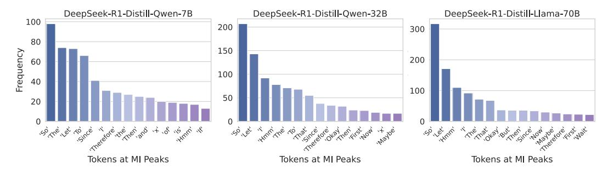

# C Discussions

Limitations. This work has several limitations. First, we analyze the MI dynamics of LRMs at the token level. Alternative granularities such as dividing reasoning steps by semantic units or logical steps may reveal additional insights. Second, while we observe the interesting MI peaks phenomenon and provide insights into the reasoning mechanisms of LRMs, the underlying mechanisms that give rise to these peaks remain underexplored. We leave a deeper analysis of their origin to future work. We hope that our work will inspire further research along these directions and contribute to a deeper understanding of the reasoning process in LRMs.

Broader impacts. This work contributes to a deeper understanding of the reasoning mechanisms in LRMs. We first observe the MI peaks phenomenon during LRMs' reasoning process, and then propose two simple training-free methods to enhance LRMs' reasoning performance based on the findings. These analyzes may have positive impacts by making AI systems more transparent and effective. However, there are also potential risks. If used carelessly, the same methods could be applied to manipulate outputs or reinforce biased thinking patterns. It is important to consider these concerns when applying our techniques and to encourage responsible use through further study and monitoring.

Discussion on Tokens at MI Peaks. As shown in Figure 4 in the main text and Figure [8](#page-18-1) in the appendix, different LRMs exhibit slightly different token frequency patterns at MI peaks. For models trained from foundation LLMs, *i.e.,* DeepSeek-R1-Distill-Llama-8B, DeepSeek-R1-Distill-Qwen-14B, DeepSeek-R1-Distill-Qwen-32B, and DeepSeek-R1-Distill-LLaMA-70B, the frequently occurring tokens include So, Let, Hmm, The, and Okay. And for DeepSeek-R1-Distill-Qwen-7B, which is trained from a math-specialized LLM, tokens such as So, The, Let, To, and, and Since are more prominent. For QwQ-32B, tokens like To, the, we, and Let appear more frequently. Semantically, these tokens commonly express reasoning-related functions such as initiating thinking (So, Hmm), logical transition (Since, Therefore), or discourse structuring (Let, Then, To), which likely help facilitate the model's continued reasoning. We hypothesize that the distribution of tokens at MI peaks may be influenced by factors such as the nature of the foundation LLM, the reasoningintensive training paradigm, etc. We leave a deeper investigation of the relationship among MI-peak token distributions, foundation LLM characteristics, reasoning-intensive training paradigms, and model reasoning performance to future work.

Further discussion on thinking token suppression (Section [3.2,](#page-6-1) Figure [5\)](#page-6-0). As shown in Figure [3.2,](#page-6-1) while the overall trend indicates that LRMs' reasoning performance degrades as more thinking tokens are suppressed, the decline is not strictly monotonic. In some cases, performance improves temporarily. We conduct an empirical analysis to better understand this phenomenon. Specifically, we observe that when certain tokens are suppressed, the model tends to adopt alternative expressions to convey similar meanings. For instance, when the generation of the token "Wait" is suppressed, the model may instead produce phrases like "But wait", which could lead to slight improvements in

> **[图片提取文字 (无描述)]:**
> DeepSeek-R1-Distill-Owen-7B DeepSeek-R1-Distill-Qwen-32B DeepSeek-R1-Distill-Llama-70B 100 200 300 80 150 Frequency 200 100 100 50 Tokens at MI Peaks Tokens at MI Peaks Tokens at MI Peaks

Figure 8: Frequency distribution of tokens at MI peaks for DeepSeek-R1-Distill-Qwen-7B, DeepSeek-R1-Distill-Qwen-32B, and DeepSeek-R1-Distill-Llama-70B.

performance. The observed performance fluctuations across different numbers of suppression tokens further support that these thinking tokens play a critical role in LRMs' reasoning capabilities.

