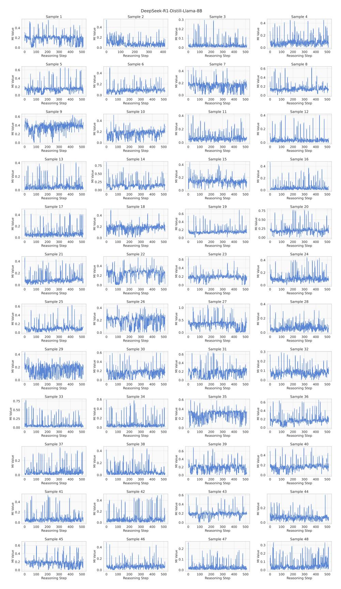
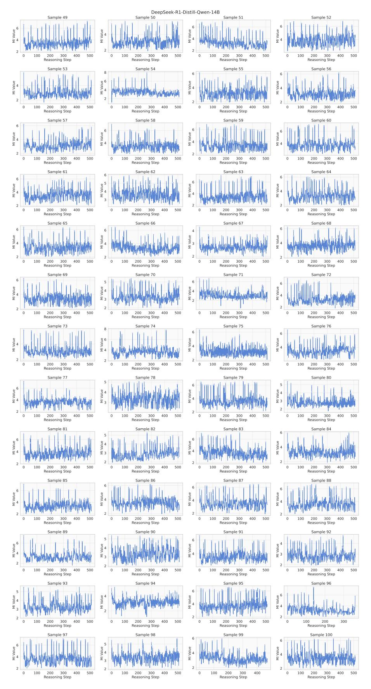
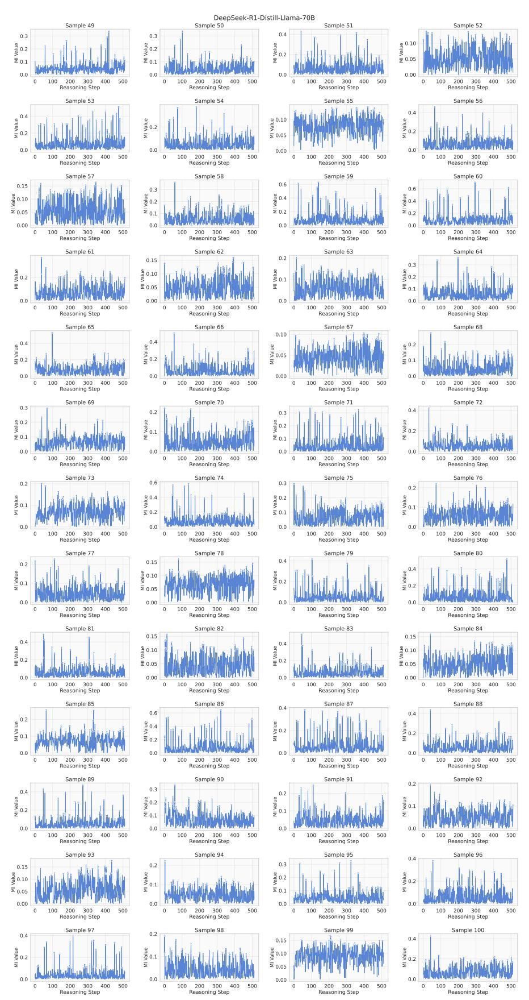

# D Additional Experimental Results

Figures [9](#page-19-0)[–20](#page-30-0) illustrate the MI trajectories of various LRMs across more data samples.

> **[图片提取文字 (无描述)]:**
> DeepSeek-R1-Distill-Llama-8B Sample 4 Sample 1 Sample 2 Sample 3 0.3 4 Value 0.4 Value Value ₹ 0.2 ₹ 0.1 0.0 0.0 0.0 0.0 0 0 0 300 100 200 Reasoning Step Reasoning Step Reasoning Step Reasoning Step Sample 8 Sample 5 Sample 6 Sample 7 0.6 0.6 0.4 0.4 0.4 Naine 0.2 9 0.4 N 0.2 ₹ 0.2 0.0 0.0 0.0 0.0 300 0 200 300 400 0 200 300 0 100 200 0 100 200 300 400 Reasoning Step Reasoning Step Reasoning Step Reasoning Step Sample 11 Sample 9 Sample 10 Sample 12 0.4 0.4 0.6 0.4 0.4 Na Value 0.2 an Value MI Value ₹ 0.2 0.2 0.0 0.0 0.0 0.0 200 300 Reasoning Step 200 300 300 300 100 0 100 400 500 0 100 200 500 200 0 400 Reasoning Step Reasoning Step Reasoning Step Sample 13 Sample 14 Sample 15 Sample 16 0.4 0.4 0.75 0.4 0.50 W 0.25 WI Value 0.2 0.0 0.00 0.0 0.0 0 100 200 300 400 500 0 200 300 400 500 200 400 0 300 400 100 0 100 300 500 100 200 500 Reasoning Step Reasoning Step Reasoning Step Reasoning Step Sample 17 Sample 18 Sample 19 Sample 20 4 Value 0.75 0.6 0.4 MI Value 9 0.50 Value Value 0.4 0.2 0.2 ₹ 0.2 ₹ 0.25 0.0 0.0 0.0 0.00 200 0 100 200 300 400 0 100 200 300 400 500 0 100 200 300 400 500 0 100 300 400 500 Reasoning Step Reasoning Step Reasoning Step Reasoning Step Sample 21 Sample 22 Sample 23 Sample 24 0.6 0.4 0.4 9.0 M 9.0 M 9.0 M M Value 9 0.4 R 0.2 Ē 0.2 0.0 0.0 0.0 0.0 0 200 300 0 200 300 400 200 300 0 100 200 300 400 Reasoning Step Reasoning Step Reasoning Step Reasoning Step Sample 25 Sample 26 Sample 27 Sample 28 0.4 0.6 1.0 0.4 0.4 WI Value o.2 0.2 0.5 0.0 0.0 0.0 0.0 200 300 400 400 0 100 200 300 400 500 0 100 0 100 200 300 500 200 300 400 Reasoning Step Reasoning Step Reasoning Step Reasoning Step Sample 29 Sample 30 Sample 31 Sample 32 0.3 0.6 0.4 0.6 MI Value value Value Value Value Value 0.4 ≅ 0.2 ₹ 0.2 ₹ 0.1 0.0 0.0 0.0 0.0 0 200 300 200 300 200 300 400 100 400 500 0 100 400 500 0 100 500 0 100 200 300 400 500 Reasoning Step Reasoning Step Reasoning Step Reasoning Step Sample 35 Sample 36 Sample 33 Sample 34 0.6 0.75 9 0.50 W 0.25 9 0.4 ₩ 0.2 9 0.4 W 0.2 9 0.4 W 0.2 0.00 0.0 0.0 0.0 0 200 300 400 0 200 300 400 500 100 200 300 500 100 100 0 200 300 400 0 400 100 Reasoning Step Reasoning Step Reasoning Step Reasoning Step Sample 37 Sample 38 Sample 39 Sample 40 0.6 0.4 0.4 Value WI Value MI Value 0.4 M Value 0.2 Ξ 0.2 0.0 0.0 0.0 0.0 0 100 200 300 400 0 100 200 300 400 0 100 200 300 0 100 200 300 400 Reasoning Step Reasoning Step Reasoning Step Reasoning Step Sample 41 Sample 42 Sample 44 Sample 43 0.6 0.4 0.4 W Agine 0.2 9 0.4 ▼ 0.2 M Value M 0.2 0.0 0.0 0.0 0.0 0 100 200 300 400 0 200 300 400 500 0 100 200 300 400 500 0 200 300 400 Reasoning Step Reasoning Step Reasoning Step Reasoning Step Sample 45 Sample 46 Sample 47 Sample 48 0.3 0.6 0.2 W Aalne 0.1 0.4 9 0.4 9 0.2 8 0.2 MI Value 0.2 ₹ 0.2 ₹ 0.1 0.0 0.0 0.0 0.0 200 300 400 200 300 400 200 300 300 0 100 500 0 100 500 0 100 400 500 0 100 200 400 Reasoning Step Reasoning Step Reasoning Step Reasoning Step

Figure 9: MI trajectories of DeepSeek-R1-Distill-Llama-8B.

> **[图片提取文字 (无描述)]:**
> DeepSeek-R1-Distill-Llama-8B Sample 50 Sample 49 Sample 51 Sample 52 0.3 0.4 0.4 0.2 0.2 0.0 0.0 0.0 0 300 400 500 0 100 200 500 0 200 300 400 500 100 300 100 200 300 0 200 400 500 Reasoning Step Reasoning Step Reasoning Step Reasoning Step Sample 53 Sample 54 Sample 55 Sample 56 0.4 0.4 Nalue Value MI Value Value 0.2 ₹ 0.1 Ξ 0.0 0.0 0.0 0.0 0 300 400 500 0 0 300 0 200 100 200 200 300 200 400 500 100 300 400 500 Reasoning Step Reasoning Step Reasoning Step Reasoning Step Sample 57 Sample 58 Sample 59 Sample 60 0.6 0.6 e 0.4 0.6 eng 0.4 e Nalue Nalue 0.2 ± 0.2 ≅ 0.2 Ξ ₹ 0.2 0.0 0.0 0.0 0.0 0 0 200 0 0 200 300 Reasoning Step Reasoning Step Reasoning Step Reasoning Step Sample 61 Sample 62 Sample 63 Sample 64 0.3 0.4 0.4 Value Value Nalue 0.2 0.2 ₹ 0.1 ₹ 0.1 0.0 0.0 0.0 0.0 0 200 300 400 500 0 100 200 300 400 0 100 200 300 400 500 0 200 300 400 Reasoning Step Reasoning Step Reasoning Step Reasoning Step Sample 66 Sample 67 Sample 68 Sample 65 0.6 0.4 WI Agine 0.6 0.4 o.4 Nalue MI Value ₹ 0.2 0.0 0.0 0.0 0.0 0 200 300 400 200 200 300 200 300 400 100 0 100 300 400 500 0 100 400 500 0 100 500 Reasoning Step Reasoning Step Reasoning Step Reasoning Step Sample 69 Sample 70 Sample 72 Sample 71 4. Value 0.6 0.4 M 0.2 onle o.2 0.4 Nalue ₹ 0.2 0.0 0.0 0.0 0.0 0 200 400 0 100 0 200 200 300 400 100 300 500 200 300 400 100 300 400 500 0 100 500 500 Reasoning Step Reasoning Step Reasoning Step Reasoning Step Sample 73 Sample 74 Sample 75 Sample 76 0.4 0.3 0.75 9 0.50 9 0.2 0.2 Value ₹ 0.2 ≅ 0.1 0.25 0.0 0.0 0.0 0.00 0 200 400 0 200 0 0 200 100 300 100 300 400 100 200 300 400 500 100 300 400 Reasoning Step Reasoning Step Reasoning Step Reasoning Step Sample 77 Sample 79 Sample 80 Sample 78 0.6 0.6 0.4 0.2 9 0.4 W 0.2 Mi Value ₹ 0.2 0.0 0.0 0.0 0.0 0 200 300 0 100 200 300 0 100 200 300 400 0 100 200 300 400 Reasoning Step Reasoning Step Reasoning Step Reasoning Step Sample 81 Sample 82 Sample 83 Sample 84 0.4 0.6 0.6 0.4 one 0.4 9.0.4 Value ₹ 0.2 W 0.2 0.0 0.0 0.0 0.0 Reasoning Step Reasoning Step Reasoning Step Reasoning Step Sample 85 Sample 86 Sample 87 Sample 88 0.75 0.6 0.4 WI value 0.2 0.4 M 0.2 0.4 M Value 0.2 9 0.50 ₹ 0.25 0.0 0.0 0.0 0.00 0 100 200 300 400 500 0 100 200 300 400 500 0 100 200 300 400 500 0 100 200 300 400 500 Reasoning Step Reasoning Step Reasoning Step Reasoning Step Sample 89 Sample 91 Sample 90 Sample 92 0.4 0.3 0.3 0.4 Najne o.2 9.0 Value o.2 ₹ 0.1 ₹ 0.2 0.1 0.0 0.0 0.0 0.0 0 300 0 200 300 0 200 100 200 400 400 500 100 200 300 0 100 300 400 Reasoning Step Reasoning Step Reasoning Step Reasoning Step Sample 96 Sample 93 Sample 94 Sample 95 0.4 0.6 0.4 0.2 Wind Value 0.1 9 0.4 ₩ 0.2 Mi Value 0.2 0.0 0.0 0.0 0.0 0 100 200 300 400 500 0 100 200 300 400 500 0 100 200 300 400 500 0 100 200 300 400 500 Reasoning Step Reasoning Step Reasoning Step Reasoning Step Sample 97 Sample 98 Sample 99 Sample 100 0.6 0.4 0.4 W 0.2 Mi Value MI Value 0.2 0.2 0.0 0.0 0.0 0.0 300 300 200 0 400 500 300 0 400 100 200 500 0 100 200 300 400 0 100 400 500 100 200 500 Reasoning Step Reasoning Step Reasoning Step Reasoning Step

Figure 10: (Continued) MI trajectories of DeepSeek-R1-Distill-Llama-8B.

> **[图片提取文字 (无描述)]:**
> DeepSeek-R1-Distill-Qwen-7B Sample 2 Sample 1 Sample 3 Sample 4 MI Value alue 4 Value Reasoning Step Reasoning Step Reasoning Step Reasoning Step Sample 8 Sample 7 Sample 5 Sample 6 MI Value A Value value 4 Ξ Ξ Reasoning Step Reasoning Step Reasoning Step Reasoning Step Sample 9 Sample 10 Sample 11 Sample 12 MI Value . Value value 4 Reasoning Step Reasoning Step Reasoning Step Reasoning Step Sample 15 Sample 13 Sample 14 Sample 16 M Value Value Value Ξ Reasoning Step Reasoning Step Reasoning Step Reasoning Step Sample 17 Sample 20 Sample 18 Sample 19 MI Value Value 4 Reasoning Step Reasoning Step Reasoning Step Reasoning Step Sample 21 Sample 22 Sample 24 Sample 23 MI Value yalue 4 Ξ Reasoning Step Reasoning Step Reasoning Step Reasoning Step Sample 25 Sample 26 Sample 28 Sample 27 A Value Value MI Value Reasoning Step Reasoning Step Reasoning Step Reasoning Step Sample 29 Sample 30 Sample 32 Sample 31 MI Value Value Ξ Reasoning Step Reasoning Step Reasoning Step Reasoning Step Sample 33 Sample 34 Sample 35 Sample 36 MI Value MI Value MI Value value 4 Reasoning Step Reasoning Step Reasoning Step Reasoning Step Sample 38 Sample 39 Sample 37 Sample 40 MI Value MI Value o A Ξ Reasoning Step Reasoning Step Reasoning Step Reasoning Step Sample 41 Sample 42 Sample 43 Sample 44 Mi Value MI Value MI Value MI Value Reasoning Step Reasoning Step Reasoning Step Reasoning Step Sample 45 Sample 48 Sample 46 Sample 47 MI Value MI Value MI Value alue 4 Ξ Reasoning Step Reasoning Step Reasoning Step Reasoning Step

Figure 11: MI trajectories of DeepSeek-R1-Distill-Qwen-7B.

Figure 12: (Continued) MI trajectories of DeepSeek-R1-Distill-Qwen-7B.

Figure 13: MI trajectories of DeepSeek-R1-Distill-Qwen-14B.

Figure 14: (Continued) MI trajectories of DeepSeek-R1-Distill-Qwen-14B.

Figure 15: MI trajectories of DeepSeek-R1-Distill-Qwen-32B.

Figure 16: (Continued) MI trajectories of DeepSeek-R1-Distill-Qwen-32B.

> **[图片提取文字 (无描述)]:**
> QwQ-32B Sample 3 Sample 1 Sample 2 Sample 4 3 MI Value M Value Value 1 Ξ 0 0 0 0 100 200 300 0 0 100 200 300 400 400 200 100 200 300 500 300 400 Reasoning Step Reasoning Step Reasoning Step Reasoning Step Sample 8 Sample 5 Sample 6 Sample 7 6 .i Value Value 4 0 0 0 100 200 300 0 300 0 100 200 300 400 300 Reasoning Step Reasoning Step Reasoning Step Reasoning Step Sample 9 Sample 12 Sample 10 Sample 11 2.1 MI Value Value Ξ 0 0 -0.04 -0.02 0.00 0.02 0.04 0 200 300 0 200 300 400 500 100 200 300 500 100 500 100 400 Reasoning Step Reasoning Step Reasoning Step Reasoning Step Sample 13 Sample 14 Sample 15 Sample 16 3 0 0 0 300 0 200 300 200 0 100 200 300 400 200 Reasoning Step Reasoning Step Reasoning Step Reasoning Step Sample 17 Sample 18 Sample 19 Sample 20 Value M Value 0 0 0 0 0 100 200 300 400 100 200 0 100 200 100 200 300 400 Reasoning Step Reasoning Step Reasoning Step Reasoning Step Sample 24 Sample 21 Sample 22 Sample 23 1.5 1.0 W Aslue Value Ξ ₹1 0 0 0 0.0 200 0 300 100 200 400 0 100 300 400 0 200 300 100 200 300 400 Reasoning Step Reasoning Step Reasoning Step Reasoning Step Sample 25 Sample 26 Sample 27 Sample 28 3 MI Value Value Value ₹ 1  $\hat{\Xi}_1$ ₹ 2 0 0 0 300 0 200 200 Reasoning Step Reasoning Step Reasoning Step Reasoning Step Sample 31 Sample 32 Sample 29 5ample 30 3.7 4.8 Value Value 3.6 ₹ 4.6 ₹ 3.5 0 0 300 400 200 300 400 -0.04 -0.02 0.00 0.02 -0.04 -0.02 0.00 0.04 200 0.04 0.02 Reasoning Step Reasoning Step Reasoning Step Reasoning Step Sample 33 Sample 34 Sample 35 Sample 36 MI Value MI Value MI Value MI Value 0 0 0 0 0 100 300 0 100 200 300 400 500 0 100 200 300 400 0 100 200 300 400 Reasoning Step Reasoning Step Reasoning Step Reasoning Step Sample 39 Sample 37 Sample 38 Sample 40 4 3 MI Value Mi Value MI Value Value Ē 0 0 0 0 0 500 0 200 300 0 500 0 300 500 300 500 100 200 400 Reasoning Step Reasoning Step Reasoning Step Reasoning Step Sample 43 Sample 41 Sample 42 Sample 44 5.0 3 4 MI Value MI Value M Value WI Value 4.6 0 300 200 200 300 0 200 500 0 300 0 -0.040.02 0.00 0.02 0.04 Reasoning Step Reasoning Step Reasoning Step Reasoning Step Sample 45 Sample 46 Sample 47 Sample 48 3 3.3 M Value 3.2 W 3.1 Value Value Ξ 0 0 0 0 0 -0.02 0.00 100 200 300 400 100 200 300 400 500 -0.040.02 0.04 200 300 Reasoning Step Reasoning Step Reasoning Step Reasoning Step

Figure 17: MI trajectories of QwQ-32B.

> **[图片提取文字 (无描述)]:**
> QwQ-32B Sample 49 Sample 52 Sample 50 Sample 51 Ξ1 0 0 0 0 100 200 300 0 100 200 300 400 0 100 200 300 400 500 0 100 200 300 400 500 Reasoning Step Reasoning Step Reasoning Step Reasoning Step Sample 56 Sample 53 Sample 54 Sample 55 1.5 9 1.0 \$ 2 ₹ 0.5 0.0 0 0 0 0 50 100 150 0 200 300 400 500 0 100 200 300 400 500 0 100 200 300 400 Reasoning Step Reasoning Step Reasoning Step Reasoning Step Sample 58 Sample 59 Sample 60 Sample 57 2 2 3 0 0 0 0 200 300 400 500 200 300 200 300 200 300 Reasoning Step Reasoning Step Reasoning Step Reasoning Step Sample 61 Sample 62 Sample 63 Sample 64 2 Value Value 3 0 0 0 0 300 400 200 300 200 300 400 100 200 500 200 Reasoning Step Reasoning Step Reasoning Step Reasoning Step Sample 66 Sample 67 Sample 68 Sample 65 2.9 4 2 Value Value ₹ 2.7 0 0 0 2.6 0 200 300 400 200 300 -0.02 0.00 0.02 200 300 500 400 0.04 Reasoning Step Reasoning Step Reasoning Step Reasoning Step Sample 69 Sample 70 Sample 71 Sample 72 3.8 5.4 9 3.7 N 3.6 W S.2 Value Ξ 5.0 3.5 0 0 0 200 300 300 -0.02 0.00 0.02 -0.02 0.00 0.02 Reasoning Step Reasoning Step Reasoning Step Reasoning Step Sample 73 Sample 74 Sample 75 Sample 76 3 2.1 Ξ 2.0 0 0 200 300 400 0 100 200 300 400 0 100 200 300 400 500 -0.04 -0.02 0.00 0.02 0.04 Reasoning Step Reasoning Step Reasoning Step Reasoning Step Sample 78 Sample 77 Sample 79 Sample 80 3 0 0 0 0 100 200 300 400 500 0 200 400 500 100 200 300 400 200 400 100 300 100 300 500 Reasoning Step Reasoning Step Reasoning Step Reasoning Step Sample 81 Sample 84 Sample 83 4 6.8 6.6 Value ž 6.4 200 400 300 0.04 -0.02 0.00 0.02 Reasoning Step Reasoning Step Reasoning Step Reasoning Step Sample 85 Sample 86 Sample 87 Sample 88 2 3 3.8 WI Value 3.6 MI Value M Value 0 0 0 100 200 300 400 500 -0.04 -0.02 0.00 0.02 0.04 0 200 300 400 0 100 200 300 400 Reasoning Step Reasoning Step Reasoning Step Reasoning Step Sample 89 Sample 90 Sample 91 Sample 92 2 M Value Value 0 0 0 0 0 0 200 200 0 200 200 300 100 300 400 500 300 400 500 100 300 500 100 400 500 400 Reasoning Step Reasoning Step Reasoning Step Reasoning Step Sample 93 Sample 94 Sample 95 Sample 96 2.9 3 2 Nalue M 1 alue 2.8 Value 2 Value ≥ ₹ 2.7 ₹1 0 0 -0.04 -0.02 0.00 200 300 500 0.02 0.04 200 300 500 200 300 400 500 Reasoning Step Reasoning Step Reasoning Step Reasoning Step Sample 97 Sample 98 Sample 99 Sample 100 6 3 M Value MI Value A Value 0 0 0 0 300 200 300 400 0 100 200 300 0 200 300 400 Reasoning Step Reasoning Step Reasoning Step Reasoning Step

Figure 18: (Continued) MI trajectories of QwQ-32B.

> **[图片提取文字 (无描述)]:**
> DeepSeek-R1-Distill-Llama-70B Sample 2 Sample 3 Sample 1 Sample 4 0.4 0.3 0.4 M Value o.2 9 0.2 8 0.2 9 0.2 ₹ 0.1 Ξ ₹ 0.1 0.0 0.0 0.0 0.0 0 200 300 400 0 100 200 300 400 0 100 200 300 400 0 100 200 300 400 Reasoning Step Reasoning Step Reasoning Step Reasoning Step Sample 5 Sample 6 Sample 7 Sample 8 0.4 0.4 Value 0.15 0.3 MI Value 0.2 kglne 0.10  $\leq 0.2$ ₹ 0.05 0.0 0.0 0.0 0.00 0 200 300 0 100 200 300 0 200 300 200 300 400 Reasoning Step Reasoning Step Reasoning Step Reasoning Step Sample 9 Sample 10 Sample 11 Sample 12 0.10 Aalue 0.3 0.10 W 0.05 Value Value 0.2 W Agine 0.1 ₹ 0.05 ₹ 0.2 0.0 0.00 0.0 0.00 0 200 300 0 300 400 500 0 200 300 400 200 300 400 500 200 Reasoning Step Reasoning Step Reasoning Step Reasoning Step Sample 16 Sample 13 Sample 14 Sample 15 0.2 0.10 Agine 0.3 0.10 Nege MI Value 9 0.2 Nature ₹ 0.05 ₹ 0.1 ₹ 0.05 0.0 0.0 0.00 0.00 300 0 100 200 300 400 0 200 300 400 500 0 100 200 400 500 0 100 200 300 400 500 Reasoning Step Reasoning Step Reasoning Step Reasoning Step Sample 17 Sample 19 Sample 18 Sample 20 0.6 0.15 0.4 W Agine 0.2 MI Value e 0.4 0.10 ₹ 0.2  $\bar{\Xi}_{0.05}$ 0.0 0.0 0.0 0.00 300 0 100 200 300 0 200 300 400 0 100 200 400 200 300 400 500 100 Reasoning Step Reasoning Step Reasoning Step Reasoning Step Sample 23 Sample 24 Sample 21 Sample 22 0.15 0.3 0.3 0.10 0.2 9 0.10 ₹ 0.05 Value MI Value 0.2 0.05 ₹ 0.1 ₹ 0.1 0.00 0.00 0.0 0.0 0 100 200 300 400 500 0 100 200 300 400 0 200 300 400 0 200 300 400 500 500 Reasoning Step Reasoning Step Reasoning Step Reasoning Step Sample 28 Sample 25 Sample 26 Sample 27 0.2 0.4 0.6 M Value 0.10 Refe 90 kg 0.1 9 0.4 0.4 Ξ ₹ 0.2 ₹ 0.05 0.0 0.0 0.0 0.00 200 0 100 200 300 400 0 100 200 300 400 0 100 200 300 400 0 100 300 400 500 Reasoning Step Reasoning Step Reasoning Step Reasoning Step Sample 29 Sample 30 Sample 31 Sample 32 0.2 W Agree 0.1 0.2 0.3 0.4 W Asine 0.2 o.2 0.1 £ 0.1 0.0 0.0 0.0 0.0 200 300 0 200 300 400 0 200 300 400 0 200 300 400 100 100 100 500 Reasoning Step Reasoning Step Reasoning Step Reasoning Step Sample 33 Sample 34 Sample 35 Sample 36 0.3 0.3 1 1 0.2 M W 0.1 M Value M Value 0.2 W 0.1 0.0 0.0 0.0 0.0 300 200 300 300 0 100 200 400 500 0 100 200 300 400 0 100 400 0 100 200 400 Reasoning Step Reasoning Step Reasoning Step Reasoning Step Sample 38 Sample 37 Sample 39 Sample 40 0.6 0.2 0.3 0.4 W Value 0.2 Mgree 0.1 Wgree 0.4 ₩ 0.2 M Value 0.0 0.0 0.0 0.0 0 200 300 0 200 300 400 500 0 200 300 400 0 200 300 Reasoning Step Reasoning Step Reasoning Step Reasoning Step Sample 42 Sample 41 Sample 43 Sample 44 0.3 0.4 0.6 0.4 0.4 Nalue 0.2 M Value MI Value Nature Value ₹ 0.1 0.0 0.0 0.0 0.0 0 100 200 300 400 0 100 200 300 400 500 0 100 200 300 400 500 0 100 200 300 400 500 Reasoning Step Reasoning Step Reasoning Step Reasoning Step Sample 45 Sample 46 Sample 47 Sample 48 0.3 0.2 9 0.10 0.4 0.2 MI Value 0.1 M Value M Value ₹ 0.05 0.0 0.0 0.0 0.00 0 300 0 200 300 400 0 200 300 400 300 500 200 400 Reasoning Step Reasoning Step Reasoning Step Reasoning Step

Figure 19: MI trajectories of DeepSeek-R1-Distill-Llama-70B.

> **[图片提取文字 (无描述)]:**
> DeepSeek-R1-Distill-Llama-70B Sample 49 Sample 50 Sample 51 Sample 52 0.4 9 0.10 N 0.3 0.3 9 0.2 ₩ 0.1 B 0.2 9 0.2 W ≅ 0.1 ₹ 0.05 0.0 0.0 0.0 0.00 200 300 400 0 200 300 400 0 200 300 0 200 300 Reasoning Step Reasoning Step Reasoning Step Reasoning Step Sample 53 Sample 54 Sample 55 Sample 56 0.4 Ni Value 0.4 9 0.10 M Value MI Value 0.2 ₹ 0.05 0.0 0.0 0.00 0 300 0 200 300 0 300 200 300 Reasoning Step Reasoning Step Reasoning Step Reasoning Step Sample 60 Sample 57 Sample 58 Sample 59 0.6 0.15 0.6 0.3 0.10 9 0.2 0.2 ango.4 9 0.4 ₹ 0.05 ≅ 0.1 ₹ 0.2 ≅ 0.2 0.0 0.0 0.0 0 200 300 400 200 300 0 200 300 400 100 200 300 400 Reasoning Step Reasoning Step Reasoning Step Reasoning Step Sample 61 Sample 62 Sample 63 Sample 64 0.2 0.15 0.3 MI Value 0.10 Value 0.2 ₹ 0.05 ₹ 0.1 0.0 0.00 0.0 0.0 0 300 400 0 200 300 400 0 200 200 300 400 200 300 0 Reasoning Step Reasoning Step Reasoning Step Reasoning Step Sample 68 Sample 65 Sample 66 Sample 67 0.4 d Value 0.10 90.2 80.2 90.4 M 0.2 M Value 0.05 0.2 ₹ 0.1 0.00 0.0 0.0 0.0 200 300 400 200 300 400 200 300 200 400 0 100 500 0 100 500 0 100 400 0 100 300 Reasoning Step Reasoning Step Reasoning Step Reasoning Step Sample 69 Sample 71 Sample 70 Sample 72 0.3 0.4 0.2 0.3 ang 0.2 Nafue Vafue ange 0.1 o.2 ₹ 0.1 ₹ 0.1 Ξ 0.0 0.0 0.0 0.0 200 200 300 400 200 300 400 0 200 300 0 100 500 0 100 500 0 100 300 400 500 100 400 Reasoning Step Reasoning Step Reasoning Step Reasoning Step Sample 73 Sample 74 Sample 75 Sample 76 0.6 0.2 0.3 0.2 M Value o.4 one 0.2 MI Value ₹ 0.2 ₹ 0.1 0.0 0.0 0.0 0.0 300 0 200 300 400 0 100 200 300 400 500 0 100 200 400 0 100 200 300 400 Reasoning Step Reasoning Step Reasoning Step Reasoning Step Sample 77 Sample 78 Sample 79 Sample 80 0.4 0.15 0.2 0.4 M Value 0.2 M Value 0.10 0.1 ≅ 0.05 0.0 0.0 0.0 0 200 300 400 0 200 300 0 200 300 400 200 300 Reasoning Step Reasoning Step Reasoning Step Reasoning Step Sample 84 Sample 81 Sample 82 Sample 83 0.4 WI Value 0.15 0.4 0.10 Value MI Value 0.10 ₹ 0.05 0.00 0.00 200 300 300 400 200 300 400 200 300 400 Reasoning Step Reasoning Step Reasoning Step Reasoning Step Sample 86 Sample 87 Sample 85 Sample 88 0.4 MI Value 0.6 0.4 9 0.4 MI Value MI Value 0.2 ≅ 0.2 0.0 0.0 0.0 0.0 200 300 0 300 0 200 200 0 100 400 100 200 400 100 300 0 100 300 400 Reasoning Step Reasoning Step Reasoning Step Reasoning Step Sample 89 Sample 90 Sample 91 Sample 92 0.2 0.3 0.4 0.2 MI Value o.1 M 0.2 ₹ 0.1 MI Value 0.2 0.1 0.0 0.0 0.0 0.0 0 100 200 300 400 0 200 300 400 0 200 300 200 300 Reasoning Step Reasoning Step Reasoning Step Reasoning Step Sample 93 Sample 94 Sample 95 Sample 96 0.4 0.3 0.2 0.15 0.10 M 0.05 MI Value 0.2 Naine 0.1 MI Value 0.00 0.0 0.0 0.0 200 300 0 200 300 200 300 400 200 300 0 400 100 400 0 100 0 400 Reasoning Step Reasoning Step Reasoning Step Reasoning Step Sample 97 Sample 98 Sample 99 Sample 100 0.2 0.4 0.4 0.15 o.2 M o.1 M 夏 0.10 o.2 N ₹ 0.05 0.0 0.0 0.0 0.00 300 300 0 100 200 400 0 200 400 500 .0 200 300 0 200 300 Reasoning Step Reasoning Step Reasoning Step Reasoning Step

Figure 20: (Continued) MI trajectories of DeepSeek-R1-Distill-Llama-70B.