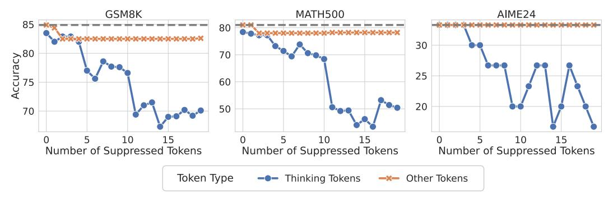

# 3 Thinking Tokens are Information Peaks in LLM Reasoning

In Section [2,](#page-2-2) we identify a distinctive phenomenon in LRMs' reasoning trajectories: the emergence of MI peaks. Then a natural follow-up question is: *what semantic information is encoded in the representations at these MI peaks?* In this section, we investigate this question from a token-level perspective. Specifically, in Section [3.1,](#page-5-1) we project the representations at MI peaks into the token space and analyze the characteristics of the corresponding tokens. Then in Section [3.2,](#page-6-1) we design experiments to assess the functional role of these tokens, demonstrating that they are crucial for LRM's reasoning performance, while other tokens have minimal impact.

#### 3.1 Exploring MI Peak Representations in Token Space

Projecting representations to token space. To interpret the semantics of representations at MI peaks, we decode these specific representations into the token space using LLM's output head [\[46,](#page-11-8) [54,](#page-12-3) [14\]](#page-9-4). Specifically, for a representation ht, we first compute the corresponding token probability distribution, and then employ a greedy decoding strategy to extract the token with the highest probability:

$$p_t = \operatorname{Softmax}(W_{\text{out}}h_t + b), \quad \hat{z}_t = \arg\max_{i \in \{1, \dots, V\}} [p_t]_i,$$
 (5)

where Wout P R V ˆd is the output projection matrix, b P R V is the bias vector, and V is the vocabulary size. We apply the above decoding procedure to all representations at MI peaks across the evaluation dataset. In this way, we analyze the empirical distribution over these decoding tokens, uncovering patterns about what types of semantic tokens tend to correspond to these high-MI representations. Specifically, we use the same models and dataset as described in Section [2.1](#page-2-0) to conduct experiments.

> **[图片提取文字 (无描述)]:**
> GSM8K MATH500 AIME24 85 80 30 Accuracy 52 70 25 60 20 50 70 10 10 10 Number of Suppressed Tokens Number of Suppressed Tokens Number of Suppressed Tokens Token Type -- Thinking Tokens Other Tokens

Figure 5: Impact of suppressing the generation of thinking tokens versus other tokens on LRMs' reasoning performance.

For each model, we aggregate all decoded tokens at MI peaks across the dataset, and then compute their frequency distribution for further analysis.

The tokens that appear at MI peaks are mostly connective words that express self-reflection or transitions in LRM's reasoning process. In Figure [4,](#page-5-2) we illustrate the top-30 tokens decoded at MI peaks in DeepSeek-R1-Distill-LLaMA-8B, DeepSeek-R1-Distill-Qwen-14B and QwQ[2](#page-6-2) . Interestingly, we observe that the MI peak tokens in LRMs are predominantly logical markers and reflective expressions such as *"So"*, *"Hmm"*, and *"Wait"*, which are commonly associated with pause, thinking, or internal deliberation. Intuitively, tokens like *"Hmm"* and *"Wait"* often prompt the model to selfreflect, consider alternative reasoning paths, etc. For example, we randomly extract responses from LRMs where these tokens appear and observe the follow-up statements: "Wait, let me think differently. Let's denote...," "Hmm, so I must have made a mistake somewhere. Let me double-check my calculations. First, ..." This behavior aligns with prior work suggesting that such tokens can motivate to perform multi-step reasoning and improve answer accuracy [\[18\]](#page-10-3). We provide more discussions in Appendix [C.](#page-17-0)

### 3.2 Tokens at MI Peaks are Critical to LRM's Reasoning Performance

Here, we refer to those decoded high-MI tokens in Section [3.1](#page-5-1) as *thinking tokens*. These thinking tokens appear to play a dual role: (i) linguistically, they serve as discourse cues that encourage the model to think or reflect; and (ii) in hidden space, their corresponding representations contain high MI with the golden answer. Thus, we hypothesize that *these thinking tokens may be critical to model's final reasoning results*. In this subsection, we conduct experiments to validate this hypothesis.

Suppressing the generation of thinking tokens significantly impairs the reasoning performance of LRMs, while suppressing other tokens has minimal effect. To investigate the role of thinking tokens identified at MI peaks, we conduct a controlled intervention experiment. Specifically, during inference with LRMs, we suppress the generation of a certain number of thinking tokens by setting their generation probabilities to zero. As a comparison, we randomly suppress the same number of non-thinking token. In this way, we evaluate the model's performance on several math reasoning benchmarks under different numbers of suppression tokens. As shown in Figure [5,](#page-6-0) suppressing thinking tokens leads to a significant degradation in the model's reasoning performance, while suppressing non-thinking tokens has little to no effect (more discussions are provided in Appendix [C\)](#page-17-0). This indicates that the thinking tokens indeed play a critical role in LRMs' reasoning capabilities, providing empirical support for our previous hypothesis.

