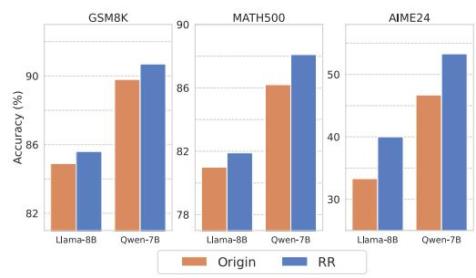
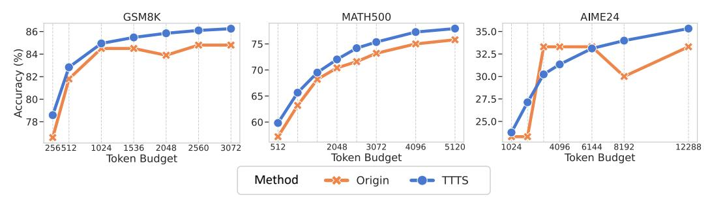

# 4 Applications: Leveraging MI Peaks to Improve LRM Reasoning

Drawing insights from our previous analyses, we propose two simple yet effective techniques to improve LRMs' reasoning performance. In Section [4.1,](#page-7-0) we introduce a method that reuses internal representations at MI peaks to allow the model to further exploit the information in latent space. In Section [4.2,](#page-7-1) we incorporate the thinking tokens into a test-time scaling scenario to improve model's reasoning accuracy.

2Results for the other models are provided in Appendix [D.](#page-18-0)

#### 4.1 Recycling High-MI Representations During Inference

The MI Peaks phenomenon analyzed in Section 2.2 suggests that some representations in LRMs' reasoning process may encode particularly useful semantic information for reasoning. Motivated by this, we propose a simple technique named Representation Recycling (RR). Intuitively, RR feeds the representations at MI peaks back into the model, thereby allowing the model to process and exploit these representations more thoroughly.

**Method.** Recall that each layer in an LLM typically consists of a Transformer block [45]. Given an input, the forward computation flow through the layers of an LLM follows:

$$h_{\ell} = \mathrm{TF}_{\ell}(h_{\ell-1}), \quad \ell = 1, \dots, L,$$

where  $h_{\ell}$  is the output representation of the l-th transformer block  $\mathrm{TF}_{\ell}(\cdot)$ , and L is the total number of layers. To encourage deeper processing of a potentially important representation  $h_{\ell}$ \* at layer  $\ell$ \*, we modify the forward computation by feeding it back into the same layer once more:  $h'_{\ell} = \mathrm{TF}_{\ell} * (h_{\ell})$ , instead of directly passing it to the next layer. Then, for layers  $\ell > \ell^*$ , we continue the forward pass as usual:  $h'_{\ell} = \mathrm{TF}_{\ell} (h'_{\ell-1})$ . In this way, the above "recycling" operation allows the model to reprocess the high-MI representations to further extract critical reasoning features.

> **[图片提取文字 (无描述)]:**
> GSM8K MATH500 AIME24 90 50 90 86 Accuracy (%) 40 82 30 82 78 Llama-8B Qwen-7B Llama-8B Llama-8B Qwen-7B Qwen-7B Origin

Figure 6: Reasoning performance of the original LRMs and our RR method across multiple math benchmarks.

**Experimental setup.** To evaluate RR's effectiveness, we conduct experiments on three mathematical reasoning benchmarks using DeepSeek-R1-Distill-Llama-8B and DeepSeek-R1-Distill-Qwen-7B. Since ground-truth answers are unavailable during inference, we first record the thinking tokens using the training set of MATH dataset (as introduced in Section 3.1), and then trigger RR whenever the model generates one of these thinking tokens. We empirically set  $\ell^*$  to middle or high layers of the LLMs, since previous studies suggest that these layers tend to encode more semantically rich content [5, 59, 35].

**Results.** As shown in Figure 6, **RR** consistently improves LRMs' reasoning performance across all benchmarks. In particular, RR yields a notable performance improvement on the AIME24 dataset, which consists of challenging competition-level problems. This suggests that recycling the MI-peak representations could help LRMs further unlock and leverage their inherent reasoning potential, leading to better reasoning performance.

#### **4.2** Test-Time Scaling with Thinking Tokens

With the diminishing returns of scaling laws in LLMs' training stage, test-time scaling is becoming an increasingly important paradigm for improving the reasoning performance of LRMs [12, 38, 50]. Prior studies have shown that LLMs' reasoning performance can continue to improve as more compute is allocated at inference time [21]. Inspired by prior work [30], we propose a simple yet effective strategy called Thinking Token based Test-time Scaling (TTTS).

**Method.** Given the set of thinking tokens identified in Section 3.1, we filter out tokens with little semantic content (*e.g.*, punctuations and single characters, see Appendix B for more details) and retain tokens like "So," "Hmm," which often indicate reflection, transition, or further thinking. Then during inference, we append one of these thinking tokens to the end of the model's initial output and allow it to continue generating additional reasoning steps.

**Experimental setup.** We evaluate TTTS using LLaMA-8B on GSM8K, MATH500, and AIME24. Specifically, we consider a controlled test-time scaling setting: given a LRM with an initial token budget, we gradually increase the token generation budget and compare the model's reasoning performance with and without TTTS.

Results. As shown in Figure 7, under the same token budget, TTTS consistently outperforms the original LRM on both GSM8K and MATH500. Notably, on GSM8K, the original LRM's performance plateaus once the token budget exceeds 1024, whereas TTTS continues to yield performance improvements as the token budget increases. On the harder AIME24 benchmark,

> **[图片提取文字 (无描述)]:**
> GSM8K MATH500 AIME24 86-35.0-75-Accuracy (%) 32.5-70-30.0-65-27.5-25.0-78-60-512 2048 3072 4096 5120 1024 12288 3072 4096 6144 8192 256512 1024 1536 2048 2560 Token Budget Token Budget Token Budget Method -X- Origin -O- TITS

Figure 7: Reasoning performance of TTTS and the original LRMs across multiple math benchmarks under varying token budgets.

we observe that the original model's performance saturates once the token budget reaches around 3000. In contrast, although TTTS underperforms slightly at some intermediate token budgets, its performance continues to improve steadily and eventually surpasses the original model once the budget exceeds 6144 tokens. These results suggest that as more inference-time resources become available, TTTS could effectively prompt LRMs to further think, and stably improve the model's reasoning performance.

