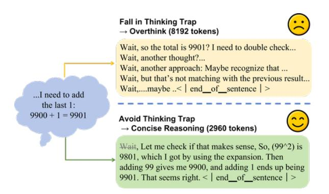
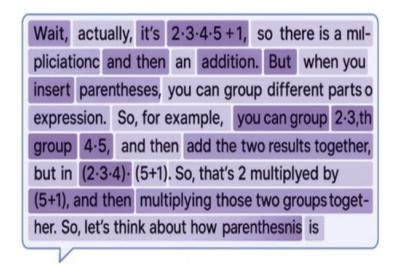
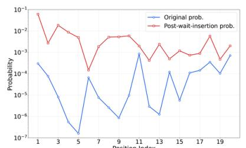
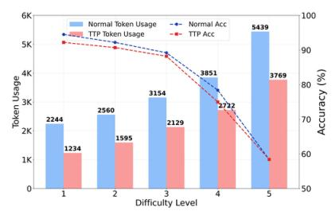

# Do Thinking Tokens Help or Trap? Towards More Efficient Large Reasoning Model

Bowen Ding1,4,\*, Yuhan Chen2,\*, Futing Wang1,4, Lingfeng Ming3, and Tao Lin4,5,†

1 Zhejiang University 2 Boston University 3 ByteDance

4 School of Engineering, Westlake University

5 Research Center for Industries of the Future, Westlake University

4{dingbowen, wangfuting, lintao}@westlake.edu.cn

2erv1n@bu.edu, 3minglingfeng@bytedance.com

#### Abstract

Large Reasoning Models (LRMs) excel at solving complex problems but face an overthinking dilemma. When handling simple tasks, they often produce verbose responses overloaded with thinking tokens (e.g., wait, however). These tokens trigger unnecessary high-level reasoning behaviors like reflection and backtracking, reducing efficiency. In this work, our pilot study reveals that these thinking-token-induced behaviors are not essential for effective problemsolving and may even hinder correct reasoning within constrained token budgets. We identify this phenomenon as the thinking trap. To mitigate this issue, we propose Dual Policy Preference Optimization (DuP-PO), a novel algorithm featuring: (1) A rollout sampling strategy that guarantees balanced exposure to responses with and without thinking tokens; (2) A fine-grained advantage control technique to dynamically regulate the prediction of target tokens; (3) A policy shaping method ensuring stable gradient contributions from thinking tokens. Experimental results on five popular math reasoning benchmarks show that DuP-PO performs well on the popular LRM, which significantly improves their token efficiency during reasoning, while achieving the superior performance of the base model. 1

#### 1 Introduction

Large Reasoning Models (LRMs) excel at generating complex, human-like chains-of-thought (CoTs) for tasks like math, coding, and STEM Q&A (OpenAI, 2024; DeepSeek-AI, 2025; Qwen Team, 2025; Seed et al., 2025). Unlike

> **[图片提取文字 (无描述)]:**
> Fall in Thinking Trap → Overthink (8192 tokens) Wait, so the total is 9901? I need to double check... Wait, another thought?... Wait, another approach: Maybe recognize that ... Wait, but that's not matching with the previous result... Wait,...maybe .. < end\_of\_sentence | > ...I need to add the last 1: 9900 + 1 = 9901Avoid Thinking Trap → Concise Reasoning (2960 tokens) Wait, Let me check if that makes sense, So, (99^2) is 9801, which I got by using the expansion. Then adding 99 gives me 9900, and adding 1 ends up being 9901. That seems right, < | end of sentence | >

Figure 1: The Illustration of Trapped v.s. Efficient Reasoning. An example from MATH500 where correct inference gets stuck in redundant verification loops, failing to produce a final answer within token limits

conventional Large Language Models (LLMs), LRMs consistently generate discourse markers such as "wait, hmm, however" within their reasoning processes, which we term **thinking tokens** (elaborated in Section 5.3.1). These tokens, in turn, activate advanced cognitive behaviours such as reflection, back-tracking, and thought transitions. This phenomenon is often referred to as an "aha moment" and has traditionally been considered a hallmark of the evolution from a System-1 agent to a System-2 agent (DeepSeek-AI, 2025; Zeng et al., 2025; Muennighoff et al., 2025a).

Recently, a growing number of studies (Sui et al., 2025; Luo et al., 2025a; Feng et al., 2025) indicate that these advanced thought patterns in LRMs can lead to an explosive growth in response length. Even for remarkably simple problems, such as "9900 + 1 =?", LRM responses can become cluttered with extensive and unnecessary reflective thinking patterns, often resulting in outputs exceeding thousands of tokens, as shown in Figure 1. This phenomenon, termed **overthinking**, significantly constrains the practical applicability of LRMs

\*Contributed equally.

&lt;sup>†Corresponding author.

&lt;sup>1The project is still under progress and our codes will be released at https://github.com/Danield21/Dual-Policy-Preference-Optimization

in real-world scenarios [\(Chen et al.,](#page-9-2) [2025\)](#page-9-2).

Existing training-based approaches tackle overthinking by collecting variable-length CoT [\(Xia et al.,](#page-11-2) [2025;](#page-11-2) [Kang et al.,](#page-10-5) [2025;](#page-10-5) [Ma](#page-10-6) [et al.,](#page-10-6) [2025b;](#page-10-6) [Munkhbat et al.,](#page-10-7) [2025\)](#page-10-7) and explicitly penalizing verbose responses [\(Fu et al.,](#page-9-3) [2024;](#page-9-3) [Yu et al.,](#page-11-3) [2024;](#page-11-3) [Aggarwal and Welleck,](#page-9-4) [2025\)](#page-9-4). Nevertheless, these methods struggle to achieve an optimal balance between performance gains and token efficiency [\(Fang et al.,](#page-9-5) [2025;](#page-9-5) [Su and Cardie,](#page-11-4) [2025\)](#page-11-4), highlighting the need for a deeper understanding of overthinking mechanisms to develop more effective solutions.

Recent work by [Muennighoff et al.](#page-10-8) [\(2025b\)](#page-10-8) demonstrates that appending thinking tokens (e.g., *wait*) after end-of-thinking delimiters can artificially extend reasoning duration, suggesting that frequent sampling of such tokens may contribute to overthinking. However, the research community has yet to reach consensus on the role that thinking tokens play in the reasoning process, leading us to pose a fundamental question:

## *Do Thinking Tokens Help or Trap?*

To answer this question, we conduct systematic experiments analyzing thinking token behaviors in LRMs. Our analysis reveals that thinking tokens may trigger a **thinking trap**, where unproductive reasoning loops that waste computational resources without improving task performance. This challenges the prevailing assumption that more thinking necessarily leads to better reasoning.

Building on the insight, we propose a simple yet effective **r**einforcement **l**earning (RL) algorithm: **Du**al-**P**olicy **P**reference **O**ptimization (DuP-PO), which features three key innovations: (1) **Dual-Policy Sampling** that provides balanced exposure to responses with and without thinking tokens during training; (2) **Token-Level Advantage Scaling** that finely controls the reinforcement of specific tokens based on their utility; and (3) **Policy Shaping** that ensures stable gradient flow for thinking token suppression. This approach enables models to learn when thinking tokens are beneficial versus detrimental, avoiding the thinking trap while maintaining reasoning quality. The main contributions of this work include:

• We identify and characterize the **thinking trap**, where thinking tokens drive unproduc-

- tive reasoning cycles, providing empirical evidence that challenges their assumed necessity.
- We propose **DuP-PO**, a training-based approach that achieves superior performanceefficiency trade-offs by reinforcing concise correct responses while suppressing problematic thinking token generation.
- We demonstrate DuP-PO's effectiveness across diverse mathematical reasoning benchmarks, achieving 6-20% token reduction with performance improvements through minimal training overhead.

## **2 Related work**

## **2.1 Analysis on Thinking Tokens**

Since the advent of DeepSeek-R1, thinking tokens, predominantly featuring *wait*, have garnered significant attention. [DeepSeek-AI](#page-9-0) [\(2025\)](#page-9-0) emphasizes the significance of these tokens, positing that their emergence signals a model's autonomous development of advanced problem-solving strategies. Concurrently, [Zhou et al.](#page-11-5) [\(2025\)](#page-11-5) and [Open-R1-Team](#page-10-9) [\(2025\)](#page-10-9) have regarded the model's exhibition of "aha moments" deduced by thinking tokens as an indicator of successfully replicating R1. Furthermore, other works have investigated the origins of these thinking tokens. [Liu et al.](#page-10-10) [\(2025\)](#page-10-10) suggest that thinking tokens represent pre-existing patterns within base models, which RL methods merely activate.

Moreover, certain studies have delved into the model behaviors and internal mechanisms induced by thinking tokens. [Yang et al.](#page-11-6) [\(2025d\)](#page-11-6) posit that these thinking tokens can subtly alter the model's perception of problem difficulty, thereby facilitating the resolution of complex problems. [Wang et al.](#page-11-7) [\(2025a\)](#page-11-7) observe that in Qwen3 series models, tokens like *wait* introduce high uncertainty. Additionally, [Qian](#page-10-11) [et al.](#page-10-11) [\(2025\)](#page-10-11), by calculating the mutual information between response tokens and the final answer, find mutual information peaks associated with thinking tokens such as *hmm*, *wait*, and *therefore*, suggesting that these tokens possess superior representational capabilities for the answer compared to other tokens.

In contrast, our analysis demonstrates that thinking tokens can induce a trap of redundant cyclic verification, leading to reasoning inefficiencies such as overthinking in the context of mathematical reasoning tasks.

### **2.2 Mitigating Overthinking**

To reduce over-thinking in LRMs, prior work explores both training-free and training-based approaches. Training-free methods include prompt-based techniques, which elicit concise reasoning through carefully designed prompts [\(Ma et al.,](#page-10-12) [2025a\)](#page-10-12), and decoding-based strategies that terminate reasoning based on uncertainty signals or penalize unstable token transitions [\(Fu et al.,](#page-9-3) [2024;](#page-9-3) [Yang et al.,](#page-11-8) [2025b;](#page-11-8) [Wang et al.,](#page-11-9) [2025c\)](#page-11-9).

Training-based methods promote efficiency through supervised fine-tuning on variablelength CoT data [\(Xia et al.,](#page-11-2) [2025;](#page-11-2) [Kang et al.,](#page-10-5) [2025;](#page-10-5) [Ma et al.,](#page-10-6) [2025b;](#page-10-6) [Munkhbat et al.,](#page-10-7) [2025;](#page-10-7) [Yu et al.,](#page-11-3) [2024;](#page-11-3) [Cui et al.,](#page-9-6) [2025\)](#page-9-6) or reinforcement learning with length-aware rewards to discourage verbosity [\(Yeo et al.,](#page-11-10) [2025;](#page-11-10) [Luo](#page-10-13) [et al.,](#page-10-13) [2025b;](#page-10-13) [Team et al.,](#page-11-11) [2025;](#page-11-11) [Aggarwal and](#page-9-4) [Welleck,](#page-9-4) [2025;](#page-9-4) [Shen et al.,](#page-10-14) [2025;](#page-10-14) [Qu et al.,](#page-10-15) [2025;](#page-10-15) [Hou et al.,](#page-10-16) [2025;](#page-10-16) [Yang et al.,](#page-11-12) [2025c\)](#page-11-12). Hybrid approaches further adapt reasoning depth based on task complexity [\(Zhang et al.,](#page-11-13) [2025;](#page-11-13) [Tu et al.,](#page-11-14) [2025\)](#page-11-14).

In contrast, our method DuP-PO requires no curated CoT data or predefined reasoning length. It finely regulates thinking token usage, delivering a favorable balance between performance and efficiency.

## **3 Rethinking the Role of Thinking Tokens**

In this section, we challenge the prevailing assumption that thinking tokens universally enhance reasoning capabilities in large reasoning models [\(DeepSeek-AI,](#page-9-0) [2025;](#page-9-0) [Muennighoff et al.,](#page-10-3) [2025a\)](#page-10-3).

Our empirical analysis of 6,023 test responses from DeepSeek-R1-Distill-Qwen-1.5B [\(DeepSeek-AI,](#page-9-0) [2025\)](#page-9-0) reveals a counterintuitive pattern:

## **Observation**

Incorrect responses contain **twice as many thinking tokens** as correct responses.

This finding suggests that thinking token

density correlates more strongly with reasoning failures than successes, motivating a fundamental question:

#### **Question**

Do thinking tokens **genuinely facilitate complex reasoning**? or do they **introduce detrimental overthinking**?

We address this question through two complementary investigations: Section [3.1](#page-2-0) examines whether reasoning performance degrades when thinking tokens are removed, while Section [3.2](#page-3-0) analyzes specific properties of thinking tokens that may contribute to overthinking behaviors in large reasoning models.

## **3.1 When Fewer Thinking Tokens Maintain a Good Reasoning**

To directly test the necessity of thinking tokens, we conduct a controlled experiment where thinking token generation is systematically suppressed through logits penalty (i.e., ThinkTokenPenalty in Section [5.2\)](#page-7-1) on common thinking tokens (*wait, hmm, hold on, alternatively, maybe, however, but, okay*), Then we get a counterintuitive result:

### **Observation**

Suppressing thinking token generation produces **minimal degradation** in reasoning performance across difficulty levels.

As illustrated in Figure [2c,](#page-3-1) accuracy remains remarkably stable across MATH500 difficulty levels, with both normal reasoning and ThinkTokenPenalty achieving comparable performance across varying problem difficulties. Simultaneously, the bar chart reveals substantial savings on the reasoning cost, achieving approximately 1*,*000 token reductions per response across different difficulty levels through disenabling thinking tokens. Furthermore, our error analysis demonstrates that ThinkToken-Penalty significantly reduces reasoning failures attributed to excessive reflection and response truncation, decreasing such failures from 86% to 37%. These empirical findings lead to a critical takeaway:

> **[图片提取文字 (无描述)]:**
> Wait, actually, it's 2.3.4.5 +1, so there is a milpliciationc and then an addition. But when you insert parentheses, you can group different parts o expression. So, for example, you can group 2-3,th group 4.5, and then add the two results together, but in (2·3·4) (5+1). So, that's 2 multiplyed by (5+1), and then multiplying those two groups together. So, let's think about how parenthesnis is

> **[图片提取文字 (无描述)]:**
> $10^{-1}$ Original prob. Post-wait-insertion prob. 10-2  $10^{-3}$ Probability 10-4 10-5  $10^{-6}$ 10-7 13 15 17 19 Donaldian Indian

> **[图片提取文字 (无描述)]:**
> 6K Normal Token Usage Normal Acc TTP Token Usage TTP Acc 5K Token Usage 1K Difficulty Level

- (a) The heatmap of token probability.
- (b) The illustration of *wait* cascading effect.
- (c) Normal reasoning v.s. ThinkTokenPenalty (TTP) on MATH500.

Figure 2: **Analysis of thinking token effects in DeepSeek-R1-Distill-Qwen-1.5B**. [\(2a\)](#page-3-1) **The heatmap of token probability.** Darker backgrounds indicate higher probabilities, showing systematic over-confidence in thinking tokens like *wait*. [\(2b\)](#page-3-1) **The illustration of** *wait* **cascading effect.** Blue circles show the original *wait* probabilities, red squares show 100-fold increases after inserting a single *wait* token, demonstrating auto-regressive amplification across 20 positions. [\(2c\)](#page-3-1) **Normal reasoning v.s. ThinkTokenPenalty (TTP) on MATH500.** The performance and response token usuage across difficulty levels 1-5 is shown, where bars show token usage and dotted lines show accuracy for normal reasoning (blue) and TTP (red). TTP maintains comparable accuracy while reducing token consumption.

#### **Takeaway**

Thinking tokens are **not necessary** for effective reasoning; their absence often **improves** reasoning efficiency.

We formalize this counterproductive phenomenon as **thinking trap**-reasoning deadlocks caused by excessive self-reflection, as exemplified in Figure [1.](#page-0-1)

## **3.2 Mechanisms Underlying Thinking Traps**

Having established that thinking tokens can impair reasoning performance, we investigate the underlying mechanisms driving this phenomenon. Our analysis identifies two critical properties that enable thinking trap formation: **over-confidence** and **cascading generation**.

**Over-confidence in Thinking Token Prediction.** Analysis of our 6*,*023 response dataset reveals an average of 106 thinking tokens per response, indicating remarkably high generation frequency. Moreover, Figure [2a](#page-3-1) demonstrates consistent high-probability patterns for thinking tokens such as *wait* and *but*, evidenced by the prominent highlighting behavior. These observations suggest:

### **Hypothesis**

Models assign consistently **high probabilities** to thinking tokens, leading to their **frequent sampling**.

Among these, *wait* emerges as the most prevalent thinking token, constituting 37% of all thinking tokens across responses on average. We therefore focus on *wait* tokens to validate our hypothesis. To test this, we analyze the top 100 responses with the highest *wait* token occurrences, encompassing 492 instances in total. The average model-predicted probability for *wait* at these positions reaches 0*.*88, confirming systematic over-confidence in *wait* token generation within the LRM.

**Cascading Generation Patterns.** Further analysis of *wait* tokens reveals another concerning pattern: 96% of responses contain multiple (more than one) *wait* tokens. Considering the auto-regressive mechanism of LRM generation, we hypothesize:

#### **Hypothesis**

Previous thinking token generation **triggers cascading production** of additional thinking tokens.

We validate this through controlled insertion experiments on 100 responses initially containing no *wait* tokens (typically under 3*,*000 tokens). Inserting a single *wait* token increases subsequent *wait* prediction probabilities by 100 fold over the following 20 positions (Figure [2b\)](#page-3-1), demonstrating strong auto-regressive amplification.

Together, these findings reveal the key mechanisms underlying thinking trap formation:

#### **Takeaway**

LRMs exhibit **systematic overconfidence** in thinking token utility and **cascading generation behaviors** that **create unproductive reasoning loops**.

## **4 Methodology**

Given the insights gained from our analysis on thinking tokens and their detrimental effects on reasoning performance, we propose **Du**al-**P**olicy **P**reference **O**ptimization (DuP-PO) to mitigate the thinking trap dilemma.

DuP-PO extends GRPO to **precisely control thinking token usage**. Rather than eliminating thinking tokens arbitrarily, DuP-PO learns to strategically regulate their generation, enabling models to engage in productive reasoning while avoiding the thinking trap.

In this section, we first provide an overview of GRPO in Section [4.1,](#page-4-0) followed by a detailed explanation of the core concepts and implementation of DuP-PO in Section [4.4.](#page-5-0)

#### **4.1 Preliminary**

In this section, we review the key components of GRPO that underpin our approach.

#### **4.2 GRPO**

The GRPO algorithm streamlines PPO [\(Schul](#page-10-17)[man et al.,](#page-10-17) [2017\)](#page-10-17) by replacing the traditional value network with group-based advantage estimation. The algorithm operates by sampling *G* response trajectories {*τ i*} *G i*=1 from the current policy *πθ*old for each query-answer pair (*q, a*) in dataset D. Each trajectory receives a reward score *Ri* through rule-based evaluation.

The binary reward function exemplifies this approach:

$$R_i = \begin{cases} 1.0 & \text{if is\_equivalent}(\boldsymbol{a}, \boldsymbol{\tau}_i) \\ 0.0 & \text{otherwise} \end{cases}$$
 (1)

This formulation creates a clear preference hierarchy: trajectories satisfying is\_equivalent(*a, τ i*) are designated as **preferred** and receive positive rewards, while all other trajectories are treated as **unpreferred** with zero rewards.

**Advantage Estimation.** With these reward assignments, GRPO transforms the group-level preferences into token-level training signals. The advantage for any token *τ i,t* is computed through group normalization:

$$A_i^t = \frac{R_i - \text{mean}(\{R_i\}_{i=1}^G)}{\text{std}(\{R_i\}_{i=1}^G)}$$
 (2)

This equation indicates that GRPO assigns the identical advantage to all tokens within a trajectory, treating all reasoning content identically regardless of their distinct roles in response quality.

**Policy Optimization Objective.** GRPO aims to maximize the expected advantage of the policy while preventing the current policy from deviating excessively from the reference policy. The optimization objective J (*θ*) incorporates token-level advantages through a clipped policy gradient formulation that balances preference learning with training stability:

$$\mathcal{J}(\theta) = \mathbb{E}_{\mathcal{D}, \pi_{\theta_{\text{old}}}} \left[ \frac{1}{\sum_{i=1}^{G} |\tau_i|} \sum_{i=1}^{G} \sum_{t=1}^{|\tau_i|} \min \left( r_i^t A_i^t, C_i^t A_i^t \right) \right] - \beta \cdot \mathbb{D}_{\text{KL}} \left[ \pi_{\theta} || \pi_{\text{ref}} \right]$$
(3)

where *r t i* = *πθ*(*τi,t*|*q,τi,<t*) *πθ*old(*τi,t*|*q,τi,<t*) is the importance ratio measuring probability shifts for each token, and *C t i* = clip(*r t i ,* 1 − *ϵ,* 1 + *ϵ*) applies clipping to maintain training stability. The clipping trick ensures that when the importance ratio exceeds the trust region bounds [1 − *ϵ,* 1 + *ϵ*], the gradient contribution is capped, preventing excessive policy updates that could destabilize training.

#### **4.3 Token-Level Policy Gradient**

As a policy gradient method, GRPO utilizes the policy gradient to control the token prediction. Building on the optimization objective in Equation [\(3\)](#page-4-1), the policy gradient for token *τ i,t* follows a conditional update rule:

$$\nabla_{\theta} \mathcal{J}(\boldsymbol{\tau}_{i,t}) = \begin{cases} \nabla_{\theta} \log \pi_{\theta}(\boldsymbol{\tau}_{i,t}) A_i^t & \text{if } A_i^t > 0 \\ & \text{and } r_i^t < 1 + \epsilon \end{cases}$$

$$\nabla_{\theta} \log \pi_{\theta}(\boldsymbol{\tau}_{i,t}) A_i^t & \text{if } A_i^t < 0 \\ & \text{and } r_i^t > 1 - \epsilon \end{cases}$$

$$0, & \text{otherwise}$$

which exposes three fundamental properties:

- Magnitude Scaling: The advantage magnitude  $|A_i^t|$  directly controls gradient strength, allowing proportional reinforcement based on trajectory success. Higher-performing trajectories generate stronger learning signals for all constituent tokens.
- Directional Control: The advantage sign determines whether token probabilities increase (positive advantage from preferred trajectories) or decrease (negative advantage from un-preferred ones), providing clear directional guidance for policy updates.
- Gradient Gating: The importance ratio  $r_i^t$  acts as a gate, zeroing gradients when policy changes exceed clipping bounds. This mechanism prevents unstable updates while preserving meaningful learning signals within the trust region.

These properties form the foundation for DuP-PO's ability to apply distinct training signals to some concerned tokens (i.e., thinking tokens) versus others, enabling precise control over when and how models engage in self-reflection. We leverage these insights to design our algorithm in Section 4.4.

#### 4.4 DuP-PO

DuP-PO addresses two key limitations of GRPO: its inability to preferentially reinforce concise preferred trajectories and its failure to effectively suppress unpreferred trajectories that fall into the thinking trap.

The core training objective of DuP-PO extends GRPO's formulation:

$$\mathbb{E}_{\mathcal{D},(\pi_n,\pi_r)} \left[ \frac{1}{\sum_{i=1}^{N+M} |\boldsymbol{\tau}_i|} \sum_{i=1}^{N+M} \sum_{t=1}^{|\boldsymbol{\tau}_i|} \right]$$

$$\min \left( \hat{r}_i^t \hat{A}_i^t, \operatorname{clip}(\hat{r}_i^t, 1 - \epsilon, 1 + \epsilon) \hat{A}_i^t \right)$$

$$- \beta \cdot \mathbb{D}_{\mathrm{KL}} \left[ \pi_{\theta} || \pi_{\mathrm{ref}} \right].$$
(5)

where  $\hat{A}_i^t = m_i^t \cdot A_i^t$  represents scaled advantages and  $\hat{r}_i^t$  denotes calibrated importance ratios. It enables three complementary components:

- 1. **Dual-Policy Sampling** generates both thinking-heavy and thinking-free trajectories during rollout, providing comparative examples that GRPO's single-policy sampling cannot achieve.
- 2. Token-level Advantage Scaling breaks GRPO's uniform advantage constraint by applying differential scaling factors  $m_i^t$  to

- thinking tokens based on the trajectory's characteristic.
- 3. Policy Shaping ensures a consistent gradient flow for thinking token suppression by calibrating importance ratios  $\hat{r}_i^t$ , overcoming GRPO's clipping limitations that can zero out crucial learning signals.

#### 4.4.1 Dual-Policy Sampling

Our first innovation addresses the single-policy sampling limitation of GRPO through a dualpolicy approach during the rollout phase.

GRPO sampling Limitation. GRPO samples all trajectories from a single policy  $\pi_{\theta_{\text{old}}}$  (referred to as the normal policy  $\pi_n$ ). For models prone to overthinking, this creates a critical problem: nearly all sampled trajectories contain excessive thinking tokens, providing no examples of the concise responses we want to encourage. Without seeing both thinkingheavy and thinking-free responses for the same query, GRPO cannot learn to prefer concise reasoning over overthinking.

Rectified Policy Design. To provide balanced training examples, we introduce a rectified policy  $(\pi_r)$  that systematically eliminates thinking tokens during generation. This policy operates by setting the logit values of predefined thinking tokens to  $-\infty$ , effectively zeroing their generation probability. For any token  $\tau_{\cdot,t} \in \mathcal{S}_{\text{think}}$  (our predefined set of thinking tokens), the rectified policy is defined as:

$$\pi_r(\boldsymbol{\tau}_{\cdot,t}|\boldsymbol{q},\boldsymbol{\tau}_{\cdot,< t}) = \begin{cases} \delta \approx 0, & \text{if } \boldsymbol{\tau}_{\cdot,t} \in \mathcal{S}_{\text{think}} \\ \pi_n(\boldsymbol{\tau}_{\cdot,t}|\boldsymbol{q},\boldsymbol{\tau}_{\cdot,< t}), & \text{if } \boldsymbol{\tau}_{\cdot,t} \notin \mathcal{S}_{\text{think}} \end{cases}$$

Balanced Trajectory Generation. During rollout, DuP-PO samples N trajectories from the rectified policy  $\{\boldsymbol{\tau}_i^r\}_{i=1}^N \sim \pi_r$  and M trajectories from the normal policy  $\{\boldsymbol{\tau}_i^n\}_{i=1}^M \sim \pi_n$ .

This dual-sampling strategy ensures the model observes both response types for each query, enabling it to learn the comparative value of concise versus thinking-heavy approaches. Unlike GRPO's uniform sampling, this provides the contrastive examples necessary for effective thinking token regulation.

#### 4.4.2 Token-Level Advantage Scaling

Our second innovation breaks GRPO's constraint of assigning the identical advantage

within a trajectory. DuP-PO applies tokenspecific advantage scaling based on the token's attribute and the corresponding trajectory preference.

#### GRPO Identical Advantage Limitation.

Section 4.2 demonstrates that GRPO assigns identical advantages to all tokens within a trajectory, limiting fine-grained control over token-level optimization. Since advantage magnitude and sign directly determine each token's likelihood adjustment in the updated policy (see Section 4.3), this uniform treatment creates a fundamental constraint: GRPO cannot selectively encourage concise reasoning while suppressing certain overthinking triggers (i.e., thinking tokens) within the same trajectory.

Advantage Scaling Mechanism. To overcome this limitation, we introduce a scaling factor  $m_i^t$  that modifies the original advantage  $A_i^t$  to produce calibrated advantages  $\hat{A}_i^t = m_i^t \cdot A_i^t$ . The scaling factor is determined by both the advantage sign and trajectory source:

$$m_i^t := \begin{cases} \alpha, & \text{if } A_i^t > 0 \text{ and } \boldsymbol{\tau}_i \sim \pi_r \\ \beta, & \text{if } A_i^t < 0 \text{ and } \boldsymbol{\tau}_i \sim \pi_n \\ & \text{and } \boldsymbol{\tau}_{i,t} \in \mathcal{S}_{\text{think}} \end{cases}$$

$$0, & \text{if } A_i^t > 0 \text{ and } \boldsymbol{\tau}_i \sim \pi_n \\ & \text{and } \boldsymbol{\tau}_{i,t} \in \mathcal{S}_{\text{think}} \\ & \text{and } \exists j \text{ s.t. } A_j > 0 \text{ and } \boldsymbol{\tau}_j \sim \pi_r \end{cases}$$

$$1, & \text{otherwise}$$

Equation (6) enables four distinct advantage operations, each of which targets a specific scenario:

- Enhancement  $(m_i^t = \alpha > 1)$ : Amplifies advantages for preferred trajectories from the rectified policy, strongly reinforcing thinking-free successful responses.
- Suppression ( $m_i^t = \beta > 1$ ): Magnifies negative advantages for thinking tokens in unpreferred normal policy trajectories, actively discouraging overthinking behaviors that lead to incorrect responses.
- Return-to-Zero ( $m_i^t = 0$ ): Eliminates advantages for thinking tokens in preferred normal policy trajectories when equivalent thinking-free solutions exist, removing redundant learning signals.
- Identity  $(m_i^t = 1)$ : Preserves original advantages for all other tokens, maintaining

standard GRPO behavior where differential treatment is unnecessary.

This design enables preferential reinforcement of concise preferred trajectories through enhancement while simultaneously suppressing the triggers (i.e., thinking tokens) of overthinking.

