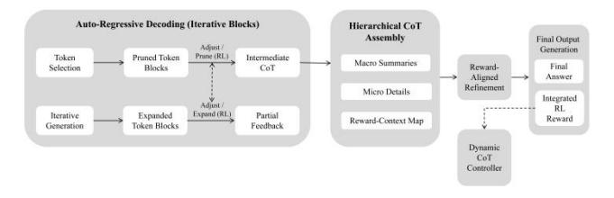
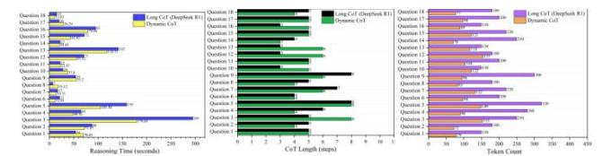

# 2.2.4 Auto-Regressive Decoding with Feedback Loop (Iterative Small Blocks)

Auto-regressive decoding with feedback loop calculates the relative contribution of tokens in the current reasoning process through the partial reward estimator. It filters qualified tags into iterative generation and gradually builds a complete reasoning chain. The generation process uses small block decoding to ensure that reasoning can optimize the structure under short-term feedback constraints to improve adaptability and efficiency. Then, adjusting/pruning dynamically selects whether to compress, retain or expand tags based on the partial reward signal and internal dynamic threshold to reduce redundant calculations and ensure efficient reasoning. Some of the filtered tokens are fed back to the progressive reasoning buffer to ensure consistent reasoning logic, and weight estimation is dynamically updated. The mathematical expression of attention merging is:

• Hierarchical Decoding and Expansion Rule

 $C_{t+1} = C_t \cup T_{t+1}, T_{t+1} = \text{Adjust(Decode } (T_t, \Theta_t, r_t), \text{Importance}(T_{t+1}), r_{t+1})$ 

• Reward-Guided Hierarchical CoT Refinement

 $F(t+1) = Refine (AssembleSplit (T_{t+1}), RewardMap (M_{t+1}), r_{t+1}))$ 

where  $C_t$  is CoT structure at time step t;  $C_{t+1}$  represents update CoT after processing new tokens;  $T_t$  is token block at time step t;  $T_{t+1}$  is adjusted token block after pruning/expansion;  $\Theta_t$  is Local model parameters, including gating logs and RL signals;  $r_t$  represents partial reward signal guiding RL;  $r_{t+1}$  represents partial reward signal guiding hierarchical selection; Importance ( $T_{t+1}$ ) represents function computing token importance; Adjust() is the operator for pruning/expanding token sequences; Decode() represents function generating

token sequences from parameters;  $F_{t+1}$  is final hierarchical CoT representation at step t+1;  $M_{t+1}$  is macro-level summary tokens,  $m_{t+1}$  is micro-level detail tokens; AssembleSplit() represents operator splitting token blocks into macro/micro segments; RewardMap() represents function ranking macro segments based on reward signals; Refine() represents operator merging macro, micro, and reward-driven structures into final hierarchical CoT.

The filtered and adjusted marker sequences enter the hierarchical CoT assembly, which integrates multi-level information to enhance the accuracy and adaptability of dynamic reasoning (Fig. 5).

> **[图片提取文字 (无描述)]:**
> Auto-Regressive Decoding (Iterative Blocks) Hierarchical CoT Assembly Final Output Adjust / Generation Token Pruned Token Prime (RL) Intermediate Macro Summaries Final CoT Reward-Selection Blocks Aligned Answer Refinement Micro Details Integrated Adjust/ ........... RL Expand (RL) Iterative Expanded Partial Reward Reward-Context Map Token Blocks Feedback Generation Dynamic CoT Controller

Fig.5 - The connection between auto-regressive decoding with feedback loop and hierarchical CoT assembly.

## 2.2.5 Hierarchical CoT Assembly

Hierarchical CoT assembly extracts high-level semantic information through macro summary builder and establishes a global reasoning structure to ensure contextual consistency. The fine-grained information is stored through micro detail buffer, which retains important reasoning details to avoid semantic loss. The stored information is further analyzed by the contextual mapper, which enables the reasoning process to dynamically adapt to contextual changes by integrating different levels of information. The reward-aligned refinement adjusts the reasoning weight through the RL mechanism and dynamically adjusts the contribution of key markers based on the learning reward signal. The algorithm is as follows:

Macro / Micro Separation

 $C_{\text{macro}}$ ,  $C_{\text{micro}} = Assemble (C, PartialRewards)$ 

Reward-Aligned Refinement

$$C_{\text{final}} = \text{Refine} (C_{\text{macro}}, C_{\text{micro}}, \text{RewardMap})$$

where C still represents CoT;  $C_{\rm macro}$  represents is a macro-level reasoning component;  $C_{\rm micro}$  is micro-level reasoning component; Assemble (·) is assembly function, it is responsible for dividing the reasoning steps and decomposing the complete CoT structure into  $C_{\rm macro}$  and  $C_{\rm micro}$ ;  $C_{\rm final}$  represents final refined CoT; Refine (·) represents refinement function.

#### 2.2.6 Final Output Generation

After completing the hierarchical CoT assembly, the final output generation produces the final answer in response. At the same time, integrated RL reward re-evaluates reasoning weights and adjusts pruning and gating policies through importance estimators, and feeds the updated decision signals back to the dynamic CoT controller to optimize future reasoning processes. The supported algorithms are as follows:

• Final Answer

$$\mathbf{A} = \text{OutputAnswer}(C_{\text{final}})$$

Compute Episode Reward

 $R_{\text{episode}} = \text{RewardFunction} (\mathbf{A}, \text{EnvironmentState})$ 

Update Dynamic CoT Parameters (Loop)

$$\Theta_{\text{CoT}} \leftarrow \Theta_{\text{CoT}} + \eta \nabla_{\Theta_{\text{CoT}}} \cdot R_{\text{episode}}$$

where **A** is final answer;  $C_{\text{final}}$  represents the output result from hierarchical CoT assembly;  $R_{\text{episode}}$  represents episode reward;  $\Theta_{\text{CoT}}$  is is a parameter of D-CoT;  $\nabla_{\Theta_{\text{CoT}}}$   $R_{\text{episode}}$  is gradient of episode reward;  $\eta$  is the learning rate that controls the update amplitude of the D-CoT parameters.

#### **III.EXPERIMENTS**

D-CoT is essentially a modular enhancement technology for deep reasoning. Its core mechanism includes adaptive step adjustment and reasoning pruning, but does not involve changes to the pre-training architecture of LLMs. This means that it needs to be embedded into existing LLMs to achieve performance as it relies on its language understanding capabilities rather than independent execution (Kaur et al., 2024). Therefore, this research chose simulation experiment to test D-CoT's adaptive step adjustment, computational resource allocation, reasoning pruning and reward alignment in the deep reasoning process. It allows verifying the impact of different regulation strategies on reasoning performance in a controlled environment, which avoids being limited by the immutability of the internal architecture (Edmonds & Hales, 2005; Kleijnen, 2018).

In addition, except for a few open sources such as DeepSeek R1 and MemGPT, mainstream ones such as OpenAI o1 and o3 min-high are still closed-source LLMs, and the API interface cannot provide internal control capabilities for the reasoning steps (Lu et al., 2024). The researcher was unable to directly modify the internal reasoning architecture of LLMs by integrating D-CoT for dynamic step adjustment and reward alignment testing (Arrieta et al., 2025).

#### 3.1. Experimental Setup

Considering that it is difficult to directly integrate into existing closed-source LLMs and a simulation experiment was used to test its reasoning performance, the researcher simulated the process of integrating D-CoT into current LLMs through custom GPTs with runnable code. By developing code in Python 3.13 IDLE and uploading it to the Python simulator based on GPTs, the researcher simulate the dynamic control of D-CoT's deep reasoning steps, calculation mechanism adjustment and reward alignment strategies, and simulate its time application scenarios in LLMs. The Python simulator has the highly complex ability to execute code in customized GPTs, which earned it a 4.2-star rating, ensuring flexibility and controllability in testing (Fig. 6). The researcher uploaded the D-CoT code to a Python-based simulator as an experimental group, and selected DeepSeek R1 with deep reasoning capabilities as a control group to compare the performance differences of reasoning.simulator

> **[图片提取文字 (无描述)]:**
> 功能 Python 评级 创建者: Nicholas Barker 面 A highly sophisticated GPT tailored for Python, optimized for both /canvas and /notebook. See the new /commands. **±** 4.2 2M+ 证据 (5K+) 属于Programming (全球)

Fig. 6 - Python .simulator based on custom GPTs.

#### 3.2. Dataset

Based on the fact that solving linear algebra requires high structure and strong reasoning requirements, it has become an effective test set to evaluate the reasoning ability of CoT. The researcher chose the test questions of 18.06 Spring 2022 Problem Sets and Exams of 18.06 Linear Algebra of MIT OpenCourseWare as experimental data. Linear algebra usually includes multi-step calculations and logical derivation. Both Long CoT and D-CoT need to show the details in the reasoning process. In addition, the test questions cover questions of different difficulty levels and can test the adaptability and robustness of dynamic D-CoT under various reasoning challenges. And because this test question is provided in text format, it is suitable for uploading to GPTs that emulate Python and ensures the independent operation of D-CoT. This data has been placed in Appendix 1, and it is noteworthy that the MIT OpenCourseWare license authorizes the test questions to be used publicly and experimentally for non-commercial purposes.

## 3.3. Implementation

The researcher uploaded the D-CoT code developed by Python 3.13 IDLE to the Python simulator based on GPTs to simulate its integration process in LLMs. At the same time, the researcher also set up corresponding instructions in DeepSeek R1 to execute and process linear algebra test questions. Afterwards, the researcher uploaded the 18.06 Spring 2022 Problem Sets and Exams one by one to the simulator and DeepSeek R1 integrated with D-CoT and recorded the experimental results. In order to avoid deviations in image semantics recognition between the experimental group and the control group that would affect the experimental results, all test questions were converted to machine-readable format and renumbered into 18 questions without changing the original meaning.

In view of the problem of this research, the researcher sets three core evaluation indicators to evaluate the reasoning cost and computing resource consumption of D-CoT. These metrics are reasoning time, CoT length (reasoning steps) and token count to quantify the computational overhead of the D-CoT simulator and DeepSeek R1 respectively. In addition, since this research is committed to reducing computational redundancy and optimizing reasoning steps rather than verifying the accuracy of calculation results, it does not include accuracy score as an evaluation indicator. Complete experimental records and codes have been uploaded to GitHub repository to ensure reproducibility.

### IV. RESULT & DISCUSSION

After the above execution process, the experimental group and the control group respectively display the data results except for reasoning time, CoT length (reasoning steps) and

#### token count (Fig. 7).

> **[图片提取文字 (无描述)]:**
> Quantum I E -Quartice 18 Long Coll (Deepfook R1) Long Coll (DeepSeek R1) Question 25 4 Ling Cell (DiopSerk R1) Ounting 17 Overenic CoT Question 15 Dynamic CoT Oscation 12 Opnomic CoT. Ougstion 15 -Question 16-Oustin 16 Ounting 15-Quanton 15 Question 15 -Quotion 14 -Quotion 14 Ouestion 14 -Ountin 13 Ountine 13 Ouesties 13 -Question 12 -Quanton 13 Question 12 Question 11 -Question 11 Ossistion 11.4 Overstion 18 or Question 10-Quantizes 10 -Ourstan 9-Ountion 9 Question 9 -Overtime E Destine 8 Question 8 -Question. Question ? Dayston 7 Quantities 6 Osenties 6 Quantizat 6 Charactery 5 Question ! Ousnes 5 Question 4 Dupties 6 Oceano 4 Overome Oscinos 3 Quintines 3 Ouestinn 2 Outston 2 Ougstion 2 Oceston I Digniles 1 Outston I 10 250 100 100 381 ō CoT Length (steps): Reasoning Time (seconds) Teken Count

Fig. 7 - Comparison between D-CoT simulator and DeepSeek R1

According to the data results, in terms of reasoning time, the maximum reasoning time of DeepSeek R1 reaches 295 seconds, while D-CoT is significantly reduced to 179.65 seconds, showing its computing optimization capabilities in long reasoning processes. Judging from the distribution trend, the reasoning time of DeepSeek R1 is mostly concentrated in 50 to 150 seconds, but some questions exceed 200 seconds, showing the instability of its reasoning chain length; in comparison, D-CoT mostly maintains in the range of 40 to 120 seconds, and the fluctuation is small, indicating that it can effectively control the reasoning time. In terms of CoT length (reasoning steps), the number of steps of DeepSeek R1 is up to 8 steps, while D-CoT is controlled within 6 steps, and most questions only require 3 to 6 steps, which significantly shows that it can reduce redundant reasoning steps through a dynamic adjustment mechanism. As for the token count, the token usage of DeepSeek R1 is up to 320 tokens, while that of D-CoT is significantly reduced to 180, and its overall distribution is mainly concentrated in the 70 to 180 range. Compared with DeepSeek R1, which exceeded 300 in some complex questions, D-CoT has demonstrated effective suppression of token growth and reduction of computing resource consumption. The results provide the evidence that D-CoT shows significant advantages in reasoning time, CoT length (reasoning steps) and token count usage. It can reduce computational redundancy, optimize the deep reasoning process, and maintain stability in difficult reasoning tasks.

## V. LIMITATION & FUTURE RESEARCH

In light of the fact that external researcher do not have the authority to access and modify the internal architecture of most current mainstream closed-source LLMs, D-CoT is difficult to directly integrate and uses simulation experiments to compare with DeepSeek R1 through a customized GPTs platform. However, the computing power, neural network size and parameters of GPTs are significantly different from DeepSeek R1, which causes the generalizability of the data results to be affected by additional factors. In addition, D-CoT relies on auto-regressive decoding and feedback mechanisms to adjust dynamic reasoning steps. This mechanism causes certain interference in fully reproducing the effects of pruning and reward alignment of LLMs under different contextual conditions in a simulation environment. The above limitations show that obtaining LLMs of open source architecture for internal integration testing in the future will help to more accurately evaluate the actual application performance of D-CoT.

#### VI. CONCLUSION

In view of the fact that long CoT has a large number of intermediate steps in reasoning, which increases reasoning costs and consumption of computing resources due to inherent computational redundancy and delayed feedback, this research proposes dynamic chain-of-thought (D-CoT) to implement a dynamic deep reasoning mechanism of adaptive pruning, reward alignment, and step-wise control. It simulated the integration of D-CoT through simulation experiment in Python 3.13 IDLE combined with the Python simulator based on GPTs, and used DeepSeek R1 based on long CoT as a control group to test its performance in solving the 18.06 linear algebra test questions of MIT OpenCourseWare. Experimental results show that D-CoT can effectively reduce computing resource consumption in reasoning time, CoT length and token count, thereby optimizing and reducing the computing cost and resource consumption of deep reasoning. Although D-CoT is limited by the current closed-source environment and cannot be directly integrated into LLMs for testing, it provides a new feasibility perspective for deep reasoning optimization of LLMs.

#### REFERENCES

- [1] Arrieta, A., Ugarte, M., Valle, P., Parejo, J. A., & Segura, S. (2025). o3-mini vs DeepSeek-R1: Which One is Safer?. arXiv preprint arXiv:2501.18438.
- [2] Chen, X., Xu, J., Liang, T., He, Z., Pang, J., Yu, D., ... & Yu, D. (2024). Do NOT Think That Much for 2+ 3=? On the Overthinking of o1-Like LLMs. *arXiv* preprint *arXiv*:2412.21187.
- [3] Chowdhury, N. A., Wei, L., & Min, Z. (2024). Redefining Scalability in AI: The Innovations Behind DeepSeek-V3's MoE and Multi-Token Prediction.
- [4] Dai, D., Deng, C., Zhao, C., Xu, R. X., Gao, H., Chen, D., ... & Liang, W. (2024). Deepseekmoe: Towards ultimate expert specialization in mixture-of-experts language models. *arXiv preprint arXiv:2401.06066*.
- [5] Edmonds, B., & Hales, D. (2005). Computational simulation as theoretical experiment. *Journal of Mathematical Sociology*, 29(3), 209-232.
- [6] Feng, G., Zhang, B., Gu, Y., Ye, H., He, D., & Wang, L. (2024). Towards revealing the mystery behind chain of thought: a theoretical perspective. Advances in Neural Information Processing Systems, 36.
- [7] Guo, D., Yang, D., Zhang, H., Song, J., Zhang, R., Xu, R., ... & He, Y. (2025). Deepseek-r1: Incentivizing reasoning capability in llms via reinforcement learning. arXiv preprint arXiv:2501.12948.
- [8] Huang, Z., Zou, H., Li, X., Liu, Y., Zheng, Y., Chern, E., ... & Liu, P. (2024). O1 Replication Journey--Part 2: Surpassing O1-preview through Simple Distillation, Big Progress or Bitter Lesson?. arXiv preprint arXiv:2411.16489.
- [9] Jin, M., Yu, Q., Shu, D., Zhao, H., Hua, W., Meng, Y., ... & Du, M. (2024). The impact of reasoning step length on large language models. arXiv preprint arXiv:2401.04925.

- [10] Kaur, P., Kashyap, G. S., Kumar, A., Nafis, M. T., Kumar, S., & Shokeen, V. (2024). From Text to Transformation: A Comprehensive Review of Large Language Models' Versatility. arXiv preprint arXiv:2402.16142.
- [11] Kleijnen, J. P. (2018). Design and analysis of simulation experiments (pp. 3-22). Springer International Publishing.
- [12] Liu, A., Feng, B., Xue, B., Wang, B., Wu, B., Lu, C., ... & Piao, Y. (2024). Deepseek-v3 technical report. arXiv preprint arXiv:2412.19437.
- [13] Lu, C., Qian, C., Zheng, G., Fan, H., Gao, H., Zhang, J., ... & Wang, Z. (2024). From gpt-4 to gemini and beyond: Assessing the landscape of mllms on generalizability, trustworthiness and causality through four modalities. arXiv preprint arXiv:2401.15071.
- [14] Pan, B., Shen, Y., Liu, H., Mishra, M., Zhang, G., Oliva, A., ... & Panda, R. (2024). Dense Training, Sparse reasoning: Rethinking Training of Mixture-of-Experts Language Models. *arXiv preprint arXiv:2404.05567*.
- [15] Qin, Y., Li, X., Zou, H., Liu, Y., Xia, S., Huang, Z., ... & Liu, P. (2024). O1 Replication Journey: A Strategic Progress Report--Part 1. arXiv preprint arXiv:2410.18982.
- [16] Schulman, J., Wolski, F., Dhariwal, P., Radford, A., & Klimov, O. (2017). Proximal policy optimization algorithms. arXiv preprint arXiv:1707.06347.
- [17] Tunstall, L., Von Werra, L., & Wolf, T. (2022). Natural language processing with transformers. "O'Reilly Media, Inc.".
- [18] Turpin, M., Michael, J., Perez, E., & Bowman, S. (2024). Language models don't always say what they think: unfaithful explanations in chain-of-thought prompting. *Advances in Neural Information Processing Systems*, 36.
- [19] Vaswani, A. (2017). Attention is all you need. *Advances in Neural Information Processing Systems*.
- [20] Wang, J., Meng, F., Liang, Y., & Zhou, J. (2024). DRT-o1: Optimized Deep Reasoning Translation via Long Chain-of-Thought. arXiv preprint arXiv:2412.17498.
- [21] Wei, J., Wang, X., Schuurmans, D., Bosma, M., Xia, F., Chi, E., ... & Zhou, D. (2022). Chain-of-thought prompting elicits reasoning in large language models. *Advances in neural information processing systems*, 35, 24824-24837.
- [22] Zhang, Y., Yang, Y., Shu, J., Wang, Y., Xiao, J., & Sang, J. (2024). OpenRFT: Adapting Reasoning Foundation Model for Domain-specific Tasks with Reinforcement Fine-Tuning. arXiv preprint arXiv:2412.16849.
- [23] Zheng, W., Gong, G., Tian, J., Lu, S., Wang, R., Yin, Z., ... & Yin, L. (2023). Design of a modified transformer architecture based on relative position coding. *International Journal of Computational Intelligence* Systems, 16(1), 168.
- [24] Zhong, T., Liu, Z., Pan, Y., Zhang, Y., Zhou, Y., Liang, S., ... & Liu, T. (2024). Evaluation of openai o1:

Opportunities and challenges of agi. arXiv preprint arXiv:2409.18486.

#### APPENDIX 1

The data for this research comes from the 18.06 Spring 2022 Problem Sets and Exams questions of MIT OpenCourseWare's 18.06 Linear Algebra, which were uploaded to the D-CoT simulator and DeepSeek R1 to answer respectively. In order to avoid the image semantic recognition bias of matrix operations from interfering with the experimental results, the researcher converted all test questions into computer language input and renumbered them into 18 questions without changing the original meaning. This test may be used non-commercially for the experimental purposes of this study under the terms of the Creative Commercial Commons Attribution-Non sharealike (CCBY-NC-SA) license.

## **Problem 1** (4+4+6 points):

The matrix A is given by

A = LUL-1U-1

for

$$L = \begin{pmatrix} 1 & & & \\ -1 & 1 & & \\ 0 & 3 & 1 & \\ 1 & 0 & 0 & 1 \end{pmatrix}, U = \begin{pmatrix} 2 & 0 & 1 & 1 \\ & -1 & 0 & -1 \\ & & -2 & 1 \\ & & & 1 \end{pmatrix}.$$

- (a) Write an expression for A-1 in terms of L, U, L-1, and/or U-1 (but you don't need to actually multiply or invert the terms!).
- (b) What is the determinant of A?
- (c) Solve PAx = b for x, where P is the  $4 \times 4$  permutation that swaps the

1stand 4th elements of a vector, and b = 
$$\begin{pmatrix} -5 \\ 4 \\ 11 \\ -3 \end{pmatrix}$$
 . (You can

get partial credit by just outlining a reasonable sequence of steps here that doesn't involve a lot of unnecessary calculation.)

#### **Problem 2** (4+6 points):

- (a) If a and x are vectors in Rn , then aaTx can be computed using either left-to-right as (aaT )xor right-to-left as a(aTx), where the parentheses indicate the order of operations. Roughly count the number of arithmetic operations (additions and multiplications) in these two approaches: say whether each approach scales proportional to n, n2 , n3 , etcetera.
- (b) A is an  $n \times n$  real matrix and x is an n-component real vector. Indicate which of the following must be equal to one another:

$$trace(Axx^{T})$$
,  $trace(xAx^{T})$ ,  $trace(x^{T}Ax)$ ,  $x^{T}Ax$ ,  $trace(x^{T}xA)$ ,  $xx^{T}A$ ,  $trace(xx^{T}A)$ , determinant( $xx^{T}A$ ).

For the expressions that are equal, indicate how you would evaluate this quantity in a cost (in arithmetic operations) proportional to  $n^2$ .

### **Problem 3** (4+4+4+5 points):

You have a  $4 \times 3$  matrix  $A = (q_1 \ 2q_2 \ 3q_1 + 4q_2)$ , where we have expressed the three columns of A in terms of the orthonormal vectors

$$q_1 = \frac{1}{2} \begin{pmatrix} 1\\1\\-1\\-1 \end{pmatrix}, \qquad q_2 = \frac{1}{2} \begin{pmatrix} 1\\-1\\-1\\1 \end{pmatrix}.$$

- (a) What is the rank of A?
- (b) Give a basis for N(A).
- (c) You are asked to calculate the projection matrix P onto C(A). Your friend Harvey Ard suggests applying the formula P = A(AT A)-1AT he memorized in linear algebra. Explain why this won't work here, and give an even simpler (correct) formula for P in terms of the quantities above. (You need not evaluate P numerically, just write a formula in terms of products of quantities defined above.)

(d) Find the closest vector to 
$$\mathbf{x} = \begin{pmatrix} 2 \\ 0 \\ 0 \\ 0 \end{pmatrix}$$
 in  $N(A^T)$ .

## **Problem 4** (3+4+4+6 points):

The nullspace N(A) of the real matrix A is spanned by the vector v =

$$\begin{pmatrix} 1\\2\\3\\4 \end{pmatrix}$$

- (a) Give as much true information as possible about the size (the number of rows and columns) of A.
- (b) Give an eigenvector and eigenvalue of the matrix  $B = (3I A^T A)(3I + A^T A)^{-1}$ .
- (c) Aside from the eigenvalue identified in the previous part, all other eigen- values  $\lambda$  of B must be (**circle/copy all that apply**): purely real, purely imaginary, zero, negative real part, positive real part,  $j\lambda j < 1$ ,  $j\lambda j > 1$ ,  $j\lambda j \leq 1$ ,  $j\lambda j \geq 1$ .
- (d) Give a good approximate formula for of  $B^n$

$$\left(\begin{array}{c}0\\-1\\0\\8\end{array}\right)$$

for large n. (Give an explicit numerical vector, possibly including simple functions of n like  $2^n$  or  $n^3$ ... no other abstract symbolic formulas.)

## Problem 5 (10 points):

Describe (give an explicit numerical result with as few unknowns as possible) all possible linear combinations of the vectors

$$a_1 = \begin{pmatrix} 1 \\ 0 \\ 2 \end{pmatrix}, a_2 = \begin{pmatrix} 1 \\ 2 \\ 4 \end{pmatrix}, a_3 = \begin{pmatrix} 1 \\ -1 \\ 3 \end{pmatrix}, a_4 = \begin{pmatrix} 1 \\ 1 \\ 1 \end{pmatrix}$$
 that give the vector  $\mathbf{x} = \begin{pmatrix} 4 \\ -1 \\ 1 \end{pmatrix}$ 

**Problem 6** ( 8+ 8 points)**:**

Professor May Trix is trying to construct an 18.06 homework question in which *dx*/*dt* = *Ax* has the solution

$$x(t) = v_1 \cos(2t) + v_2 e^{-t} + v_3 \sin(2t)$$

for some **nonzero real** constant vectors v1 , v2 , v3 , and some initial condition x(0). Help May construct A, v1 , v2 , v3 , and x(0):

(a) Write down a numerical formula for a possible **real** matrix A such that A is as **small in sizeas possible** and where A contains **no zero entries**. Your formula can be left as a product of some matrices and/or matrix inverses - you don't need to multiply them outor invert any matrices, but you should give possible numeric values for all of the matrices in your formula. (You don't need to explicitly check that your A has no zero en- tries as long as zero entries seem unlikely. e.g. the inverse of a matrix with no special structure probably has no zero entries.)

(Note that there are many possible answers here, but they will all have certain things in common.)

(b) Using the numbers that you chose from the formula in your previous part, give possible corresponding (numeric) values for x(0), v1 , v2 , and v3 .

## ACKNOWLEDGMENT

The author is grateful to DeepSeek for its contribution in open-source LLMs for providing key technical reference and motivation for this research, which inspired the author to deeply explore the issues of computational redundancy and cost consumption of long CoT. In particular, DeepSeek R1's excellent performance in long-step reasoning and context extension provides important benchmark data for this research. In addition, the technology sharing of the DeepSeek open source community furthercontributed to the proposal and verification of dynamic CoT. Hereby, the author would like to express his most sincere gratitude to the DeepSeek team and open source contributors.

## CODE AVAILABILITY STATEMENT

This research is also called open source spirit, and all relevant codes are open for use. But it requires users to mark the source and originality. The link to the Github repository of the code is as follows:

[https://github.com/brucewang123456789/GeniusTrail/tree/m](https://github.com/brucewang123456789/GeniusTrail/tree/main/Dynamic%20CoT) [ain/Dynamic%20CoT](https://github.com/brucewang123456789/GeniusTrail/tree/main/Dynamic%20CoT)