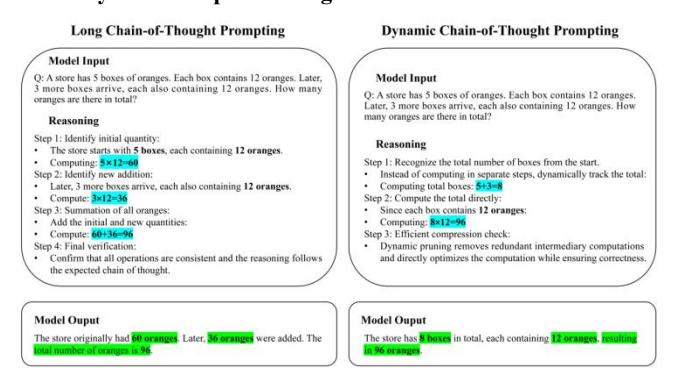
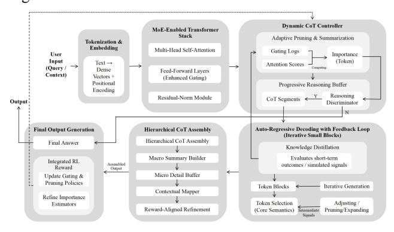
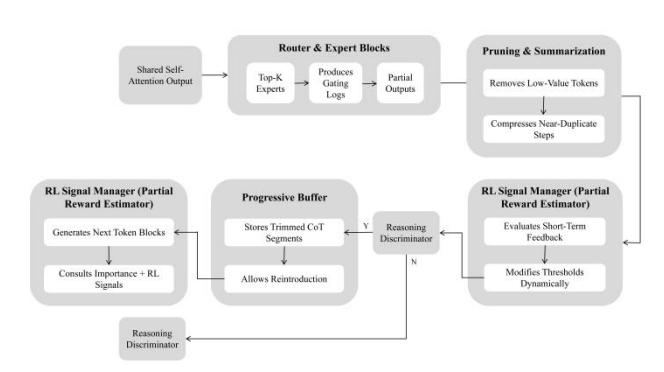
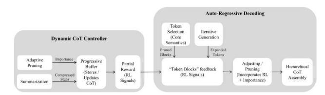

## **Dynamic Chain-of-Thought: Towards Adaptive Deep Reasoning**

Libo Wang Nicolaus Copernicus University Jurija Gagarina 11, 87-100 Toruń, Poland

326360@o365.stud.umk.pl UCSI University

Taman Connaught, 56000 Kuala Lumpur, Wilayah Persekutuan Kuala Lumpur, Malaysia 1002265630@ucsi.university.edu.my

Abstract— To reduce the cost and consumption of computing resources caused by computational redundancy and delayed reward assignment in long CoT, this research proposes the dynamic chain-of-thought (D-CoT) with adaptive reasoning time and steps. The researcher used simulation experiment to simulate the integration of D-CoT through Python 3.13 IDLE combined with a Python simulator based on GPTs. At the same time, the researcher used DeepSeek R1 as a control group to test and compare the performance of the D-CoT simulator in processing MIT OpenCourseWare's linear algebra exam questions. Experimental results show that D-CoT is better than DeepSeek R1 based on long CoT in three indicators: reasoning time, CoT length (reasoning steps) and token count, which achieves a significant reduction in computing resource consumption. In addition, this research has potential value in deep reasoning optimization that is used as a reference for future dynamic deep reasoning frameworks.

> **[图片提取文字 (无描述)]:**
> Long Chain-of-Thought Prompting Dynamic Chain-of-Thought Prompting Model Input Q: A store has 5 boxes of oranges. Each box contains 12 oranges. Later, Model Input 3 more boxes arrive, each also containing 12 oranges. How many Q: A store has 5 boxes of oranges. Each box contains 12 oranges. oranges are there in total? Later, 3 more boxes arrive, each also containing 12 oranges. How many oranges are there in total? Reasoning Step 1: Identify initial quantity: Reasoning The store starts with 5 boxes, each containing 12 oranges. Computing: 5×12-60 Step 1: Recognize the total number of boxes from the start. Step 2: Identify new addition: Instead of computing in separate steps, dynamically track the total: Later, 3 more boxes arrive, each also containing 12 oranges. Computing total boxes: 5+3=8 Compute: 3×12=36 Step 2: Compute the total directly: Step 3: Summation of all oranges: Since each box contains 12 oranges: Computing: 8×12=96 Add the initial and new quantities: Compute: 60+36=96 Step 3: Efficient compression check: Step 4: Final verification: Dynamic pruning removes redundant intermediary computations Confirm that all operations are consistent and the reasoning follows and directly optimizes the computation while ensuring correctness. the expected chain of thought. Model Ouput Model Ouput The store originally had 60 oranges. Later, 36 oranges were added. The The store has 8 boxes in total, each containing 12 oranges, resulting otal number of oranges is 96. in 96 oranges

Figure 1 - Comparison of the reasoning process of long CoT and dynamic CoT via prompting.

### I.INTRODUCTION

As an emergent capability of large language models (LLMs) with huge parameter sizes in the reasoning process, chain-of-thought (CoT) allocates additional computing resources in a way that facilitates the gradual decomposition of tasks, which is particularly prominent in context learning (Wei et al. al., 2022). It follows that chain-of-thought provides techniques for gradually unfolding intermediate reasoning steps to enhance LLMs' ability to handle complex problems by disassembling them into coherent sub-steps (Feng et al., 2024). However, affected by context, prompt word design, and model learning bias, CoT has unfaithful interpretations, which leads to deviations between the reasoning process and the actual decision-making mechanism (Turpin et al., 2024). In addition, while CoT enhances the reasoning capabilities of LLMs, it also brings concerns about rising costs by prolonging the reasoning steps and improving quality (Jin et al., 2024). In

response to the above-mentioned shortcomings of traditional CoT, more and more cutting-edge LLMs apply long CoT technology to demonstrate excellent reasoning capabilities when processing complex tasks (Chen et al., 2024; Wang et al., 2024).

Long chain-of-thought (long CoT) aims to promote the model to have self-reflection and adaptive refinement in multi-step complex scene reasoning through hierarchical reasoning and stepwise verification to ensure accuracy and consistency (Wang et al., 2024). For few-shot CoT, the accuracy of LLMs output is linearly related to the number of reasoning steps, which means that the longer the number of steps, the more accurate the response, while reducing the CoT length will significantly reduce the response accuracy (Jin et al., 2024). Jin et al. found that even if errors occur in the intermediate steps of long CoT during the reasoning process, maintaining the necessary reasoning length will produce a high-accuracy response.

In the application of OpenAI's o1 model, long CoT is combined with reinforcement fine-tuning (RFT) to further optimize LLMs' understanding and memory capabilities of multi-level reasoning processes (Huang et al., 2024; Zhang et al., 2024). In view of the shortcomings of LLMs in intermediate reasoning and adaptive learning capabilities, DeepSeek-R1 introduces large-scale pure reinforcement learning training to reduce reliance on supervised fine-tuning (SFT) (Guo et al., 2025). During training, in order to avoid instability in the initial cold start phase due to no longer relying on large amounts of labeled data, it constructs long CoT data and uses specific collection and processing methods to guide deeper reflection. and verification (Chen et al., 2024; Liu et al., 2024).

However, long CoT requires a large number of intermediate steps in the reasoning practice process, its inherent computational redundancy and delayed feedback problems significantly increase the reasoning cost and consumption of computing resources, which is directly reflected in the exponential growth of reasoning time and steps. In order to improve accuracy, a large number of lengthy reasoning steps do not directly contribute to the final answer but only serve as an auxiliary process, resulting in the accumulation of computational overhead (Dai et al., 2024). These phenomena are often reflected in users' actual applications, especially LLMs with deep reasoning capabilities such as o3 min-high or DeepSeek R1. For example, when users use DeepSeek R1 to perform difficult and complex tasks, the number of reasoning steps increases significantly and the system response delay

increases significantly. Unstable reasoning fluctuations cause low efficiency, and even the response "The server is busy. Please try again later" appears frequently due to server resource saturation.

The deep gap lies in the fact that long CoT essentially runs on a static reasoning framework, making it difficult to flexibly adjust the number of reasoning steps according to the difficulty of different problems. The lack of dynamic adaptation mechanism usually treats the reasoning process as a linear expansion, which is reflected in the inability to adjust the length of the thinking chain according to the complexity of different tasks and environmental feedback. For example, when DeepSeek R1 faces deep reasoning on difficult tasks, even if some reasoning steps have minimal impact on the final decision, it still cannot actively compress or ignore redundant steps. This design flaw makes it difficult for the system to adaptively allocate computing resources, accumulation of inefficient reasoning causes nonlinear growth in reasoning time. In addition, the insufficient coupling between long CoT generation and RL reward mechanism is one of gaps about huge computational overhead. This technology is designed to enhance transparency and explainability, but is not tightly integrated with RL goals, which results in the lack of an effective credit allocation mechanism between reward signals during reasoning. Even though traditional RL relies on immediate or deferred rewards to adjust strategies, the value of a step in a long CoT is usually only determined when rewards are finally obtained.

#### II.PROPOSED MODULE & ALGORITHMS

In view of gaps, this research proposes dynamic chain-of-thought (D-CoT) to implement a state compression mechanism with adaptive reasoning steps to reduce computational redundancy. Fig. 1 shows the comparison of the reasoning process between long CoT and dynamic CoT under the same prompt.

## 2.1. Dynamic Chain-of-Thought Framework

Dynamic chain-of-thought (D-CoT) is an LLMs reasoning framework with adaptive reasoning capabilities that reduces the consumption of cost computing resources by real-time adjustment of chain length (reasoning steps) and reasoning time. Compared with the fixed and linear expansion of reasoning steps of traditional long CoT, D-CoT dynamically adjust the length of CoT in real time, select key steps after rating different tasks. Its specific internal structure is shown in Fig. 2.

> **[图片提取文字 (无描述)]:**
> Dynamic CoT Controller MoE-Enabled Transformer Stack Adaptive Pruning & Summarization Tokenization & Embedding Multi-Head Self-Attention Gating Logs User Importance (Token) Input Text → Attention Scores (Query Dense Feed-Forward Layers Context) Vectors + (Enhanced Gating) Positional Progressive Reasoning Buffer Encoding Reasoning Residual-Norm Module CoT Segments Output Discriminator Auto-Regressive Decoding with Feedback Loop **Final Output Generation** Hierarchical CoT Assembly (Iterative Small Blocks) Hierarchical CoT Assembly Final Answer Knowledge Distillation Macro Summary Builder Evaluates short-term Integrated RL Assembled outcomes / simulated signals Reward Output Micro Detail Buffer Update Gating & Pruning Policies Iterative Generation Token Blocks Contextual Mapper Refine Importance Token Selection Adjusting / Estimators Reward-Aligned Refinement Pruning/Expanding (Core Semantics) Intermediate. Sinnels

Fig. 2 - Dynamic Chain-of-Thought Framework

The D-CoT leverages the core principles of the hierarchical adaptive reinforcement learning to adjust the steps and information weights in the deep reasoning process to minimize computational redundancy and optimize the decision path. It introduces an importance-driven pruning strategy in the process of auto-regressive decoding, combines the partial reward estimator to instantly evaluate the effectiveness of the reasoning block, and decides whether to expand or delete the reasoning steps through adaptive thresholding. In addition, D-CoT constructs a multi-level reasoning structure through macro summary and micro detail buffer to ensure the optimal transmission of information flow at different reasoning scales. In contrast, it not only reduces the cumulative computational burden of long CoTs, but also improves the adaptability of reasoning, forming an efficient reasoning framework with feedback adjustment capabilities. The following is a detailed display of the HARO algorithm:

#### 2.1.1. Hierarchical Adaptive Reward Optimization

The operating mechanism of the HARO (Hierarchical Adaptive Reward Optimization) algorithm is based on hierarchical reward allocation and adaptive reasoning adjustment. The algorithm uses the partial reward estimator to instantly evaluate the contribution of decisions at different levels of the deep reasoning process, and uses adaptive thresholding to dynamically correct the weight of the reasoning step (CoT length) to ensure the priority delivery of high-value information. In addition, this algorithm combines an importance-driven pruning strategy to instantly filter inefficient reasoning paths to reduce redundant computing overhead and improve overall reasoning efficiency.

## Token Importance Evaluation

Each reasoning step  $c_i$  is assigned an importance score:

$$I(c_i) = \alpha * A(c_i) + (1 - \alpha) * GatingScore(c_i)$$

where  $A(c_i)$  is the dominance estimate derived from RL and GatingScore reflects the token-level contribution.

## Dynamic Adaptive Pruning Thresholding

It introduces a self-adjusting threshold  $\tau_t$  based on historical success rates:

$$\tau_t = \gamma \cdot \tau_{t-1} + (1 - \gamma) \cdot \frac{1}{N} \sum_{j=1}^{N} \mathbb{1}[I(c_j)] > \tau_{t-1}]$$

where  $\tau_t$  represents the updated threshold at time step t;  $\gamma$  is an attenuation factor used to control the retention of historical information;  $1[I(c_j) > \tau_{t-1}]$  tracks whether past tokens have exceeded a previous threshold.

• Progressive Reasoning Buffer (Adaptive Selection)

Dynamic adjustments in CoT segments are stored in buffers:

$$C_t = C_{t-1} + \operatorname{argmax}_{ci} (I(c_i) - \tau_t)$$

where steps below  $\tau_t$  are discarded unless they contribute significantly to global coherence;  $C_t$  represents the CoT state at time t.

• Reward Optimization and Auto-Regressive Feedback

HARO uses reward gradients to iteratively optimize token selection by core semantics:

$$\nabla_{\theta} J = \mathbf{E} \left[ R_{\text{sem}}(C) + \lambda R_{\text{struct}}(C) \right) \nabla_{\theta} \log \pi_{\theta}(C) \right]$$

where E represents expectation value; R represents reward function;  $\theta$  represents model parameters;  $R_{\text{sem}}(C)$  represents a semantic reward function;  $R_{\text{struct}}(C)$  represents a structural function;  $\lambda$  is a weighting hyperparameter balancing semantic fidelity and structural efficiency;  $\pi_{\theta}(C)$  represents the policy for selecting tokens;  $\nabla_{\theta} \log \pi_{\theta}(C)$  is the optimization through policy gradients.

Notably, reward alignment and policy adjustment are inspired by PPO (Proximal Policy Optimization). PPO is committed to truncating the clipped objective function restriction policy and updating the amplitude policy update range to ensure training stability (Schulman et al., 2017). HARO further introduces adaptive thresholding, allowing reward signals to dynamically adapt according to the reasoning steps to improve the selectivity of the optimal decision trajectory. In addition, HARO draws on advantage estimation, dynamically filters high-value reasoning through hierarchical feedback mechanism, reduces low-reward expansion, and thereby reasons redundancy.

## 2.2. Detailed Framework Composition

The D-CoT framework consists of six key parts. First, it converts user input into dense vectors through tokenization and embedding. Then, the MoE-enabled transformer stack is applied to the multi-head self-attention mechanism to enhance semantic expression (Dai et al., 2024). Dynamic CoT Controller performs reasoning step screening through adaptive pruning and attention scores. Subsequently, auto-regressive decoding uses partial reward estimation for mark selection and incremental generation. Finally, the hierarchical CoT assembly integrates the deep reasoning process and uses reward-aligned refinement to optimize the final output.

#### 2.2.1 Tokenization & Embedding

As the first part of D-CoT, it is responsible for converting natural language input into a dense vector representation that can be processed by the model (Tunstall et al., 2022). This process first decomposes the text into subword units through tokenization, maps it to a high-dimensional space through an embedding layer to capture semantic information and contextual dependencies, and combines it with positional encoding to provide sequence order information (Vaswani, 2017). The following are the supported algorithms in the workflow:

Tokenization Process

$$T = Tokenizer(Q)$$

Embedding with Positional Encoding

$$\mathbf{X} = E(\mathbf{T}) + P.$$

Seamless Transition to MoE Stack

where converting user query  $\mathbf{Q}$  into a token sequence  $\mathbf{T}$ , this algorithm converts  $\mathbf{Q}$  into discrete labeled units; Mapping tokens into dense embeddings while integrating positional

encoding; X represents the final embedding representation that contains the vectorized representation and position encoding; E(T) represents the embedding function that converts mark tokens into corresponding embedding representations; P represents position encoding.

## 2.2.2 MoE-Enabled Transformer Stack

The MoE-enabled transformer stack uses a mixture of experts (MoE) mechanism to enhance selective computing capabilities through multi-head self-attention to ensure efficient acquisition of key information (Liu et al., 2024). The feed-forward layers combined with enhanced gating perform feature transformation based on dynamically selected experts to maximize reasoning efficiency (Guo et al., 2025). The residual-norm module provides gradient stability and reduces signal attenuation to ensure smooth flow of information in deep structures. The researcher demonstrated its workflow algorithm as follow.

• Expert Selection

$$\alpha_{t,e} = \text{Router } (u_t, e), E_{\text{active}} = \text{TopK} \{\alpha_{t,e} \mid e = 1, ..., N\}$$

Expert Outputs

$$\mathbf{h}_{t}^{'} = \sum_{e \in E_{t, \text{netwoe}}} \alpha_{t, e} \cdot f_{e}(\mathbf{u}_{t}), \mathbf{u}_{t} \in \Re$$

• Importance Score

$$I_t = \gamma \left( \sum_{e \in \mathcal{E}_{t,\text{active}}} \alpha_{t,e} \right) + (1 - \gamma) \beta_t$$

After expert assignment of input vectors through MoE, the refined semantic information is passed to the dynamic CoT controller for adaptive pruning and dynamic summarization to reduce reasoning redundancy (Fig. 3).

> **[图片提取文字 (无描述)]:**
> Router & Expert Blocks **Pruning & Summarization** Shared Self-Produces Top-K. Partial Attention Output Gating Removes Low-Value Tokens Experts Outputs Logs Compresses Near-Duplicate Steps RL Signal Manager (Partial RL Signal Manager (Partial Progressive Buffer Reward Estimator) Reward Estimator) Stores Trimmed CoT **Evaluates Short-Term** Reasoning Generates Next Token Blocks Feedback Segments Discriminator N Modifies Thresholds Consults Importance + RL Allows Reintroduction Dynamically Signals Reasoning Discriminator

Fig.3 - The connection between MoE-enabled transformer stack and dynamic CoT controller.

• Adaptive Thresholding for Pruning and Summarization

$$\tau_{\rm dyn}(r_t) = \tau_0 + \eta(r_t - \bar{r})$$

Hierarchical Decoding & Assembly

$$y_{t+1} =$$
Assemble ( $B_T$ , {macro, micro})

where  $\tau_{\text{dyn}}(r_t)$  is dynamic threshold;  $r_t$  is partial reward;  $\tau_0$  is a base threshold, r is a running average reward, and  $\eta$  is a scaling factor;  $y_{t+1}$  represents the next generated token after decoding;  $B_T$  represents the final buffer of CoT segments after iterative refinement; The macro-level summaries

compress global information; micro-level expansions retain fine-grained details.

## 2.2.3 Dynamic CoT Controller

As the core of D-CoT's deep reasoning, the dynamic CoT controller is responsible for optimizing the length and content of CoT to reduce redundant calculations and the accumulation of unnecessary steps. The key technology is to dynamically adjust the reasoning steps to adapt the reasoning process to different types of task requirements, thereby improving the adaptability of LLMs in complex decision-making scenarios. Its operating mechanism calculates the importance score of the token based on gating logs and attention scores, which determines whether the inference step should be retained or compressed. Afterwards, the reasoning fragments are stored in the progressive reasoning buffer to ensure that key information is efficiently used in subsequent steps. Reasoning discriminator determines whether to start CoT reasoning through knowledge certainty evaluation (Y/N). The system calculates the confidence  $P_{\text{fact}}(x)$ via FAISS/BM25,  $C_{comp}(x)$  is not greater than 3 that is based on syntactic structure and computational cost evaluation. If both are below the threshold, they are directly output, otherwise they enter CoT segments for reasoning. The relevant supported algorithms are as follows:

Adaptive Pruning & Summarization

 $I_t$ = Importance (t) (combining gating + attention)

if  $I_t < \tau_{\text{dyn}}(r_t)$ , prune token t, else, optionally summarize

• Progressive Buffer Update

$$B_{t+1} = B_t \cup \{\text{Summarized } t \mid I_t \geq \tau_{\text{dyn}}(r_t)\}$$

Partial Reward

$$r_t = \text{RLFeedback}(t), \tau_{\text{dyn}}(r_t) = \tau_0 + \eta \cdot (r_t - r)$$

Adaptive Token Expansion and Pruning

 $z_{t+1}$  = Adjust (Generate (SelectTokens  $(B_t, \theta_t, r_t), B_t, \theta_t), r_{t+1}$ )

• Reasoning Discriminator

$$y_{\text{out}} = \begin{cases} \text{OutputAnswer}(x), & \text{if } P_{\text{fact}}(x) \ge 0.85 \text{ and } C_{\text{comp}}(x) \le 3\\ \text{CoT Segments}(x), & \text{otherwise} \end{cases}$$

Reward-Guided CoT Assembly

 $B_t = \text{AssembleCoT}(B_t, \{z_t\}_{t=-T}, r_{t+1} = \text{RewardUpdate } (r_t, \text{DecodeOut } (z_{t+1})))$ 

where  $I_t$  is importance score of token t (gating + attention);  $\tau_{\rm dyn}$  represents dynamic threshold based on reward  $r_t$ ;  $\tau_0$  is base pruning threshold;  $\eta$  is scaling factor for threshold adjustment;  $r_t$  is RL feedback at step t / partial reward signal;  $r_{t+1}$  represents the updated reward at step t+1;  $r^{-}$  represents running average reward;  $B_t$  represents token buffer at step t / the final structured CoT assembly after multiple iteration steps;  $B_{t+1}$  represents updated token buffer; t represents the current reasoning step in the iterative decoding process; Summarized t is compressed token representation; RLFeedback(t) represents RL-based reward function for token t; t represents tokens at time step t / the generated reasoning tokens at step t; t represents hidden parameters of the decoder at t; SelectTokens() represents token selection of

of core semantics; Generate(·) is based on generation of new tokens; Adjust(·) expands or prunes tokens (adaptive pruning or expansion decision) based on rewards and gating logs; T is The total number of CoT reasoning steps; RewardUpdate() updates the reward based on the previous reward and newly decoded token sequence; DecodeOut( $z_{t+1}$ ) is from the iterative reasoning process at step t+1; AssembleCoT() structures the final CoT by integrating generated reasoning tokens and their associated reward values.

The processed CoT fragment is passed to auto-regressive decoding with feedback loop (Fig.4). It evaluates the effectiveness of each fragment based on the partial reward estimator and optimizes the reasoning strategy through dynamic adjustment, which reduces computational overhead while maintaining high accuracy output.

> **[图片提取文字 (无描述)]:**
> Auto-Regressive Decoding Token Selection Iterative (Core Generation **Dynamic CoT Controller** Semantics) Expanded Prumed Tokens Blocks J Adaptive Importance; Progressive Adjusting / Partial Pruning Hierarchical Buffer "Token Blocks" feedback Reward Pruning (Stores / CoT (RL Signals) (Incorporates RL Compressed (RL Updates Assembly Stens Summarization + Importance) Signals) CoT)

Fig.4 - The connection between dynamic CoT controller and auto-regressive decoding with feedback loop.

