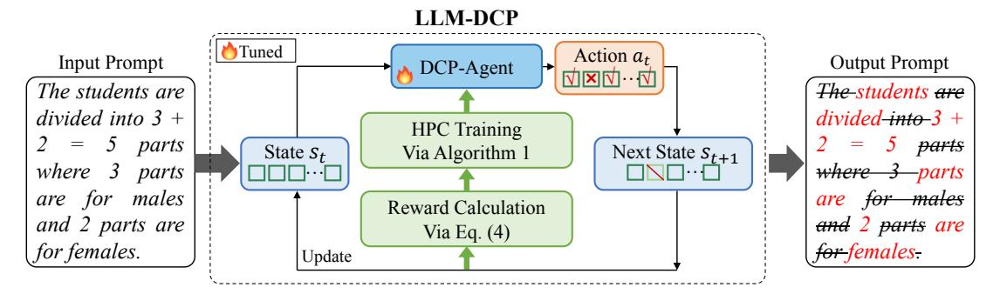

# B. Motivation

Many existing prompt compression methods are task-aware, which limits their generalizability across different downstream tasks. Moreover, most task-agnostic methods estimate token importance using information entropy from causal language models, neglecting the sequential nature of prompt compression, where each token significance depends on the evolving context. To address these issues, we hypothesize that prompt compression can be viewed as a dynamic, iterative decision-making process. Each compression step should reduce redundant information while leveraging the outcomes of previous steps to achieve efficient compression progressively. A natural idea emerges: Could we iteratively eliminate redundancy from the prompt while preserving its critical content through a series of decisions?

The answer is yes. Inspired by trial-and-error learning, we model prompt compression as a Markov Decision Process (MDP), where the DCP-Agent iteratively compresses

> **[图片提取文字 (无描述)]:**
> LLM-DCP Tuned Action at Input Prompt Output Prompt DCP-Agent The students are The students are divided into 3 + divided-into-3 + **HPC** Training parts parts Next State  $S_{t+1}$ State  $S_t$ Via Algorithm 1 where 3 where parts males -males Reward Calculation and 2 parts are and 2 parts are Via Eq. (4) for females. for females. Update

Fig. 2. General diagram of proposed LLM-DCP. We model prompt compression as a Markov Decision Process (MDP) and train a DCP-Agent to determine an optimal compression pathway. The input prompt represented as a token sequence serves as the initial state of the MDP. At time step t, the DCP-Agent performs the action to select specific tokens to retain or discard, yielding a compressed token sequence as the next state  $s_{t+1}$ . Then the reward is calculated according to Eq. (4). Our designed hierarchical prompt compression (HPC) training strategy collects the trajectory, which is applied to train the DCP-Agent. This process iterates until reaching the max trajectory length. The final token sequence is decoded into compressed text, with a much lower token number without affecting the output performance as much as possible.

the prompt by removing redundant tokens while preserving essential content, with each decision building on the outcomes of previous steps for efficient, context-aware compression. We design a reward function that balances compression rate, output distribution, and key information retention, ensuring that the model understanding and output quality remain intact. Additionally, considering the challenges of retaining essential information while achieving high compression rates in the prompt compression task, we incorporate curriculum learning [24, 25, 51], progressively introducing more complex compression tasks to enhance the agent's ability to compress prompts efficiently while preserving essential content.

## IV. PROPOSED METHODS

In this paper, we propose a dynamic compressing prompts method, called LLM-DCP, which seeks to remove redundant content in a given input prompt, thereby reducing computational cost and better using the limited context window in LLMs. As shown in Fig. 2. We model the prompt compression process as a Markov Decision Process (MDP) and train a DCP-Agent to determine an optimal compression pathway. Given an input prompt, we convert it to a token sequence, which serves as the initial state in the MDP framework. At time step t, the DCP-Agent selects specific tokens to be removed, yielding a compressed token sequence that constitutes the subsequent state  $s_{t+1}$ . Then the reward is calculated according to Eq. (4). The trajectory is collected to train the DCP-Agent via our designed hierarchical prompt compression (HPC) training strategy. Additionally, the next state is input to the DCP-Agent for further iterations. This iterative process continues until the maximum trajectory length is reached. The final token sequence is decoded into compressed text, with a much lower token number without affecting the output performance.

## A. Dynamic Compressing Prompts as an MDP

We seek a general DCP-Agent to remove redundant tokens for a dynamic input prompt, thereby improving the inference efficiency while maintaining the quality of the generated text as much as possible. To this end, we formulate the step-bystep removal of redundant tokens as Markov Decision Process (MDP) [52]:  $\langle S, A, \mathcal{T}, \mathcal{R}, \pi \rangle$ . The state space of the environment is S and the action space of the agent is A. At time step t, the agent takes the state  $s_t \in S$  as input and performs an action  $a_t \in A$  through the policy network  $\pi: S \times A \to [0,1]$ . The environment changes to the next state  $s_{t+1} = \mathcal{T}(s_t, a_t)$  according to the transition function  $\mathcal{T}$  and a reward  $r_t = \mathcal{R}(s_t, a_t)$  is received with reward function  $\mathcal{R}$ . In this work, the MDP is detailed as follows:

**States** S is the description for the environment. At time step t, the state is a compressed prompt:  $s_t = \widetilde{x}_{t-1} = \{x_i\}_{i=1}^{\widetilde{L}_{t-1}}$ , where  $\widetilde{L}_{t-1}$  is the number of tokens after compression processing at time step t-1. Thus, the agent can predict which tokens need to be removed based on the current compressed prompt.

**Actions** A is a discrete set of actions the agent can take. In this task, the action space  $A = \{0, 1\}^n$  is labeled for each token, with 0 indicating removal and 1 indicating preservation. At time step t, the agent gives the action  $a_t \in A$  based on the state  $s_t$  to remove redundant tokens.

**Transition**  $\mathcal{T}(S, A)$  is a function  $\mathcal{T}: S \times A \to S$  which maps a state  $s_t$  into a new state  $s_{t+1}$ . When the maximum trajectory length is reached, this episode will terminated and  $s_{T+1}$  is *None*. Otherwise, the action (preservation/removal) at time step t for each token will result in a new prompt. It can be represented as:

$$s_{t+1} = \mathcal{M}_{a_t}(s_t), \tag{2}$$

where  $\mathcal{M}_{a_t}(\cdot)$  is the operation that removes redundant tokens according to action  $a_t$ .

**Rewards**  $\mathcal{R}(s_t, a_t)$  is the reward function. In the LLM prompt compression task, the reward can be seen as minimizing the LLM output results while reducing the length of the prompt. The details of the reward function we designed are given in the subsection IV-B.

**Policy**  $\pi_{\theta}(a \mid s) : S \times A \rightarrow [0, 1]$  describes the behaviors of the agent. During the training process, the agent takes the current state  $s_t$  as input and outputs a probability distribution for each possible action  $a_t \in A = \{0, 1\}^n$ :

$$\pi (a_t \mid s_t; \theta) = \frac{\exp\{f_{\theta}(s_t)_i\}}{\sum_{i=1}^{N} \exp\{f_{\theta}(s_t)_i\}},$$
 (3)

where  $f_{\theta}(s_t)$  is the output vector of the policy network with input  $s_t$ , and i denotes the action style (0 or 1). The  $\theta$  is the learnable parameter of the policy network.

#### B. Reward function

Our goal is to reduce the number of tokens in the prompt without losing key information, not affecting LLM understanding of the prompt and the generation of results, as shown in Eq. (1). Therefore, we design a reward function that takes into account the compression ratio, the Kullback-Leibler (KL) divergence [53] of the LLM-generated result distribution, and the degree of retention of key information from the prompt. The reward function is as follows:

$$\mathcal{R}(s_t, a_t) = \alpha \frac{1}{\rho} + \beta D(s_0, s_t)$$

$$- \gamma K L(P(s_{tG}|s_t), P(s_{0G}|s_0))$$

$$- \mathbb{I}(\rho < c_s) P_s - \mathbb{I}(\rho > c_l) P_l, \tag{4}$$

where  $D(\cdot, \cdot)$  is used to compute the degree of key information retention for the original prompt (i.e., initial state  $s_0$ ) and the compressed prompt (i.e., state  $s_t$  at time step t) and here Bertscore [54] is used,  $c_s$  and  $c_l$  are hyperparameters that indicate the lower and upper bounds of the expectation compression ratio,  $P_s$  and  $P_l$  are penalties for compressing prompts that are too short (over-compressed) and too long (under-compressed), respectively. The  $\mathbb{I}(\cdot)$  is an indicator function. The  $s_{0G}$  and  $s_{tG}$  are the outputs of the LLM according to  $s_0$  and  $s_t$ . Here the resulting distribution  $P(\cdot)$  is not obtained from the target black-box LLM, but from a distribution-aligned small model, see subsection IV-D for details.

**Remark:** Unlike existing reinforcement learning-based summarization methods [55, 56], the reward function we designed without considering the fluency and grammar of the compressed prompt, which is due to the fact that LLM has a good tolerance for prompts that lack fluency and grammatical errors [12, 18, 19]. Disregarding the fluency and grammar of the prompt is beneficial for obtaining a higher compression rate. In addition, the reward function we design does not require the involvement of a black-box LLM, which is different from the existing method [17, 23].

## C. Hierarchical Prompt Compression Training Strategy

Considering the challenges of retaining essential information while achieving high compression ratio in the prompt compression task, and inspired by the progressive difficulty adjustment used in curriculum learning [24, 25], we propose Hierarchical Prompt Compression (called **HPC**) training strategy for Proximal Policy Optimization (PPO) [47] process. The HPC training strategy introduces increasingly difficult compression tasks so that the agent gradually learns to balance efficient compression and preservation of key information. The details are as follows:

**Actor.** The actor (also called agent)  $\pi_{\theta}$  is trained in binary classification (i.e., preservation or discarding of tokens) of the prompt according to the original prompt  $\mathbf{x} = \{x_i\}_{i=1}^{L}$ . To utilize the bidirectional contextual information of each token, we utilize the Transformer encoder as a feature extractor and then

