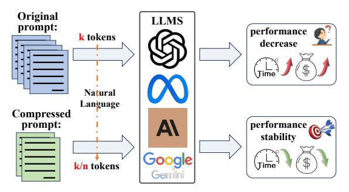

# I. INTRODUCTION

L ARGE Language Models (LLMs) [\[1](#page-9-0)[–6\]](#page-9-1) have shown excellent performance in different tasks, including recommender systems [\[7\]](#page-9-2) and drug design [\[8\]](#page-9-3). Many recently emerged prompting techniques for LLMs, such as Chain of Thought (CoT) [\[9\]](#page-9-4), Retrieval Augmented Generation (RAG)

This work was partly supported by the National Natural Science Foundation of China under Grant 62072190.

Jinwu Hu and Wei Zhang are with the School of Software Engineering, South China University of Technology, and with Pazhou Lab, Guangzhou, China (e-mail: fhujinwu@gmail.com, zw2177738821@gmail.com).

Yufeng Wang is with the School of Future Technology, South China University of Technology, Guangzhou, China, and with Peng Cheng Laboratory, Shenzhen, China (e-mail: 202310193334@mail.scut.edu.cn).

Yu Hu is with the Department of Health Technology and Informatics, Hong Kong Polytechnic University, Hong Kong, China (e-mail: jasonscut@outlook.com).

Mingkui Tan and Qing Du are with the School of Software Engineering, South China University of Technology, Guangzhou, China (e-mail: mingkuitan@scut.edu.cn, duqing@scut.edu.cn).

Bin Xiao is with the Department of Computer Science and Technology, Chongqing University of Posts and Telecommunications, Chongqing, China (e-mail: xiaobin@cqupt.edu.cn).

∗Authors contributed equally. †Corresponding authors

> **[图片提取文字 (无描述)]:**
> Original LLMS prompt: performance k tokens decrease Natural Language Compressed prompt: performance . stability k/n tokens

1

Fig. 1. Motivation for Prompt Compression of LLMs.

[\[10\]](#page-9-5), Role-playing [\[11\]](#page-9-6), etc., empower LLMs to handle complex and diverse tasks. However, these techniques increase the number of tokens required for the prompt, leading to additional computational and financial overhead, as well as reduced perceptual ability due to the limited context window of LLMs [\[12\]](#page-9-7) (see Fig. [1\)](#page-0-0). While model quantization and expanding the context window can partially mitigate this issue, they do not fundamentally address the cost and performance limitations caused by long prompts. Consequently, prompt compression provides a straightforward solution aimed at shortening the original prompt while preserving key information and improving the LLM inference efficiency.

*Unfortunately*, prompt compression presents several challenges, partly for the following reasons. *1) Context sensitivity:* LLMs heavily rely on long prompts for context. Shortening prompts can negatively impact the ability of LLMs to generate coherent and accurate responses, requiring sophisticated compression techniques. *2) Information retention:* Compressing prompts while preserving essential information is difficult. Key details can be lost during compression, leading to degraded performance in LLM outputs. *3) Task-agnostic compression:* Developing a compression method adaptable across tasks, without being customized for specific scenarios, is particularly challenging due to the diverse nature of LLM applications.

To improve prompting efficiency, various prompt compression methods [\[12–](#page-9-7)[20\]](#page-10-0) have been explored, which can be broadly classified into white-box and black-box methods. The white-box compression method [\[13](#page-9-8)[–16\]](#page-9-9) compresses the prompt at the token-embedding level by modifying the model parameters, structure, and transformer self-attention mechanism. However, most high-performing LLMs (such as GPT-4 and Claude-3) are accessed through application programming interfaces (APIs), and the unavailability of source code severely limits the development and application of these methods. In response to the limited access to the source code of LLMs, black-box compression methods have emerged [\[12,](#page-9-7) [17–](#page-9-10)[20\]](#page-10-0), leveraging the inherent redundancy of natural language [\[21\]](#page-10-1). The black-box compression method operates at the natural language level, aiming to shorten the original prompt without losing essential information. This method does not require access to the LLM source code for training or inference, reducing usage costs by directly minimizing input size. It also shortens inference time while preserving the performance of the LLM output.

Despite the recent black-box compression methods that can reduce the number of tokens in the prompt while maintaining the LLM output performance as much as possible, these methods still face certain limitations. Firstly, a common drawback of some existing task-aware compression methods [\[17,](#page-9-10) [19,](#page-10-2) [22,](#page-10-3) [23\]](#page-10-4) is that they are usually fine-tuned for specific tasks, and thus often difficult to use for different downstream task. For example, LongLLMLingua [\[19\]](#page-10-2) has to dynamically adjust the compression content according to the question, which may be difficult to use in summary tasks. Secondly, most taskagnostic methods [\[12,](#page-9-7) [18,](#page-10-5) [20\]](#page-10-0) estimate token importance using information entropy from causal language models, overlooking the sequential nature of prompt compression, where each token significance depends on the evolving context. Thirdly, many existing methods heavily depend on black-box LLMs during training, either for providing reward signals [\[17,](#page-9-10) [23\]](#page-10-4) or generating large-scale labeled data [\[12\]](#page-9-7), leading to high training costs and limited practicality.

To address the above limitations, we propose a novel task-agnostic Dynamic Compressing Prompts method, called LLM-DCP, reducing the number of tokens of Prompt without affecting the output performance of LLMs as much as possible. Since the decision to remove or retain a token largely depends on the evolving context, we hypothesize that prompt compression can be viewed as a sequential decision-making process. In this process, redundancy is reduced iteratively while essential content is preserved, with each compression decision relying on the intermediate outcomes of previous iterations. Specifically, we model the prompt compression task as a Markov Decision Process (MDP), enabling the DCP-Agent to sequentially remove redundant tokens by adapting to dynamic contexts and retaining crucial content. Furthermore, we design a reward function for training the DCP-Agent that balances the compression rate, output distribution, and retention of key information, enabling prompt token reduction without compromising the LLM understanding and output. Importantly, this reward function does not require access to a black-box LLM, significantly reducing training costs. Additionally, inspired by curriculum learning [\[24](#page-10-6)[–26\]](#page-10-7), we introduce a Hierarchical Prompt Compression (HPC) training strategy that progressively increases the difficulty of compression, enabling the agent to effectively balance efficient compression with the protection of key information.

We summarize our main contributions as follows:

• We propose a task-agnostic prompt compression method that models the compression process as a sequential decision-making problem using a Markov Decision Process (MDP). This method reduces the number of prompt tokens while aiming to minimize any negative impact

- on the LLM output performance. Experimental results show that LLM-DCP achieves approximately a 3.04% improvement in Rouge-2 score over the state-of-the-art method, along with a higher compression ratio of 12.9x on the Arxiv-March23 dataset.
- To effectively train the DCP-Agent, we design a reward function that balances compression rate, output quality, and retention of key information. This reward function operates without direct supervision from the target LLM, significantly reducing training costs and enhancing practicality.
- We propose a Hierarchical Prompt Compression (HPC) training strategy that introduces progressively challenging compression tasks, allowing the proposed method to balance efficient compression with the preservation of key information effectively. Experiments show that the use of HPC yields a relative improvement of 25.5% in compression ratio and 0.5 in metric.

The remainder of this paper is organized as follows. Related work is presented in Section [II.](#page-1-0) Section [III](#page-2-0) provides the problem definition and motivations. Section [IV](#page-3-0) describes the proposed LLM-DCP. Section [V](#page-5-0) provides the experiments and discussions. The conclusion of this paper is in Section [VI.](#page-9-11)

