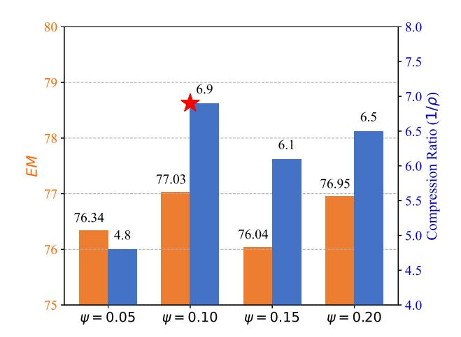

# **The Generation of LLMLingua-2:**

To solve the problem, we need to break it down step by step.\n\n1. \*\*Calculate the total cost of half a dozen plates:\*\*\n - Half a dozen plates = 6 plates / 2 = 3 plates.\n - Cost of each plate = \$6000.\n - Total cost of 3 plates = 3 plates \u00d7 \$6000/plate = \$18000.\n\n2. \*\*Determine the cost of twenty dozen cups:\*\*\n - According to the problem, twenty dozen cups cost \$1200 less than the total cost of half a dozen plates.\n - Therefore, the cost of twenty dozen cups = Total cost of half a dozen plates - \$1200.\n - Cost of twenty dozen cups = \$18000 - \$1200 = \$16800.\n\n3. \*\*Calculate the total number of cups:\*\*\n - Twenty dozen cups = 20 \u00d7 12 = 240 cups.\n\n4. \*\*Calculate the total cost of buying each cup:\*\*\n - Total cost of twenty dozen cups = \$16800.\n - Cost per cup = Total cost / Total number of cups = \$16800 / 240 cups.\n\n5. \*\*Perform the division:\*\*\n - Cost per cup = \$16800 / 240 = \$70.\n\nThus, the total cost of buying each cup is **\*\*\$70\*\*.**

Fig. 3. Cases study on GSM8K dataset in *1-shot constraint*. The red highlights the words that are preserved. The strikethrough highlights the words that are removed.

→3.4x). The proposed LLM-DCP achieves a 17.0% relative improvement over the classical method, Selective-Context, on the BLEU metric. We conclude that LLM-DCP removes redundant tokens according to prompt dynamic inputs, which allows outperforming SOTA methods in all metrics while maintaining a high compression ratio.

Excellent performance of the LLM-DCP in the summarization task. As shown in Table [I,](#page-5-5) our proposed LLM-DCP outperforms SOTA methods in the summarization task. Specifically, the proposed LLM-DCP achieves a relative improvement of 9.03% (14.62→15.94) on Rouge-2 metric compared to LLMLingua-2, while having a higher compression ratio (12.0x→12.9x). Our proposed LLM-DCP is not optimal in BLEU metric compared to LLMLingua-2, the main reason is that our DCP-Agent is trained on conversation data, while LLMLingua-2 is trained on the summarization task dataset, MeetingBank [\[65\]](#page-11-4). Meanwhile, it exactly proves that the proposed LLM-DCP still achieves better prompt compression performance in the cross-task situation.

LLM-DCP trade-off between performance and compression ratio. As shown in Table [II,](#page-6-6) the proposed LLM-DCP outperforms the SOTA method in the reasoning task. Specifically, with the *1-shot constraint*, our proposed LLM-DCP has a relative improvement of 21.1% (5.7x→6.9x) in compression ratio and 0.2% (76.87→77.03) in metric compared to LLMLingua-2. With *half-shot constraint*, our proposed LLM-DCP has a relative improvement of 0.3% in metric over LLMLingua-2, with a compression ratio of 15.5x. We conclude that the proposed LLM-DCP trades off between performance and compression ratio. In the reasoning task, the performance of the metric is not significantly improved between our proposed method and the existing prompt compression methods with approximately the same compression rate, a possible factor is that the target black-

TABLE III
ABLATION STUDY ON THE GSM8K DATASET WITH 1-shot constraint.

| Version                | 1-shot constraint |            |                  |  |  |
|------------------------|-------------------|------------|------------------|--|--|
| version                | $EM\uparrow$      | Tokens ↓   | $1/\rho\uparrow$ |  |  |
| Random                 | 76.04             | 428        | 5.5x             |  |  |
| LLM-DCP (w/o Training) | 76.19             | <u>422</u> | <u>5.6x</u>      |  |  |
| LLM-DCP (w/o HPC)      | 76.57             | 431        | 5.5x             |  |  |
| LLM-DCP (Ours)         | 77.03             | 343        | 6.9x             |  |  |

box model, GPT-4o-mini, already performs well on this task, even though the prompt of the CoT is not complete.

Excellent performance of LLM-DCP in In-context learning task. As shown in Table II, the proposed LLM-DCP outperforms the SOTA method in the EM metric at a higher compression ratio. Specifically, with the I-shot constraint, the proposed LLM-DCP achieves a relative improvement of about 1.0% (82.41 $\rightarrow$ 83.16) in EM metric compared to LLMLingua-2, along with a relative improvement of 3.3% ( $3.0x\rightarrow3.1x$ ) in compression ratio. With half-shot constraint, the proposed LLM-DCP improves the EM metric by a relative 1.6% (82.64 $\rightarrow$ 83.98) compared to LLMLingua-2 while maintaining the same compression ratio.

Overall, our proposed LLM-DCP is a task-agnostic prompt compression method that achieves to outperform the SOTA method on four challenging tasks, such as the summarization task and reasoning task, by training only on the QA type dataset. On the one hand, it is because we model the prompt compression task as an MDP, and the DCP-Agent is able to remove redundant tokens according to the dynamic prompt inputs. On the other hand, it is because the reward function we designed balances the compression ratio, the output distribution of LLM, and the key information retention.

## C. Eaxmples of LLM-DCP

We show an example of LLM-DCP and LLMLingua-2 on a reasoning task to demonstrate the effect of prompt compression, as shown in Fig.3. The LLM-DCP and LLMLingua-2 are both tokens-level prompt compression methods, and although the compressed prompts are poorly readable, this does not have a significant impact on the understanding of the prompts by the LLM. In addition, our proposed LLM-DCP retains more key information, which makes the prompts obtained after LLM-DCP compression allow LLM to output more accurate answers compared to LLMLingua-2.

## D. Ablation Studies

We follow the experimental setup of section V-A and conduct a variety of ablation experiments to validate the effectiveness of modeling prompt compression as an MDP and the proposed HPC training strategy. Here, we experiment with the reasoning task in GSM8K dataset.

Effectiveness of prompt compression with MDP. We compare LLM-DCP and random deletion tokens to demonstrate the effectiveness of modeling prompt compression as an MDP, as shown in Table III. Compared to the random deletion tokens, the proposed LLM-DCP achieves a relative

TABLE IV EXPERIMENTAL RESULTS FOR THE COMPONENT OF THE REWARD FUNCTION ON THE GSM8K DATASET WITH 1-shot constraint.

|              | 0            |              | 1-shot constraint |          |                   |  |
|--------------|--------------|--------------|-------------------|----------|-------------------|--|
| α            | Р            | γ            | $EM\uparrow$      | Tokens ↓ | $1/\rho\uparrow$  |  |
|              | ✓            | ✓            | 76.57             | 339      | <u>7.0x</u>       |  |
| $\checkmark$ |              | ✓            | 76.70             | 396      | $\overline{6.0x}$ |  |
| $\checkmark$ | ✓            |              | 76.72             | 323      | 7.3x              |  |
| $\checkmark$ | $\checkmark$ | $\checkmark$ | 77.03             | 343      | 6.9x              |  |

> **[图片提取文字 (无描述)]:**
> 8.0 80 7.5 79 6.9 Compression Ratio  $(1/\rho)$  0.5 6.5 78 6.1 EM 77.03 76.95 76.34 76.04 4.8 76 4.5 4.0  $\psi = 0.15$  $\psi = 0.05$  $\psi = 0.10$  $\psi = 0.20$

Fig. 4. Experimental results for different values of  $\psi$  on the GSM8K dataset with *1-shot constraint*.

improvement of 1.3% ( $76.04 \rightarrow 77.03$ ) in *EM* metric and a relative improvement of 25.5% ( $5.5x \rightarrow 6.9x$ ) in compression ratio. A primary reason is the modeling of prompt compression as MDP, the trained DCP-Agent is able to iteratively refine the prompt by removing redundant tokens while preserving essential content, with each decision building on the outcomes of previous steps for efficient, context-aware compression.

Effectiveness of HPC training strategy. We compare LLM-DCP and LLM-DCP (w/o HPC) to verify the effectiveness of the proposed Hierarchical Prompt Compression training strategy, as shown in Table III. Compared to LLM-DCP (w/o HPC), LLM-DCP has a relative improvement of 0.6% ( $76.57 \rightarrow 77.03$ ) in EM metrics and a relative improvement of 25.5% ( $5.5x \rightarrow 6.9x$ ) in the compression ratio. An important reason is that the HPC training strategy setting makes the training difficulty incremental step by step, which helps the DCP-Agent to better learn how to remove the redundant tokens in the dynamic prompt input.

