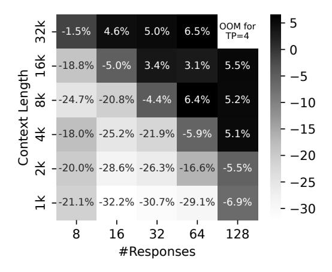

# 3.1 Experiment Setup

Our experiments have the following setup:

**Testbed.** We deploy EARL on a cluster of 16 machines (128× NVIDIA H100-80 GB GPUs). All GPUs are connected with NVLink. The inter-machine bandwidth is 200 Gbps.

**Models and Training Environments.** We train Qwen2.5-72B-Instruct [24] in an agentic setting within the Connect-Four2 environment. The training begins with a tensor parallelism degree of 4, and the initial maximum context length is set to 8,192. We employ a customized agentic RL algorithm, which utilizes REINFORCE [9] as the advantage estimator.

**Implementation.** We have built *EARL* on top of ROLL [26], an open-source framework for agentic RL training. The agentic environment, Connect-Four, is implemented with openspiel [13] and integrated into ROLL. The *Parallelism Selector* is activated before the Rollout stage in each training step. We optimize the data dispatch logic between the Experience Preparation stage and the Model Update stage to avoid the aggregation behavior in the single-controller architecture.

**Metrics.** We evaluate the performance of *Parallelism Selector* by measuring the *relative throughput speedup* of *tokens-per-GPU-per-second*, which is denoted as TGS. Specifically, the

> **[图片提取文字 (无描述)]:**
> OOM for -1.5% 4.6% 5.0% 6.5% TP=4 --18.8% -5.0% 3.4% 5.5% 3.1% Length ☆ --24.7% -20.8% -4.4% 6.4% 5.2% Context <del>4</del> --18.0% -25.2% -21.9% -5.9% -15 5.1% -20**≍** --20.0% -28.6% -26.3% -16.6% -5.5% -25**≚** --21.1% -32.2% -30.7% -29.1% -6.9% -3016 32 64 128 8 #Responses

Fig. 3: Relative throughput speedup from TP=4 to TP=8 across different context lengths and response counts, computed using Equation 1. Positive values indicate TP8 outperforms TP4; negative values indicate TP4 outperforms TP8.

relative speedup of switching from TP = a to TP = b is:

$$Speedup_{\%}(a, b) = \frac{TGS(b) - TGS(a)}{TGS(a)} \times 100$$
 (1)

where a positive value indicates that TP = b achieves higher throughput than TP = a.

#### 3.2 Dynamic Parallelism in Rollout Stage

As shown in Fig. 3, we report Speedup $\infty$  (4, 8), the relative throughput improvement in the decoding phase of the Rollout stage, when switching the tensor parallelism degree from TP = 4 to TP = 8. The results demonstrate the effectiveness of adapting the parallelism configuration to changes in the increasing context length during training. In practice, the number of responses for the Rollout stage is typically fixed, while both response length and context length increase as the multi-turn training progresses. In the case of #responses = 32, our approach maintains the performance advantage of TP = 4 (31% higher throughput) when the context length is small. When the context length reaches 16K and 32K, EARL switches to TP = 8, which yields 5% improvement. In the most extreme case, with 128 responses and a 32K context length, TP=4 encounters out-of-memory (OOM) failures, whereas switching to TP = 8 maintains system stability and prevents crashes.

#### 3.3 Optimizing Data Dispatching Between Stages

We optimize the data dispatch logic for transferring *log-probability* tensors from the reference model to the training workers, since these tensors are not required for aggregation in advantage estimation. The intermediate data sizes are 46 MiB, 93 MiB, and 187 MiB per independent worker. As shown in Fig. 4, the data dispatcher consistently achieves better performance across different context lengths. At a context length of 8K, the optimization reduces transmission time

&lt;sup>2https://en.wikipedia.org/wiki/Connect Four

> **[图片提取文字 (无描述)]:**
> Baseline 80 EARL Latency (s) 20 11.2× 11.0× 9.8× 8K 16K 32K Context Length

Fig. 4: Data dispatch latency of baseline and EARL under different context lengths. Numbers above the bars indicate the relative latency reduction of EARL compared to the baseline.

by 9.7×, and when the context length reaches 32K, it yields up to 11.2× lower latency. The current prototype employs TCP over Ethernet, identical to the baseline transport, and we expect further gains with RDMA-based communication.

#### 4 Related Works

Efficient large-scale agentic systems are an area of active research. However, existing agentic RL systems do not optimize for the dynamic and increasing nature of context length during training and rollouts. Instead, they often rely on general inference techniques for handling long context. VeRL [19], SkyRL [6], and ROLL [26] incorporate tensor parallelism [20] and sequence parallelism [10, 12] to enable long context training. Slime [30] handles long-context during rollouts by using SGLang's chunked prefill technique [29]. EARL complements these systems by introducing dynamic parallelism that adapts to the context length in Rollout stage and optimizing the data dispatch logic to improve efficiency at scale.

Other approaches implicitly apply length penalties in training to constrain context growth [1, 5, 22, 27]. Other works, such as SkyWork-OR1 [8] and DeepCoder [15] progressively increase the context length across training stages to enable effective rollouts at shorter context lengths. Our work, *EARL*, is orthogonal to both strategies and focuses on system-level optimizations that can be utilized with any training-time technique to scale agentic RL effectively under long-context regimes.

#### 5 Limitations and Future Work

EARL presents an initial prototype for building efficient agentic RL systems for LLMs, with a focus on addressing the challenge of context length explosion in agentic RL. For dynamic parallelism, we have so far optimized only the *Rollout* stage, without extending the optimization to the training stage. The Rollout stage only performs inference, which differs significantly in workload from training. Achieving joint optimization with the training stage requires a more

comprehensive design, but we expect this direction to yield substantial performance gains.

On the other hand, in data movement, the data dispatch logic optimization focuses on tensors with minimal interstage dependencies (i.e., log-probabilities are not required for advantage estimation). However, our approach can be applied to other tensors, such as rewards and advantages. In the current system, rewards and returns are aggregated for advantage estimation. We plan to improve this process in a distributed manner to alleviate communication bottlenecks under exploding context lengths, and to better leverage all-to-all communication patterns for improved efficiency.

Other future directions include developing fully asynchronous RL for more flexible scheduling, integrating replay buffers into off-policy training to enhance data dispatch efficiency, and extending our methods to a broader class of algorithms. We believe these insights and advances will guide the development of more efficient and robust agentic RL systems for LLMs.

