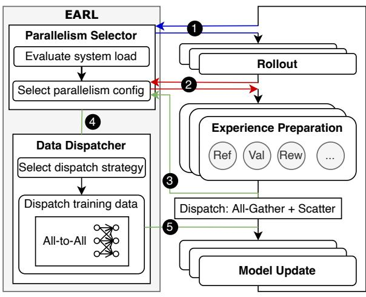

# CCS Concepts: • Computing methodologies → Distributed computing methodologies: Machine learning.

*Keywords:* Agentic Reinforcement Learning, Large Language Models (LLMs), Reinforcement Learning (RL), Distributed Training, Dynamic Parallelism

#### **ACM Reference Format:**

Zheyue Tan, Mustapha Abdullahi, Tuo Shi, Huining Yuan, Zelai Xu, Chao Yu, Boxun Li, and Bo Zhao. 2025. *EARL*: Efficient Agentic Reinforcement Learning Systems for Large Language Models. In 1st Workshop on Systems for Agentic AI (SAA '25), October 13th, 2025, Seoul, Republic of Korea. ACM, New York, NY, USA, 5 pages.

#### 1 Introduction

Reinforcement Learning (RL) has become a key component in the post-training of large language models (LLMs), used Bo Zhao Aalto University bo.zhao@aalto.fi

to align model behavior with human preferences [2, 18] and to elicit advanced capabilities such as reasoning, tool-use, and decision-making [4, 7, 23]. Agentic LLMs [3, 16, 17, 23], which act as autonomous agents interacting with complex environments, are increasingly prominent and typically trained with agentic RL involving multi-turn interactions and adaptive behavior in response to the environment's feedback, achieving superior reasoning and tool-use performance for real-world applications [3, 11, 16, 28].

During RL training, the context length increases dramatically, initially boosting reasoning performance [7, 22, 25], but this introduces significant system-level challenges in memory and communication, limiting overall scalability. Excessive context growth inflates memory usage and can trigger out-of-memory (OOM) failures. In agentic RL, this issue is further exacerbated by multi-turn interactions. For example, with the Llama-3.1-70B model [14], context lengths of 4,096 and 8,196 require around 97 GB and 354 GB for the training batch, respectively, exceeding the memory capacity of existing GPUs [21]. Existing works typically apply a *hard limit* on maximum context length, and some even introduce a *length penalty* [22] to prevent OOM, but these approaches also restrict the model's performance potential.

We observe a similar phenomenon in *our industrial practice* (Fig. 1): a 4B-parameter LLM is trained in a Tic-Tac-Toe environment with a maximum context length of 8,192 (due to GPU memory constraints), and each episode consists of approximately three turns. Even early in training (Fig. 1a), the average single-turn response length increases steadily. 1 By step 13 (Fig. 1b), the episode-level context length reaches the system limit, causing truncated reasoning and introducing "low-quality" data into the rollouts. The degradation leads to a sharp drop in average return and ultimately collapses learning after step 15 (Fig. 1c).

&lt;sup>1Turn-level context length refers to the token length within a single agent–environment interaction round, while episode-level context length refers to the cumulative number of tokens across an entire episode.

> **[图片提取文字 (无描述)]:**
> (b) (a) 8000 -System limit 4000 -4000 -4000 -0.5 7000 -0.0 # 6000 --0.512 15 18 21 12 15 18 21 12 15 18 21 Training Step Training Step Training Step

Fig. 1: Training a 4B-parameter LLM on the Tic-Tac-Toe task: (a) turn-level context length steadily increases; (b) episode-level context length quickly reaches the system limit; and (c) training performance collapses due to context truncation.

Tab. 1: Intermediate Data Batch Size Under Different Context Lengths on a 1k-GPU Cluster.

| Context Length              | 1,024  | 2,048  | 4,096  | 8,192   | 16,384  | 32,768  |
|-----------------------------|--------|--------|--------|---------|---------|---------|
| <b>Estimated Size (MiB)</b> | 15,625 | 31,250 | 62,500 | 125,000 | 250,000 | 500,000 |

> **[图片提取文字 (无描述)]:**
> EARL Parallelism Selector Evaluate system load Rollout Select parallelism config **Experience Preparation** Data Dispatcher Val Ref Rew Select dispatch strategy 3 Dispatch training data Dispatch: All-Gather + Scatter All-to-All Model Update

Fig. 2: System design of EARL.

Long contexts also hinder scalability by generating massive volumes of intermediate data that must be exchanged across nodes, creating substantial communication overhead. These intermediate batches consist of tensors required to compute training signals, including tokens, log probabilities, rewards, returns, and other auxiliary tensors. The estimated sizes of such batches are reported in Table 1. At the 1K-GPU scale, the aggregated data volume grows linearly with context length, reaching up to 500 GB at 32K tokens.

In our industrial practice, we have observed this significant data dispatch bottleneck, exacerbated by increasing context length when scaling training to 1,024 GPUs. For instance, while training a model with over 200B parameters at context length 32K using the VeRL framework [19], the data volume approached 1 TB due to additional implementation overhead. This amount of data required more than 20 minutes for transmission (under a 25 Gbps peak bandwidth), occupying over 25% of the total iteration time and severely degrading training throughput. The bottleneck is further aggravated by VeRL's single-controller architecture, in which

a centralized process coordinates data exchange across different stages, forcing all intermediate data to be aggregated on a single node before redistribution.

These challenges reveal a fundamental challenge in scaling agentic RL: longer contexts boost capability but also strain memory and communication. Existing safeguards, such as hard length limits, mitigate resource pressure but also cap performance ceiling. This motivates the design of EARL, which tackles the context length explosion issue and data dispatching bottleneck, for stable and efficient large-scale training.

