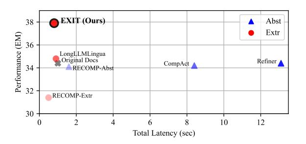

# 1 Introduction

Retrieval-Augmented Generation (RAG) [\(Lewis](#page-11-0) [et al.,](#page-11-0) [2020b;](#page-11-0) [Khandelwal et al.,](#page-11-1) [2020\)](#page-11-1) is the task of enhancing the responses of Large Language Models (LLMs) with relevant external contexts or documents. By grounding answers in evidence, RAG systems have gained much attention for mitigating hallucination issues [\(Ram et al.,](#page-12-0) [2023;](#page-12-0) [Li et al.,](#page-11-2) [2023c\)](#page-11-2) and improving factual reliability [\(Jeong](#page-10-0) [et al.,](#page-10-0) [2024;](#page-10-0) [Xia et al.,](#page-14-0) [2024b\)](#page-14-0).

> **[图片提取文字 (无描述)]:**
> EXIT (Ours) Abst 38 Extr Performance (EM) 36 LongLLMLingua Original Docs Refiner A CompAct 34 RECOMP-Abst 32 RECOMP-Extr 30 0 8 10 Total Latency (sec)

Figure 1: Average QA accuracy (EM) and efficiency (Total Latency) across various compression methods using Contriever-MSMARCO as the retriever and Llama-3.1- 8b-Instruct as the reader. Experiments were conducted on a single A100-80GB GPU, and latency (in seconds) was averaged over all samples from these datasets.

However, they face significant challenges in practical deployment, as retrieval models sometimes fail to rank the most relevant documents at the top [\(Robertson and Zaragoza,](#page-13-0) [2009;](#page-13-0) [Izacard et al.,](#page-10-1) [2022\)](#page-10-1). One potential solution is to retrieve a larger set of documents to ensure the coverage of the necessary information, but this approach compromises both effectiveness and efficiency. Specifically, for effectiveness, LLMs often struggle with processing long contexts, overlooking critical information located in the middle of contexts [\(Liu](#page-11-3) [et al.,](#page-11-3) [2024\)](#page-11-3). Additionally, irrelevant information in retrieved documents can act as distractors, significantly degrading the overall QA performance [\(Shi et al.,](#page-13-1) [2023;](#page-13-1) [Li et al.,](#page-11-4) [2023b;](#page-11-4) [Wu et al.,](#page-13-2) [2024\)](#page-13-2). From an efficiency perspective, increasing the context size raises inference latency—due to quadratic complexity in attention computation [\(Xia et al.,](#page-14-1) [2024a\)](#page-14-1)—and API costs tied to input length[1](#page-0-0) . Moreover, the context window limitations inherent in LLM architectures set strict upper bounds on the maximum input size [\(Peng et al.,](#page-12-1) [2024\)](#page-12-1).

To address these challenges, context compression has emerged as a promising solution, condensing essential information from multiple retrieved

\* Corresponding author

1 <https://openai.com/api/pricing/>

contexts through either abstractive or extractive approaches. While they can reduce inference time and filter out irrelevant information, both approaches still have notable drawbacks. Specifically, abstractive compression methods—often implemented via autoregressive generation—summarize or rewrite documents into a single condensed passage [\(Li](#page-11-5) [et al.,](#page-11-5) [2023d;](#page-11-5) [Xu et al.,](#page-14-2) [2024;](#page-14-2) [Yoon et al.,](#page-14-3) [2024;](#page-14-3) [Li et al.,](#page-11-6) [2024;](#page-11-6) [Wang et al.,](#page-13-3) [2023\)](#page-13-3), significantly increasing end-to-end latency due to their tokenby-token generation process. For instance, as illustrated in Figure [1,](#page-0-1) CompAct [\(Yoon et al.,](#page-14-3) [2024\)](#page-14-3), a representative abstractive approach, takes over 8 seconds to process just five documents for a single query, whereas using the original document without compression takes only 1 second.

On the other hand, extractive compression approaches can offer a more efficient alternative [\(Xu](#page-14-2) [et al.,](#page-14-2) [2024;](#page-14-2) [Jiang et al.,](#page-10-2) [2023,](#page-10-2) [2024\)](#page-10-3), by selecting relevant textual segments (e.g., sentences, or even token-level excerpts) directly from retrieved documents. This strategy reduces both compression time and overall latency. However, current extractive methods have yet to reach their full potential in terms of effectiveness [\(Choi et al.,](#page-9-0) [2021;](#page-9-0) [Pan et al.,](#page-12-2) [2024\)](#page-12-2). They often rely on rigid selection criteria that do not adapt well to variations in query complexity or the quality of retrieved documents, and they frequently neglect to fully leverage the broader context when choosing which tokens or sentences to retain. Specifically, as illustrated in Figure [1,](#page-0-1) while extractive approaches such as RECOMP-Extr [\(Xu et al.,](#page-14-2) [2024\)](#page-14-2) achieve minimal compression time, their inability to dynamically adjust selection processes results in suboptimal QA performance.

Therefore, in this work, we propose a novel compression framework for RAG, EXtractIve ContexT compression (EXIT), designed to enhance both effectiveness and efficiency by improving efficiency through an extractive compression and by enhancing effectiveness through dynamic, context-aware sentence selection. Specifically, as shown in Figure [2,](#page-2-0) EXIT operates in three stages: (1) splitting retrieved documents into sentences, (2) performing parallelizable binary classification ("Yes" or "No") on each sentence to assess its relevance while considering its full document context, rather than evaluating them independently, and (3) recombining selected sentences while preserving their original order. Therefore, as shown in Figure [1,](#page-0-1) EXIT frames context compression as a sentence classification problem, enabling it to outperform both compression methods and the uncompressed baseline in terms of speed. Specifically, it reduces processing time from several seconds to about 1 second. Moreover, by leveraging context-aware and adaptive sentence selection, EXIT also surpasses other extractive methods in accuracy. Also, we note that EXIT operates as a plug-and-play module that can be seamlessly integrated into any existing RAG pipeline without architectural modifications.

We evaluate EXIT on both single-hop QA tasks (NQ [\(Kwiatkowski et al.,](#page-11-7) [2019\)](#page-11-7), TQA [\(Joshi et al.,](#page-10-4) [2017\)](#page-10-4)) and multi-hop QA tasks (HQA [\(Yang et al.,](#page-14-4) [2018\)](#page-14-4), 2WikiMultiHopQA [\(Ho et al.,](#page-10-5) [2020\)](#page-10-5)). Experimental results demonstrate that EXIT not only improves effectiveness over both abstractive and extractive compression baselines but also significantly reduces latency compared to abstractive methods and the uncompressed baseline.

Our contributions are as follows:

- We identify and address the key weaknesses of existing context compression methods: abstractive methods incur prohibitive latency, while traditional extractive methods rely on rigid, non-adaptive content selection.
- We propose EXIT (EXtractIve ContexT Compression), an extractive compression framework that dynamically adjusts to query complexity and retrieval quality.
- We demonstrate, through extensive experiments, that EXIT surpasses previous compression methods and uncompressed retrievals, improving QA performance while significantly reducing both token counts and end-to-end latency.

