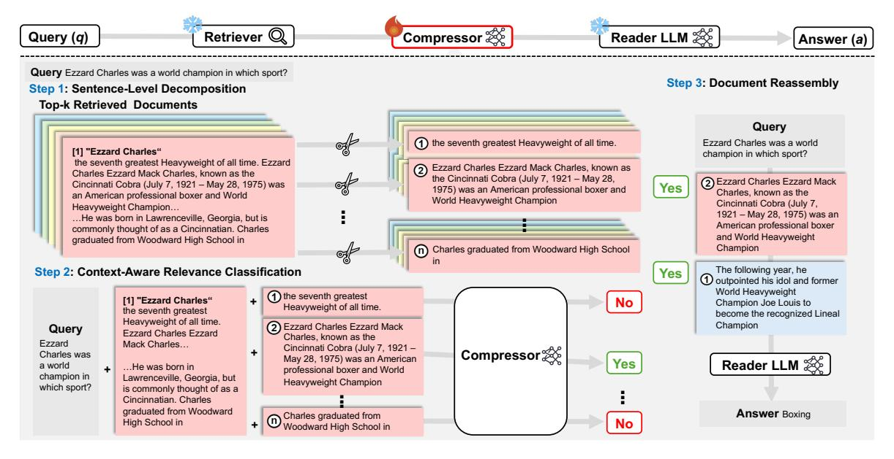

# 2 Related Work

Retrieval-Augmented Generation. RAG enhances LLMs by grounding responses in retrieved external documents [\(Lewis et al.,](#page-11-0) [2020b;](#page-11-0) [Shi et al.,](#page-13-4) [2024;](#page-13-4) [Ram et al.,](#page-12-0) [2023\)](#page-12-0). However, increasing retrieved content often leads to longer contexts, higher inference costs [\(Xia et al.,](#page-14-1) [2024a\)](#page-14-1), and retrieval noise [\(Shi et al.,](#page-13-1) [2023;](#page-13-1) [Liu et al.,](#page-11-3) [2024\)](#page-11-3), impacting efficiency and accuracy.

To mitigate these challenges, ad-hoc methods have been proposed at different stages of the retrieval pipeline, including pre-retrieval and postretrieval methods. Pre-retrieval methods, such as

> **[图片提取文字 (无描述)]:**
> Retriever Q Reader LLM XX Query (q) Compressor 25 Answer (a) Query Ezzard Charles was a world champion in which sport? Step 3: Document Reassembly Step 1: Sentence-Level Decomposition Top-k Retrieved Documents Querv 1 the seventh greatest Heavyweight of all time. Ezzard Charles was a world [1] "Ezzard Charles" champion in which sport? the seventh greatest Heavyweight of all time. Ezzard (2) Ezzard Charles Ezzard Mack Charles, known as Charles Ezzard Mack Charles, known as the the Cincinnati Cobra (July 7, 1921 - May 28, (2) Ezzard Charles Ezzard Mack Cincinnati Cobra (July 7, 1921 - May 28, 1975) was Yes 1975) was an American professional boxer and Charles, known as the an American professional boxer and World World Heavyweight Champion Cincinnati Cobra (July 7, Heavyweight Champion... 1921 - May 28, 1975) was an ... He was born in Lawrenceville, Georgia, but is American professional boxer commonly thought of as a Cincinnatian. Charles and World Heavyweight graduated from Woodward High School in (n) Charles graduated from Woodward High School Champion The following year, he Step 2: Context-Aware Relevance Classification Yes 1 outpointed his idol and former World Heavyweight 1) the seventh greatest [1] "Ezzard Charles" No Champion Joe Louis to Heavyweight of all time. the seventh greatest become the recognized Lineal Heavyweight of all time. (2) Ezzard Charles Ezzard Mack Champion Query Fzzard Charles Fzzard Charles, known as the **Fzzard** Mack Charles... Cincinnati Cobra (July 7, 1921 -Compressor 55 Charles was May 28, 1975) was an American Yes Reader LLM XX a world ... He was born in professional boxer and World champion in Lawrenceville, Georgia, but Heavyweight Champion which sport? is commonly thought of as a Cincinnatian Charles graduated from Woodward **Answer** Boxing Charles graduated from High School in No Woodward High School in

Figure 2: Overview of our framework. First, the retrieved document is split into sentences. Next, each sentence is classified as either "Yes" or "No" using the Compressor. Finally, sentences with scores above the threshold are recombined in their original order to complete the compression.

Landmark Embedding (Luo et al., 2024) and Late Chunking (Günther et al., 2024), improve document representations to enhance retrieval effectiveness but lack adaptive filtering mechanisms after retrieval and may be difficult to integrate orthogonally with existing retrieval methods. Post-retrieval methods, including reranking (Nogueira and Cho, 2019; Qin et al., 2023; Li et al., 2023a) and context compression (Xu et al., 2024; Yoon et al., 2024; Li et al., 2024; Jiang et al., 2024), refine retrieved documents through reordering or pruning. However, most post-retrieval methods overlook query complexity and operate on a fixed number of retrieved items, limiting their adaptability in balancing effectiveness and efficiency.

We introduce EXIT, a novel post-retrieval compression framework that adaptively filters query-relevant sentences while discarding redundancy. Unlike existing methods, EXIT dynamically adjusts to query complexity and retrieval quality, balancing efficiency and effectiveness. Its lightweight, adaptive design seamlessly integrates into RAG pipelines while remaining orthogonal to pre-retrieval methods.

Context Compression. Context compression is a practical remedy for handling increasingly extensive prompt lengths in RAG pipelines. Existing methods commonly fall into soft or hard compression. Soft compression focuses on embedding prompts into compact continuous representations (Wingate et al., 2022; Mu et al., 2023; Ge et al., 2024; Chevalier et al., 2023; Cheng et al.,

2024), but requires extensive training and architectural changes, making it unsuitable for black-box LLMs. Hard compression, by contrast, removes non-essential textual content directly (Li et al., 2023e; Jiang et al., 2023), offering a plug-and-play solution even compatible with API-based models such as ChatGPT (OpenAI, 2023).

Hard compression are further divided into abstractive and extractive methods. Abstractive methods employ autoregressive models to generate query-focused summaries, thus reducing token counts at the cost of additional latency and potential hallucinations (Zhao et al., 2020). For example, RECOMP-Abst (Xu et al., 2024) uses a T5-based summarizer for token reduction but requires dataset-specific training and slows inference. CompAct (Yoon et al., 2024) and Refiner (Li et al., 2024) take this method further by leveraging even larger LLMs with 7B parameters, compounding latency issues and increasing resource demands. Extractive methods, such as RECOMP-Extr (Xu et al., 2024), directly select salient segments (e.g., sentences or tokens) from retrieved documents. This avoids the autoregressive bottleneck and mitigates hallucinations. However, their static and contextagnostic selection of only a few sentences per document limits its performance. Similarly, token-level methods such as LLMLingua family (Li et al., 2023e; Jiang et al., 2023; Pan et al., 2024; Jiang et al., 2024) can distort semantic coherence by removing key entities or splitting essential facts.

In short, abstractive methods offer strong com-

pression but suffer from latency and potential hallucinations, while extractive methods are often rigid and lack context awareness. Our work addresses these limitations by proposing a parallelizable, context-aware extractive compression framework. It adaptively selects sentences at scale, optimizing accuracy and speed in complex retrieval scenarios.

