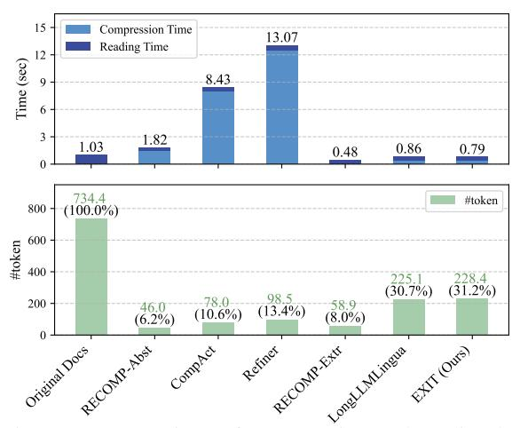

# 4 Experiment Setups

We conduct comprehensive experiments to evaluate EXIT's effectiveness and efficiency in context compression for RAG systems. More implementation details of our experiments are in Appendix [B.](#page-15-0)

Datasets. We evaluate on both single-hop and multi-hop question answering datasets: NaturalQuestions (NQ) [\(Kwiatkowski et al.,](#page-11-7) [2019\)](#page-11-7) and TriviaQA (TQA) [\(Joshi et al.,](#page-10-4) [2017\)](#page-10-4) for singlehop QA; HotpotQA (HQA) [\(Yang et al.,](#page-14-4) [2018\)](#page-14-4) and 2WikiMultihopQA (2WIKI) [\(Ho et al.,](#page-10-5) [2020\)](#page-10-5) for multi-hop QA. We use the test set for TQA evaluations and development sets for all other datasets. For the train dataset for the classifier, we exploit the train split of HQA, which has relevant annotations to each sentence in the multiple documents for a query.

Model Configuration. Our system consists of three primary components. The retriever employs Contriever-MSMARCO [\(Izacard et al.,](#page-10-1) [2022\)](#page-10-1), a dense retriever fine-tuned on MSMARCO [\(Nguyen](#page-12-8) [et al.,](#page-12-8) [2016\)](#page-12-8). The EXIT compressor utilizes Gemma-2B-it [\(Mesnard et al.,](#page-12-9) [2024\)](#page-12-9), optimized for efficient parallel processing. For the reader model, we exploit two scales of instruction-tuned models: Llama3.1-{8, 70}B-Instruct [\(Dubey et al.,](#page-10-9) [2024\)](#page-10-9).

Baselines. We compare EXIT against the following context compression methods: 1) Original Documents serves as uncompressed baseline. For abstractive methods, 2) RECOMP-Abs [\(Xu](#page-14-2) [et al.,](#page-14-2) [2024\)](#page-14-2) uses T5-based (775M) summarization tuned for NQ, TQA, HQA (HQA model for 2WIKI), 3) CompAct [\(Yoon et al.,](#page-14-3) [2024\)](#page-14-3) implements Mistral-7B-based iterative compression with 5-segment blocks, and 4) Refiner [\(Li et al.,](#page-11-6) [2024\)](#page-11-6) uses Llama2-7B-based compression. For extractive methods, 5) RECOMP-Extr [\(Xu et al.,](#page-14-2) [2024\)](#page-14-2) employs Contriever-based (110M) sentence-level extraction tuned for NQ, TQA, HQA (HQA model for 2WIKI), and 6) LongLLMLingua [\(Jiang et al.,](#page-10-3) [2024\)](#page-10-3) uses Llama2-7B-chat for token-level extraction with 0.4 dynamic compression rate.

Evaluation Metrics. We use three metrics: Exact Match (EM) and F1 score to measure effectiveness in question answering, and end-to-end inference latency (Lat.) in seconds to assess efficiency. Endto-end latency captures the total wall-clock time required to generate an answer for a single query, including both compression time and LLM inference time. We report the average latency per sample, computed over the entire evaluation set. This provides a more holistic efficiency metric than token count alone, as it directly reflects the practical runtime performance of the full RAG pipeline.

Table 1: Performance across models and datasets, measured by EM, F1, and inference latency (Lat.). 8B reader experiments were conducted on a single A100-80GB GPU, while 70B reader experiments utilized 4 A100-80GB GPUs in parallel. Best results for each dataset are highlighted in **bold**, and second best results are <u>underlined</u>. The "Type" column denotes whether a given compressor is abstractive (Abs.) or extractive (Ext.).

| Compressor    | Type |             | NQ          |            |             | TQA         |            |             | HQA         |            |      | 2WIK        | [          |             | AVG.        |            |
|---------------|------|-------------|-------------|------------|-------------|-------------|------------|-------------|-------------|------------|------|-------------|------------|-------------|-------------|------------|
| <b>k</b>      |      | ЕМ↑         | F1 ↑        | Lat.↓      | ЕМ↑         | F1 ↑        | Lat.↓      | EM ↑        | F1 ↑        | Lat.↓      | EM ↑ | F1 ↑        | Lat.↓      | EM ↑        | F1 ↑        | Lat.↓      |
|               |      |             |             |            |             | Llama       | 3.1-8B-    | Instruc     | :t          |            |      |             |            |             |             |            |
| Original Docs | -    | 34.6        | 47.1        | 1.0        | 58.8        | 68.6        | 0.9        | 28.1        | 38.6        | 1.0        | 16.1 | 24.9        | 1.1        | 34.4        | 44.8        | 1.0        |
| RECOMP-Abst   | Abs. | 31.3        | 43.2        | 1.6        | 55.9        | 65.7        | 1.4        | 26.5        | 37.0        | 2.2        | 22.7 | 29.1        | 2.1        | 34.1        | 43.7        | 1.8        |
| CompAct       | Abs. | 32.9        | 44.6        | 8.5        | 58.1        | 67.7        | 8.8        | 28.8        | 39.8        | 8.3        | 16.8 | 26.0        | 8.1        | 34.2        | 44.5        | 8.4        |
| Refiner       | Abs. | 32.9        | 45.0        | 28.1       | 59.2        | 68.9        | 10.9       | 28.8        | <u>40.0</u> | 6.9        | 16.8 | 25.4        | 6.4        | 34.4        | <u>44.8</u> | 13.1       |
| RECOMP-Extr   | Ext. | 34.6        | 44.6        | 0.5        | 56.5        | 65.1        | 0.4        | 23.4        | 32.8        | 0.4        | 11.2 | 19.6        | 0.6        | 31.4        | 40.5        | 0.5        |
| LongLLMLingua | Ext. | 30.2        | 41.5        | 0.9        | <u>59.4</u> | 68.0        | 0.8        | 28.0        | 38.0        | 0.8        | 21.5 | 27.4        | 0.9        | 34.8        | 43.7        | 0.9        |
| EXIT (Ours)   | Ext. | 35.9        | 47.8        | 0.8        | 60.8        | 69.9        | <u>0.7</u> | 30.6        | 41.5        | 0.8        | 24.2 | 30.8        | 0.9        | 37.9        | 47.5        | <u>0.8</u> |
|               |      |             |             |            | ]           | Llama-      | 3.1-70E    | -Instru     | ct          |            |      |             |            |             |             |            |
| Original Docs | -    | 35.6        | 48.0        | 8.6        | 65.1        | 73.9        | 7.7        | 33.7        | 44.5        | 8.3        | 20.8 | 28.3        | 9.1        | 38.8        | 48.7        | 8.4        |
| RECOMP-Abst   | Abs. | 34.1        | 47.0        | 4.5        | 61.3        | 70.6        | 3.3        | 30.3        | 40.8        | 4.4        | 24.2 | 30.3        | 4.2        | 37.5        | 47.2        | 4.1        |
| CompAct       | Abs. | 34.1        | 45.4        | 11.9       | 62.6        | 71.1        | 11.7       | 33.8        | 44.1        | 11.0       | 20.5 | 27.4        | 11.6       | 37.8        | 47.0        | 11.5       |
| Refiner       | Abs. | 35.3        | <u>47.1</u> | 42.5       | 64.3        | 73.0        | 18.3       | 33.8        | 44.7        | 14.6       | 21.2 | 28.0        | 11.2       | 38.7        | 48.2        | 21.6       |
| RECOMP-Extr   | Ext. | <u>35.8</u> | 45.3        | 2.5        | 63.5        | 71.0        | 2.2        | 27.6        | 36.7        | 2.9        | 13.8 | 19.3        | 3.3        | 35.2        | 43.1        | 2.7        |
| LongLLMLingua | Ext. | 32.2        | 44.0        | 4.4        | <u>66.7</u> | <u>75.2</u> | 3.9        | <u>34.1</u> | <u>45.3</u> | 4.0        | 28.3 | 34.8        | 4.3        | <u>40.3</u> | <u>49.8</u> | 4.1        |
| EXIT (Ours)   | Ext. | 36.9        | 49.4        | <u>3.9</u> | 67.3        | 75.9        | <u>3.1</u> | 37.0        | 48.3        | <u>3.3</u> | 28.6 | <u>34.5</u> | <u>3.5</u> | 42.5        | 52.0        | <u>3.5</u> |

**Implementation Details.** We perform document retrieval using the December 2018 Wikipedia dump and apply SpaCy for sentence segmentation. The LLM outputs are generated with a temperature of 0.0 and a top-P of 1.0. We set the relevance threshold  $\tau$  to 0.5 based on empirical tuning. All experiments are conducted on A100-SXM4-80GB GPUs.

#### 5 Main Results

Table 1 summarizes our evaluation results across multiple datasets and compression methods. With the 8B reader, EXIT demonstrates strong generalization: although trained solely on HQA, it effectively addresses both single-hop (NQ, TQA) and multi-hop (2WIKI) queries under out-of-domain conditions. Compared to all baseline methods, EXIT consistently improves EM scores—for instance, by 1.3 and 2.0 points on NQ and TQA, and by even larger margins of 2.5 and 8.1 points on HQA and 2WIKI, respectively. Notably, these accuracy gains come with an average latency of just 0.8s, substantially faster than abstractive compression methods.

The benefits of EXIT become more pronounced at larger scales. Using the 70B reader, EXIT surpasses the accuracy of all competing methods, averaging a 3.7-point improvement in EM and a 3.3-point improvement in F1 over the uncompressed baseline. On HQA, it achieves a 3.3-point EM gain while maintaining an efficient 3.5s latency—faster than using uncompressed documents

and still competitive with the previously fastest method, RECOMP-Extr, but with significantly higher accuracy. EXIT's effectiveness and efficiency, especially with larger models, makes it a practical solution for large-scale QA applications.

#### 6 Analyses

We conduct a series of analyses examining EXIT's robustness, classification performance, latency factors, and design choices under various configurations. Additional experimental results and analyses are provided in Appendix C.

#### 6.1 Robustness Analysis

To examine EXIT's robustness as the retrieval set size grows, we gradually increased the number of retrieved documents  $(k \in \{1, 5, 10, 20, 30\})$  with an 8B reader, as shown in Figure 3. We found that EXIT steadily improves EM scores—from 28.2 points at k = 1 to 33.1 points at k = 30—while avoiding the performance degradation seen in RE-COMP variants and Refiner at high k values. Also, we measured the impact on the efficiency of the RAG pipeline with token counts and end-to-end latency, confirming that EXIT significantly reduces context from 4,497.1 tokens to 594.4 tokens (86.8% fewer) at k = 30, even improving the quality. Also, EXIT's latency scales nearly linearly (0.48s to 2.71s) and is much faster than the abstraction methods and the uncompressed baseline. These results demonstrate that EXIT consistently delivers

> **[图片提取文字 (无描述)]:**
> -- Original Docs RECOMP-Abst -- CompAct -- Refiner RECOMP-Extr -- LongLLMLingua EXIT (Ours) EM # Tokens Inference Latency 4000 -30 -32 -3000 -20 -2000 -10 30 -1000 3 ≅ 28 J 750 -26 -500 -24 -250 22 -0 -20 30 10 20 30 20 30 Top-k Top-k Top-k

Figure 3: Performance analysis on HQA across different Top-k values (1, 5, 10, 20, 30), comparing accuracy, token retention, and inference latency between baselines and our method. All experiments were conducted on a single A100-80GB GPU.

> **[图片提取文字 (无描述)]:**
> 15 Compression Time 13.07 Reading Time 12 Time (sec) 8.43 9 6 3 1.82 1.03 0.86 0.790.48 0 734.4 (100.0%) #token 800 #token 600 400 228.4 (31.2%) 225.1 (30.7%) 98.5 78.0 (10.6%) 200 58.9 (8.0%) 46.0 (6.2%) (13.4%)RECOMP. Aber 0 RECOMPLEX Langlimlingua Original Docs CompAct Refiner

Figure 4: Comparison of compression and reading latency across baselines and our method in QA setting. Experiments were conducted on a single A100 GPU.

significant accuracy improvements with minimal inference costs, regardless of the number of documents, making it well-suited for tasks involving larger retrieval sets.

