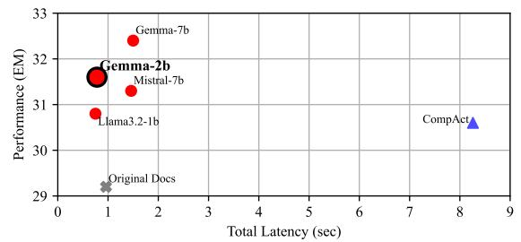

# **6.3** Computational Complexity and Efficiency Trade-offs

To strengthen the justification of EXIT's efficiency, we analyze not only latency but also computational complexity, measured in TFLOPs, using Deep-Speed's FlopsProfiler (Rasley et al., 2020). Table 2 reports the total FLOPs required for compression and reading (inference), as well as the resulting latency, all measured on a single A100-80GB GPU.

Table 3: Ablation studies on HQA examining (1) training data composition (Pos, H-Neg, Neg), (2) adaptive vs. fixed-length sentence selection, and (3) the impact of incorporating passage context during classification.

| Configuration                                       | EM ↑ |           | F1 ↑ # token ↓  |
|-----------------------------------------------------|------|-----------|-----------------|
| Ours (Pos + H-Neg + Neg)                            |      |           | 31.6 42.6 195.1 |
| Pos + H-Neg                                         |      | 30.0 41.3 | 286.8           |
| Pos + Neg                                           |      | 29.8 40.9 | 404.6           |
| w/o Adaptive Sentence Selection (2 sents) 29.4 40.7 |      |           | 91.0            |
| w/o Adaptive Sentence Selection (4 sents) 30.2 41.4 |      |           | 166.5           |
| w/o Passage as context                              |      | 30.4 42.3 | 157.4           |

Although EXIT incurs higher total TFLOPs (38.40) than some competing methods, its design enables parallel sentence-level classification, which significantly reduces end-to-end latency. By contrast, abstractive methods like CompAct and Refiner involve autoregressive decoding, which must be executed sequentially and is subject to memory I/O bottlenecks, leading to much longer runtimes (up to 12.86 seconds).

This reveals a key trade-off: EXIT utilizes more GPU computation, but this computation is efficiently executed in parallel. Since many LLM inference pipelines are memory-bound rather than compute-bound, EXIT takes advantage of underutilized compute capacity to reduce latency. For example, compared to the uncompressed baseline (0.95s), EXIT achieves a lower latency of 0.88s, despite higher FLOPs.

These results demonstrate that EXIT provides practical efficiency by converting increased computation into latency reduction through parallel execution, offering a better balance between accuracy and response time than autoregressive alternatives.

#### 6.4 Ablation Studies

To better understand how the design choices in EXIT affect its overall performance and efficiency, we conduct ablation studies focusing on three key components: data sampling strategy, adaptive sentence selection, and context-aware extraction. Table [3](#page-7-0) summarizes these results.

Data Sampling Strategy. Our training data combines positive, hard negative, and random negative samples to mirror the diversity of real-world retrieval scenarios. Compared to using only subsets of these sample types, the comprehensive strategy improves EM by 1.6 points over using only hard negatives and by 1.8 points over only random negatives. Relying solely on positive and random negatives led to excessive token retention, while depending only on hard negatives diminished the model's

> **[图片提取文字 (无描述)]:**
> 33 Gemma-7b Performance (EM) 32 Gemma-2b Mistral-7b CompAct\_ lama3.2-1b Original Docs 29 Total Latency (sec)

Figure 5: Ablation on HQA comparing EM scores and latency for different model configurations within EXIT (red dot). CompAct and Original Docs are included as indicators. Experiments on a single A100-80GB GPU.

ability to filter out spurious retrieval noise.

Adaptive Sentence Selection. We compare our adaptive selection mechanism to a fixed-length strategy, which limits selection to four sentences. While the fixed-length method reduces token count to 166.5, it lowers EM by 1.4 and F1 by 1.2 points. This highlights the importance of adapting sentence selection based on query complexity and document relevance rather than imposing a static constraint. Context-Aware Extraction. We evaluate the effect of considering full document context when determining sentence relevance. Removing surrounding context reduces token usage by 38 tokens but decreases EM by 1.2 points, highlighting the importance of contextual awareness in preserving answer accuracy. While context-aware extraction slightly increases token count, it ensures more precise and reliable responses.

These findings confirm that a balanced training data strategy enhances robustness, that adaptive sentence selection ensures efficiency, and that full document consideration preserves accuracy.

