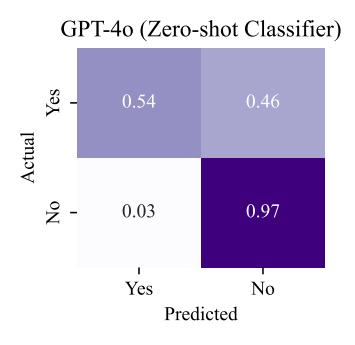

# 6.5 Compressor Model Size and Strategy Impact

Model Size Considerations. Figure [5](#page-7-1) presents an ablation study examining how different base models influence EM scores and total latency. Note that all models trained within EXIT achieve superior accuracy compared to uncompressed baselines and fast compression under 2 seconds. Specifically, Gemma-2B, our base classifier model, achieves a favorable balance between effectiveness and efficiency, delivering 31.6 EM points in 0.78s. When moving to the largest model, Gemma-7B, the highest accuracy (32.4 EM) is achieved, yet it also inflates latency to 1.50s, slightly exceeding the time of uncompressed documents. These results suggest that scaling up model parameters can improve

Table 4: Performance comparison across different retrieval and reranking methods on 2WIKI.

| Method                                                                                                 | EM                                          | F1                                           | #tok.                                              |  |  |  |  |  |
|--------------------------------------------------------------------------------------------------------|---------------------------------------------|----------------------------------------------|----------------------------------------------------|--|--|--|--|--|
| Passage-Level (Top-1)                                                                                  |                                             |                                              |                                                    |  |  |  |  |  |
| bge-m3 bge-reranker-v2-gemma RepLLaMA UPR Yes/No Ranking Prompt Pairwise Ranking Prompt | 14.6 15.0 16.0 9.2 13.4 13.2 | 22.7 22.9 24.1 16.8 21.8 21.5 | 156.5 156.2 157.2 155.3 157.5 156.2 |  |  |  |  |  |
| Sentence-Level (Top-5)                                                                                 |                                             |                                              |                                                    |  |  |  |  |  |
| bge-m3 bge-reranker-v2-gemma RepLLaMA UPR Yes/No ranking prompt Pairwise ranking prompt | 16.6 18.4 14.8 7.4 14.6 11.6 | 24.2 26.2 23.2 14.6 21.8 19.4 | 216.9 203.2 239.0 148.9 135.6 209.9 |  |  |  |  |  |
| Ours                                                                                                   | 24.8                                        | 30.1                                         | 150.2                                              |  |  |  |  |  |

performance but may also compromise latency benefits, emphasizing the flexibility of our proposed method by selecting an appropriate model depending on the user requirement.

Abstractive vs. Extractive Compression. Figure [5](#page-7-1) also compares our extractive approach, EXIT, against CompAct, a 7B-scale abstractive compressor. Using Mistral-7B as the base model for both methods, EXIT (31.3 EM, 1.46s) significantly outperforms CompAct (30.6 EM, 8.26s) in terms of latency and maintains competitive accuracy. This stark difference underscores that the compression strategy, not the just model size, heavily influences efficiency. By relying on extraction rather than iterative summarization, EXIT capitalizes on a largescale model to preserve high accuracy without incurring prohibitively long inference time.

#### 6.6 Comparison with Reranking Methods

We compare EXIT with post-retrieval reranking methods in Table [4,](#page-8-0) including bge-m3 [\(Chen et al.,](#page-9-3) [2024a\)](#page-9-3), bge-reranker-v2-gemma [\(Li et al.,](#page-11-8) [2023a\)](#page-11-8), RepLLaMA [\(Ma et al.,](#page-12-11) [2024\)](#page-12-11), UPR [\(Sachan et al.,](#page-13-6) [2022\)](#page-13-6), Yes/No ranking prompting [\(Liang et al.,](#page-11-10) [2023\)](#page-11-10), and Pairwise ranking prompting [\(Qin et al.,](#page-12-12) [2024\)](#page-12-12). EXIT consistently achieves higher EM and F1 scores, demonstrating its ability to adaptively select query-relevant sentences while filtering out redundancy. By contrast, Top-k re-ranking methods rely on static ranking, often retaining irrelevant content, increasing token count, and diminishing output quality. Moreover, they lack sentence-level context awareness, treating sentences independently without considering their broader document context, which can lead to incoherent or incomplete retrieval. These results underscore EXIT's advan-

> **[图片提取文字 (无描述)]:**
> GPT-40 (Zero-shot Classifier) Yes 0.54 Actual 0.03 0.97 Yes No Predicted

Figure 6: Confusion matrix of GPT-4o zero-shot classifier on HotpotQA. The model demonstrates high precision for identifying irrelevant sentences ("No") but shows moderate recall for relevant ones ("Yes").

tage in providing a more efficient and contextually relevant input for RAG than other post-retrieval methods.

#### 6.7 Leveraging LLMs for Pseudo-Annotation

To explore scalable alternatives to manual sentencelevel annotations, we evaluated the use of a large language model (GPT-4o) as a zero-shot relevance classifier for generating pseudo-labels. Without any fine-tuning, GPT-4o achieved strong filtering precision, correctly identifying 97% of irrelevant sentences, though with lower recall (54%) for relevant ones (Figure [6\)](#page-8-1). Despite this, EXIT trained with GPT-4o annotations still delivered competitive QA performance (Table [14\)](#page-20-0), highlighting the feasibility of LLM-based pseudo-annotation as a scalable supervision strategy. These findings suggest a promising direction for improving generalization across domains by leveraging LLM-generated training data beyond curated datasets like HQA.

