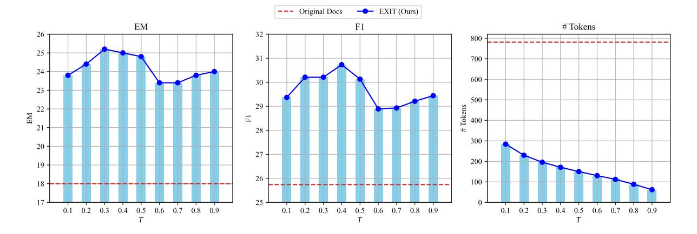

# C.8 Adaptability of EXIT to Different Supervision Signals

A key strength of EXIT is its ability to integrate different classifiers for sentence selection without

Table 12: Average end-to-end latency (seconds per sample) across different compression methods. Results are the mean and standard deviation (Std) over five runs. Experiments for the 8B reader were conducted on a single A100-80GB SXM GPU, and for the 70B reader on four A100-80GB SXM GPUs.

| 8B Reader                    | Compression      |                  |                  | Reading          | Total            |                  |
|------------------------------|------------------|------------------|------------------|------------------|------------------|------------------|
| Method                       | Avg              | Std              | Avg              | Std              | Avg              | Std              |
| Original Docs                | –                | –                | 0.9481           | 0.0056           | 0.9481           | 0.0056           |
| RECOMP-Abst                  | 1.9967           | 0.0159           | 0.3177           | 0.0008           | 2.3144           | 0.0167           |
| CompAct                      | 12.4682          | 0.0030           | 0.3930           | 0.0006           | 12.8612          | 0.0036           |
| Refiner                      | 6.3881           | 0.0332           | 0.3877           | 0.0012           | 6.7758           | 0.0344           |
| RECOMP-Extr                  | 0.0279           | 0.0022           | 0.3668           | 0.0040           | 0.3947           | 0.0062           |
| LongLLMLingua                | 0.3721           | 0.0050           | 0.4526           | 0.0004           | 0.8247           | 0.0054           |
| EXIT (Ours)                  | 0.4263           | 0.0031           | 0.4529           | 0.0028           | 0.8792           | 0.0059           |
| 70B Reader                   | Compression      |                  | Reading          |                  | Total            |                  |
| Method                       | Avg              | Std              | Avg              | Std              | Avg              | Std              |
| Original Docs                | –                | –                | 8.0835           | 0.0072           | 8.0835           | 0.0072           |
|                              |                  |                  |                  |                  |                  |                  |
|                              |                  |                  |                  |                  |                  |                  |
| RECOMP-Abst                  | 1.8621           | 0.0171           | 2.3210           | 0.0113           | 4.1831           | 0.0284           |
| CompAct                      | 15.1999          | 0.0132           | 2.6932           | 0.0007           | 17.8931          | 0.0139           |
| Refiner                      | 8.3520           | 0.0248           | 3.0993           | 0.0017           | 11.4513          | 0.0265           |
| RECOMP-Extr LongLLMLingua | 0.0329 0.4788 | 0.0069 0.0127 | 2.8288 3.7121 | 0.0031 0.0012 | 2.8617 4.1909 | 0.0100 0.0139 |

> **[图片提取文字 (无描述)]:**
> --- Original Docs EXIT (Ours) F1 # Tokens EM 26 -25 31 700 24 600 30 -23 500 Tokens 22 Ξ 28 300 20 200 19 26 -100 0.3 0.4 0.5 0.6 0.7 0.2 0.3 0.4 0.7 0.8 0.9 0.2 0.8 0.9 0.5 0.6 0.8 0.2 0.3 0.4 0.5 0.6 0.7

Figure 7: Changes in EM, F1 score, and token count as the threshold τ for retaining sentences is adjusted.

being constrained to manually annotated datasets. To explore this flexibility, we evaluate an alternative approach where relevance scores are derived from GPT-4o without explicit fine-tuning. As shown in Table [14,](#page-20-0) EXIT maintains strong performance, outperforming or closely matching baselines such as LongLLMLingua and CompAct. This demonstrates that EXIT can leverage diverse supervision signals while remaining adaptable to different scoring mechanisms. Moreover, these results suggest the potential of utilizing large-scale pseudo-labeled data to further refine EXIT's training, enhancing scalability without relying strictly on human-labeled datasets. This adaptability highlights EXIT's robustness and practical applicability across various retrieval settings.

