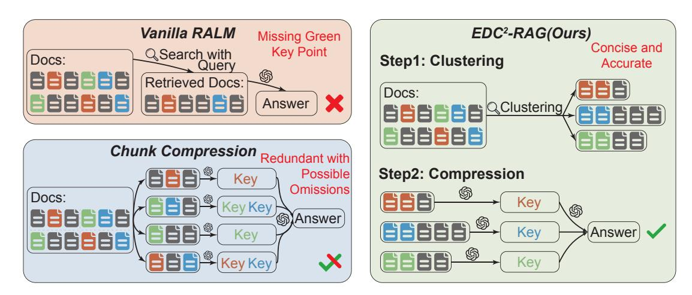

# 1 Introduction

In recent years, large language models (LLMs) have advanced rapidly, excelling in natural language processing (NLP) tasks such as question answering, code generation, and even medical diagnosis [\(Yasunaga et al.,](#page-11-0) [2021;](#page-11-0) [He et al.,](#page-9-0) [2025;](#page-9-0) [Yue et al.,](#page-11-1) [2023;](#page-11-1) [Singhal et al.,](#page-10-0) [2023;](#page-10-0) [Li et al.,](#page-9-1) [2024a\)](#page-9-1). Despite their success, LLMs face two key challenges: expensive knowledge updates due to the large number of learnable parameters, and hallucinations that lead to misleading content [\(Honovich et al.,](#page-9-2) [2023;](#page-9-2) [Hu et al.,](#page-9-3) [2023;](#page-9-3) [Lin et al.,](#page-10-1) [2024;](#page-10-1) [Xu et al.,](#page-10-2) [2024\)](#page-10-2). These issues impact the availability, reliability and

\*Email: liwt23@mails.tsinghua.edu.cn † corresponding authors.

consistency of LLMs [\(Zhou et al.,](#page-11-2) [2024\)](#page-11-2). Retrievalaugmented generation (RAG) [\(Lewis et al.,](#page-9-4) [2020;](#page-9-4) [Borgeaud et al.,](#page-9-5) [2022;](#page-9-5) [Izacard et al.,](#page-9-6) [2022\)](#page-9-6) addresses these problems by integrating retrieval with generation, allowing LLMs to access external knowledge without parameter updates, reducing hallucinations, and improving reliability.

However, the implementation of RAG methods in real-world settings presents significant challenges. From a structural perspective, the effectiveness of RAG frameworks derives from the information augmentation of integrated databases[\(Lewis](#page-9-4) [et al.,](#page-9-4) [2020\)](#page-9-4). In practical applications, the databases are often of limited quality due to the scarcity of high-quality data and the high cost of data cleaning. Therefore, the candidate documents faced by retrievers tend to exhibit the following frequentlyencountered quality flaws:

- Noise: irrelevant content to the query, which may result in errors during generation.
- Redundancy: highly similar content between documents, which will consume more tokens and time in inference.

These issues can significantly reduce the effectiveness of retrieval and compromise the quality of the final generated output. Faced with these practical challenges, it is increasingly significant to build a reliable RAG system. However, current RAG frameworks predominantly rely on querydocument similarity for retrieval, without explicitly addressing prevalent issues such as noise and redundancy in real-world document corpora. To solve the problems, we propose an efficient dynamic clustering-based compression method for a reliable document retrieval.

Specifically, we first encode the documents to get a denser content representation, then perform clustering to aggregate semantically similar documents, mitigating content repetition. Subsequently, we use prompt-based techniques to guide the LLMs

<span id="page-1-0"></span>> **[图片提取文字 (无描述)]:**
> EDC2-RAG(Ours) Vanilla RALM Missing Green Concise and **Key Point** Q Search with Step1: Clustering Docs: Accurate Query (G) Retrieved Docs: Docs: Answer Q Clustering Chunk Compression Redundant with Step2: Compression Possible Key **Omissions** Docs: Key (S) Answer Key Answer Kev


Figure 1: Comparison between our method and prior approaches. Unlike Vanilla RAG, which misses key information, and Chunk Compression, which is redundant and incomplete, our method clusters and compresses documents to extract concise and accurate answers.

in query-specific compression to improve information density and eliminate noise. Finally, we concatenate the compressed content into the prompts for response generation. In summary, our method leverages the latent relationships between documents to reduce noise and redundant content.

To validate the effectiveness of our approach, we selected two types of widely used datasets: KQA tasks and hallucination detection tasks. Systematic experiments conducted on GPT-3.5-Turbo demonstrate that our method achieves significant performance improvements across different settings. Meanwhile, our method also exhibits strong robustness and generalization potential to other scenarios. These findings indicate that by deeply exploring and utilizing fine-grained relationships among documents, RAG methods can reach new performance heights, providing a novel direction for addressing the hallucination problem and knowledge update challenges in LLMs.

The main contributions of our work are:

- To the best of our knowledge, we are the first to apply similarity-based semantic clustering in the post-retrieval stage to address practical challenges in in-the-wild RAG systems.
- Our method effectively improves the performance and robustness of the RAG systems and also enhances their long context capability.
- As a post-retrieval method, our approach is plug-and-play, requiring no additional training, and can be integrated into various pipelines.

### 2 Related Works

Reranking and Compression. Post-retrieval methods for frozen large language models (LLMs) can be categorized into reranking and compression approaches [\(Gao et al.,](#page-9-7) [2023b\)](#page-9-7). Reranking refines the order of retrieved documents to improve LLMsgeneration performance. Re3val [\(Song et al.,](#page-10-3) [2024\)](#page-10-3) uses reinforcement learning (RL) and targeted queries, while REAR [\(Wang et al.,](#page-10-4) [2024\)](#page-10-4) utilizes LLaMA 2 [\(Touvron et al.,](#page-10-5) [2023\)](#page-10-5) for reranking, enhancing response quality. Compression methods condense retrieved content, primarily through fine-tuned models[\(Xu et al.,](#page-10-6) [2023;](#page-10-6) [Liu et al.,](#page-10-7) [2023;](#page-10-7) [Yu et al.,](#page-11-3) [2024\)](#page-11-3) or LLMs native capabilities. For instance, SURE [\(Kim et al.,](#page-9-8) [2023\)](#page-9-8) generates and selects the best answer by summarizing multiple responses. However, existing methods rarely address document noise and redundancy issues, whereas our approach tackles them with dynamic clustering and prompt-guided compression.

Retrieval Semantic Relation Modeling. Beyond post-retrieval methods, some studies focus on refining relationships between documents, chunks or entities. Recent approaches frame RAG as a multi-agent collaboration, where each agent processes a subset of retrieved content. Long Agent [\(Zhao et al.,](#page-11-4) [2024\)](#page-11-4) supports large contexts through chunk-level conflict resolution, while MADAM-RAG [\(Wang et al.,](#page-10-8) [2025\)](#page-10-8) uses agents to address conflicting responses. Multi-agent RAG is also applied to data integration [\(Salve et al.,](#page-10-9) [2024\)](#page-10-9), but these methods increase inference costs and latency, limiting real-world applicability. Knowledge Graphs (KGs) structure document information by

#### Phase 1: Initialization 1: Input: Document set V = {d1, d2, . . . , dn}, query q, similarity function sim(·, ·), embedding model f(·), initial cluster size τ , threshold Λ 2: Output: Clusters {C1, C2, . . . , Ck} 3: Compute query embedding: vq ← f(q) 4: for all d<sup>j</sup> ∈ V do 5: Compute embedding: v<sup>j</sup> ← f(d<sup>j</sup> ) 6: end for 7: Select initial cluster root: C.R<sup>1</sup> ← arg maxd∈<sup>V</sup> sim(vq, v<sup>j</sup> ) 8: for all d<sup>j</sup> ∈ V do 9: Compute similarity: s<sup>j</sup> ← sim(vC.R<sup>1</sup> , v<sup>j</sup> ) 10: end for 11: Form C<sup>1</sup> with top-τ documents from V sorted by s<sup>j</sup> 12: Remove C<sup>1</sup> members from V Phase 2: Iterative Subgraph Formation 1: k ← 2 2: while V ̸= ∅ do 3: Select new root: C.R<sup>k</sup> ← arg maxd∈<sup>V</sup> sim(vq, v<sup>j</sup> ) 4: for all d<sup>j</sup> ∈ V do 5: Compute similarity: s<sup>j</sup> ← sim(vC.R<sup>k</sup> , v<sup>j</sup> ) 6: end for 7: Determine cluster size: size ← min(2 × |Ck−1|, Λ) 8: Form C<sup>k</sup> with top-size documents from V sorted by s<sup>j</sup> 9: Remove C<sup>k</sup> members from V 10: k ← k + 1 11: end while

Algorithm 1: Efficient Dynamic Graph-based Document Clustering

providing contextual relationships [\(Ji et al.,](#page-9-9) [2021\)](#page-9-9). KAPING builds a KG for retrieval [\(Baek et al.,](#page-9-10) [2023\)](#page-9-10), while G-Retriever queries subgraphs [\(He](#page-9-0) [et al.,](#page-9-0) [2025\)](#page-9-0). Despite their effectiveness in entityrich tasks, KG-based methods face scalability and adaptability challenges and often require substantial resources on the corpus processing side [\(Peng et al.,](#page-10-10) [2023;](#page-10-10) [Li et al.,](#page-10-11) [2024b\)](#page-10-11), and so does RAPTOR [\(Sarthi et al.,](#page-10-12) [2024\)](#page-10-12). Our method dynamically constructs semantic relationships postretrieval, avoiding multi-agent systems and prebuilt graphs, thereby improving retrieval quality by reducing redundancy and noise.

### 3 Problem Definition

Consider a set of retrieved documents V = {d1, d2, . . . , dn}, where each document d<sup>i</sup> is associated with a query q. These documents are retrieved based on their relevance to q, but their exact utility in answering q is initially unknown. Furthermore, there may exist potential overlaps and redundancies among the documents in V , as some documents may share similar or identical information, while others may provide complementary or conflicting details.

Let E = {eij} represent the relationships between pairs of documents d<sup>i</sup> and d<sup>j</sup> , where i, j ∈ {1, 2, . . . , n}. These relationships can be categorized as:

• Overlapping: eij = Overlap, indicating that d<sup>i</sup> and d<sup>j</sup> share redundant or highly similar content.

• Complementary: eij = Complementary, indicating that d<sup>i</sup> and d<sup>j</sup> provide distinct but relevant information to q.

Additionally, let U = {u1, u2, . . . , un} denote the utility scores of the documents, where u<sup>i</sup> represents the degree to which d<sup>i</sup> contributes to answering q. These scores are initially unknown and must be inferred based on the relationships E and the content of the documents.

The goal is to effectively utilize the retrieved documents V , their relationships E, and their inferred utilities U to construct a comprehensive and accurate response to the query q. This involves addressing the challenges of redundancy, inconsistency, and varying utility among the documents, while ensuring that the final output maximizes relevance and minimizes noise.

### 4 Method

### 4.1 Overview

The core of our approach involves clustering documents using embedding models guided by predefined rules, followed by applying compression techniques to eliminate noise. These refined documents are then integrated into the prompt, enabling the LLM to more effectively utilize the information and enhance its performance. Our methodology is presented in accordance with the processing workflow, and Figure [1](#page-1-0) provides a comparative visualization of our method against current RAG frameworks.

### 4.2 Efficient Dynamic Clustering of Documents

In RAG frameworks, retrieved documents often contain redundancy and noise, which can negatively impact the reasoning quality of LLMs. Traditional post-retrieval methods primarily rely on reranking or compression strategies to refine retrieved results, but they often fail to fully utilize the fine-grained relationships between documents.

To address this, we propose an efficient dynamic clustering-based approach to structure the retrieved documents before further processing. By organizing documents into clusters based on similarity, we aim to reduce redundancy and group related content together, creating a more coherent input for downstream tasks. Specifically, we prioritize documents with high similarity to the query, as these are most likely to contribute valuable information. Additionally, we adopt a dynamically expanding clustering strategy, where the cluster size increases iteratively, ensuring efficient grouping while keeping computational costs manageable. In our experiments, we set τ = 3 and Λ = 20.

#### 4.3 Query-Aware Compression

After constructing the subgraphs C1, C2, . . . , Ck, it is essential to further refine the retrieved content by eliminating redundancy and distilling key information. While clustering helps organize documents based on similarity, it does not inherently resolve the issue of overlapping or extraneous details.

To address this, we introduce a compression step that leverages a large language model (LLM) to generate concise yet informative summaries. Specifically, we concatenate each C<sup>i</sup> (i ∈ [1, k]) with the query q and prompt the LLM to produce a query-aware summary, ensuring that only the most relevant and essential content is preserved. The goal of this step is to maximize the information density of retrieved documents while removing redundant or marginally relevant details, preparing a high-quality input for final generation.

Importantly, this summarization process is highly efficient as all summaries can be generated in parallel, allowing the system to scale effectively with the number of clusters while maintaining low latency. An example prompt is as follows:

```
Compression Prompt
Few-shots:
{example 1}
{example 2}
{...}
Instruction:
Given a question and a set of reference documents,
extract only the verifiable, relevant information that
directly supports the question.
Avoid inferences or conclusions.
If nothing is relevant, output: "No content to
extract".
Question:
{query}
Documents:
{docs}
Extracted Summary:
{to be filled}
```

#### 4.4 Generation

After clustering and compression refine the documents, the system generates a contextually relevant response. Our query-aware integration ensures the output is based on coherent, information-rich content tailored to the query. To accommodate diverse dataset characteristics, our method flexibly adapts the generation process. In scenarios where compression may risk omitting critical details due to LLM limitations (such as in KQA tasks), we strategically integrate response generation with the compression phase, allowing the system to dynamically refine answers. This approach enhances the retention of essential information and improves response accuracy, particularly in complex questionanswering tasks. If compression yields poor summaries, the system falls back to original documents, ensuring robustness.

Unlike traditional RAG methods, which often rely on loosely structured retrieved documents, our approach enhances the informativeness of retrieved content by distilling critical insights in a query-driven manner. This structured input enables the LLM to reason more effectively, reducing hallucinations and improving response precision. Moreover, our method efficiently balances computational costs and performance by limiting the number of API calls required for summarization, ensuring practical deployment feasibility.

By optimizing the input for the final response generation step, our method improves both the precision and efficiency of the system, leading to more

reliable and contextually relevant outputs while reducing computational overhead.

### 5 Experimental Settings

### 5.1 Overview

To validate the effectiveness of our method, we employe three types of datasets in the experiments: Knowledge-QA datasets, Hallucination-Detection datasets, and Redundancy dataset built by us. The retrieval settings and implementation details for these datasets vary slightly, which are presented in Appendix [B.](#page-11-5)

We utilize GPT-3.5-Turbo-1106 and GPT-4omini-2024-07-18 as the backbone LLMs. For simplicity, we refer to GPT-3.5-Turbo-1106 as "Chat-GPT" and GPT-4o-mini-2024-07-18 as "GPT-4omini". The decoding temperature is fixed at 0 for reproducibility, with the exception of Long Agent and KQA sampling steps in our methods, where 0.7 is used to enhance output diversity.

### 5.2 Datasets

Knowledge-QA Datasets: Knowledge Question Answering (KQA) datasets assess a LLM's ability to reason over retrieved external knowledge sources from knowledge graphs or textual corpora. We use three common KQA datasets [\(Yu et al.,](#page-11-3) [2024;](#page-11-3) [Lv](#page-10-13) [et al.,](#page-10-13) [2024;](#page-10-13) [Song et al.,](#page-10-14) [2025\)](#page-10-14): WebQ [\(Berant et al.,](#page-9-11) [2013\)](#page-9-11) (single-hop), and 2WikiMultiHopQA [\(Ho](#page-9-12) [et al.,](#page-9-12) [2020\)](#page-9-12) (hereafter referred to as 2Wiki) plus Musique [\(Trivedi et al.,](#page-10-15) [2022\)](#page-10-15) (both multi-hop). To analyze noise robustness, following prior work [\(Lv](#page-10-13) [et al.,](#page-10-13) [2024;](#page-10-13) [Yu et al.,](#page-11-3) [2024\)](#page-11-3), we employ DPR retrieval and its reader to identify noisy documents, constructing cases with varying noise proportions by filtering samples from these three datasets. Details are in the Appendix [B.1.](#page-11-6)

Redundancy dataset: To evaluate the capability of our method in handling redundancy, we used DPR to retrieve Top-20 documents per question from the WebQ dataset. The redundancy rate r is defined as:

$$r = \frac{\text{number of rewritten documents}}{20}$$

Implementation details are provided the in Appendix [B.1.](#page-11-6)

Hallucination-Detection Datasets: Hallucination Detection is an NLP task that verifies whether generated or stated content—like summaries or answers—is factual or nonfactual by checking against available information sources. We conducte

experiments on three widely used fact-checking tasks [\(Li et al.,](#page-10-16) [2024c;](#page-10-16) [Lv et al.,](#page-10-13) [2024\)](#page-10-13): the FELM World Knowledge Subset [\(Chen et al.,](#page-9-13) [2023\)](#page-9-13), the WikiBio GPT-3 Dataset [\(Manakul et al.,](#page-10-17) [2023\)](#page-10-17), and the HaluEval Dataset [\(Li et al.,](#page-10-18) [2023\)](#page-10-18). Details are in the Appendix [B.2.](#page-12-0)

### 5.3 Baselines and Evaluation Metrics

We compare with several baselines: 1) Vanilla RALM [\(Borgeaud et al.,](#page-9-5) [2022\)](#page-9-5), the standard RAG process; 2) Chunk Compression [\(Jiang](#page-9-14) [et al.,](#page-9-14) [2024\)](#page-9-14), which compresses documents using an LLM; 3) Long Agent [\(Zhao et al.,](#page-11-4) [2024\)](#page-11-4), which divides long documents among collaborating agents with a leader agent aggregating outputs; 4) CEG [\(Li et al.,](#page-10-16) [2024c\)](#page-10-16), a strong post-hoc RAG baseline for hallucination detection; 5) Raptor, which leverages recursive abstractive processing for tree-organized retrieval; and 6) task-specific methods including HalluDetector [\(Wang et al.,](#page-10-19) [2023\)](#page-10-19), Focus [\(Zhang et al.,](#page-11-7) [2023\)](#page-11-7), SelfCheckGPT w/NLI [\(Manakul et al.,](#page-10-17) [2023\)](#page-10-17), CoT-augmented prompting [\(Kojima et al.,](#page-9-15) [2022\)](#page-9-15), and prompts augmented with hyperlinks to reference documents and with human-annotated reference documents [\(Chen](#page-9-13) [et al.,](#page-9-13) [2023\)](#page-9-13). Full details are in Appendix [B.3.](#page-13-0)

We use F1 score as the evaluation metric for the Knowledge-QA task, Balanced Acc for the FELM and WikiBio GPT-3 datasets, and Acc for the HaluEval dataset.

### 6 Experimental Results

### 6.1 Main Results on Knowledge-QA Datasets

#### 6.1.1 Results on Varying Top-k

Experimental results in Table [1](#page-5-0) demonstrate the effectiveness and robustness of our method across multiple datasets and LLM backends.

On Musique, our approach achieves the highest average F1-scores with both ChatGPT and GPT-4o-mini, consistently outperforming all baselines. Notably, while Long Agent performs well with ChatGPT, its performance drops significantly with GPT-4o-mini, indicating possible overfitting or reduced adaptability. In contrast, our method maintains strong performance across both models.

On WebQ, our method also achieves the best average performance with ChatGPT and GPT-4omini, showing improvements over Vanilla RALM and other compression-based methods. The results highlight the generalizability of our approach to both simple and diverse question types.

<span id="page-5-0"></span>

| Dataset | Method            |                        |                    |       |       | Top-k |       |       |       |
|---------|-------------------|------------------------|--------------------|-------|-------|-------|-------|-------|-------|
|         |                   | 5                      | 10                 | 20    | 30    | 50    | 70    | 100   | Avg   |
|         |                   |                        | gpt-3.5-turbo-1106 |       |       |       |       |       |       |
|         | Vanilla RALM      | 71.05                  | 71.73              | 74.75 | 76.93 | 75.16 | 80.25 | 77.04 | 75.27 |
|         | Chunk Compression | 74.45                  | 81.01              | 74.15 | 76.49 | 69.57 | 74.53 | 67.17 | 73.91 |
| Musique | Long Agent        | 83.07                  | 85.83              | 82.04 | 84.84 | 81.87 | 80.65 | 83.67 | 83.14 |
|         | Ours              | 81.66                  | 83.31              | 82.55 | 80.17 | 86.60 | 86.10 | 84.68 | 83.58 |
|         | Vanilla RALM      | 88.84                  | 90.14              | 90.07 | 90.30 | 91.13 | 90.74 | 91.38 | 90.89 |
|         | Chunk Compression | 90.52                  | 91.15              | 90.77 | 91.18 | 91.24 | 90.98 | 90.38 | 90.26 |
| WebQ    | Long Agent        | 89.79                  | 91.03              | 90.49 | 90.25 | 89.01 | 90.21 | 91.03 | 90.26 |
|         | Ours              | 92.01                  | 90.98              | 90.79 | 91.74 | 92.97 | 91.51 | 92.45 | 91.78 |
|         | Vanilla RALM      | 69.90                  | 74.68              | 77.51 | 71.36 | 78.25 | 76.88 | 79.17 | 75.39 |
|         | Chunk Compression | 67.38                  | 67.14              | 72.41 | 68.98 | 72.08 | 72.99 | 72.66 | 70.52 |
| 2Wiki   | Long Agent        | 69.30                  | 75.39              | 76.06 | 78.36 | 77.16 | 83.22 | 83.45 | 77.56 |
|         | Ours              | 73.09                  | 74.68              | 76.20 | 78.64 | 80.90 | 80.45 | 82.06 | 78.00 |
|         |                   | gpt-4o-mini-2024-07-18 |                    |       |       |       |       |       |       |
|         | Vanilla RALM      | 74.43                  | 78.85              | 77.78 | 74.95 | 78.55 | 76.24 | 78.20 | 77.00 |
|         | Chunk Compression | 77.12                  | 73.59              | 75.67 | 76.02 | 75.17 | 75.35 | 79.42 | 76.05 |
| Musique | RAPTOR            | 75.14                  | 69.40              | 72.07 | 73.49 | 78.65 | 70.61 | 74.89 | 73.46 |
|         | Long Agent        | 73.29                  | 75.25              | 80.43 | 72.52 | 80.03 | 80.85 | 77.38 | 77.11 |
|         | Ours              | 78.33                  | 79.80              | 81.71 | 73.13 | 78.21 | 77.95 | 80.07 | 78.46 |
|         | Vanilla RALM      | 85.92                  | 89.14              | 88.05 | 85.10 | 89.32 | 91.92 | 87.42 | 88.12 |
|         | Chunk Compression | 85.64                  | 84.99              | 85.07 | 83.98 | 88.66 | 90.79 | 90.94 | 87.15 |
| WebQ    | Long Agent        | 89.35                  | 89.16              | 90.77 | 91.08 | 91.82 | 90.91 | 91.52 | 90.66 |
|         | Ours              | 90.01                  | 90.77              | 91.89 | 90.30 | 91.51 | 91.25 | 92.02 | 91.11 |
|         | Vanilla RALM      | 64.81                  | 73.38              | 73.84 | 77.08 | 78.04 | 78.01 | 77.89 | 74.72 |
|         | Chunk Compression | 62.38                  | 65.76              | 69.24 | 67.62 | 72.45 | 73.26 | 74.06 | 69.25 |
| 2Wiki   | Long Agent        | 66.00                  | 70.04              | 71.33 | 77.68 | 79.98 | 77.13 | 83.45 | 75.09 |
|         | Ours              | 68.67                  | 69.79              | 72.86 | 73.73 | 75.82 | 77.43 | 79.28 | 73.94 |

Table 1: Performance comparison of different methods on MusiQue, WebQ, and 2Wiki Datasets Using GPT-3.5 turbo-1106 and GPT-4o-mini-2024-07-18 across various Top-k values.

For 2Wiki, a dataset requiring deeper reasoning, our method achieves the highest average with Chat-GPT again, and shows competitive performance with GPT-4o-mini. Moreover, our approach exhibits more stable behavior across top-k values, unlike some baselines that fluctuate significantly especially Chunk Compression, whose performance is inconsistent across different k.

Overall, these results confirm that our clusteringbased compression method is not only effective in preserving essential information and reducing redundancy, but also exhibits strong model-agnostic adaptability and stability across retrieval depths, making it a reliable choice for RAG pipelines.

### 6.1.2 Results on Noise Resistence

Tables [2](#page-6-0) and [11](#page-16-0) summarize performance under varying noise levels with Top-k set to 100 and 20, respectively. Our method consistently yields the highest average F1 scores across all datasets and

both model backends (ChatGPT and GPT-4o-mini). As noise increases, the performance gap over baselines widens, highlighting the robustness of our approach in noisy retrieval settings.

For instance, on MusiQue with ChatGPT at Topk=100, our method exceeds the best baseline by over 3.4 F1 points on average and ranks first across all noise levels. Even at 100% noise—when all retrieved documents are distractors—it achieves 84.54 F1, far surpassing the next-best score of 80.47. This demonstrates our compression strategy's ability to suppress irrelevant content and recover useful signals from fully corrupted inputs.

Results on 2Wiki reveal similar strengths. While other methods degrade sharply with noise, our approach sustains relatively high performance, maintaining a 5–7 point margin under heavy noise. This shows its robustness in multi-hop reasoning even with deeply buried evidence.

GPT-4o-mini results show greater overall stabil-

<span id="page-6-0"></span>

| Dataset | Method             |                        |       |       |       | Noise Rates (%) at Top-k=100 |       |       |  |
|---------|--------------------|------------------------|-------|-------|-------|------------------------------|-------|-------|--|
|         |                    | 0                      | 20    | 40    | 60    | 80                           | 100   | Avg   |  |
|         | gpt-3.5-turbo-1106 |                        |       |       |       |                              |       |       |  |
|         | Vanilla RALM       | 77.04                  | 82.48 | 79.32 | 76.49 | 79.45                        | 75.86 | 78.44 |  |
|         | Chunk Compression  | 67.17                  | 77.83 | 75.62 | 79.79 | 77.20                        | 75.81 | 75.57 |  |
| MusiQue | Long Agent         | 80.54                  | 79.52 | 79.29 | 84.08 | 77.20                        | 80.47 | 80.18 |  |
|         | Ours               | 84.68                  | 85.06 | 85.43 | 81.84 | 80.32                        | 84.54 | 83.65 |  |
|         | Vanilla RALM       | 91.38                  | 88.88 | 88.28 | 88.85 | 87.54                        | 81.61 | 87.76 |  |
|         | Chunk Compression  | 90.38                  | 88.07 | 88.73 | 89.73 | 87.10                        | 82.87 | 87.81 |  |
| WebQ    | Long Agent         | 91.03                  | 90.79 | 90.07 | 88.39 | 90.17                        | 88.56 | 89.84 |  |
|         | Ours               | 92.45                  | 92.04 | 92.40 | 90.67 | 91.08                        | 90.20 | 91.47 |  |
|         | Vanilla RALM       | 79.17                  | 71.76 | 71.48 | 71.26 | 64.81                        | 58.95 | 69.57 |  |
|         | Chunk Compression  | 72.66                  | 65.74 | 66.76 | 69.96 | 66.20                        | 59.03 | 66.73 |  |
| 2Wiki   | Long Agent         | 83.45                  | 81.41 | 82.52 | 78.88 | 71.79                        | 70.92 | 78.16 |  |
|         | Ours               | 82.06                  | 77.78 | 74.69 | 78.14 | 76.71                        | 75.65 | 77.51 |  |
|         |                    | gpt-4o-mini-2024-07-18 |       |       |       |                              |       |       |  |
|         | Vanilla RALM       | 78.20                  | 76.55 | 72.70 | 67.36 | 76.49                        | 64.94 | 72.71 |  |
|         | Chunk Compression  | 79.42                  | 76.90 | 75.62 | 71.98 | 70.85                        | 69.66 | 74.07 |  |
| MusiQue | Long Agent         | 77.38                  | 75.93 | 74.76 | 73.44 | 76.58                        | 78.84 | 76.16 |  |
|         | Ours               | 80.07                  | 82.17 | 77.49 | 74.43 | 75.62                        | 78.70 | 78.08 |  |
|         | Vanilla RALM       | 87.42                  | 87.08 | 89.67 | 85.13 | 90.31                        | 84.89 | 87.42 |  |
|         | Chunk Compression  | 90.94                  | 90.06 | 89.30 | 89.64 | 88.68                        | 84.41 | 88.84 |  |
| WebQ    | Long Agent         | 91.77                  | 90.37 | 90.70 | 90.42 | 87.84                        | 86.67 | 89.63 |  |
|         | Ours               | 92.02                  | 91.42 | 89.31 | 88.97 | 89.82                        | 86.83 | 89.73 |  |
|         | Vanilla RALM       | 77.89                  | 77.83 | 75.79 | 77.15 | 72.69                        | 66.67 | 74.67 |  |
|         | Chunk Compression  | 74.06                  | 75.19 | 75.58 | 73.88 | 70.65                        | 63.54 | 72.15 |  |
| 2Wiki   | Long Agent         | 83.45                  | 81.13 | 76.97 | 73.99 | 64.06                        | 59.64 | 73.21 |  |
|         | Ours               | 79.28                  | 76.27 | 75.35 | 71.96 | 70.64                        | 68.67 | 73.70 |  |

Table 2: Comparison of F1 scores under different noise levels at Top-k=100 on MusiQue, WebQ, and 2Wiki datasets for multiple retrieval methods.

ity than ChatGPT, but our method remains consistently superior. On MusiQue, it achieves 79.11 average F1, compared to 76.55 by Long Agent, again outperforming strong long-context baselines.

Under the Top-k=20 setting, where retrieval is constrained and noise more impactful, our method remains highly resilient. On WebQ and MusiQue, it sustains strong performance even under 80–100% noise, while baselines drop sharply—demonstrating that our compression mechanism works effectively not only for large retrieval sets but also in low-budget scenarios where every document matters.

#### 6.1.3 Results on Redundancy Resistence

Table [3](#page-7-0) reports performance under varying redundancy rates. Our method achieves the highest average F1 on WebQ, outperforming RALM in highredundancy settings with a peak gain of +6.18 at 95% redundancy. This demonstrates its effectiveness in handling redundant information while preserving retrieval quality.

In summary, our method's consistent advantage across noise levels, datasets, and LLM backends highlights the generalizability and robustness of the compression strategy. By filtering irrelevant content and distilling key evidence, it boosts downstream performance and offers a reliable solution for noisy retrieval in RAG pipelines.

### 6.2 Main Results on Hallucination Detection

Table [5](#page-7-1) presents a performance comparison of our proposed method against baseline approaches across three Hallucination-Detection datasets: FELM, WikiBio, and HaluEval. Results are reported as Maximum and Average accuracy over Top-k predictions (k from 1 to 10), with balanced accuracy used for FELM and WikiBio, and standard accuracy for HaluEval. Improvements over the best baseline are highlighted in green.

In the FELM dataset, our method achieves the highest maximum accuracy, surpassing baselines

<span id="page-7-0"></span>

| Dataset | Method            |       | Redundancy Rates (%) at Top-k=20 |       |       |       |       |       |  |  |  |
|---------|-------------------|-------|----------------------------------|-------|-------|-------|-------|-------|--|--|--|
|         |                   | 0     | 20                               | 40    | 60    | 80    | 95    | Avg   |  |  |  |
|         | Vanilla RALM      | 90.07 | 87.67                            | 89.76 | 89.00 | 88.17 | 83.04 | 87.95 |  |  |  |
|         | Chunk Compression | 90.77 | 89.74                            | 90.21 | 90.96 | 90.90 | 87.01 | 89.93 |  |  |  |
| WebQ    | Long Agent        | 90.25 | 92.31                            | 88.75 | 88.98 | 90.95 | 89.89 | 90.19 |  |  |  |
|         | Ours              | 92.01 | 91.33                            | 90.96 | 91.07 | 90.93 | 89.22 | 90.92 |  |  |  |

<span id="page-7-2"></span>Table 3: Performance on WebQ under different redundancy rates (Top-k=20). Values in parentheses indicate differences from Vanilla RALM. Green indicates improvement, red indicates decline.

| Dataset | Method  |       | Noise Rates (%) at Top-k=20 |       |       |       |       |       |  |  |  |
|---------|---------|-------|-----------------------------|-------|-------|-------|-------|-------|--|--|--|
|         |         | 0     | 20                          | 40    | 60    | 80    | 100   | Avg   |  |  |  |
|         | Dynamic | 90.79 | 91.87                       | 90.75 | 91.00 | 89.23 | 87.87 | 90.25 |  |  |  |
| WebQ    | Avg     | 88.94 | 89.07                       | 89.92 | 86.80 | 86.53 | 86.96 | 88.04 |  |  |  |
|         | Random  | 90.40 | 86.84                       | 85.81 | 86.81 | 87.78 | 88.19 | 87.64 |  |  |  |

Table 4: Ablation study on clustering strategies under varying noise rates on WebQ.

like Vanilla, CoT, Link. Our method performs only slightly below Doc, which benefits from manually annotated golden documents. Its average accuracy reflects a modest improvement over the CEG baseline, demonstrating robustness across varying k values. For WikiBio GPT-3, our method performs competitively, slightly improving average accuracy over CEG and outperforming HalluDetector, Focus, and SelfCheckGPT, indicating consistent detection in biographical data. In HaluEval, our method records the highest performance, with a notable improvement over CEG, showcasing its effectiveness in open-domain settings.

<span id="page-7-1"></span>

| Dataset  | Methods       | Accuracy<br>(Top-k, k=1∼10) |
|----------|---------------|-----------------------------|
|          | Vanilla       | 58.18                       |
|          | CoT           | 61.32                       |
|          | Link          | 56.78                       |
| FELM     | Doc           | 65.18                       |
|          | CEG           | 63.35 / 61.89               |
|          | Ours          | 64.03 / 62.26+0.37          |
|          | HalluDetector | 74.82                       |
|          | Focus         | 74.08                       |
| WikiBio  | SelfCheckGPT  | 70.55                       |
|          | CEG           | 76.58 / 74.14               |
|          | Ours          | 75.89 / 74.29+0.15          |
|          | CEG           | 78.10 / 76.93               |
| HaluEval | Ours          | 78.85 / 77.87+0.94          |

Table 5: Performance comparison on Hallucination-Detection datasets. Each entry shows Max / Avg accuracy over Top-k. Metric: Accuracy for HaluEval; Balanced Accuracy for WikiBio GPT-3 and FELM.

Overall, our method consistently outperforms or matches the best baselines across all datasets, with improvements in average accuracy. These results highlight its stability and generalizability, making it a promising approach for reducing hallucinations in applications like automated fact-checking.

### 6.3 Effectiveness of Clustering Strategies

To validate the effectiveness of our clustering method, we compare it with two alternative strategies—Average Clustering and Random Clustering—that match our dynamic clustering in both the number of clusters and the overall document compression ratio for a controlled comparison. Average Clustering groups documents by their similarity rank to the query and distributes them evenly across clusters, while Random Clustering assigns documents randomly from the top-k pool, maintaining the same number and size of clusters as dynamic clustering.

Table [4](#page-7-2) compares these strategies on WebQ under different noise rates. Our method achieves highest average F1, outperforming baselines. Average Clustering and Random Clustering obtain lower F1, and degrade more under high noise. These results highlight the effectiveness of our entropy-guided dynamic clustering in document compression.

Further validation is provided by evaluating clustering consistency on the Musique dataset using GPT-4o-mini-2024-07-18 for document classification. We measure the intra-class clustering probability for documents labeled as "useful" or "noise,"

<span id="page-8-1"></span>

|           | Top-k = 20 |   |   |   |             |   |   |                                                                                                                          |   |    |    |  |
|-----------|------------|---|---|---|-------------|---|---|--------------------------------------------------------------------------------------------------------------------------|---|----|----|--|
| τ         | 1          | 2 | 3 | 4 | 5           | 6 | 7 | 8                                                                                                                        | 9 | 10 | 20 |  |
| API Calls | 5          | 4 | 3 | 3 | 3           | 2 | 2 | 2                                                                                                                        | 2 | 2  | 1  |  |
| F1 (%)    |            |   |   |   |             |   |   | 72.86±1.62 73.07±2.40 76.85±1.98 77.15±2.89 74.70±0.09 76.69±3.74 76.51±2.11 74.88±1.82 77.63±0.82 73.55±3.42 73.71±1.93 |   |    |    |  |
|           |            |   |   |   | Top-k = 100 |   |   |                                                                                                                          |   |    |    |  |
| τ         | 1          | 2 | 3 | 4 | 5           | 6 | 7 | 8                                                                                                                        | 9 | 10 | 20 |  |
| API Calls | 7          | 6 | 6 | 5 | 5           | 5 | 4 | 4                                                                                                                        | 4 | 4  | 3  |  |
| F1 (%)    |            |   |   |   |             |   |   | 78.54±3.74 78.33±1.70 80.73±3.90 80.21±3.12 76.66±3.32 76.86±2.14 76.80±2.02 77.41±2.69 77.85±1.17 77.78±2.14 77.97±2.09 |   |    |    |  |

Table 6: Ablation study results on Musique dataset (GPT-4o-mini-2024-07-18) for varying τ at top-k = 20 and top-k = 100 (noise = 40%).

defined as:

$$\frac{\sum_{i,j \in \text{same-class}, i < j} \mathbb{1}[\text{cluster}(i) = \text{cluster}(j)]}{\binom{N_{\text{same-class}}}{2}}$$

Table [7](#page-8-0) summarizes these metrics under varying top-k and noise levels, with random baselines using the same number of clusters. Our method exhibits probabilities exceeding random baselines, demonstrating significant semantic consistency and robustness, particularly under high noise.

<span id="page-8-0"></span>

| Noise Rates (%) at Top-k = 20            |    |                         |    |    |  |  |  |  |  |
|------------------------------------------|----|-------------------------|----|----|--|--|--|--|--|
| Metric                                   | 20 | 40                      | 60 | 80 |  |  |  |  |  |
| Useful Prob. (%)                         |    | 35.87 36.59 36.43 39.37 |    |    |  |  |  |  |  |
| Rand. Useful (%) 33.33 33.33 33.33 33.33 |    |                         |    |    |  |  |  |  |  |
| Noise Prob. (%)                          |    | 31.43 34.97 35.22 35.05 |    |    |  |  |  |  |  |
| Rand. Noise (%)                          |    | 33.33 33.33 33.33 33.33 |    |    |  |  |  |  |  |
| Noise Rates (%) at Top-k = 100           |    |                         |    |    |  |  |  |  |  |
| Metric                                   | 20 | 40                      | 60 | 80 |  |  |  |  |  |
| Useful Prob. (%)                         |    | 19.09 20.49 18.80 19.11 |    |    |  |  |  |  |  |
| Rand. Useful (%) 14.56 14.62 14.29 14.29 |    |                         |    |    |  |  |  |  |  |
| Noise Prob. (%)                          |    | 20.31 20.19 17.35 17.03 |    |    |  |  |  |  |  |
| Rand. Noise (%)                          |    | 14.56 14.62 14.29 14.29 |    |    |  |  |  |  |  |

Table 7: Clustering consistency metrics on Musique dataset (GPT-4o-mini-2024-07-18 classification) under varying top-k and noise levels, displayed for Top-k = 20 and Top-k = 100.

The modest gains over baselines stem from (i) the lightweight, dated nature of SimCSE-BERT (circa 2021), which constrains fine-grained semantic capture, and (ii) the binary "useful"/"noise" labels inadequately capturing nuanced real-world document interrelations.

### 6.4 Ablation Studies on τ

We conduct ablation studies on the Musique dataset with GPT-4o-mini-2024-07-18 (top-k = 20 and 100,

noise = 40%), evaluating the initial cluster count (τ ) across three independent trials. We report the mean and unbiased standard deviation of F1 scores and API call counts, with Λ fixed for consistency. The results, presented in Table [6,](#page-8-1) demonstrate stable performance across a wide range of τ , affirming the robustness of our design.

### 7 Conclusion

In this study, we design an efficient dynamic clustering algorithm and apply compression techniques to exploit fine-grained relationships between documents. Our method EDC<sup>2</sup> -RAG enhances evidence quality by filtering noise and capturing detailed document relationships, achieving consistent performance improvements on three Hallucination-Detection datasets and three KQA datasets, thus demonstrating the strong robustness and broad applicability of our method. Extensive evaluations show that our approach outperforms competitive baselines across multiple metrics and model backbones.

### Limitations

Our study has several limitations: 1) Due to time constraints, we did not validate the generalization ability of our method on more datasets and base models. 2) Using compression technique incurs some API consumption, but these costs are within an acceptable range. See Appendix [A](#page-11-8) for details.

### Acknowledgements

This work is supported by the National Natural Science Foundation of China (62372260, 62276152), and Wuxi Research Institute of Applied Technologies, Tsinghua University. Weizhi Ma is also supported by Beijing Nova Program.

### References

- <span id="page-9-10"></span>Jinheon Baek, Alham Fikri Aji, and Amir Saffari. 2023. [Knowledge-augmented language model prompting](https://doi.org/10.18653/v1/2023.matching-1.7) [for zero-shot knowledge graph question answering.](https://doi.org/10.18653/v1/2023.matching-1.7) In *Proceedings of the First Workshop on Matching From Unstructured and Structured Data (MATCH-ING 2023)*, pages 70–98, Toronto, ON, Canada. Association for Computational Linguistics.
- <span id="page-9-11"></span>Jonathan Berant, Andrew Chou, Roy Frostig, and Percy Liang. 2013. Semantic parsing on freebase from question-answer pairs. In *Proceedings of the 2013 conference on empirical methods in natural language processing*, pages 1533–1544.
- <span id="page-9-5"></span>Sebastian Borgeaud, Arthur Mensch, Jordan Hoffmann, Trevor Cai, Eliza Rutherford, Katie Millican, George Bm Van Den Driessche, Jean-Baptiste Lespiau, Bogdan Damoc, Aidan Clark, and 1 others. 2022. Improving language models by retrieving from trillions of tokens. In *International conference on machine learning*, pages 2206–2240. PMLR.
- <span id="page-9-13"></span>Shiqi Chen, Yiran Zhao, Jinghan Zhang, I Chern, Siyang Gao, Pengfei Liu, Junxian He, and 1 others. 2023. Felm: Benchmarking factuality evaluation of large language models. *arXiv preprint arXiv:2310.00741*.
- <span id="page-9-18"></span>Tianyu Gao, Xingcheng Yao, and Danqi Chen. 2021. [SimCSE: Simple contrastive learning of sentence em](https://doi.org/10.18653/v1/2021.emnlp-main.552)[beddings.](https://doi.org/10.18653/v1/2021.emnlp-main.552) In *Proceedings of the 2021 Conference on Empirical Methods in Natural Language Processing*, pages 6894–6910, Online and Punta Cana, Dominican Republic. Association for Computational Linguistics.
- <span id="page-9-16"></span>Tianyu Gao, Howard Yen, Jiatong Yu, and Danqi Chen. 2023a. [Enabling large language models to generate](https://doi.org/10.18653/v1/2023.emnlp-main.398) [text with citations.](https://doi.org/10.18653/v1/2023.emnlp-main.398) In *Proceedings of the 2023 Conference on Empirical Methods in Natural Language Processing*, pages 6465–6488, Singapore. Association for Computational Linguistics.
- <span id="page-9-7"></span>Yunfan Gao, Yun Xiong, Xinyu Gao, Kangxiang Jia, Jinliu Pan, Yuxi Bi, Yi Dai, Jiawei Sun, and Haofen Wang. 2023b. Retrieval-augmented generation for large language models: A survey. *arXiv preprint arXiv:2312.10997*.
- <span id="page-9-0"></span>Xiaoxin He, Yijun Tian, Yifei Sun, Nitesh Chawla, Thomas Laurent, Yann LeCun, Xavier Bresson, and Bryan Hooi. 2025. G-retriever: Retrieval-augmented generation for textual graph understanding and question answering. *Advances in Neural Information Processing Systems*, 37:132876–132907.
- <span id="page-9-12"></span>Xanh Ho, Anh-Khoa Duong Nguyen, Saku Sugawara, and Akiko Aizawa. 2020. [Constructing a multi](https://doi.org/10.18653/v1/2020.coling-main.580)[hop QA dataset for comprehensive evaluation of](https://doi.org/10.18653/v1/2020.coling-main.580) [reasoning steps.](https://doi.org/10.18653/v1/2020.coling-main.580) In *Proceedings of the 28th International Conference on Computational Linguistics*, pages 6609–6625, Barcelona, Spain (Online). International Committee on Computational Linguistics.

- <span id="page-9-2"></span>Or Honovich, Thomas Scialom, Omer Levy, and Timo Schick. 2023. Unnatural instructions: Tuning language models with (almost) no human labor. In *Proceedings of the 61st Annual Meeting of the Association for Computational Linguistics (Volume 1: Long Papers)*, pages 14409–14428.
- <span id="page-9-3"></span>Xuming Hu, Junzhe Chen, Xiaochuan Li, Yufei Guo, Lijie Wen, Philip S Yu, and Zhijiang Guo. 2023. Do large language models know about facts? *arXiv preprint arXiv:2310.05177*.
- <span id="page-9-6"></span>Gautier Izacard, Patrick Lewis, Maria Lomeli, Lucas Hosseini, Fabio Petroni, Timo Schick, Jane Dwivedi-Yu, Armand Joulin, Sebastian Riedel, and Edouard Grave. 2022. Few-shot learning with retrieval augmented language models. *arXiv preprint arXiv:2208.03299*.
- <span id="page-9-9"></span>Shaoxiong Ji, Shirui Pan, Erik Cambria, Pekka Marttinen, and Philip S Yu. 2021. A survey on knowledge graphs: Representation, acquisition, and applications. *IEEE transactions on neural networks and learning systems*, 33(2):494–514.
- <span id="page-9-14"></span>Huiqiang Jiang, Qianhui Wu, Xufang Luo, Dongsheng Li, Chin-Yew Lin, Yuqing Yang, and Lili Qiu. 2024. [LongLLMLingua: Accelerating and enhanc](https://doi.org/10.18653/v1/2024.acl-long.91)[ing LLMs in long context scenarios via prompt com](https://doi.org/10.18653/v1/2024.acl-long.91)[pression.](https://doi.org/10.18653/v1/2024.acl-long.91) In *Proceedings of the 62nd Annual Meeting of the Association for Computational Linguistics (Volume 1: Long Papers)*, pages 1658–1677, Bangkok, Thailand. Association for Computational Linguistics.
- <span id="page-9-17"></span>Vladimir Karpukhin, Barlas Oguz, Sewon Min, Patrick Lewis, Ledell Wu, Sergey Edunov, Danqi Chen, and Wen-tau Yih. 2020. [Dense passage retrieval for open](https://doi.org/10.18653/v1/2020.emnlp-main.550)[domain question answering.](https://doi.org/10.18653/v1/2020.emnlp-main.550) In *Proceedings of the 2020 Conference on Empirical Methods in Natural Language Processing (EMNLP)*, pages 6769–6781, Online. Association for Computational Linguistics.
- <span id="page-9-8"></span>Jaehyung Kim, Jaehyun Nam, Sangwoo Mo, Jongjin Park, Sang-Woo Lee, Minjoon Seo, Jung-Woo Ha, and Jinwoo Shin. 2023. Sure: Improving opendomain question answering of llms via summarized retrieval. In *The Twelfth International Conference on Learning Representations*.
- <span id="page-9-15"></span>Takeshi Kojima, Shixiang Shane Gu, Machel Reid, Yutaka Matsuo, and Yusuke Iwasawa. 2022. Large language models are zero-shot reasoners. *Advances in neural information processing systems*, 35:22199– 22213.
- <span id="page-9-4"></span>Patrick Lewis, Ethan Perez, Aleksandra Piktus, Fabio Petroni, Vladimir Karpukhin, Naman Goyal, Heinrich Kuttler, Mike Lewis, Wen-tau Yih, Tim ¨ Rocktaschel, and 1 others. 2020. Retrieval- ¨ augmented generation for knowledge-intensive nlp tasks. *Advances in Neural Information Processing Systems*, 33:9459–9474.
- <span id="page-9-1"></span>Junkai Li, Yunghwei Lai, Weitao Li, Jingyi Ren, Meng Zhang, Xinhui Kang, Siyu Wang, Peng Li, Ya-Qin

- Zhang, Weizhi Ma, and 1 others. 2024a. Agent hospital: A simulacrum of hospital with evolvable medical agents. *arXiv preprint arXiv:2405.02957*.
- <span id="page-10-18"></span>Junyi Li, Xiaoxue Cheng, Xin Zhao, Jian-Yun Nie, and Ji-Rong Wen. 2023. [HaluEval: A large-scale hal](https://doi.org/10.18653/v1/2023.emnlp-main.397)[lucination evaluation benchmark for large language](https://doi.org/10.18653/v1/2023.emnlp-main.397) [models.](https://doi.org/10.18653/v1/2023.emnlp-main.397) In *Proceedings of the 2023 Conference on Empirical Methods in Natural Language Processing*, pages 6449–6464, Singapore. Association for Computational Linguistics.
- <span id="page-10-11"></span>Mufei Li, Siqi Miao, and Pan Li. 2024b. Simple is effective: The roles of graphs and large language models in knowledge-graph-based retrieval-augmented generation. *arXiv preprint arXiv:2410.20724*.
- <span id="page-10-16"></span>Weitao Li, Junkai Li, Weizhi Ma, and Yang Liu. 2024c. [Citation-enhanced generation for LLM-based chat](https://doi.org/10.18653/v1/2024.acl-long.79)[bots.](https://doi.org/10.18653/v1/2024.acl-long.79) In *Proceedings of the 62nd Annual Meeting of the Association for Computational Linguistics (Volume 1: Long Papers)*, pages 1451–1466, Bangkok, Thailand. Association for Computational Linguistics.
- <span id="page-10-1"></span>Zichao Lin, Shuyan Guan, Wending Zhang, Huiyan Zhang, Yugang Li, and Huaping Zhang. 2024. Towards trustworthy llms: a review on debiasing and dehallucinating in large language models. *Artificial Intelligence Review*, 57(9):243.
- <span id="page-10-7"></span>Junyi Liu, Liangzhi Li, Tong Xiang, Bowen Wang, and Yiming Qian. 2023. [TCRA-LLM: Token compres](https://doi.org/10.18653/v1/2023.findings-emnlp.655)[sion retrieval augmented large language model for](https://doi.org/10.18653/v1/2023.findings-emnlp.655) [inference cost reduction.](https://doi.org/10.18653/v1/2023.findings-emnlp.655) In *Findings of the Association for Computational Linguistics: EMNLP 2023*, pages 9796–9810, Singapore. Association for Computational Linguistics.
- <span id="page-10-13"></span>Qitan Lv, Jie Wang, Hanzhu Chen, Bin Li, Yongdong Zhang, and Feng Wu. 2024. Coarse-to-fine highlighting: Reducing knowledge hallucination in large language models. *arXiv preprint arXiv:2410.15116*.
- <span id="page-10-17"></span>Potsawee Manakul, Adian Liusie, and Mark Gales. 2023. [SelfCheckGPT: Zero-resource black-box hallucina](https://doi.org/10.18653/v1/2023.emnlp-main.557)[tion detection for generative large language models.](https://doi.org/10.18653/v1/2023.emnlp-main.557) In *Proceedings of the 2023 Conference on Empirical Methods in Natural Language Processing*, pages 9004–9017, Singapore. Association for Computational Linguistics.
- <span id="page-10-10"></span>Ciyuan Peng, Feng Xia, Mehdi Naseriparsa, and Francesco Osborne. 2023. Knowledge graphs: Opportunities and challenges. *Artificial Intelligence Review*, 56(11):13071–13102.
- <span id="page-10-9"></span>Aniruddha Salve, Saba Attar, Mahesh Deshmukh, Sayali Shivpuje, and Arnab Mitra Utsab. 2024. A collaborative multi-agent approach to retrieval-augmented generation across diverse data. *arXiv preprint arXiv:2412.05838*.
- <span id="page-10-12"></span>Parth Sarthi, Salman Abdullah, Aditi Tuli, Shubh Khanna, Anna Goldie, and Christopher D Manning. 2024. Raptor: Recursive abstractive processing for tree-organized retrieval. In *The Twelfth International Conference on Learning Representations*.

- <span id="page-10-0"></span>Karan Singhal, Tao Tu, Juraj Gottweis, Rory Sayres, Ellery Wulczyn, Le Hou, Kevin Clark, Stephen Pfohl, Heather Cole-Lewis, Darlene Neal, and 1 others. 2023. Towards expert-level medical question answering with large language models. *arXiv preprint arXiv:2305.09617*.
- <span id="page-10-3"></span>EuiYul Song, Sangryul Kim, Haeju Lee, Joonkee Kim, and James Thorne. 2024. [Re3val: Reinforced and](https://aclanthology.org/2024.findings-eacl.27/) [reranked generative retrieval.](https://aclanthology.org/2024.findings-eacl.27/) In *Findings of the Association for Computational Linguistics: EACL 2024*, pages 393–409, St. Julian's, Malta. Association for Computational Linguistics.
- <span id="page-10-14"></span>Huatong Song, Jinhao Jiang, Yingqian Min, Jie Chen, Zhipeng Chen, Wayne Xin Zhao, Lei Fang, and Ji-Rong Wen. 2025. R1-searcher: Incentivizing the search capability in llms via reinforcement learning. *arXiv preprint arXiv:2503.05592*.
- <span id="page-10-5"></span>Hugo Touvron, Louis Martin, Kevin Stone, Peter Albert, Amjad Almahairi, Yasmine Babaei, Nikolay Bashlykov, Soumya Batra, Prajjwal Bhargava, Shruti Bhosale, and 1 others. 2023. Llama 2: Open foundation and fine-tuned chat models. *arXiv preprint arXiv:2307.09288*.
- <span id="page-10-15"></span>Harsh Trivedi, Niranjan Balasubramanian, Tushar Khot, and Ashish Sabharwal. 2022. [MuSiQue: Multi](https://doi.org/10.1162/tacl_a_00475)[hop questions via single-hop question composition.](https://doi.org/10.1162/tacl_a_00475) *Transactions of the Association for Computational Linguistics*, 10:539–554.
- <span id="page-10-8"></span>Han Wang, Archiki Prasad, Elias Stengel-Eskin, and Mohit Bansal. 2025. Retrieval-augmented generation with conflicting evidence. *arXiv preprint arXiv:2504.13079*.
- <span id="page-10-19"></span>Xiaohua Wang, Yuliang Yan, Longtao Huang, Xiaoqing Zheng, and Xuanjing Huang. 2023. [Hallucination](https://doi.org/10.18653/v1/2023.emnlp-main.949) [detection for generative large language models by](https://doi.org/10.18653/v1/2023.emnlp-main.949) [Bayesian sequential estimation.](https://doi.org/10.18653/v1/2023.emnlp-main.949) In *Proceedings of the 2023 Conference on Empirical Methods in Natural Language Processing*, pages 15361–15371, Singapore. Association for Computational Linguistics.
- <span id="page-10-4"></span>Yuhao Wang, Ruiyang Ren, Junyi Li, Xin Zhao, Jing Liu, and Ji-Rong Wen. 2024. [REAR: A](https://doi.org/10.18653/v1/2024.emnlp-main.321) [relevance-aware retrieval-augmented framework for](https://doi.org/10.18653/v1/2024.emnlp-main.321) [open-domain question answering.](https://doi.org/10.18653/v1/2024.emnlp-main.321) In *Proceedings of the 2024 Conference on Empirical Methods in Natural Language Processing*, pages 5613–5626, Miami, Florida, USA. Association for Computational Linguistics.
- <span id="page-10-6"></span>Fangyuan Xu, Weijia Shi, and Eunsol Choi. 2023. Recomp: Improving retrieval-augmented lms with compression and selective augmentation. *arXiv preprint arXiv:2310.04408*.
- <span id="page-10-2"></span>Ziwei Xu, Sanjay Jain, and Mohan Kankanhalli. 2024. Hallucination is inevitable: An innate limitation of large language models. *arXiv preprint arXiv:2401.11817*.

<span id="page-11-0"></span>Michihiro Yasunaga, Hongyu Ren, Antoine Bosselut, Percy Liang, and Jure Leskovec. 2021. [QA-GNN:](https://doi.org/10.18653/v1/2021.naacl-main.45) [Reasoning with language models and knowledge](https://doi.org/10.18653/v1/2021.naacl-main.45) [graphs for question answering.](https://doi.org/10.18653/v1/2021.naacl-main.45) In *Proceedings of the 2021 Conference of the North American Chapter of the Association for Computational Linguistics: Human Language Technologies*, pages 535–546, Online. Association for Computational Linguistics.

<span id="page-11-3"></span>Wenhao Yu, Hongming Zhang, Xiaoman Pan, Peixin Cao, Kaixin Ma, Jian Li, Hongwei Wang, and Dong Yu. 2024. [Chain-of-note: Enhancing robustness in](https://doi.org/10.18653/v1/2024.emnlp-main.813) [retrieval-augmented language models.](https://doi.org/10.18653/v1/2024.emnlp-main.813) In *Proceedings of the 2024 Conference on Empirical Methods in Natural Language Processing*, pages 14672–14685, Miami, Florida, USA. Association for Computational Linguistics.

<span id="page-11-1"></span>Shengbin Yue, Wei Chen, Siyuan Wang, Bingxuan Li, Chenchen Shen, Shujun Liu, Yuxuan Zhou, Yao Xiao, Song Yun, Wei Lin, and 1 others. 2023. Disc-lawllm: Fine-tuning large language models for intelligent legal services. *arXiv preprint arXiv:2309.11325*.

<span id="page-11-7"></span>Tianhang Zhang, Lin Qiu, Qipeng Guo, Cheng Deng, Yue Zhang, Zheng Zhang, Chenghu Zhou, Xinbing Wang, and Luoyi Fu. 2023. [Enhancing uncertainty](https://doi.org/10.18653/v1/2023.emnlp-main.58)[based hallucination detection with stronger focus.](https://doi.org/10.18653/v1/2023.emnlp-main.58) In *Proceedings of the 2023 Conference on Empirical Methods in Natural Language Processing*, pages 915–932, Singapore. Association for Computational Linguistics.

<span id="page-11-4"></span>Jun Zhao, Can Zu, Xu Hao, Yi Lu, Wei He, Yiwen Ding, Tao Gui, Qi Zhang, and Xuanjing Huang. 2024. [LONGAGENT: Achieving question answering for](https://doi.org/10.18653/v1/2024.emnlp-main.912) [128k-token-long documents through multi-agent col](https://doi.org/10.18653/v1/2024.emnlp-main.912)[laboration.](https://doi.org/10.18653/v1/2024.emnlp-main.912) In *Proceedings of the 2024 Conference on Empirical Methods in Natural Language Processing*, pages 16310–16324, Miami, Florida, USA. Association for Computational Linguistics.

<span id="page-11-2"></span>Lexin Zhou, Wout Schellaert, Fernando Mart´ınez-Plumed, Yael Moros-Daval, Cesar Ferri, and Jos ` e´ Hernandez-Orallo. 2024. Larger and more in- ´ structable language models become less reliable. *Nature*, 634(8032):61–68.

### Appendix

### <span id="page-11-8"></span>A API costs and Latency Control

API Cost Evaluation. To better understand the overhead introduced by different RAG compression strategies, we evaluate API token consumption using the tiktoken.encoding for model("gpt-3.5 turbo") tokenizer, which closely approximates OpenAI's official billing. Costs are computed based on the pricing of gpt-4o-mini-2024-07-18: \$0.15 per million input tokens and \$0.60 per million output tokens. We report results on the Musique dataset with k = 10 and k = 100 under the noise-free setting, and compare our method

against RALM, Long Agent, and Chunk Compression. The key metric is the total API usage cost (input + output) across the full pipeline, including both document processing and final answering.

|            | RALM    |                   | Chunk C. Long Agent | Ours     |
|------------|---------|-------------------|---------------------|----------|
|            |         | k = 10, noise=0   |                     |          |
| Avg Input  | 1388.45 | 2233.03           | 1843.42             | 2155.10  |
| Avg Output | 34.97   | 740.70            | 223.73              | 553.29   |
| API Cost   | 2.29    | 7.79              | 4.11                | 6.55     |
| Rel. Cost  | 1.00    | 3.40              | 1.79                | 2.86     |
|            |         | k = 100, noise=0  |                     |          |
| Avg Input  |         | 13542.94 20317.25 | 14406.18            | 14926.17 |
| Avg Output | 38.89   | 6026.16           | 395.58              | 1212.89  |
| API Cost   | 20.55   | 66.63             | 23.98               | 30.12    |
| Rel. Cost  | 1.00    | 3.24              | 1.17                | 1.46     |

Table 8: API cost (×10−<sup>4</sup> ) comparison on Musique under different k settings.

Cost Analysis. Our method achieves strong cost control, especially in large k settings, for two main reasons: (1) one-time document access ensures bounded input-token cost, and (2) query-aware cluster-based compression balances relevance and brevity, avoiding the excessive output tokens incurred by Chunk Compression. In low-k or noisefree settings, our cost is slightly higher than RALM and Long Agent. However, in such scenarios the total token usage is inherently small and noise is minimal (thus outside the target scenario of our method), making the overhead acceptable.

Efficiency Analysis. Our method is also efficient in runtime. We employ SimCSE-BERT (110M) as a lightweight encoder, and each document is encoded only once. The clustering step adds negligible overhead, and all summarization steps are fully parallelizable. In practice, this leads to wall-clock latency even lower than a single RALM query. These characteristics are consistent with our design goal of being efficient, as emphasized in the paper title.

### <span id="page-11-5"></span>B Implementation Details

### <span id="page-11-6"></span>B.1 Knowledge-QA Datasets and Retrieval Setup

Knowledge Question Answering (KQA) datasets are essential resources for evaluating a model's ability to perform knowledge reasoning and questionanswering tasks. These datasets typically rely on external knowledge bases (e.g., knowledge graphs or text corpora) and design questions to test the

model's ability to retrieve information from the knowledge base and perform reasoning. In this work, we used three widely adopted datasets [\(Yu](#page-11-3) [et al.,](#page-11-3) [2024;](#page-11-3) [Lv et al.,](#page-10-13) [2024\)](#page-10-13): WebQ [\(Berant et al.,](#page-9-11) [2013\)](#page-9-11) (single-hop), and 2WikiMultiHopQA [\(Ho](#page-9-12) [et al.,](#page-9-12) [2020\)](#page-9-12) (hereafter referred to as 2Wiki) plus Musique [\(Trivedi et al.,](#page-10-15) [2022\)](#page-10-15) (both multi-hop).

WebQ is constructed by collecting questions posed by users in Google Suggest, with answers primarily based on the Freebase knowledge graph. The dataset is designed to test the model's ability to retrieve answers from structured knowledge bases while understanding natural language questions.

2WikiMultiHopQA is a multi-hop question answering dataset automatically constructed from Wikipedia. Each question requires reasoning over two or more Wikipedia articles to arrive at the correct answer. It is designed to test a model's ability to perform compositional reasoning and handle longer context chains compared to single-hop datasets.

Musique is a multi-hop QA dataset with complex, natural questions decomposed into multiple factoid subquestions. It is built from real queries and aligned with Wikipedia paragraphs, making it suitable for evaluating models on realistic multihop reasoning tasks that require integrating information across multiple documents.

In this setting, we follow prior work on retrievalaugmented generation (RAG) [\(Lv et al.,](#page-10-13) [2024;](#page-10-13) [Yu](#page-11-3) [et al.,](#page-11-3) [2024;](#page-11-3) [Gao et al.,](#page-9-16) [2023a\)](#page-9-16), using the DPR retriever [\(Karpukhin et al.,](#page-9-17) [2020\)](#page-9-17) with the 2018 Wikipedia snapshot as the retrieval corpus, where each document contains approximately 100 words. For the three KQA datasets—WebQ, 2Wiki, and MuSiQue—we retrieve the top 1000 relevant documents for each test question. We apply string matching to identify whether each document contains the gold answer. A question is included in our final test set only if it has at least 100 documents with the answer (*has answer*) and 100 without. This filtering yields test sets of approximately 400, 400, and 100 queries for WebQ, 2Wiki, and MuSiQue, respectively.

To build noisy retrieval scenarios, we inject the retrieved irrelevant documents into the retrieved set at controlled noise ratios. Document order is determined by similarity to the query. We vary the number of retrieved documents (top-k) from 5 to 100 and evaluate performance across different noise levels (0% to 100%) using the F1 score as the metric. The clustering threshold τ is set to 3 to balance document compression quality and API cost.

To evaluate the capability of our method in handling redundancy, we selected the k documents when each question was associated with top-20 documents. The remaining 20 − k documents were rewritten using ChatGPT. We define the redundancy rate as

$$r = \frac{20 - k}{20}$$

and construct datasets with redundancy rates of r = 0.2, 0.4, 0.6, 0.8, and 0.95 , corresponding to k = 16, 12, 8, 4, and 1 respectively.

### <span id="page-12-0"></span>B.2 Hallucination Detection Datasets and Retrieval Setup

Fact-checking (Hallucination Detection) is a natural language processing task aimed at verifying the truthfulness and accuracy of generated or stated content. Specifically, it involves determining whether a given piece of generated text (often machine-generated, such as summaries, answers, translations, etc.) or statement is truthful, partially truthful, or false based on available information sources (i.e., containing "hallucinations" or erroneous content). We conducted experiments on three widely used fact-checking tasks: the FELM World Knowledge Subset [\(Chen et al.,](#page-9-13) [2023\)](#page-9-13), the WikiBio GPT-3 Dataset [\(Manakul et al.,](#page-10-17) [2023\)](#page-10-17), and the HaluEval Dataset [\(Li et al.,](#page-10-18) [2023\)](#page-10-18).

These datasets were constructed leveraging the generative capabilities of large language models. Researchers design a series of tasks or scenarios, collected model-generated content, and annotate it using domain-specific background knowledge. Specifically, the datasets include various examples of model outputs, which are manually labeled to classify their truthfulness. Labels indicate whether the content is truthful, partially truthful, or entirely false (in this work, partially truthful and false are treated as false). This method not only captures potential issues in model-generated content but also provides high-quality benchmark datasets for evaluating models' fact-checking capabilities. Below is a sample question.

For the FELM World Knowledge Subset and WikiBio GPT-3 Dataset, the queries are statements. The retrieval corpus consisted of an October 2023 snapshot of Wikipedia from CEG [\(Li et al.,](#page-10-16) [2024c\)](#page-10-16), and the retriever used is SimCSE Bert [\(Gao et al.,](#page-9-18)

#Knowledge#: The nine-mile byway starts south of Morehead, Kentucky and can be accessed by U.S. Highway 60. Morehead is a home rule-class city located along US 60 (the historic Midland Trail) and Interstate 64 in Rowan County, Kentucky, in the United States. #Question#: What U.S Highway gives access to Zilpo Road, and is also known as Midland Trail? #Right Answer#: U.S. Highway 60 #Hallucinated Answer#: U.S. Highway 70

Table 9: A sample question from the HaluEval Dataset.

[2021\)](#page-9-18). The evaluation metric is Balanced Accuracy (Balanced-Acc).

For the HaluEval Dataset, the retrieval corpus and setup were similar to those in other works [\(Karpukhin et al.,](#page-9-17) [2020;](#page-9-17) [Gao et al.,](#page-9-16) [2023a\)](#page-9-16), employing a 2018 snapshot of Wikipedia and a state-of-the-art BERT-based retriever, All-mpnetbase-v2[1](#page-0-0) . The evaluation metric is Accuracy (Acc).

In this scenario, due to the lack of a unified retrieval paradigm or specifically constructed retrieval corpus for such datasets, the contribution of documents to answering questions was inherently limited. We cap the number of retrieved documents at 10. Since the number of documents is small, τ is set to 1 here to help the LLM summarize the documents more effectively.

