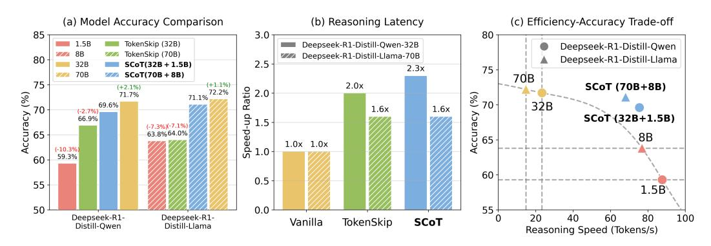

# 1 Introduction

Large-scale reasoning language models (e.g., OpenAI-o1 [\(Jaech et al., 2024\)](#page-10-0) and Deepseek-R1 [\(DeepSeek-AI et al., 2025\)](#page-9-0)) have exhibited exceptional performance across a broad range of reasoning scenarios. Their superior performance stems from two key factors: massive model scale (e.g., DeepSeek-R1 with 671B parameters) and long chain-of-thought (CoT) [\(Wei et al., 2023\)](#page-10-1) generation (reaching over 10,000 tokens for complex tasks). However, both factors incur substantial computational overhead, resulting in huge inference costs. In many reasoning systems where the model's reasoning process remains implicit, excessive reasoning time induces significant response latency.

Recent works [\(Paliotta et al., 2025;](#page-10-2) [Liao et al., 2025;](#page-10-3) [Xu et al., 2025b;](#page-11-0) [Zhang et al., 2025\)](#page-11-1) mainly tackle this challenge by developing smaller reasoning models or reducing the generation length of CoTs. Distillation [\(Paliotta et al., 2025;](#page-10-2) [Liao et al., 2025\)](#page-10-3) serves as a commonly used technique for transferring strong reasoning capabilities from large reasoning models to small ones. Representatively, Deepseek-R1-Distill-Qwen-1.5B [\(DeepSeek-AI et al., 2025\)](#page-9-0) exhibits robust performance on diverse

∗Corresponding author.

> **[图片提取文字 (无描述)]:**
> (a) Model Accuracy Comparison (b) Reasoning Latency (c) Efficiency-Accuracy Trade-off 85 3.0 80 1.5B TokenSkip (32B) Deepseek-R1-Distill-Qwen-32B Deepseek-R1-Distill-Qwen 8B TokenSkip (70B) Deepseek-R1-Distill-Llama-70B Deepseek-R1-Distill-Llama 80 32B 2.5 -SCoT(32B + 1.5B) 2.3x 75 70B SCoT(70B + 8B) 70B 75 (+1.1%)2.0x SCoT (70B+8B) (+2.1%)71.1% 72.2% Ratio 2.0 % %) 71.7% 70 32B 69.6% 1.6x 1.6x 70 (-2.7%)Accuracy Scuracy 95 Speed-up 1.0 SCoT (32B+1.5B) 66.9% (-7.3%)(-7.1%) 65 63.8%64.0% 8B 1.0x 1.0x (-10.3%) 59.3% 60 60 0.5 55 1.5B 50 0.0 55 20 60 80 Deepseek-R1-Deepseek-R1-40 100 Vanilla SCoT TokenSkip Distill-Qwen Distill-Llama Reasoning Speed (Tokens/s)

Figure 1: Average reasoning accuracy and efficiency of Speculative Chain-of-Thought (SCoT) with Deepseek-R1-Distill-Qwen-32B and Deepseek-R1-Distill-Llama-B on GSM8K, MATH, GaoKao, CollegeMath and Olympiad. Graph (a): SCoT achieves near-target-model performance level and outperforms TokenSkip on average generation accuracy on the 5 datasets. Graph (b): SCoT demonstrates an average speed-up ratio of 2.3× and 1.6× for the two target models on reasoning latency. Graph (c): Comparison of reasoning speed and accuracy for models of different sizes. Note that all the experiments for testing the reasoning speed are conducted on H800-80G GPUs. SCoT exhibits a better reasoning efficiency-accuracy trade-off through large and small model collaboration.

datasets. Approaches such as StepSkip [\(Liu et al., 2024\)](#page-10-4) and TokenSkip [\(Xia et al., 2025\)](#page-10-5) suggest training reasoning models on compressed CoT data to shorten the CoT length during inference. In practical applications, reasoning models need to solve problems with widely varying complexity levels. Fundamentally, employing large reasoning models to handle simple tasks is a waste. On the other hand, using small models alone or compressing the chain-of-thought length may compromise performance on complex tasks. Now that we have a powerful and efficient small model, why not prioritize this lightweight alternative and only invoke the large model for deeper thinking when the problem exceeds the capability threshold of the small one?

Based on this motivation, we propose Speculative Chain-of-Thought (SCoT), a reasoning framework that reduces reasoning latency through the collaboration of large and small models. The core idea of SCoT is to use a lightweight model to efficiently generate multiple CoT drafts which are then picked and used by the target model. SCoT is inspired by speculative decoding [\(Stern et al., 2018;](#page-10-6) [Xia](#page-10-7) [et al., 2023;](#page-10-7) [Leviathan et al., 2023\)](#page-10-8), which performs token-level speculation, whereas our approach conducts thought-level speculation. Unlike shortening the length of CoT, SCoT accelerates the thinking process from another dimension, that is, by increasing the speed of CoT generation.

In Section [3,](#page-2-0) we introduce thinking behavior alignment to improve drafting efficiency. We also design an error correction mechanism to preserve accuracy in dealing with complex tasks. We construct a training set by 500 samples from GSM8K to efficiently fine-tuning the target model to improve the capability of draft selection and error detection. We conduct comprehensive experiments in Section [4](#page-4-0) to evaluate the effectiveness of SCoT. Figure [1](#page-1-0) displays the overview reasoning accuracy and efficiency of SCoT. SCoT reduces reasoning latency by 48%∼66% and 21%∼49% for Deepseek-R1-Distill-Qwen-32B and Deepseek-R1-Distill-Llama-70B on 5 datasets (including the Olympiad-level dataset [\(He et al., 2024\)](#page-9-1)) while maintaining near-target-model-level performance. It achieves better reasoning accuracy compared with TokenSkip [\(Xia et al., 2025\)](#page-10-5) under similar speed-up ratios. Adapting to task difficulty and draft quality, the draft selection mechanism decides when the target model should rethink. Simple tasks mainly utilize the draft model for thought chain generation, while complex problems engage the target model more extensively in the reasoning process. On the other hand, the single-pass drafting and selection paradigm of SCoT significantly reduces the model reloading overhead between high-bandwidth memory and on-chip cache inherent in traditional speculative decoding methods, maintaining high efficiency even in long-sequence generation scenarios.

