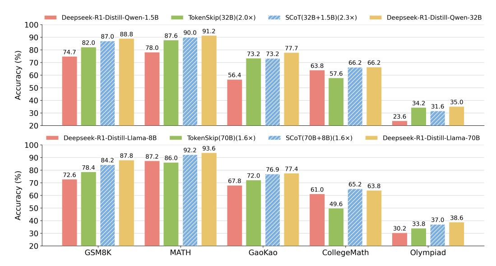

# 4.1 Settings

We adopt Deepseek-R1-Distill-Qwen-32B [\(DeepSeek-AI et al., 2025\)](#page-9-0) and Deepseek-R1-Distill-Llama-70B (abbreviated as D-Qwen-32B and D-Llama-70B) as the target models. We employ Deepseek-R1-Distill-Qwen-1.5B and Deepseek-R1-Distill-Llama-8B as the draft models for them, respectively. We conducte the two groups of experiments under different hardware environments. We use a single A100-PCIE-40GB GPU for the 1.5B model and 4 A100-PCIE-40GB GPUs for the 32B model. While we deploy the 8B model on a single H800-80GB GPU and the 80B model on 4 H800-80GB GPUs. We evaluate the efficiency and accuracy of Speculative CoT on reasoning datasets of various difficulty levels, including GSM8K [\(Cobbe et al., 2021\)](#page-9-10), MATH [\(Hendrycks et al.,](#page-9-11) [2021\)](#page-9-11), GaoKao-En-2023 [\(Liao et al., 2024\)](#page-10-15), CollegeMath [\(Tang et al., 2024\)](#page-10-16) and Olympiad [\(He et al.,](#page-9-1) [2024\)](#page-9-1). As stated in Section [3,](#page-2-0) we use data from GSM8K training set to fine-tune the models with LoRA modules. Note that there is no overlap in the data used for training and evaluation.

For SCoT, we set the rank of LoRA modules to 8 for D-Qwen-1.5B/32B and D-Llama-8B, and we set it to 16 for D-Llama-70B. Learning rate is set to 5e-5 and 1e-4 for the draft models and target models, respectively. The number of CoT drafts n is set to 5. We set the temperature for sampling to 0.6 in CoT drafting process. To avoid running out of memory when selecting the drafts, the maximum draft length is set to 5000. We set the maximum generation length of CoT to 20480. We compare the reasoning latency and accuracy of Speculative CoT with the vanilla reasoning by the target models.

We also compare the performance of SCoT with TokenSkip [\(Xia et al., 2025\)](#page-10-5), which trains the target model with compressed CoT data to shorten the mean CoT length. The original CoT data are generated by the original target model. Then it compresses the thought chains through LLMLingua-2 [\(Pan et al., 2024\)](#page-10-17). We adopt the training set of GSM8K to construct the training data. To compare the accuracy of the two methods at similar acceleration ratios, we set the compression ratio to 0.5 for TokenSkip, which means that about half of the tokens in thought chains are dropped.

Table 1: Comparison of CoT length and reasoning efficiency. We report average CoT length of the target model lM, average CoT length of the draft model lMd and average CoT latency of each sample t(sec). Speed-up ratio r is calculated by average thinking time compared with vanilla decoding.

| Method         |      | GSM8K |       | MATH |       | GaoKao |      | CollegeMath |        | Olympiad |  |
|----------------|------|-------|-------|------|-------|--------|------|-------------|--------|----------|--|
|                | lM   | lMd   | lM    | lMd  | lM    | lMd    | lM   | lMd         | lM     | lMd      |  |
| D-Qwen-32B     | 302  | -     | 2123  | -    | 3230  | -      | 1051 | -           | 8431   | -        |  |
| SCoT(32B+1.5B) | 45   | 265   | 151   | 1855 | 630   | 2767   | 110  | 1136        | 3553   | 4194     |  |
| D-Llama-70B    | 326  | -     | 1492  | -    | 2521  | -      | 920  | -           | 5503   | -        |  |
| SCoT(70B+8B)   | 47   | 410   | 70    | 2395 | 501   | 2986   | 120  | 1913        | 2579   | 4319     |  |
|                | t    | r     | t     | r    | t     | r      | t    | r           | t      | r        |  |
| D-Qwen-32B     | 26.5 | 1.00  | 225.1 | 1.00 | 369.5 | 1.00   | 95.3 | 1.00        | 1092.2 | 1.00     |  |
| SCoT(32B+1.5B) | 11.7 | 2.26  | 77.0  | 2.92 | 160.1 | 2.31   | 43.7 | 2.18        | 575.7  | 1.90     |  |
| D-Llama-70B    | 21.6 | 1.00  | 105.5 | 1.00 | 188.3 | 1.00   | 63.3 | 1.00        | 443.6  | 1.00     |  |
| SCoT(70B+8B)   | 11.0 | 1.96  | 57.8  | 1.83 | 111.0 | 1.70   | 50.4 | 1.26        | 325.0  | 1.36     |  |

> **[图片提取文字 (无描述)]:**
> Deepseek-R1-Distill-Qwen-1.5B TokenSkip(32B)(2.0 $\times$ ) SCoT(32B+1.5B)(2.3×) Deepseek-R1-Distill-Qwen-32B 100 87.6 90.0 91.2 87.0 88.8 90 82.0 78.0 77.7 80 74.7 Accuracy (%) 73.2 73.2 70 66.2 66.2 63.8 57.6 60 56.4 50 40 35.0 34.2 30 23.6 20 Deepseek-R1-Distill-Llama-8B TokenSkip $(70B)(1.6\times)$ SCoT(70B+8B)(1.6×) Deepseek-R1-Distill-Llama-70B 100 92.2 93.6 87.8 87.2 86.0 90 84.2 78.4 80 76.9 77.4 Accuracy (%) 72.6 72.0 67.8 70 65.2 63.8 61.0 60 49.6 50 37.0 38.6 40 33.8 30.2 30 20 GSM8K MATH GaoKao CollegeMath Olympiad

Figure 4: Comparison of accuracy of the final answer on the 5 datasets with Deepseek-R1-Distill-Qwen (top) and Deepseek-R1-Distill-Llama (bottom). The compression ratio for TokenSkip is set to 0.5. The speed-up ratio in the legends represents the latency speed-up for TokenSkip and SCoT.

## 4.2 Main Results

Lower Reasoning Latency Table [1](#page-5-0) demonstrates the average CoT length and the average CoT latency of each sample on the 5 datasets. lM and lMd represent the numbers of tokens generated by the target model and the draft model during the thinking stage, respectively. Since the draft model generates 5 draft chains in parallel, lMd refers to the length of the longest draft CoT. The average latency t is measured in seconds. For the 32B model, lM exhibits a wide range of 302 to 8431 across different datasets. Except for MATH where the average CoT length of SCoT (lM + lMd ) is shorter than that of the 32B model, the overall CoT lengths of the two methods are close in the Qwen group. However, SCoT generates more tokens during the reasoning phase in the Llama group, where the speed-up ratio is relatively lower. For SCoT, most of the reasoning tokens are generated by the draft model, and the CoT tokens generated by the target model account for 2.8%∼45.9% of the total CoT tokens. As task difficulty increases, small models exhibit higher error rates, thus necessitating greater involvement from the target model in the reasoning process. The draft selection mechanism dynamically determines whether the target model should reconsider its output, evaluating both

problem complexity and draft generation quality. For simpler tasks, thought chains are predominantly produced by the draft model. Conversely, the proposed mechanism allocates more thought chain generation to the target model when handling complex problems.

The throughput of the draft model is about 5 times that of the corresponding target model for both groups in our experimental environment. The CoT latency of SCoT is mainly composed of the target model reasoning time, draft model reasoning time, and draft selection time. For the GSM8K dataset in the Qwen group, the proportions are approximately 33.9%, 60.2%, and 5.9% respectively. With longer generated CoTs (e.g., on Olympiad), draft selection incurs minimal overhead. Generally, SCoT achieves greater speed-up ratios on simpler tasks where the CoT drafts demonstrate higher quality. SCoT achieves a speed-up ratio ranging from 1.26× to 2.92× compared to vanilla reasoning.

Near-target-model Level Accuracy Figure [4](#page-5-1) displays the accuracy of different methods for Deepseek-R1-Distill-Qwen and Deepseek-R1-Distill-Llama on these datasets. Comparative results indicate that SCoT maintains near-target-model performance levels on all datasets (even for the Olympiad-level task), with clearly superior accuracy compared to standalone draft model reasoning. For CollegeMath, SCoT even achieves a better accuracy compared to the target model. Moreover, SCoT outperforms TokenSkip in generation accuracy on most groups except Olympiad with the Qwen model, even with higher speed-up ratios, exhibiting better accuracy-efficiency trade-off.

