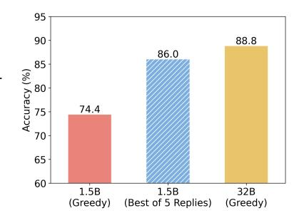

# 3 Speculative CoT

This section introduces Speculative Chain-of-Thought (SCoT), an algorithm for accelerating LLM reasoning. SCoT employs a small model to draft reasoning chains while utilizing the target model to select the best draft for generating the final answer. The overview of SCoT is shown in Figure [2.](#page-3-0)

## 3.1 Formulation

For question q in the given question set Q, the reasoning model M first enters the thinking stage after inputting q. Specifically, M will output a chain-of-thought T = (y1, y2, ..., yl) starting and ending with pre-trained special tokens, where yi represents the i-th output token and l is length of T. Take Deepseek-R1 [\(DeepSeek-AI et al., 2025\)](#page-9-0) as an example. The thinking process starts with "*<think>*" and ends with "*</think>*". Next, the model generates the final answer A based on q and T. Our goal is to reduce the inference overhead of T while ensuring the quality of the final answer.

## 3.2 Generating Drafts of Thoughts

First, we start with a question: "*Can small models generate high-quality chain-of-thoughts?*". We sampled 500 samples in GSM8K [\(Cobbe et al., 2021\)](#page-9-10) to evaluate the reasoning accuracy of Deepseek-R1-Distill-Qwen-1.5B and Deepseek-R1-Distill-Qwen-32B [\(DeepSeek-AI et al., 2025\)](#page-9-0). Figure [3](#page-2-1) displays the results. Under the greedy sampling method, the performance of the 1.5B model is significantly worse than that of the 32B model. However, if we allow the 1.5B model to provide 5 answers under the nuclear sampling method and select the best one among the 5 replies for each sample, its overall accuracy on GSM8K is close to that of the 32B model.

> **[图片提取文字 (无描述)]:**
> 95 90 88.8 86.0 85 Accuracy (%) 74.4 70 65 60 1.5B 32B 1.5B (Greedy) (Best of 5 Replies) (Greedy)

Figure 3: Comparison of reasoning accuracy on GSM8K.

From the above experiments, we can conclude that the small model has the potential to generate high-quality thought chains,

but a stronger verifier is needed to control or select its generated results. Therefore, in order to accelerate the thinking process of reasoning LLMs, we first use a smaller model Md to draft n chains

> **[图片提取文字 (无描述)]:**
> Generating CoT Drafts **Outputing Answer / Rethinking** Selecting the Best CoT Draft 1 I < n+1 Applying the best CoT draft and Parallel Drafting then output the final answer  $Argmax p(i|S(Q,T_{\leq n-1}))$  $M_d$ Index One Forward Rethinking with the target model LoRA (2) I = n+1Pass for generating the final answer Tn+1 All reasoning paths LoRA 12 nn+1 above are wrong. I will provide several Reasons for the Question. : Question : Fine-tuned Draft Model Please choose the best reasoning path and give the : Chain-of-Thought(CoT) serial Number directly (you can only choose one). : Original Target Model : CoT Selection Prompt Question: Q : Fine-tuned Target Model : Final Answer Here are the reasoning paths:

Figure 2: Overview of Speculative Chain-of-Thought. Given a question Q, SCoT first applies a lightweight draft model to generate multiple CoT drafts in parallel. The draft model is fine-tuned with LoRA modules to align the thinking behavior of the target model. It appends a special CoT option for the case where all drafts are wrong. The target model for selecting the best CoT draft is also fine-tuned with LoRA modules for improved accuracy. With the designed prompt template S, only one forward propagation is needed to get the index of the best CoT. Once the best CoT is picked, SCoT directly adopts it for the original target model to generate the final answer. Only if no draft is selected, SCoT will rethink with the target model to ensure the quality of the generated answer.

of thoughts in parallel:

$$[T_d^1, T_d^2, ..., T_d^n] = M_d(\underbrace{[q, q, ..., q]}_n).$$
 (1)

We use temperature sampling for the small model thinking to enhance the diversity of drafts of CoTs. Thanks to their smaller parameter size, smaller models can draft reasoning chains significantly faster than large models when the length of the CoT is the same, thus speeding up the thinking process.

## 3.3 Thinking Behavior Alignment

Although small models have higher throughput than large ones, significant differences in their reasoning behavior may still result in limited, or even reduced, reasoning speed. In our experiments, we observed that even models of the same series can exhibit significant differences in thinking behavior. The inference speed of Deepseek-R1-Distill-Qwen-1.5B is about 6 times that of Deepseek-R1-Distill-Qwen-32B. However, the average CoT length of the 1.5B model on the GSM8K dataset is more than 4 times that of the 32B model. The CoT of the 1.5B model contains more redundant tokens and repeated reflections. Therefore, the draft model requires training in alignment of thinking behavior to ensure drafting efficiency.

We adopt 1500 samples from the GSM8K training set to make the target model generate the corresponding thought chains. The training data d = (x1, x2, ..., xm, y1, y2, ..., yl) is a combination of the question and generated CoT, where m is the length of the question and x≤m are input tokens. Then we use LoRA modules [\(Hu et al., 2022\)](#page-10-14) to fine-tune the draft model with the cross-entropy loss:

$$\mathcal{L}_{Draft} = -\frac{1}{l} \sum_{i=1}^{l} \log p_{M_d}(y_i | x_{\leq m}, y_{< i}), \tag{2}$$

where pMd (·|·) represents the output probability distribution of Md. The original parameters of the draft model are frozen during training. The LoRA modules are adapted to the Q and V matrices in the attention block of each layer. After training, we merge the LoRA module parameters into the weight matrices of the draft model. Therefore, there is no additional overhead during inference.

## 3.4 Draft Selection and Error Correction

After generating CoT drafts (T1, T2, ..., Tn) by the fine-tuned draft model, we design a prompt template S for selecting these thought chains. Figure [2](#page-3-0) displays the specific content of this template. For particularly challenging problems where all CoT drafts may be incorrect, we aim for the target model to detect such cases to ensure the accuracy of the final answer. For this purpose, we introduce a special option Tn+1, which indicates that all CoT drafts are wrong. Through a single forward propagation, we can efficiently obtain the CoT index with the highest probability from the output distribution of the next token by the target model:

$$index = \underset{i \in \mathcal{V}}{\arg \max} P_M(i|S(q, T_{\leq n+1})), \ \mathcal{V} = \{1, 2, ..., n+1\}.$$
 (3)

To improve the accuracy of the target model in selecting the correct CoT drafts and detecting errors, we also use the LoRA modules to fine-tune the target model. We use 500 samples from the GSM8K training set to construct the training data. For each sample, we use the draft model to generate n thought chains and deploy template S as the input. We judge the correctness of the CoT drafts based on the ground truth and construct the label set Y, which is the set of indices for all correct drafts. See Appendix [A](#page-12-0) for examples. We design the following loss function to fine-tune the target model:

$$\mathcal{L}_{Target} = \min\{-\log p_M(y|S(q, T_{\leq n+1}))|y \in \mathcal{Y}\}. \tag{4}$$

Likewise, the original model parameters are frozen, and parameters in LoRA modules are merged into the weight matrices of Q and V . The fine-tuned target model is only used for CoT selection.

There are two situations when selecting CoT. The first is that the output index < n + 1, that is, the target model selects the best one Tindex among the CoTs generated by the draft model. In this case, we directly let the target model generate the final answer based on q and Tindex. The second situation is the output index = n + 1, which indicates that the problem is too hard and the draft model failed to produce correct reasoning. To maintain performance in the face of these complex problems, we instruct the target model to rethink the question and generate the final answer.

