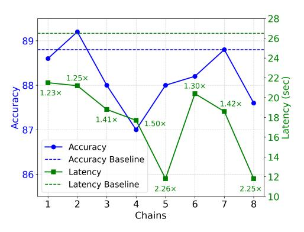

# 4.3 Ablation Studies

Table 2: Results for ablation study. Best results are in bold.

| Method               | GSM8K | MATH | GaoKao | CollegeMath | Olympiad |
|----------------------|-------|------|--------|-------------|----------|
| SCoT (32B+1.5B)      | 87.0  | 90.0 | 73.2   | 66.2        | 31.6     |
| w Single Draft       | 85.6  | 86.6 | 69.9   | 63.8        | 30.0     |
| M w/o Tuning      | 85.6  | 90.0 | 69.9   | 64.8        | 30.0     |
| w/o Error Correction | 85.6  | 90.0 | 71.4   | 65.6        | 30.2     |

We conduct an ablation study in this section. We carry out 3 sets of experiments to observe the changes in accuracy on the 5 datasets with Deepseek-R1-Distill-Qwen: 1) SCoT with Single Draft: Only one CoT draft is generated for each sample (except for the special draft Tn+1), 2) SCoT without Tuning M: We use the original target model instead of the fine-tuned version to select the drafts, 3) SCoT without Error Correction: We remove Tn+1 and the rethinking strategy. Table [2](#page-6-0) shows the results. SCoT exhibits the highest accuracy on all datasets, indicating that both of the three proposed techniques contribute to the reasoning performance. Drafting multiple thought chains increases the upper limit of draft quality, thus enhancing the potential for higher-quality outputs. In preliminary experiments, we found that without fine-tuning, M never selects the "*All reasoning paths are wrong.*" option for any CoT draft candidates. After training, the target model can acquire a certain error correction capability. We will discuss this further in Section [4.5.](#page-7-0)

Table 3: Comparative analysis of average CoT draft length on DeepSeek-R1-Distill-Qwen-1.5B and Deepseek-R1-Distill-Llama-8B with versus without thinking behavior alignment training.

| Method                        | GSM8K | MATH | GaoKao | CollegeMath | Olympiad |
|-------------------------------|-------|------|--------|-------------|----------|
| Deepseek-R1-Distill-Qwen-1.5B | 606   | 2092 | 2589   | 1355        | 4032     |
| + Thinking Behavior Alignment | 193   | 1183 | 1487   | 709         | 3554     |
| Deepseek-R1-Distill-Llama-8B  | 585   | 1979 | 3223   | 1285        | 6474     |
| + Thinking Behavior Alignment | 258   | 1536 | 2253   | 1254        | 3783     |

In order to verify the effectiveness of thinking behavior alignment, we compare the average CoT draft length generated by the original draft models and the fine-tuned versions. Table [3](#page-6-1) shows the mean CoT length on the 5 datasets. The CoT length generated by the fine-tuned model is significantly shorter than that of the original model on all datasets for both the two draft models, especially for GSM8K. Therefore, thinking behavior alignment improves the efficiency of the drafting process.

### 4.4 Comparison with Speculative Decoding

Table 4: Comparison of reasoning efficiency with auto-regressive decoding (ARD) and speculative decoding (SD) on the five datasets with the two models. s represents the average throughput during the reasoning phase (including the prefilling phase). For SCoT, only valid tokens (generated by either the draft model or the target model) are included in the calculation of s. r ′ represents the speed-up ratio of throughput. r stands for the speed-up ratio of average reasoning latency of each sample.

| GSM8K Method |                                                |      |      | MATH |      | GaoKao |      |      | CollegeMath |      |      | Olympiad |      |      |      |
|-----------------|------------------------------------------------|------|------|------|------|--------|------|------|-------------|------|------|----------|------|------|------|
|                 | s                                              | r′   | r    | s    | r′   | r      | s    | r′   | r           | s    | r′   | r        | s    | r′   | r    |
|                 | Deepseek-R1-Distill- Qwen-32B (A100-PCIE-40GB) |      |      |      |      |        |      |      |             |      |      |          |      |      |      |
| ARD             | 11.4                                           | 1.00 | 1.00 | 9.4  | 1.00 | 1.00   | 8.7  | 1.00 | 1.00        | 11.0 | 1.00 | 1.00     | 7.9  | 1.00 | 1.00 |
| SD              | 18.5                                           | 1.63 | 1.87 | 13.4 | 1.42 | 1.41   | 12.1 | 1.38 | 1.32        | 15.6 | 1.42 | 1.34     | 9.1  | 1.16 | 0.59 |
| SCoT            | 23.9                                           | 2.10 | 2.26 | 25.4 | 2.69 | 2.92   | 19.1 | 2.18 | 2.31        | 27.9 | 2.53 | 2.18     | 11.2 | 1.42 | 1.90 |
|                 | Deepseek-R1-Distill- Llama-70B (H800-80GB)     |      |      |      |      |        |      |      |             |      |      |          |      |      |      |
| ARD             | 14.5                                           | 1.00 | 1.00 | 14.1 | 1.00 | 1.00   | 13.4 | 1.00 | 1.00        | 14.5 | 1.00 | 1.00     | 12.7 | 1.00 | 1.00 |
| SD              | 25.1                                           | 1.64 | 1.63 | 21.2 | 1.50 | 1.49   | 17.6 | 1.31 | 1.35        | 23.2 | 1.59 | 1.61     | 12.6 | 0.99 | 0.58 |
| SCoT            | 37.3                                           | 2.45 | 1.96 | 41.8 | 2.96 | 1.83   | 28.7 | 2.14 | 1.70        | 37.5 | 2.58 | 1.26     | 17.4 | 1.37 | 1.36 |

We compare the reasoning efficiency of SCoT with speculative decoding with large and small models collaboration [\(Leviathan et al., 2023;](#page-10-8) [Kim et al., 2023\)](#page-10-18) in this section. Speculative decoding generates several tokens with the draft model and then verifies the candidates with the target model in each decoding step. Tokens that match the original output will be accepted during verification. We evaluate the throughput and latency with Deepseek-R1-Distill- Qwen-32B and Deepseek-R1-Distill-Llama-70B. We use the original Deepseek-R1-Distill-Qwen-1.5B and Deepseek-R1-Distill-Llama-8B as the draft models for speculative decoding. The maximum draft length is set to 5.

Table [4](#page-7-1) displays the results. The throughput of auto-regressive decoding is affected by the length of the sequence. Speculative decoding performs well when the sequence length is short. It achieves a reasoning latency speed-up ratio of up to 1.87 and 1.63 for the Qwen model and the Llama model, respectively. However, for the Olympiad dataset, where the average generation length exceeds 5000 tokens, the drafting overhead grows with sequence length, ultimately causing deceleration for both the target models. Note that speculative decoding may produce outputs that deviate from the original model when using half-precision. In certain cases (e.g., GSM8K dataset with the Qwen model), the shorter generation lengths can lead to r ′ < r. Employing the same draft models, SCoT achieves a higher throughput on all datasets. It shows a speed-up ratio of up to 2.96 for throughput. It also exhibits a better acceleration for reasoning latency (except for CollegeMath in the Llama group). While speculative decoding requires multiple verifications, SCoT's single draft-verify cycle significantly reduces the frequent model reloads between GPU high-bandwidth memory (HBM) and on-chip cache. Therefore, generation length exhibits a relatively minor impact on SCoT's efficiency (as stated in Section [4.2](#page-5-2) the speed-up ratio of SCoT is mainly affected by the difficulty of the task), reflecting its good adaptability to long sequence generation scenarios.

### 4.5 Draft Selection Accuracy Analysis

In this section, we study the draft selection and error detection accuracy of the fine-tuned Deepseek-R1-Distill-Qwen-32B on the 500 samples in the test set of GSM8K. We divide these samples into two categories according to their labels. Samples for which the draft model can generate the correct reasoning chain form Class 1 (the label y ̸= n+ 1), while others constitute Class 2 (the label y = n + 1). Table [5](#page-7-2) shows the statistical results. There are 450 first-class samples out of the 500 samples. Since the second type of sample is more difficult to predict and

Table 5: The number of two types of CoT drafts and the accuracy of draft selection on GSM8K.

| Type     | Class 1 | Class 2 |
|----------|---------|---------|
| Amount   | 450     | 50      |
| Accuracy | 85.1    | 52.0    |

the training data is limited, the target model demonstrates more accurate prediction for Class 1 samples than Class 2 samples. Our preliminary tests show that direct prediction by the original target model on the second-class samples yields zero accuracy. After fine-tuning, the model can correctly predict the labels for about half of the Class 2 samples.

### 4.6 Impact on Length of the Final Answer

We study the impact of SCoT on the length of the final answer in this section. Table [6](#page-8-0) displays the answer length of SCoT on the 5 datasets. In addition to reducing the latency of the reasoning phase, SCoT also reduces the length of the generated final answer compared to the target model and even brings additional inference efficiency improvements in the Qwen group. For the Llama group, SCoT generates final answers with lengths comparable to those produced by the original target model.

| Table 6: Average length of the final answer generated by Deepseek-R1-Distill-Qwen-32B and SCoT. |  |
|-------------------------------------------------------------------------------------------------|--|
|                                                                                                 |  |

| Method                        | GSM8K | MATH | GaoKao | CollegeMath | Olympiad |
|-------------------------------|-------|------|--------|-------------|----------|
| Deepseek-R1-Distill-Qwen-32B  | 314   | 632  | 948    | 416         | 2952     |
| SCoT (32B+1.5B)               | 270   | 358  | 610    | 357         | 2179     |
| Deepseek-R1-Distill-Llama-70B | 238   | 256  | 453    | 312         | 840      |
| SCoT (70B+8B)                 | 212   | 310  | 568    | 314         | 1068     |

## 4.7 Performance under Different Number of Chains

To explore the best number of CoT draft candidates, we evaluate the reasoning accuracy and latency under different numbers of draft thought chains in this section. We conduct an experiment with the Deepseek-R1-Distill-Qwen models on the GSM8K dataset. We tested the performance when drafting 1 to 8 thought chains. Figure [5](#page-8-1) displays the results. The blue and green lines represent the accuracy and reasoning latency, respectively. The two dotted lines show the baseline accuracy and latency of Deepseek-R1-Distill-Qwen-32B. Increasing the number of chains increases the probability of including high-quality reasoning paths in the set of drafts. When using 2 draft chains, while the latency reduction remains modest, SCoT surprisingly outperforms the target model in accuracy, demonstrating the re-

> **[图片提取文字 (无描述)]:**
> 28 26 89 24 22 (20 20 (20 18 16 161 1.25× Accuracy 88 1.30× 1.23× 1.42× 1.41× 1.50× 87 Accuracy 14 Accuracy Baseline Latency 86 12 Latency Baseline 2.25× 2.26× 2 5 6 3 8 Chains

Figure 5: Impact of the chain number on reasoning accuracy and latency on GSM8K.

markable potential of collaborative model generation. A higher speed-up ratio indicates that SCoT accepts more reasoning chains generated by the draft model. SCoT can reduce its reliance on the target model due to the increase in the number of candidates, thus achieving a higher speed-up ratio. However, as the number of chains increases, the difficulty of training the target model to select the correct draft also increases. Meanwhile, due to the inherent randomness in training procedures and the limited scale of training data, it exhibits fluctuations in reasoning accuracy. Moreover, an oversupply of chains complicates error detection for the target model, which may lead to accuracy degradation despite the improved speed. Overall, SCoT demonstrates optimal acceleration performance with 5 thought chains while maintaining acceptable accuracy degradation.

