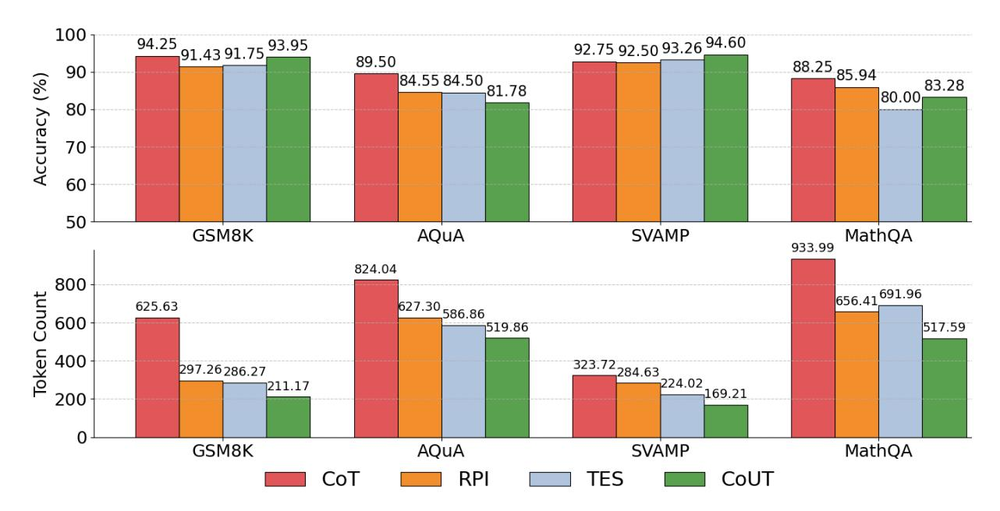

# 4.2.1 Arithmetic Reasoning

We analyze the performance of large language models on arithmetic reasoning tasks using GSM8K and SVAMP datasets, which evaluate models' capabilities in handling multi-step mathematical problems.

As shown in Table [1,](#page-5-0) when averaging results across both datasets: (I) The CoUT method demonstrates significantly lower token consumption (190.19) compared to other methods, being approximately 88.7% less than TALE-EP (1680.09) and 39.0% less than CCoT (311.76). (II) Despite this substantial reduction in token usage, CoUT maintains high accuracy (94.28%), which is comparable to CoT (93.50%) and outperforms both CoD (79.51%) and CCoT (91.63%).

Experimental results indicate that for arithmetic reasoning tasks, the CoUT method effectively reduces token output while maintaining high accuracy, significantly improving reasoning efficiency and cost-effectiveness in practical applications.

#### 4.2.2 Mathematical Reasoning

MathQA and AQUA datasets are categorized as mathematical reasoning due to their requirement for sophisticated symbolic manipulation, algebraic transformations, and complex multi-step logical inference processes.

Table [1](#page-5-0) reveals compelling efficiency advantages for the CoUT method in these complex reasoning tasks. (I) CoUT consumes just 518.73 tokens on average—more than 100 tokens fewer than the next

Table 1: Performance (%) and Token Costs of Our Proposed CoUT and Baselines for 4 LRMs on 4 Benchmarks. The bold values and underlined values denote the best and the runner-up token efficiency, respectively.

| Method  | GPT-4o   |        | Claude 3.5 Sonnet |        | O3-mini  |         | QWQ-32B  |         | Average  |         |
|---------|----------|--------|-------------------|--------|----------|---------|----------|---------|----------|---------|
|         | Accuracy | Token  | Accuracy          | Token  | Accuracy | Token   | Accuracy | Token   | Accuracy | Token   |
|         |          |        |                   |        | GSM8K    |         |          |         |          |         |
| CoT     | 96.00    | 274.30 | 91.00             | 244.59 | 96.00    | 421.73  | 94.00    | 1561.91 | 94.25    | 625.63  |
| CoD     | 85.90    | 77.80  | 67.70             | 74.72  | 95.37    | 805.90  | 52.00    | 682.41  | 75.24    | 410.21  |
| CCoT    | 94.10    | 91.25  | 89.39             | 137.66 | 95.00    | 669.42  | 88.00    | 451.49  | 91.62    | 337.46  |
| TALE-EP | 93.10    | 98.90  | 94.69             | 139.32 | 94.00    | 2414.43 | 78.00    | 4324.68 | 89.95    | 1744.33 |
| CoUT    | 93.40    | 56.80  | 95.00             | 69.10  | 91.40    | 245.98  | 96.00    | 472.81  | 93.95    | 211.17  |
|         |          |        |                   |        | SVAMP    |         |          |         |          |         |
| CoT     | 95.00    | 195.15 | 89.00             | 210.59 | 91.00    | 485.05  | 96.00    | 404.09  | 92.75    | 323.72  |
| CoD     | 93.90    | 43.30  | 92.20             | 63.39  | 93.00    | 893.01  | 56.00    | 650.83  | 83.78    | 412.63  |
| CCoT    | 93.70    | 72.13  | 91.80             | 100.45 | 94.00    | 583.39  | 87.00    | 388.24  | 91.63    | 286.05  |
| TALE-EP | 94.40    | 63.38  | 93.90             | 82.33  | 100.00   | 2485.59 | 98.00    | 3832.05 | 96.58    | 1615.84 |
| CoUT    | 90.07    | 48.37  | 93.90             | 42.59  | 94.00    | 185.26  | 97.00    | 400.91  | 94.60    | 169.21  |
|         |          |        |                   |        | MathQA   |         |          |         |          |         |
| CoT     | 86.00    | 417.86 | 90.00             | 295.55 | 90.00    | 679.76  | 87.00    | 2342.8  | 88.25    | 933.99  |
| CoD     | 77.40    | 156.90 | 68.84             | 81.41  | 90.00    | 804.23  | 93.00    | 1530.42 | 82.31    | 643.24  |
| CCoT    | 83.00    | 187.20 | 80.44             | 136.87 | 94.00    | 588.58  | 90.00    | 1281.72 | 86.86    | 548.59  |
| TALE-EP | 81.98    | 149.18 | 83.65             | 152.03 | 94.00    | 2294.09 | 94.00    | 5433.69 | 88.41    | 2007.25 |
| CoUT    | 81.20    | 149.40 | 69.92             | 73.03  | 90.00    | 408.36  | 92.00    | 1439.58 | 83.28    | 517.59  |
|         |          |        |                   |        | AQuA     |         |          |         |          |         |
| CoT     | 88.00    | 425.03 | 86.00             | 291.61 | 95.0     | 652.72  | 89.00    | 1926.78 | 89.50    | 824.04  |
| CoD     | 73.60    | 255.60 | 69.30             | 83.89  | 97.00    | 874.45  | 89.00    | 1469.64 | 82.23    | 670.90  |
| CCoT    | 81.90    | 164.85 | 80.70             | 132.19 | 88.00    | 708.75  | 85.00    | 1440.44 | 83.90    | 611.56  |
| TALE-EP | 83.46    | 202.49 | 79.53             | 186.75 | 89.00    | 2164.37 | 87.00    | 5259.03 | 84.75    | 1953.16 |
| CoUT    | 80.30    | 137.60 | 74.80             | 74.52  | 80.00    | 449.41  | 92.00    | 1417.91 | 81.78    | 519.86  |

most efficient approach (CCoT at 580.08). (II) On the accuracy front, CoUT (82.53%) outperforms CoD (82.27%) while maintaining reasonable performance relative to other methods, despite its significantly reduced computational footprint.

These results demonstrate that even in complex reasoning tasks, CoUT can effectively reduce large model output tokens without significantly compromising accuracy.

#### 4.3 Ablation Studies

This section verifies the effectiveness of components in our Chain of Underspecified Thought (CoUT) method. As shown in Figure [2,](#page-6-0) we conduct ablation studies on four models (GPT-4o, Claude 3.5 Sonnet, O3-mini, and QWQ-32B) across four mathematical reasoning datasets (GSM8K, AQuA, SVAMP, and MathQA).

First, we evaluate the individual components of CoUT. "RPI" denotes Reasoning Process Internalization, which encourages reasoning to occur

Table 2: Statistics of Benchmarks.

| Benchmark Num. of Sample | Task Type |                 |  |  |  |  |  |  |
|--------------------------|-----------|-----------------|--|--|--|--|--|--|
| Arithmetic Reasoning     |           |                 |  |  |  |  |  |  |
| GSM8K                    | 1319      | Open-ended QA   |  |  |  |  |  |  |
| SVAMP                    | 1000      | Open-ended QA   |  |  |  |  |  |  |
| Mathematical Reasoning   |           |                 |  |  |  |  |  |  |
| AQUA                     | 254       | Multi-choice QA |  |  |  |  |  |  |
| MATHQA                   | 2985      | Multi-choice QA |  |  |  |  |  |  |

within the model's hidden layers. "TES" denotes our Token-Efficiency Strategies, which implements techniques to reduce output verbosity. "CoT" represents traditional Chain of Thought prompting with explicit reasoning steps. "CoUT" combines both RPI and TES approaches.

We have the following conclusions: (I) The RPI component achieves 88.61% accuracy with 466.40 tokens, reducing token consumption by 31.1%

> **[图片提取文字 (无描述)]:**
> 100 92.75 92.50 93.26 94.60 91.43 91.75 <u>93.95</u> 94.25 88.25 89.50 84.55 84.50 81.78 90 Accuracy (%) 83.28 80.00 80 70 60 50 GSM8K **AQuA** SVAMP MathQA 933.99 824.04 800 656.41691.96 **Token Count** 627.<u>30</u>586.86 625.63 600 519.86 517.59 323.72 284.63 224.02 400 297.26286.27 1211.17 169.21 200 GSM8K MathQA **AQuA SVAMP** CoT RPI TES CoUT

Figure 2: Ablation Studies on Our Proposed CoUT. CoT denotes the Chain-of-Thought baseline. RPI denotes Reasoning Process Internalization. TES denotes Token-Efficient Strategies.

compared to CoT while maintaining comparable performance. (II) The TES component reaches 87.38% accuracy with 447.28 tokens, demonstrating a 33.9% reduction in token usage. (III) Each component individually contributes to performance improvement. And the combination achieves the best performance.

Second, by combining both components, CoUT achieves 88.40% accuracy with only 354.46 tokens consumed, representing a 47.6% reduction in token usage compared to CoT's 676.85 tokens, while the accuracy decrease is limited to 2.79% (from 91.19% to 88.40%). This demonstrates that CoUT achieves the best token efficiency, showing the effectiveness of integrating both components.

### 4.4 Case Studies

To illustrate the contrast between CoT [\(Wei et al.,](#page-9-2) [2022\)](#page-9-2), and CoD [\(Xu et al.,](#page-10-0) [2025\)](#page-10-0) prompting with CoUT prompting, we selected a representative example from our experiments.

#### Question

Q: The difference between simple interest and C.I. at the same rate for Rs.5000 for 2 years in Rs.72. The rate of interest is? Options:

A. 10%

B. 12%

C. 6%

D. 8%

E. 4%

As seen in the following example, the CoT response is highly verbose, meticulously documenting each step of the reasoning process. While this approach provides complete transparency of the model's thinking, it consumes substantial computational resources unnecessarily. The exhaustive calculations and explanations result in significant token usage even for problems that don't require such detailed exposition.

#### Chain-of-Thought

#### Answer:

To solve this problem, we need to find the rate of interest where the difference between the compound interest (C.I.) and simple interest (S.I.) for 2 years is Rs. 72 on a principal amount of Rs. 5000.

Let's denote the rate of interest as R%.

1. Simple Interest (S.I.) for 2 years:

S.I. = 
$$\frac{P \times R \times T}{100} = \frac{5000 \times R \times 2}{100} = 100R$$

2. Compound Interest (C.I.) for 2 years:

The formula for compound interest is:

$$C.I. = P \left( 1 + \frac{R}{100} \right)^T - P$$

For 2 years, it becomes:

$$C.I. = 5000 \left( 1 + \frac{R}{100} \right)^2 - 5000$$

3. Difference between C.I. and S.I.: Given that the difference is Rs. 72:

$$C.I. - S.I. = 72$$

Substituting the expressions for C.I. and S.I.:

$$5000 \left( 1 + \frac{R}{100} \right)^2 - 5000 - 100R = 72$$

Simplifying:

$$5000 \left(1 + \frac{R}{100}\right)^2 - 5000 = 100R + 72$$
$$5000 \left(1 + \frac{R}{100}\right)^2 = 100R + 5072$$

$$\left(1 + \frac{R}{100}\right)^2 = \frac{100R + 5072}{5000}$$

- 4. Solving for R: Let's try the options to find the correct R.
- Option A: 10%

$$\left(1 + \frac{10}{100}\right)^2 = (1.1)^2 = 1.21$$
 
$$5000 \times 1.21 = 6050$$
 
$$\text{C.I.} = 6050 - 5000 = 1050$$
 
$$\text{S.I.} = 100 \times 10 = 1000$$
 
$$\text{Difference} = 1050 - 1000 = 50 \neq 72$$

- Option B: 12%

$$\left(1 + \frac{12}{100}\right)^2 = (1.12)^2 = 1.2544$$

$$5000 \times 1.2544 = 6272$$
C.I. =  $6272 - 5000 = 1272$ 
S.I. =  $100 \times 12 = 1200$ 
Difference =  $1272 - 1200 = 72$ 

The CoD method shows improvement in con-

ciseness compared to CoT, condensing the solution into key steps. However, it still includes multiple

The correct rate of interest is 12%.

reasoning steps that might be redundant for relatively straightforward problems. The structured approach, while more efficient than CoT, continues to externalize computational steps that could potentially be handled internally by the model.

In contrast, the CoUT response demonstrates remarkable efficiency by directly providing the correct answer without unnecessary elaboration. For this problem, CoUT correctly identifies that "12%" is the solution while using dramatically fewer tokens. It showcases CoUT's ability to leverage the model's internal reasoning capabilities without forcing every step to be externalized in text.

