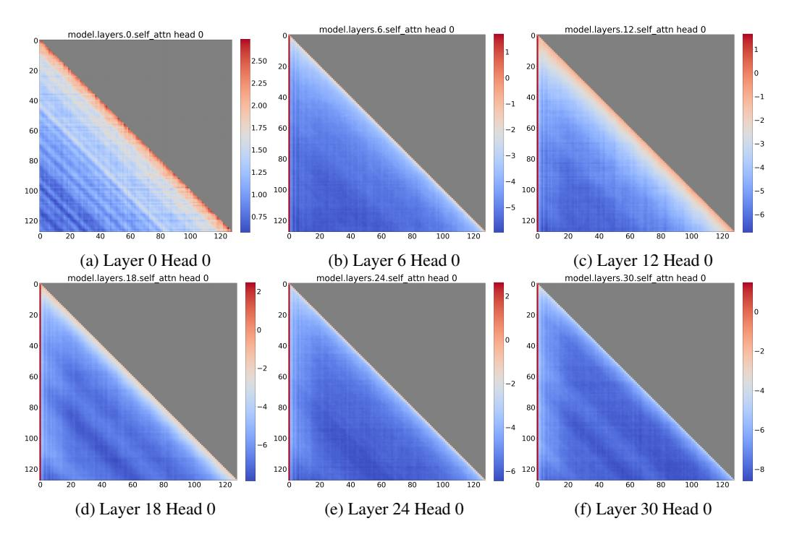
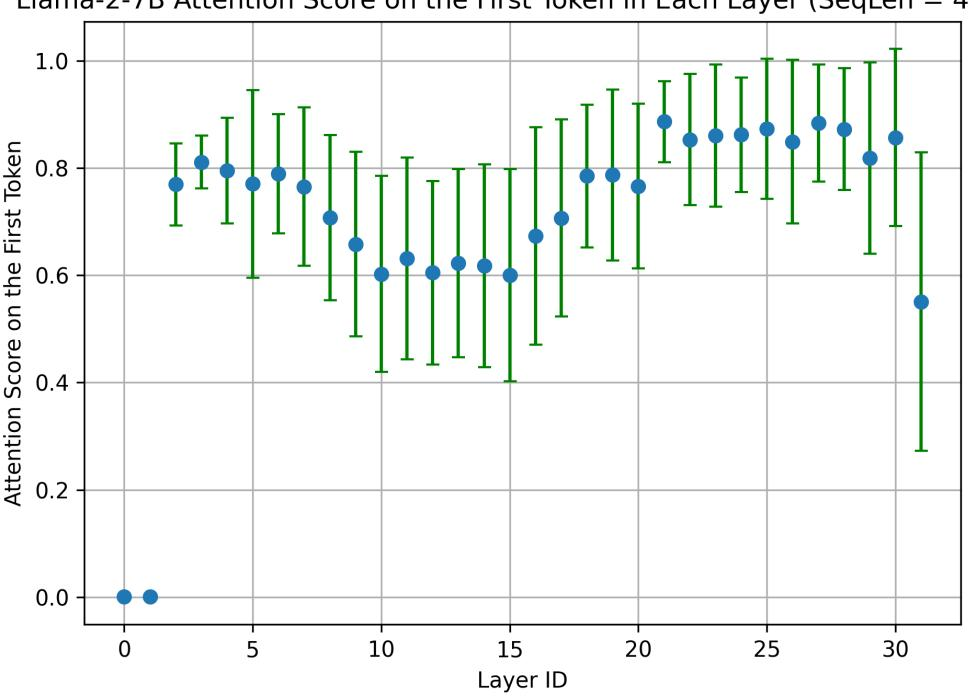
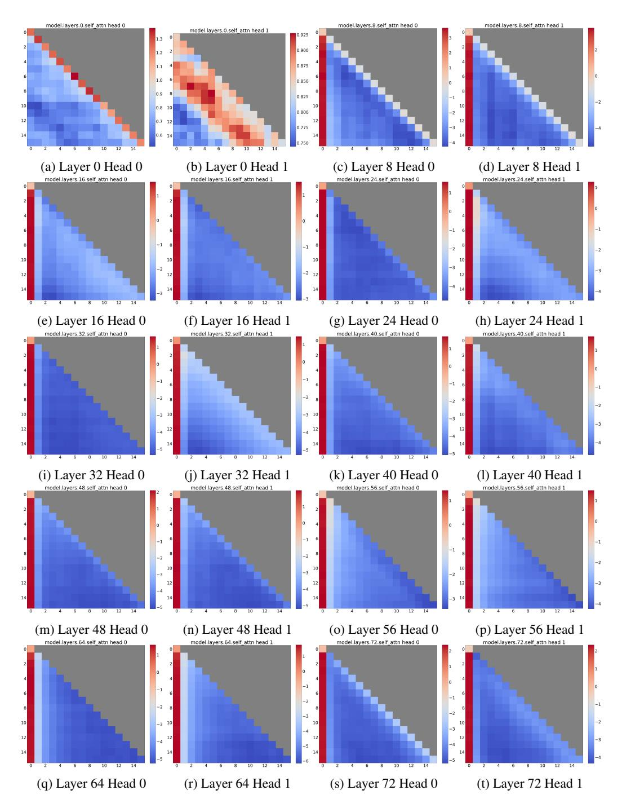
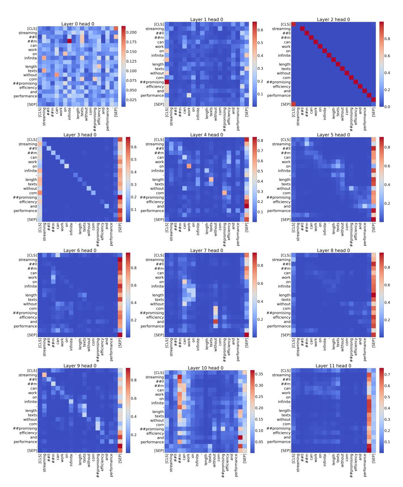
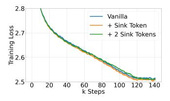

# A DISCUSSIONS

Applications. StreamingLLM is particularly suited for streaming applications, such as multi-round dialogues, where continuous operation without heavy reliance on extensive memory or historical data is crucial. For instance, in a daily assistant application based on LLMs, StreamingLLM enables the model to function seamlessly over extended periods. It bases its responses on recent interactions, thus avoiding the need for frequent cache refreshes. Traditional methods might require resetting the cache when the conversation length surpasses the training length, leading to a loss of recent context, or they might need to recompute key-value (KV) states from recent text history, which can be inefficient.

Limitations. While StreamingLLM improves the efficiency of LLMs in streaming contexts, it does not extend the models' context window or enhance their long-term memory capabilities. As detailed in Section [C,](#page-15-0) the model is limited to operating within the confines of its current cache. Consequently, StreamingLLM is not suitable for tasks that demand long-term memory and extensive data dependency, such as long document question-answering (QA) and summarization. However, it excels in scenarios only requiring short-term memory, like daily conversations and short document QA, where its strength lies in generating coherent text from recent context without the need for cache refreshment.

Broader Societal Impacts. StreamingLLM significantly enhances the efficiency and accessibility of LLMs, democratizing their use across various sectors. By enabling nonstop and rapid interactions in applications like conversational agents, StreamingLLM improves user experiences, especially in scenarios requiring fixed-length models. This advancement allows for more seamless and contextually aware dialogues, potentially benefiting sectors like education, healthcare, and customer service. Additionally, StreamingLLM's efficiency in processing reduces the computational load, aligning with the need for environmentally sustainable AI technologies. This aspect is crucial in making advanced AI tools more accessible in regions with limited technological resources. However, the potential negative impacts of StreamingLLM mirror those associated with general language models, such as misinformation and biased content generation risks. It's essential to address these risks with robust ethical guidelines and safeguards. In summary, while StreamingLLM shares some risks common to language models, its positive contributions towards enhancing user experience, democratizing AI access, and promoting sustainability are noteworthy. These benefits underscore the importance of responsible deployment and ethical use of this technology.

#### B ADDITIONAL RELATED WORKS

Sparse Transformers. The literature on efficient Transformer models primarily focuses on reducing the computational and memory complexity of the self-attention mechanism. A relevant line of work involves sparsifying the attention matrix by restricting the field of view to fixed, predefined patterns, such as local windows or block patterns with fixed strides [\(Tay et al., 2022\)](#page-12-14). Sparse Transformer [\(Child et al., 2019\)](#page-10-8) introduces sparse factorizations of the attention matrix, reducing the computational complexity of attention to O(n √ n). LongFormer [\(Beltagy et al., 2020\)](#page-9-2) combines dilated local windowed attention with task-motivated global attention. Extended Transformer Construction (ETC) [Ainslie et al.](#page-9-8) [\(2020\)](#page-9-8) presents a novel global-local attention mechanism, incorporating four types of attention patterns: global-to-global, local-to-local, local-to-global, and global-to-local. Building on ETC, BigBird [\(Zaheer et al., 2020a\)](#page-12-15) proposes another linear complexity attention alternative, utilizing global tokens, local sliding window attentions, and random attention. However, these methods have several limitations. First, Sparse Transformer and ETC require custom GPU kernels for a specific block-sparse variant of matrix-matrix multiplication. Second, LongFormer, ETC, and BigBird all rely on a global attention pattern, which is unsuitable for autoregressive language models. Third, these methods are incompatible with pre-trained models, necessitating retraining from scratch. In contrast, our method offers ease of implementation using standard GPU kernels and is compatible with pre-trained autoregressive language models using dense attention, which are prevalent in the NLP community. This compatibility provides a significant advantage, allowing for the leveraging of existing pre-trained models without any fine-tuning.

Concurrent Works. Our research coincides with the work of [Han et al.,](#page-10-9) who conducted a theoretical study on the length generalization failure of language models, identifying three out-of-distribution factors. Their approach, inspired by this analysis, involves employing a "Λ"-shaped attention pattern

| Table 7: Accuracy (in %) on StreamEval with increasing query-answer distance. Each line in StreamEval |
|-------------------------------------------------------------------------------------------------------|
| contains 23 tokens. Accuracies are averaged over 100 samples, and each sample contains 100 queries.   |

| Llama-2-7B-32K-Instruct |                 | Cache Config |        |        |         |  |
|-------------------------|-----------------|--------------|--------|--------|---------|--|
| Line Distances          | Token Distances | 4+2044       | 4+4092 | 4+8188 | 4+16380 |  |
| 20                      | 460             | 85.80        | 84.60  | 81.15  | 77.65   |  |
| 40                      | 920             | 80.35        | 83.80  | 81.25  | 77.50   |  |
| 60                      | 1380            | 79.15        | 82.80  | 81.50  | 78.50   |  |
| 80                      | 1840            | 75.30        | 77.15  | 76.40  | 73.80   |  |
| 100                     | 2300            | 0.00         | 61.60  | 50.10  | 40.50   |  |
| 150                     | 3450            | 0.00         | 68.20  | 58.30  | 38.45   |  |
| 200                     | 4600            | 0.00         | 0.00   | 62.75  | 46.90   |  |
| 400                     | 9200            | 0.00         | 0.00   | 0.00   | 45.70   |  |
| 600                     | 13800           | 0.00         | 0.00   | 0.00   | 28.50   |  |
| 800                     | 18400           | 0.00         | 0.00   | 0.00   | 0.00    |  |
| 1000                    | 23000           | 0.00         | 0.00   | 0.00   | 0.00    |  |

and reconfiguring position encoding distances to enhance length generalization in LLMs. This approach bears a resemblance to our methodology. However, our work uncovers the "attention sink" phenomenon, wherein Transformer models tend to assign high attention scores to initial tokens with small semantics. This phenomenon extends beyond the scope of length generalization failure, indicating a more pervasive issue in Transformer models. We observe this "attention sink" behavior not only in auto-regressive language models but also in encoder Transformers such as BERT (see Section [H\)](#page-19-0), and Vision Transformers (ViTs) [\(Darcet et al., 2023\)](#page-10-10), suggesting its broader prevalence in Transformer architectures. To mitigate the "attention sink" phenomenon, we propose the introduction of a learnable sink token during pre-training, and we support our findings with extensive ablation studies.

In parallel, [Darcet et al.](#page-10-10) observed similar attention concentration on random background patch tokens in Vision Transformers, termed as "registers." These registers act as repositories for global image information. Their solution, adding dedicated "register" tokens, aims to balance attention distribution. Our finding of "attention sinks" parallels this concept. In our paper, the "attention sinks" are initial tokens that disproportionately attract attention from subsequent tokens. Introducing a dedicated sink token during pre-training prevents the model from inappropriately using content tokens as attention sinks, leading to more effective attention distribution. However, a key difference exists: "registers" in Vision Transformers function as global information holders within intermediate layers, whereas our "attention sinks" are positioned as initial tokens in autoregressive models. This positional variance suggests that the softmax function in attention computation might play a more fundamental role in the emergence of attention sinks.

## C ACCURACY ON STREAMEVAL WITH INCREASING QUERY-ANSWER LINE DISTANCE

To assess StreamingLLM's handling of extended inputs, we evaluated the Llama-2-7B-32K-Instruct model on StreamEval, focusing on different query-answer line distances under various cache configurations. In StreamEval, each line consists of 23 tokens, making the line distances equivalent to token distances of 23 × line distances. Accuracy was calculated by averaging results over 100 samples, with each sample comprising 100 queries. Table [7](#page-15-1) illustrates that StreamingLLM retains accuracy when the token distance between the query and answer is within the cache size. However, accuracy diminishes as this distance increases and eventually drops to zero when it surpasses the cache capacity.

These results demonstrate that while StreamingLLM is effective in generating coherent text based on recent context, it cannot extend the context length of language models. These results also emphasize a broader challenge in current language models: their inability to fully utilize context information within the cache, a finding that aligns with the observations made by [Liu et al..](#page-11-9)

Table 8: Performance comparison of StreamingLLM against the default truncation baseline in LongBench [\(Bai](#page-9-9) [et al., 2023\)](#page-9-9). The baseline truncates inputs to 1750 initial and 1750 final tokens. StreamingLLM 4+3496 uses 4 attention sink tokens and 3496 recent tokens, while StreamingLLM 1750+1750 uses 1750 tokens for both initial and recent segments.

|                                               | Single-Document QA |              |              | Multi-Document QA                     | Summarization |              |
|-----------------------------------------------|--------------------|--------------|--------------|---------------------------------------|---------------|--------------|
| Llama2-7B-chat                                | NarrativeQA        | Qasper       |              | HotpotQA 2WikiMQA GovReport MultiNews |               |              |
| Truncation 1750+1750                          | 18.7               | 19.2         | 25.4         | 32.8                                  | 27.3          | 25.8         |
| StreamingLLM 4+3496 StreamingLLM 1750+1750 | 11.6 18.2       | 16.9 19.7 | 21.6 24.9 | 28.2 32.0                          | 23.9 26.3  | 25.5 25.9 |

## D LONG-RANGE BENCHMARK EVALUATION

We evaluated StreamingLLM using the Llama-2-7B-chat model (max context length 4k) on Long-Bench [\(Bai et al., 2023\)](#page-9-9), which encompasses three key NLP tasks: single-document QA (NarrativeQA [\(Kociský et al., 2017\)](#page-11-15) and Qasper [\(Dasigi et al., 2021\)](#page-10-11)), multi-document QA (HotpotQA [\(Yang](#page-12-16) ˇ [et al., 2018\)](#page-12-16) and 2WikiMQA [Ho et al.](#page-11-16) [\(2020\)](#page-11-16)), and summarization (GovReport [\(Huang et al., 2021\)](#page-11-17), MultiNews [\(Fabbri et al., 2019\)](#page-10-12)). LongBench sets a default max sequence length of 3,500 tokens for the Llama-2-7B-chat model, truncating from the middle to preserve beginning and end information (1,750 tokens each). Table [8](#page-16-0) shows that StreamingLLM with a 4+3496 cache configuration underperforms compared to the truncation baseline, likely due to the loss of crucial initial input prompt information. However, aligning the attention sink number to 1750 restores performance to the level of the text truncation baseline. These results corroborate the findings in Section [C,](#page-15-0) demonstrating that StreamingLLM's effectiveness is contingent on the information within its cache, with in-cache performance comparable to the text truncation baseline.

## E LLAMA-2-7B ATTENTION VISUALIZATION ON LONGER SEQUENCES

> **[图片提取文字 (无描述)]:**
> model.layers.6.self attn head 0 model.layers.12.self attn head 0 model.layers.0.self attn head 0 2.50 2.25 -1-12.00 -2 1.75 -2 -3 1.50 -3 -4 1.25 -5 1.00 0.75 o (a) Layer 0 Head 0 (b) Layer 6 Head 0 (c) Layer 12 Head 0 model.layers.30.self\_attn head 0 model.layers.18.self\_attn head 0 model.layers.24.self\_attn head 0 -2 -2 -2 -4 -6 120 (d) Layer 18 Head 0 (f) Layer 30 Head 0 (e) Layer 24 Head 0

Figure 11: Visualization of the *average* attention logits in Llama-2-7B over 256 sentences, each with a length of 128.

> **[图片提取文字 (无描述)]:**
> Liama-2-76 Attention Score on the first loken in Lach Layer (Sequen 1.0 Attention Score on the First Token 8.0 0.6 0.4 0.2 0.0 30 0 5 10 20 25 15 Layer ID

Figure 12: Visualization of attention scores (after SoftMax) on the first token across layers in Llama-2-7B. Attention Scores are the 4096th token's attention towards the first token in each layer. The error bars are the standard deviation of the first token's attention scores across different heads in one layer. Results are averaged over 256 sentences, each having a length of 4096 tokens.

Figure [2](#page-2-0) visualizes the attention map of Llama-2-7B using short sequences (length of 16) for clarity. We further visualize the attention of Llama-2-7B on longer sequences (length of 128) in Figure [11.](#page-16-1) We find the observations on short sequences also hold on longer sequences, where the attention scores of the initial tokens are much higher than the rest of the tokens in most layers, regardless of the distance between the initial tokens and the tokens in the rest of the sequence. Because the longer the sequence, the thinner the attention sinks' scores are visualized on the heatmap. We further analyze the attention distribution on longer sequences (length of 4096) using a different method in Section [F.](#page-17-0)

#### F QUATITATIVE ANALYSIS OF ATTENTION SINKS IN LONG INPUTS

Figures [2](#page-2-0) and [13](#page-18-0) illustrate the attention sink phenomenon using short sequences for clarity. Extending this analysis, Figure [12](#page-17-1) demonstrates the distribution of attention scores (after SoftMax) towards the first token in lengthy inputs (sequence length of 4096). We average attention scores across 256 sequences, with each sequence comprising 4096 tokens. The plotted data represent the attention allocated by the 4096th token to the initial token in every layer. Notably, the attention scores for the first token are significantly high, often exceeding half of the total attention, except for the two bottom layers. This observation empirically substantiates the preferential focus on the first token by the majority of layers and heads, irrespective of other tokens' distances within the sequence. Such a trend underscores the critical role of the initial tokens in a sequence, as their removal has a huge impact on language model performance due to a large portion of the denominator in the SoftMax function being removed.

## G LLAMA-2-70B ATTENTION VISUALIZATION

Figure [2](#page-2-0) shows the attention visualization of Llama-2-7B, we further visualize the attention of Llama-2-70B in Figure [13.](#page-18-0) We find the observation on Llama-2-7B also holds on Llama-2-70B,

> **[图片提取文字 (无描述)]:**
> model.layers.0.self\_attn head 0 model.layers.8.self\_attn head 0 model.layers.8.self\_attn head 1 model.layers.0.self\_attn head 1 0.925 0.900 1.1 1.0 0.850 0.9 0.825 0.8 10 0.800 0.775 (a) Layer 0 Head 0 (b) Layer 0 Head 1 (c) Layer 8 Head 0 (d) Layer 8 Head 1 model.layers.16.self\_attn head 0 model.layers.16.self\_attn head 1 model.layers.24.self\_attn head 0 model.layers.24.self\_attn head 1 12 14 (g) Layer 24 Head 0 (f) Layer 16 Head 1 (h) Layer 24 Head 1 (e) Layer 16 Head 0 model.layers.32.self\_attn head 0 model.layers.40.self\_attn head 0 model.layers.32.self\_attn head 1 model.layers.40.self\_attn head 1 12 14 (j) Layer 32 Head 1 (i) Layer 32 Head 0 (k) Layer 40 Head 0 (1) Layer 40 Head 1 model.layers.48.self\_attn head 0 model.layers.48.self\_attn head 1 model.layers.56.self\_attn head 0 model.layers.56.self\_attn head 1 12 (m) Layer 48 Head 0 (n) Layer 48 Head 1 (o) Layer 56 Head 0 (p) Layer 56 Head 1 model.layers.64.self\_attn head 0 model.layers.72.self\_attn head 0 model.layers.64.self\_attn head 1 model.layers.72.self\_attn head 1 10 12 14 (q) Layer 64 Head 0 (r) Layer 64 Head 1 (s) Layer 72 Head 0 (t) Layer 72 Head 1

Figure 13: Visualization of the *average* attention logits in Llama-2-70B over 256 sentences, each with a length of 16.

where the attention scores of the initial tokens are much higher than the rest of the tokens in most layers.

### H ATTENTION SINKS IN ENCODER TRANSFORMERS

> **[图片提取文字 (无描述)]:**
> Layer 1 head 0 Layer 2 head 0 Layer 0 head 0 [CLS] [CL5] [CLS] streaming streaming 0.6 0.200 streaming ##11 ##1 ##11 ##m ##m 0.8 ##m 0.175 can can 0.5 can work work work 0.150 on on on infinite 0.4 infinite 0.6 infinite 0.125 length length length 0.3 texts texts texts 0.100 without without 0.4 without com com com 0.075 0.2 ##promising ##promising ##promising efficiency efficiency efficiency 0.050 0.2 and and and 0.1 performance performance performance 0.025 [SEP] [SEP] [SEP] 0.0 [CLS] streaming ##II ##II on infinite length texts without [SEP] [SEP] [SEP] performance performance 9 and promising performance com Layer 3 head 0 Layer 4 head 0 Layer 5 head 0 [CLS] [CLS] [CLS] 8.0 streaming streaming streaming 0.6 8.0 ##11 ##11 ##1 0.7 ##m ##m ##m can can can 0.5 0.6 work work work 0.6 on on on infinite infinite infinite 0.5 0.4 length length length 0.4 texts 0.3 texts texts 0.4 without without without com com com 0.2 ##promising ##promising ##promising 0.2 efficiency efficiency efficiency 0.2 and and and 0.1 performance performance performance 0.1 [SEP] [SEP] [SEP] [SEP] performance [SEP] length [SEP] length performance performance Layer 6 head 0 Layer 7 head 0 Layer 8 head 0 [CLS] [CLS] [CLS] streaming streaming streaming ##11 ##11 ##1 0.8 0.8 8.0 ##m ##m ##m can can can work work work OF on on 0.6 0.6 0.6 infinite infinite infinite length length length texts texts texts 0.4 0.4 0.4 without without without com com com ##promising ##promising ##promising efficiency efficiency efficiency 0.2 0.2 0.2 and and and performance performance performance [SEP] [SEP] [SEP] rexts [SEP] [SEP] without [SEP] COM promising and performance com performance promising performance Layer 9 head 0 Layer 11 head 0 Layer 10 head 0 [CLS] [CLS] [CLS] streaming 0.35 streaming streaming 0.7 ##11 8.0 ##11 ##m ##m 0.30 ##m 0.6 can can can work work work 0.25 on on 0.5 0.6 on infinite infinite infinite 0.20 0.4 length length length texts texts 0.4 texts without without 0.15 without 0.3 com com com ##promising ##promising ##promising 0.2 0.10 efficiency efficiency efficiency 0.2 and and and performance performance 0.05 performance 0.1 [SEP] [SEP] [SEP] length texts without [SEP] ##m can work performance performance performance

Figure 14: Visualization of attention maps for sentence *"StreamingLLM can work on infinite-length texts without compromising efficiency and performance."* in BERT-base-uncased.

In this paper, we mainly explore the attention sink phenomenon observed in autoregressive, decoderonly language models like GPT and Llama. Building upon the insights from Section [3.1,](#page-3-1) we propose that this phenomenon likely extends to other Transformer architectures, including encoder models such as BERT [\(Devlin et al., 2019\)](#page-10-13) and ViT [\(Dosovitskiy et al., 2021\)](#page-10-14). This assumption stems from the fact that these models share a similar Transformer structure and utilize SoftMax attention mechanisms. To substantiate our hypothesis, we analyze the attention patterns of BERT-base-uncased,

Table 10: Comparison of vanilla attention with prepending a zero token and a learnable sink token during pre-training. Cache config x+y denotes adding x initial tokens with y recent tokens. Perplexity is evaluated on the first sample in the PG19 test set.

| Cache Config    |       |       | 0+1024 1+1023 2+1022 4+1020 |       |
|-----------------|-------|-------|-----------------------------|-------|
| Vanilla         | 27.87 | 18.49 | 18.05                       | 18.05 |
| + 1 Sink Token  | 1235  | 18.01 | 18.01                       | 18.02 |
| + 2 Sink Tokens | 1262  | 25.73 | 18.05                       | 18.05 |

as depicted in Figure [14.](#page-19-1) Our findings reveal that BERT-base-uncased exhibits the attention sink phenomenon, characterized by disproportionately high attention scores assigned to the [SEP] token in most layers. This indicates that the model consistently relies on the omnipresent [SEP] token as a focal point for attention. Furthermore, concurrent research by [Darcet et al.](#page-10-10) identifies similar attention spikes in Vision Transformers, attributed to random background patch tokens acting as "registers" for global image information. We contend that these "registers" are analogous to the attention sink phenomenon we observed, suggesting that this is a universal characteristic across all Transformer models.

## I USING MORE SINK TOKENS IN THE PRE-TRAINING STAGE

Section [3.3](#page-4-2) illustrated that incorporating a single dedicated sink token in the pre-training stage doesn't affect model performance but enhances streaming performance by centralizing attention sinks to one token. This section delves into whether adding additional sink tokens during pre-training could further optimize the performance of pre-trained language models.

As depicted in Figure [15,](#page-20-0) our experiments show that incorporating either one or two sink tokens during pre-training results in pre-training loss curves that closely resemble those of the baseline (vanilla) model. However, as detailed in Table [9,](#page-20-1) the introduction of a second sink token does not yield substantial improvements in performance across most benchmark tasks.

Further analysis, as shown in Table [10,](#page-20-2) reveals that the inclusion of additional sink tokens does not enhance streaming performance. Interestingly, the model appears to rely on both sink tokens to maintain stable streaming performance. These findings suggest that while a single sink token is adequate for improving streaming performance, adding more sink tokens does not lead to further enhancements in overall language model performance. This contrasts with findings in Vision Transformers (ViT) [\(Darcet et al., 2023\)](#page-10-10), where multiple "registers" have been found to be beneficial.

> **[图片提取文字 (无描述)]:**
> 2.8 Vanilla + Sink Token Training Loss 7.7 + 2 Sink Tokens 2.5 20 120 40 60 80 100 140 k Steps

Figure 15: Pre-training loss curves of models with 0, 1, and 2 sink tokens.

Table 9: Zero-shot accuracy (in %) across 7 NLP benchmarks, including ARC-[Challenge, Easy], HellaSwag, LAMBADA, OpenbookQA, PIQA, and Winogrande.

| Methods         |      | ARC-c ARC-e | HS   |      | LBD OBQA PIQA |      | WG   |
|-----------------|------|-------------|------|------|---------------|------|------|
| Vanilla         | 18.6 | 45.2        | 29.4 | 39.6 | 16.0          | 62.2 | 50.1 |
| + 1 Sink Token  | 19.6 | 45.6        | 29.8 | 39.9 | 16.6          | 62.6 | 50.8 |
| + 2 Sink Tokens | 18.7 | 45.6        | 29.6 | 37.5 | 15.8          | 64.3 | 50.4 |