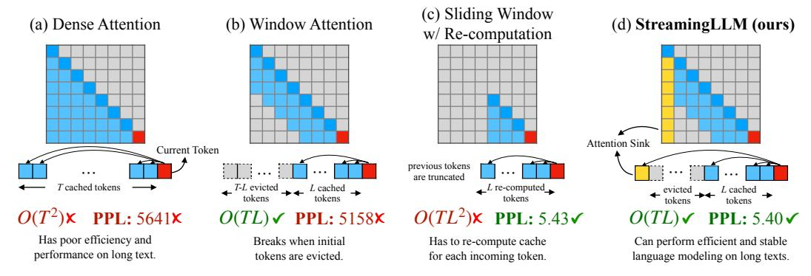
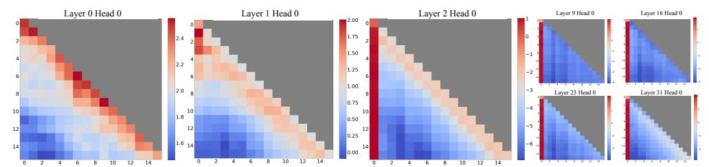
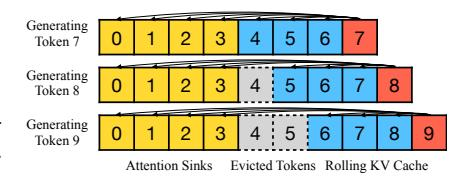
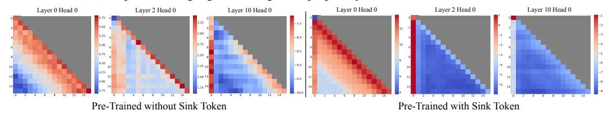
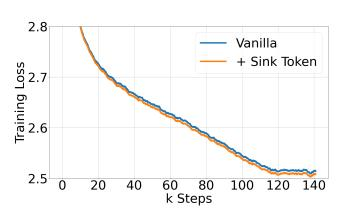
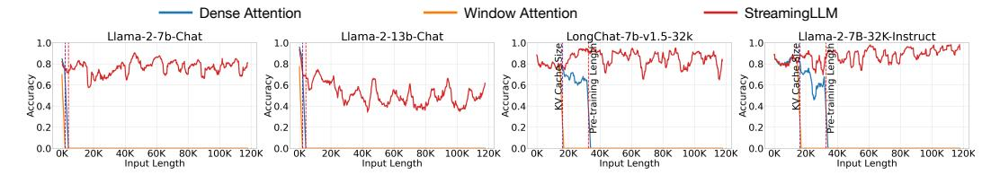
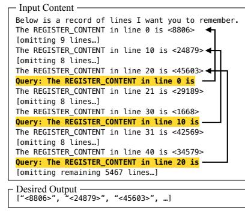

# EFFICIENT STREAMING LANGUAGE MODELS WITH ATTENTION SINKS

Guangxuan Xiao1∗ Yuandong Tian2 Beidi Chen3 Song Han1,4 Mike Lewis2

<https://github.com/mit-han-lab/streaming-llm>

#### ABSTRACT

Deploying Large Language Models (LLMs) in streaming applications such as multi-round dialogue, where long interactions are expected, is urgently needed but poses two major challenges. Firstly, during the decoding stage, caching previous tokens' Key and Value states (KV) consumes extensive memory. Secondly, popular LLMs cannot generalize to longer texts than the training sequence length. Window attention, where only the most recent KVs are cached, is a natural approach — but we show that it fails when the text length surpasses the cache size. We observe an interesting phenomenon, namely *attention sink*, that keeping the KV of initial tokens will largely recover the performance of window attention. In this paper, we first demonstrate that the emergence of *attention sink* is due to the strong attention scores towards initial tokens as a "sink" even if they are not semantically important. Based on the above analysis, we introduce StreamingLLM, an efficient framework that enables LLMs trained with a *finite length* attention window to generalize to *infinite sequence length* without any fine-tuning. We show that StreamingLLM can enable Llama-2, MPT, Falcon, and Pythia to perform stable and efficient language modeling with up to 4 million tokens and more. In addition, we discover that adding a placeholder token as a dedicated attention sink during pre-training can further improve streaming deployment. In streaming settings, StreamingLLM outperforms the sliding window recomputation baseline by up to 22.2× speedup. Code and datasets are provided in the [link.](https://github.com/mit-han-lab/streaming-llm)

#### 1 INTRODUCTION

Large Language Models (LLMs) [\(Radford et al., 2018;](#page-11-0) [Brown et al., 2020;](#page-9-0) [Zhang et al., 2022;](#page-13-0) [OpenAI, 2023;](#page-11-1) [Touvron et al., 2023a;](#page-12-0)[b\)](#page-12-1) are becoming ubiquitous, powering many natural language processing applications such as dialog systems [\(Schulman et al., 2022;](#page-12-2) [Taori et al., 2023;](#page-12-3) [Chiang et al.,](#page-10-0) [2023\)](#page-10-0), document summarization [\(Goyal & Durrett, 2020;](#page-10-1) [Zhang et al., 2023a\)](#page-13-1), code completion [\(Chen](#page-10-2) [et al., 2021;](#page-10-2) [Rozière et al., 2023\)](#page-11-2) and question answering [\(Kamalloo et al., 2023\)](#page-11-3). To unleash the full potential of pretrained LLMs, they should be able to efficiently and accurately perform long sequence generation. For example, an ideal ChatBot assistant can stably work over the content of recent day-long conversations. However, it is very challenging for LLM to generalize to longer sequence lengths than they have been pretrained on, e.g., 4K for Llama-2 [Touvron et al.](#page-12-1) [\(2023b\)](#page-12-1).

The reason is that LLMs are constrained by the attention window during pre-training. Despite substantial efforts to expand this window size [\(Chen et al., 2023;](#page-10-3) [kaiokendev, 2023;](#page-11-4) [Peng et al., 2023\)](#page-11-5) and improve training [\(Dao et al., 2022;](#page-10-4) [Dao, 2023\)](#page-10-5) and inference [\(Pope et al., 2022;](#page-11-6) [Xiao et al., 2023;](#page-12-4) [Anagnostidis et al., 2023;](#page-9-1) [Wang et al., 2021;](#page-12-5) [Zhang et al., 2023b\)](#page-13-2) efficiency for lengthy inputs, the acceptable sequence length remains intrinsically *finite*, which doesn't allow persistent deployments.

In this paper, we first introduce the concept of LLM streaming applications and ask the question:

*Can we deploy an LLM for infinite-length inputs without sacrificing efficiency and performance?*

1 Massachusetts Institute of Technology 2 Meta AI

3 Carnegie Mellon University 4 NVIDIA

∗ Part of the work done during an internship at Meta AI.

> **[图片提取文字 (无描述)]:**
> (c) Sliding Window (a) Dense Attention (b) Window Attention (d) StreamingLLM (ours) w/ Re-computation Attention Sink Current Token previous tokens are truncated T-L evicted \_\_ L cached \_\_ cached tokens L re-computed\_  $O(TL^2)$ × PPL: 5.43 $\checkmark$ PPL: 5641X  $O(TL) \checkmark PPL: 5158 \times$ PPL: 5.40 ✓ Has poor efficiency and Breaks when initial Has to re-compute cache Can perform efficient and stable performance on long text. tokens are evicted. for each incoming token. language modeling on long texts.

Figure 1: Illustration of StreamingLLM *vs*. existing methods. The language model, pre-trained on texts of length L, predicts the Tth token (T ≫ L). (a) Dense Attention has O(T 2 ) time complexity and an increasing cache size. Its performance decreases when the text length exceeds the pre-training text length. (b) Window Attention caches the most recent L tokens' KV. While efficient in inference, performance declines sharply once the starting tokens' keys and values are evicted. (c) Sliding Window with Re-computation rebuilds the KV states from the L recent tokens for each new token. While it performs well on long texts, its O(T L2 ) complexity, stemming from quadratic attention in context re-computation, makes it considerably slow. (d) StreamingLLM keeps the *attention sink* (several initial tokens) for stable attention computation, combined with the recent tokens. It's efficient and offers stable performance on extended texts. Perplexities are measured using the Llama-2-13B model on the first book (65K tokens) in the PG-19 test set.

When applying LLMs for infinite input streams, two primary challenges arise:

- 1. During the decoding stage, Transformer-based LLMs cache the Key and Value states (KV) of all previous tokens, as illustrated in Figure [1](#page-1-0) (a), which can lead to excessive memory usage and increasing decoding latency [\(Pope et al., 2022\)](#page-11-6).
- 2. Existing models have limited length extrapolation abilities, i.e., their performance degrades [\(Press et al., 2022;](#page-11-7) [Chen et al., 2023\)](#page-10-3) when the sequence length goes beyond the attention window size set during pre-training.

An intuitive approach, known as window attention [\(Beltagy et al., 2020\)](#page-9-2) (Figure [1](#page-1-0) b), maintains only a fixed-size sliding window on the KV states of most recent tokens. Although it ensures constant memory usage and decoding speed after the cache is initially filled, the model collapses once the sequence length exceeds the cache size, i.e., *even just evicting the KV of the first token*, as illustrated in Figure [3.](#page-3-0) Another strategy is the sliding window with re-computation (shown in Figure [1](#page-1-0) c), which rebuilds the KV states of recent tokens for each generated token. While it offers strong performance, this approach is significantly slower due to the computation of quadratic attention within its window, making this method impractical for real-world streaming applications.

To understand the failure of window attention, we find an interesting phenomenon of autoregressive LLMs: a surprisingly large amount of attention score is allocated to the initial tokens, irrespective of their relevance to the language modeling task, as visualized in Figure [2.](#page-2-0) We term these tokens "attention sinks". Despite their lack of semantic significance, they collect significant attention scores. We attribute the reason to the Softmax operation, which requires attention scores to sum up to one for all contextual tokens. Thus, even when the current query does not have a strong match in many previous tokens, the model still needs to allocate these unneeded attention values somewhere so it sums up to one. The reason behind *initial* tokens as sink tokens is intuitive: initial tokens are visible to almost all subsequent tokens because of the autoregressive language modeling nature, making them more readily trained to serve as attention sinks.

Based on the above insights, we propose StreamingLLM, a simple and efficient framework that enables LLMs trained with a finite attention window to work on text of infinite length without finetuning. StreamingLLM exploits the fact that attention sinks have high attention values, and preserving them can maintain the attention score distribution close to normal. Therefore, StreamingLLM simply keeps the attention sink tokens' KV (with just 4 initial tokens sufficing) together with the sliding window's KV to anchor the attention computation and stabilize the model's performance. With StreamingLLM, models including Llama-2-[7, 13, 70]B, MPT-[7, 30]B, Falcon-[7, 40]B, and Pythia- [2.9,6.9,12]B can reliably model 4 million tokens, and potentially even more. Compared with the only viable baseline, sliding window with recomputation, StreamingLLM achieves up to 22.2× speedup, realizing the streaming use of LLMs.

> **[图片提取文字 (无描述)]:**
> Layer 0 Head 0 Layer 2 Head 0 Layer 1 Head 0 Layer 9 Head 0 Layer 16 Head 0 1.75 1.50 1.25 1.00 2.0 -3 Layer 23 Head 0 Layer 31 Head 0 0.75 -4 10 0.50 12 0.25 1.6 14

Figure 2: Visualization of the *average* attention logits in Llama-2-7B over 256 sentences, each with a length of 16. Observations include: (1) The attention maps in the first two layers (layers 0 and 1) exhibit the "local" pattern, with recent tokens receiving more attention. (2) Beyond the bottom two layers, the model heavily attends to the initial token across all layers and heads.

Furthermore, we confirm our attention sink hypothesis and demonstrate that language models can be pre-trained to require only a single attention sink token for streaming deployment. Specifically, we suggest that an extra learnable token at the beginning of all training samples can serve as a designated attention sink. By pre-training 160-million parameter language models from scratch, we demonstrate that adding this single sink token preserves the model's performance in streaming cases. This stands in contrast to vanilla models, which necessitate the reintroduction of multiple initial tokens as attention sinks to achieve the same performance level.

Finally, we emphasize that StreamingLLM efficiently generates coherent text from tokens within the KV cache without extending the LLMs' context length. It suits continuous operation needs with minimal memory use and past data reliance. Additionally, StreamingLLM can complement context extension methods to increase the attendable recent context.

## 2 RELATED WORK

Extensive research has been done on applying LLMs to lengthy texts, with three main areas of focus: Length Extrapolation, Context Window Extension, and Improving LLMs' Utilization of Long Text. While seemingly related, it's worth noting that progress in one direction doesn't necessarily lead to progress in the other. For example, extending the context size of LLMs doesn't improve the model's performance beyond the context size, and neither approach ensures effective use of the long context. Our StreamingLLM framework primarily lies in the first category, where LLMs are applied to text significantly exceeding the pre-training window size, potentially even of infinite length. We do not expand the attention window size of LLMs or enhance the model's memory and usage on long texts. The last two categories are orthogonal to our focus and could be integrated with our techniques.

Length extrapolation aims to enable language models trained on shorter texts to handle longer ones during testing. A predominant avenue of research targets the development of relative position encoding methods for Transformer models, enabling them to function beyond their training window. One such initiative is Rotary Position Embeddings (RoPE) [\(Su et al., 2021\)](#page-12-6), which transforms the queries and keys in every attention layer for relative position integration. Despite its promise, subsequent research [\(Press et al., 2022;](#page-11-7) [Chen et al., 2023\)](#page-10-3) indicated its underperformance on text that exceeds the training window. Another approach, ALiBi [\(Press et al., 2022\)](#page-11-7), biases the query-key attention scores based on their distance, thereby introducing relative positional information. While this exhibited improved extrapolation, our tests on MPT models highlighted a breakdown when the text length was vastly greater than the training length. Current methodologies, however, have yet to achieve infinite length extrapolation, causing no existing LLMs to fit for streaming applications.

Context Window Extension centers on expanding the LLMs' context window, enabling the processing of more tokens in one forward pass. A primary line of work addresses the training efficiency problem. Given the attention to computation's quadratic complexity during training, developing a long-context LLM is both a computational and memory challenge. Solutions have ranged from system-focused optimizations like FlashAttention [\(Dao et al., 2022;](#page-10-4) [Dao, 2023\)](#page-10-5), which accelerates attention computation and reduces memory footprint, to approximate attention methods [\(Zaheer](#page-12-7) [et al., 2020b;](#page-12-7) [Beltagy et al., 2020;](#page-9-2) [Wang et al., 2020;](#page-12-8) [Kitaev et al., 2020\)](#page-11-8) that trade model quality for efficiency. Recently, there has been a surge of work on extending pre-trained LLMs with RoPE [\(Chen](#page-10-3) [et al., 2023;](#page-10-3) [kaiokendev, 2023;](#page-11-4) [bloc97, 2023;](#page-9-3) [Peng et al., 2023\)](#page-11-5), involving position interpolation and fine-tuning. However, all the aforementioned techniques only extend LLMs' context window to a limited extent, which falls short of our paper's primary concern of handling limitless inputs.

Figure 3: Language modeling perplexity on texts with 20K tokens across various LLM. Observations reveal consistent trends: (1) Dense attention fails once the input length surpasses the pre-training attention window size. (2) Window attention collapses once the input length exceeds the cache size, i.e., the initial tokens are evicted. (3) StreamingLLM demonstrates stable performance, with its perplexity nearly matching that of the sliding window with re-computation baseline.

**Improving LLMs' Utilization of Long Text** optimizes LLMs to better capture and employ the content within the context rather than merely taking them as inputs. As highlighted by Liu et al. and Li et al., success in the previously mentioned two directions does not necessarily translate to competent utilization of lengthy contexts. Addressing this effective usage of prolonged contexts within LLMs is still a challenge. Our work concentrates on stably harnessing the most recent tokens, enabling the seamless streaming application of LLMs.

#### 3 STREAMINGLLM

#### 3.1 THE FAILURE OF WINDOW ATTENTION AND ATTENTION SINKS

While the window attention technique offers efficiency during inference, it results in an exceedingly high language modeling perplexity. Consequently, the model's performance is unsuitable for deployment in streaming applications. In this section, we use the concept of *attention sink* to explain the failure of window attention, serving as the inspiration behind StreamingLLM.

**Identifying the Point of Perplexity Surge.** Figure 3 shows the perplexity of language modeling on a 20K token text. It is evident that perplexity spikes when the text length surpasses the cache size, led by the exclusion of initial tokens. This suggests that the initial tokens, regardless of their distance from the predicted tokens, are crucial for maintaining the stability of LLMs.

Why do LLMs break when removing *initial* tokens' KV? We visualize attention maps from all layers and heads of the Llama-2-7B and models in Figure 2. We find that, beyond the bottom two layers, the model consistently focuses on the initial tokens across all layers and heads. The implication is clear: removing these initial tokens' KV will remove a considerable portion of the denominator in the SoftMax function (Equation 1) in attention computation. This alteration leads to a significant shift in the distribution of attention scores away from what would be expected in normal inference settings.

SoftMax
$$(x)_i = \frac{e^{x_i}}{e^{x_1} + \sum_{j=2}^{N} e^{x_j}}, \quad x_1 \gg x_j, j \in 2, \dots, N$$
 (1)

There are two possible explanations for the importance of the initial tokens in language modeling: (1) Either their semantics are crucial, or (2) the model learns a bias towards their absolute position. To distinguish between these possibilities, we conduct experiments (Table 1), wherein the first four tokens are substituted with the linebreak token "\n". The observations indicate that the model still significantly emphasizes these initial linebreak tokens. Furthermore, reintroducing them restores the language modeling perplexity to levels comparable to having the original initial tokens. This suggests that the absolute position of the starting tokens, rather than their semantic value, holds greater significance.

**LLMs attend to Initial Tokens as Attention Sinks.** To explain why the model disproportionately focuses on initial tokens—regardless of their semantic relevance to language modeling, we introduce the concept of "attention sink". The nature of the SoftMax function (Equation 1) prevents all attended tokens from having zero values. This requires aggregating some information from other tokens across all heads in all layers, even if the current embedding has sufficient self-contained information for its prediction. Consequently, the model tends to dump unnecessary attention values to specific tokens. A similar observation has been made in the realm of quantization outliers (Xiao et al., 2023; Bondarenko et al., 2023), leading to the proposal of SoftMax-Off-by-One (Miller, 2023) as a potential remedy.

formance on long text. The perplexity is restored when we reintroduce the initial four tokens alongside the recent 1020 tokens (4+1020). Substituting the original four initial tokens with linebreak tokens "\n" (4"\n"+1020) achieves comparable perplexity restoration. Cache config x+y denotes adding x initial tokens with y recent tokens. Perplexities are measured on the first book (65K tokens) in the PG19 test set.

| Llama-2-13B       | PPL (↓) |
|-------------------|---------|
| 0 + 1024 (Window) | 5158.07 |
| 4 + 1020          | 5.40    |
| 4"\n"+1020        | 5.60    |

Table 1: Window attention has poor per- Table 2: Effects of reintroduced initial token numbers on StreamingLLM. (1) Window attention (0+y) has a drastic increase in perplexity. (2) Introducing one or two initial tokens doesn't fully restore model perplexity, showing that the model doesn't solely use the first token as the attention sink. (3) Introducing four initial tokens generally suffices; further additions have diminishing returns. Cache config x+y denotes adding x initial tokens to y recent tokens. Perplexities are evaluated on 400K tokens in the concatenated PG19 test set.

| Cache Config | 0+2048  | 1+2047 | 2+2046 | 4+2044 | 8+2040 |
|--------------|---------|--------|--------|--------|--------|
| Falcon-7B    | 17.90   | 12.12  | 12.12  | 12.12  | 12.12  |
| MPT-7B       | 460.29  | 14.99  | 15.00  | 14.99  | 14.98  |
| Pythia-12B   | 21.62   | 11.95  | 12.09  | 12.09  | 12.02  |
| Cache Config | 0+4096  | 1+4095 | 2+4094 | 4+4092 | 8+4088 |
| Llama-2-7B   | 3359.95 | 11.88  | 10.51  | 9.59   | 9.54   |

Why do various autoregressive LLMs, such as Llama-2, MPT, Falcon, and Pythia, consistently focus on *initial tokens* as their attention sinks, rather than other tokens? Our explanation is straightforward: Due to the sequential nature of autoregressive language modeling, initial tokens are visible to all subsequent tokens, while later tokens are only visible to a limited set of subsequent tokens. As a result, initial tokens are more easily trained to serve as attention sinks, capturing unnecessary attention.

We've noted that LLMs are typically trained to utilize multiple initial tokens as attention sinks rather than just one. As illustrated in Figure 2, the introduction of four initial tokens, as attention sinks, suffices to restore the LLM's performance. In contrast, adding just one or two doesn't achieve full recovery. We believe this pattern emerges because these models didn't include a consistent starting token across all input samples during pre-training. Although Llama-2 does prefix each paragraph with a "<s>" token, it's applied before text chunking, resulting in a mostly random token occupying the zeroth position. This lack of a uniform starting token leads the model to use several initial tokens as attention sinks. We hypothesize that by incorporating a stable learnable token at the start of all training samples, it could singularly act as a committed attention sink, eliminating the need for multiple initial tokens to ensure consistent streaming. We will validate this hypothesis in Section 3.3.

#### ROLLING KV CACHE WITH ATTENTION SINKS

To enable LLM streaming in already trained LLMs, we propose a straightforward method that can recover window attention's perplexity without any model finetuning. Alongside the current sliding window tokens, we reintroduce a few starting tokens' KV in the attention computa- Figure 4: The KV cache of StreamingLLM.

> **[图片提取文字 (无描述)]:**
> Generating Token 7 Generating Token 8 Generating Token 9 Attention Sinks Evicted Tokens Rolling KV Cache

tion. The KV cache in StreamingLLM can be conceptually divided into two parts, as illustrated in Figure 4: (1) Attention sinks (four initial tokens) stabilize the attention computation; 2) Rolling KV Cache retains the most recent tokens, crucial for language modeling. StreamingLLM' design is versatile and can be seamlessly incorporated into any autoregressive language model that employs relative positional encoding, such as RoPE (Su et al., 2021) and ALiBi (Press et al., 2022).

When determining the relative distance and adding positional information to tokens, StreamingLLM focuses on positions within the cache rather than those in the original text. This distinction is crucial for StreamingLLM's performance. For instance, if the current cache (Figure 4) has tokens [0, 1, 2, 3, 6, 7, 8] and is in the process of decoding the 9th token, the positions assigned are [0, 1, 2, 3, 4, 5, 6, 7], rather than the positions in the original text, which would be [0, 1, 2, 3, 6, 7, 8, 9].

For encoding like RoPE, we cache the Keys of tokens *prior to* introducing the rotary transformation. Then, we apply position transformation to the keys in the rolling cache at each decoding phase. On the other hand, integrating with ALiBi is more direct. Here, the contiguous linear bias is applied instead of a 'jumping' bias to the attention scores. This method of assigning positional embedding within the cache is crucial to StreamingLLM's functionality, ensuring that the model operates efficiently even beyond its pre-training attention window size.

#### 3.3 PRE-TRAINING LLMS WITH ATTENTION SINKS

As elaborated in Section [3.1,](#page-3-1) a significant reason for the model's excessive attention to multiple initial tokens is the absence of a designated sink token to offload excessive attention scores. Due to this, the model inadvertently uses globally visible tokens, primarily the initial ones, as attention sinks. A potential remedy can be the intentional inclusion of a global trainable attention sink token, denoted as a "Sink Token", which would serve as a repository for unnecessary attention scores. Alternatively, replacing the conventional SoftMax function with a variant like SoftMax-off-by-One [\(Miller, 2023\)](#page-11-11),

SoftMax1(x)i = 
$$\frac{e^{x_i}}{1 + \sum_{j=1}^{N} e^{x_j}}$$
, (2)

Table 3: Comparison of vanilla attention with prepending a zero token and a learnable sink token during pretraining. To ensure stable streaming perplexity, the vanilla model requires several initial tokens. While Zero Sink shows a slight improvement, it still needs other initial tokens. Conversely, the model trained with a learnable Sink Token shows stable streaming perplexity with only the sink token added. Cache config x+y denotes adding x initial tokens with y recent tokens. Perplexity is evaluated on the first sample in the PG19 test set.

| Cache Config   |       |       | 0+1024 1+1023 2+1022 4+1020 |       |
|----------------|-------|-------|-----------------------------|-------|
| Vanilla        | 27.87 | 18.49 | 18.05                       | 18.05 |
| Zero Sink      | 29214 | 19.90 | 18.27                       | 18.01 |
| Learnable Sink | 1235  | 18.01 | 18.01                       | 18.02 |

which does not require the attention scores on all contextual tokens to sum up to one, may also be effective. Note that SoftMax1 is equivalent to prepending a token with an all-zero Key and Value features in the attention computation. We denote this method as "Zero Sink" to fit our framework.

For validation, we pre-train three language models with 160 million parameters from scratch under identical settings. The first model utilizes the standard SoftMax attention (Vanilla), the second replaced the regular attention mechanism with SoftMax1 (Zero Sink), and one prepending a learnable placeholder token (Sink Token) in all training samples. As shown in Table [3,](#page-5-0) while the zero sink alleviates the attention sink problem to some extent, the model still relies on other initial tokens as attention sinks. Introducing a sink token is highly effective in stabilizing the attention mechanism. Simply pairing this sink token with recent tokens sufficiently anchors the model's performance, and the resulting evaluation perplexity is even marginally improved. Given these findings, we recommend training future LLMs with a sink token in all samples to optimize streaming deployment.

## 4 EXPERIMENTS

We evaluate StreamingLLM using four prominent recent model families: Llama-2 [\(Touvron et al.,](#page-12-1) [2023b\)](#page-12-1), MPT [\(Team, 2023\)](#page-12-9), PyThia [\(Biderman et al., 2023\)](#page-9-5), and Falcon [\(Almazrouei et al., 2023\)](#page-9-6). Notably, Llama-2, Falcon, and Pythia incorporate RoPE [\(Su et al., 2021\)](#page-12-6), whereas MPT employs ALiBi [\(Press et al., 2022\)](#page-11-7) — two of the most influential position encoding techniques in recent research. Our diverse model selection ensures the validity and robustness of our findings. We benchmark StreamingLLM against established baselines such as dense attention, window attention, and the sliding window approach with re-computation. In all subsequent experiments with StreamingLLM, we default to using four initial tokens as attention sinks unless stated otherwise.

#### 4.1 LANGUAGE MODELING ON LONG TEXTS ACROSS LLM FAMILIES AND SCALES

We firstly evaluate StreamingLLM's language modeling perplexity using the concatenated PG19 [\(Rae](#page-11-12) [et al., 2020\)](#page-11-12) test set, which contains 100 long books. For Llama-2 models, the cache size is set at 2048, while for Falcon, Pythia, and MPT models, it's set at 1024. This is half the pre-training window size chosen to enhance visualization clarity.

Figure [3](#page-3-0) illustrates that StreamingLLM can match the oracle baseline (sliding window with recomputation) in terms of perplexity on texts spanning 20K tokens. Meanwhile, the dense attention technique fails when the input length exceeds its pre-training window, and the window attention technique struggles when the input length surpasses the cache size, leading to the eviction of the initial tokens. In Figure [5,](#page-6-0) we further substantiate that StreamingLLM can reliably handle exceptionally extended texts, encompassing more than 4 million tokens, across a spectrum of model families and scales. This includes Llama-2-[7,13,70]B, Falcon-[7,40]B, Pythia-[2.8,6.9,12]B, and MPT-[7,30]B.

Figure 5: Language modeling perplexity of StreamingLLM on super long texts with 4 million tokens across various LLM families and scales. The perplexity remains stable throughout. We use the concatenated test set of PG19 (100 books) to perform language modeling, with perplexity fluctuations due to book transitions.

> **[图片提取文字 (无描述)]:**
> Layer 0 Head 0 Layer 2 Head 0 Layer 10 Head 0 Layer 0 Head 0 Layer 2 Head 0 Layer 10 Head 0 5.75 0 5.50 5.25 5.00 2.50 Pre-Trained without Sink Token Pre-Trained with Sink Token

Figure 7: Visualization of average attention logits over 256 sentences, each 16 tokens long, comparing models pre-trained without (left) and with (right) a sink token. Both maps show the same layers and heads. Key observations: (1) Without a sink token, models show local attention in lower layers and increased attention to initial tokens in deeper layers. (2) With a sink token, there is clear attention directed at it across all layers, effectively collecting redundant attention. (3) With the presence of the sink token, less attention is given to other initial tokens, supporting the benefit of designating the sink token to enhance the streaming performance.

#### 4.2 RESULTS OF PRE-TRAINING WITH A SINK TOKEN

To validate our suggestion that introducing a sink token to all pre-training samples improves streaming LLMs, we trained two language models, each with 160 million parameters, under identical conditions. While one model adhered to the original training settings, the other incorporated a sink token at the start of every training sample. Our experiments employed the Pythia-160M [\(Bider](#page-9-5)[man et al., 2023\)](#page-9-5) codebase and followed its training recipe. We train the models on an 8xA6000 NVIDIA GPU server using the deduplicated Pile [\(Gao et al., 2020\)](#page-10-6) dataset. Apart from reducing the training batch size to 256, we retained all Pythia training configurations, including learning rate schedules, model initialization, and dataset permutations. Both models were trained for 143,000 steps.

> **[图片提取文字 (无描述)]:**
> 2.8 Vanilla Training Loss 2.7 + Sink Token 2.5 20 40 60 80 100 120 140 k Steps

Figure 6: Pre-training loss curves of models w/ and w/o sink tokens. Two models have a similar convergence trend.

Table 4: Zero-shot accuracy (in %) across 7 NLP benchmarks, including ARC-[Challenge, Easy], HellaSwag, LAMBADA, OpenbookQA, PIQA, and Winogrande. The inclusion of a sink token during pre-training doesn't harm the model performance.

| Methods                |              | ARC-c ARC-e  | HS           |              | LBD OBQA PIQA |              | WG           |
|------------------------|--------------|--------------|--------------|--------------|---------------|--------------|--------------|
| Vanilla +Sink Token | 18.6 19.6 | 45.2 45.6 | 29.4 29.8 | 39.6 39.9 | 16.0 16.6  | 62.2 62.6 | 50.1 50.8 |
|                        |              |              |              |              |               |              |              |

Convergence and Normal Model Performance. Including a sink token during pre-training has no negative impact on model convergence and subsequent performance on a range of NLP benchmarks. As depicted in Figure [6,](#page-6-1) models trained with a sink token exhibit similar convergence dynamics compared to their vanilla counterparts. We evaluate the two models on seven diverse NLP benchmarks, including ARC-[Challenge, Easy] [\(Clark et al., 2018\)](#page-10-7), HellaSwag [\(Zellers et al., 2019\)](#page-12-10), LAMBADA [\(Paperno et al., 2016\)](#page-11-13), OpenbookQA [\(Mihaylov et al., 2018\)](#page-11-14), PIQA [\(Bisk et al., 2020\)](#page-9-7), and Winogrande [\(Sakaguchi et al., 2019\)](#page-12-11). As shown in Table [4,](#page-6-2) the model pre-trained with a sink token performs similarly to that trained using the vanilla approach.

Streaming Performance. As illustrated in Table [3,](#page-5-0) the streaming perplexities differ between models trained using traditional methods and those augmented with a sink token. Remarkably, the vanilla model requires the addition of multiple tokens as attention sinks to maintain stable streaming perplexity. In contrast, the model trained with a sink token achieves satisfactory streaming performance using just the sink token.

Table 5: Accuracy (in %) on the ARC-[Easy, Challenge] datasets. Questions were concatenated and answered in a streaming manner to mimic a real-world chat setting. The dense baseline fails due to Out-of-Memory (OOM) errors. Window attention has poor accuracy. StreamingLLM has comparable results with the one-shot sample-by-sample baseline. Window attention and StreamingLLM use cache sizes of 1024.

| Model        | Llama-2 | 2-7B-Cha | t Llama-2 | 2-13B-Cha | t Llama-2 | 2-70B-Chat |
|--------------|---------|----------|-----------|-----------|-----------|------------|
| Dataset      | Arc-E   | Arc-C    | Arc-E     | Arc-C     | Arc-E     | Arc-C      |
| One-shot     | 71.25   | 53.16    | 78.16     | 63.31     | 91.29     | 78.50      |
| Dense        |         |          | (         | OOM       |           |            |
| Window       | 3.58    | 1.39     | 0.25      | 0.34      | 0.12      | 0.32       |
| StreamingLLM | 71.34   | 55.03    | 80.89     | 65.61     | 91.37     | 80.20      |

> **[图片提取文字 (无描述)]:**
> Dense Attention Window Attention StreamingLLM Llama-2-7b-Chat Llama-2-13b-Chat Llama-2-7B-32K-Instruct LongChat-7b-v1.5-32k 1.0 1.0 0.8 €0.6 €0.6 ₩ 0.6 0.4 QC0.4 0.4 ၌ 0.4 100K 120K Input Length Input Length Input Length Input Length

Figure 9: Performance on the StreamEval benchmark. Accuracies are averaged over 100 samples.

Attention Visualization. Figure 7 contrasts attention maps for models pre-trained with and without a sink token. The model without the sink token, similar to Llama-2-7B (Figure 2), shows early-layer local attention and deeper-layer focus on initial tokens. In contrast, models trained with a sink token consistently concentrate on the sink across layers and heads, indicating an effective attention offloading mechanism. This strong focus on the sink, with reduced attention to other initial tokens, explains the sink token's efficacy in enhancing model's streaming performance.

> **[图片提取文字 (无描述)]:**
> Input Content Below is a record of lines I want you to remember. The REGISTER CONTENT in line 0 is <8806> [omitting 9 lines...] The REGISTER CONTENT in line 10 is <24879> < [omitting 8 lines...] The REGISTER CONTENT in line 20 is <45603>. Query: The REGISTER CONTENT in line 0 is The REGISTER CONTENT in line 21 is <29189> [omitting 8 lines...] The REGISTER CONTENT in line 30 is <1668> Query: The REGISTER CONTENT in line 10 is The REGISTER CONTENT in line 31 is <42569> [omitting 8 lines...] The REGISTER CONTENT in line 40 is <34579> Query: The REGISTER CONTENT in line 20 is -[omitting remaining 5467 lines...] Desired Output ["<8806>", "<24879>", "<45603>", ....]

Figure 8: The first sample in StreamEval.

