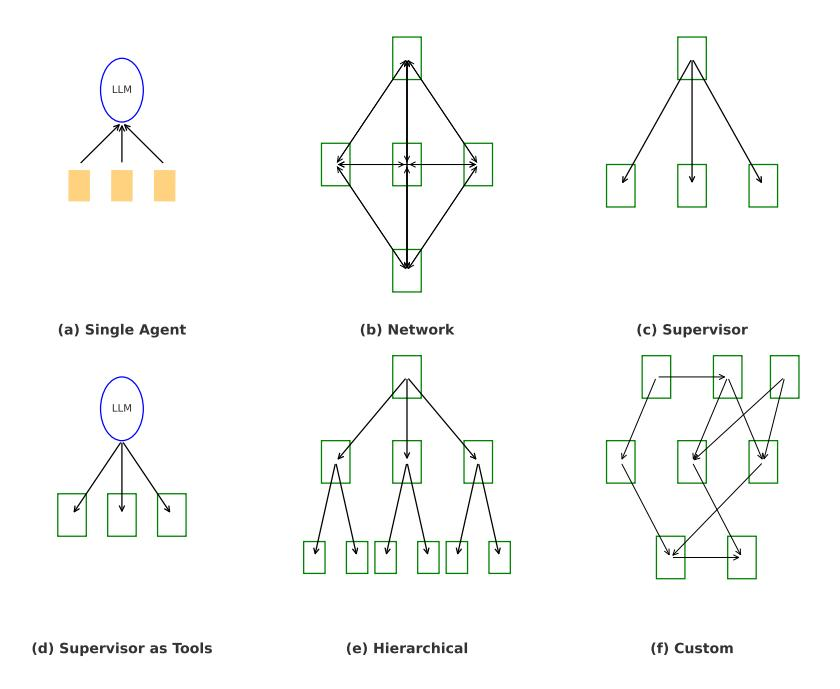

# 2.3 Functional Capabilities

Agents are equipped with a diverse set of functional capabilities, encompassing the concrete operations an agent can perform. Some operate in closed environments, relying solely on static model parameters to generate responses. Others can dynamically invoke tools, such as search engines, APIs, databases, or code execution environments, to augment their reasoning or access real time information. This tool-using behavior enables agents to go beyond static knowledge, making them more robust and useful in open ended or evolving environments.

### 2.4 Agents as a compute graph

To understand and optimize the behavior of AI agents, we need a representation that captures both their modular composition and dynamic control flow. Such a representation enables systematic analysis of execution dependencies, identification of bottlenecks, and opportunities for optimization and scheduling.

A natural way to express agent workloads is as a directed, potentially cyclic, graph of tasks. This graph represents the dataflow and execution dependencies between components. Each node in this graph corresponds to a discrete operation or module. These nodes are hierarchical, where the node may itself be an agent composed of further subgraphs. This allows us to represent agent workloads following the taxonomy of common agentic architectures in Figure [1.](#page-3-0)

> **[图片提取文字 (无描述)]:**
> (a) Single Agent (b) Network (c) Supervisor LLM (d) Supervisor as Tools (e) Hierarchical (f) Custom

Figure 1: Comparison of agentic architectural patterns, inspired by LangGraph's taxonomy [\[16\]](#page-22-15). (a) A single LLM agent invoking external tools directly. (b) A peer-to-peer network of agents coordinating actions. (c) A supervisor agent dispatching work to multiple subordinate agents. (d) A single agent that uses another agent (e.g., a supervisor) as a tool. (e) A hierarchical architecture with clear delegation across layers, a generalized version of the supervisor pattern. (f) A custom, arbitrarily structured agent graph enabling flexible planning.

> **[图片提取文字 (无描述)]:**
> Web search Speech to text LLM Text to speech User voice input Agent voice output

Figure 2: Directed graph for a conversational voice agent

We outline the tasks of the dataflow graph in detail in Table [1,](#page-4-0) where we provide example inputs, outputs, and implementations for each node type. At a high level, these nodes include:

- Agent: A nested or composite controller with its own task graph.
- Tool Call: An external API or function invoked as part of execution.
- Model Execution: A transformer-based inference step.
- Memory: Access to external context or database.
- General Purpose Compute: Lightweight CPU-side processing for logic, parsing, or transformation.

While nodes in the agent graph represent discrete operations, the edges define the dataflow and control dependencies between those operations. An edge typically indicates that one node's output is required by another, such as text, embeddings, tool outputs, or control signals. Edges can represent either synchronous or asynchronous execution. In conditional or cyclic graphs, they may also encode feedback loops or branching behavior.

### 2.4.1 Dataflow Graph Example

To illustrate how a simple agent can be modeled as a dataflow graph, consider a conversational voice agent designed to answer user questions using web search. The graph begins with a user's spoken query as the input node. This signal is transcribed using a Speech-to-Text model and passed to a language model for processing. If the LLM determines that additional context is needed, it triggers a branch that issues web search queries to retrieve relevant information. This process may repeat until the model has enough context to generate a complete response. The final output is converted to speech using a Text-to-Speech model and returned to the user. The complete computation graph, including conditional control flow, is shown in Figure [2.](#page-3-1)

### 2.4.2 Systems-Level Optimizations of Dataflow Graphs

Representing agents as dataflow graphs provides a natural abstraction for modeling the flow of information and computation across discrete operations. This structure not only makes agent behavior more interpretable and modular but also illustrates the space for system-level optimization such as parallelism. Since many agent workloads involve multiple independent or loosely coupled operations, graph structure can reveal natural concurrency across tasks or stages of execution. Leveraging this parallelism is critical for improving latency, throughput, and resource utilization. The primary forms of parallelism exposed by agent graphs include:

- Pipeline parallelism: Decomposing a workload into sequential stages, where each stage processes a different input concurrently. This enables overlapping execution and improved throughput.
- Task parallelism: Executing independent operations or sub-tasks in parallel, often across separate threads, processes, or nodes.

A concrete instance of pipeline parallelism is disaggregated inference, where LLM execution is partitioned into prefill and decode stages and scheduled across distinct hardware resources. This staged architecture enables overlapped execution, allowing the system to initiate prefill for a new input while performing decode on a prior output.

In contrast, an example of task parallelism is expert parallelism. In expert parallelism, different model components are specialized for specific sub-tasks and invoked concurrently. Each expert operates independently on its assigned portion of the workload, enabling the system to process multiple computations simultaneously.

| Task Type               | Inputs                                  | Outputs                                 | Example                                                            |
|-------------------------|-----------------------------------------|-----------------------------------------|--------------------------------------------------------------------|
| Agent                   | Messages, context                       | Sub-tasks or output mes sage         | Recursive agent graph                                              |
| Model Execution         | Token sequence                          | Token logits, hidden state              | Llama [17], GPT [18], BERT [19]                        |
| Model KV Cache          | Write from prefill; Read from decode | KV tensors                              | Device-local memory, re mote memory, or disaggre gated store |
| Tool Call               | Query or structured input               | Tool response or data                   | API request (e.g., calcula tor, search)                         |
| Memory Lookup           | Key, retrieval prompt                   | Retrieved documents or values  | Vector DB (e.g., FAISS, PGVector)                               |
| General Purpose Compute | Data blob, parameters                   | Transformed data                        | JSON parsing, routing logic                               |
| Control Flow / Planner  | Graph state, input tokens               | Execution plan or sub graph | Agent planner module                                               |
| Observation Store       | Event, result                           | Updated memory state                    | Logging, episodic memory                                           |

Table 1: Common Agent Task Types

