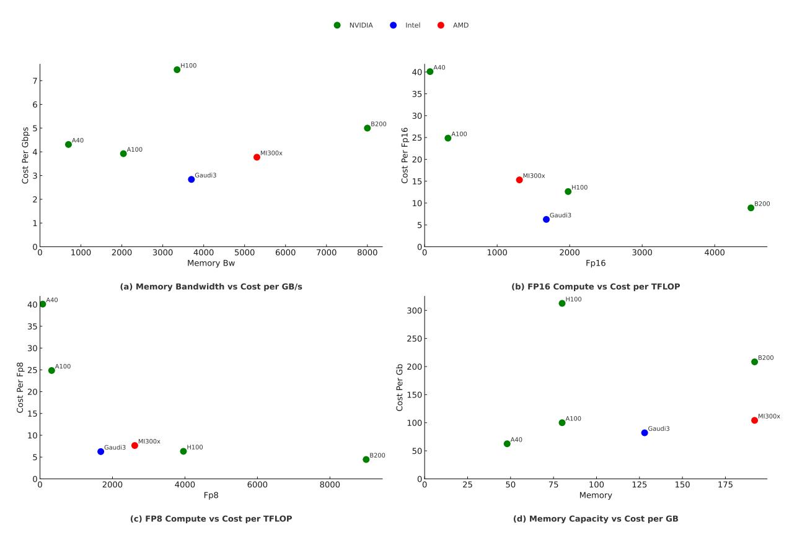

# 3 Design Framework for Heterogeneous Systems

Today's typical AI deployments rely heavily on racks of homogeneous GPUs interconnected via high-bandwidth, scale-up networks. These racks usually consist of identical nodes featuring high-performance GPUs such as NVIDIA's GB200 NVL72[\[20\]](#page-23-3), each offering substantial computational resources (e.g., PFLOPS), large memory bandwidth (upwards of several TB/s), and substantial networking bandwidth facilitated by high-speed interconnects like NVIDIA's NVLink[\[21\]](#page-23-4) or InfiniBand[\[22\]](#page-23-5). NVIDIA's future roadmap further emphasizes scaling up these homogeneous rack-scale GPU systems to deliver even higher throughput and compute density, particularly targeting the demands of large-scale AI workloads [\[23\]](#page-23-6).

However, the uniformity of such homogeneous systems implies a uniform, high cost per unit of resource—whether it be computational FLOPs, memory bandwidth, network bandwidth, or memory capacity—regardless of the specific task or operation. Consequently, deployments incur substantial costs even for tasks that may not require the maximum available specifications in every dimension. For example, an asynchronous AI agent that relies on long-lived external requests may not benefit from a 10% speedup in LLM inference, especially if it requires doubling infrastructure costs.

As highlighted previously, agentic AI workloads comprise diverse, dynamically orchestrated components with varying resource sensitivities. For instance, the decoding phase of large language models (LLMs) benefits significantly from greater memory capacity and bandwidth but does not demand as many computational FLOPs as the prefill stage. Similarly, data-intensive tasks might prioritize high memory bandwidth, while compute-bound operations require maximum computational power. Thus, using a homogeneous system forces a scenario where every task, irrespective of its specific resource requirements, incurs the same high uniform cost per unit of resource utilized.

In contrast, heterogeneous systems offer a compelling alternative by integrating compute nodes (both accelerators and CPUs) with varied specifications across different resource dimensions such as TFLOPS, memory bandwidth and capacity, network bandwidth, disk capacity, and CPU resources. Figure. [4](#page-9-0) shows an analysis of the cost/unit for different resources for a sample of AI HW: memory BW, TFLOPS and memory capacity for different classes and generations of NVIDIA, Intel and AMD HW. As expected, different HW offer a diverse array of cost optimization points for different resources. By adopting such heterogeneous systems, individual components of an agentic AI graph could be optimally mapped onto specific hardware nodes tailored to their unique performance requirements. Consequently, instead of incurring a uniform cost across all operations, each component could leverage the most cost-effective hardware tailored to its needs, intuitively reducing the overall cost associated with executing agentic AI workloads.

The primary challenge in exploiting this insight lies in the lack of infrastructure for systemically representing, scheduling, and executing agentic AI workloads across heterogeneous hardware. In particular, doing so requires:

- 1. A fine-grained workload model that describes agent behavior as low-level execution steps (e.g., model inference, tool use, memory lookup).
- 2. A scheduling system that can reason about cost-performance trade-offs and assign each step to the most appropriate hardware, accounting for both compute and data transfer overhead.
- 3. A heterogeneous compiler and orchestration layer that abstracts away the complexities of generating and placing code on heterogeneous nodes, seamlessly integrating tasks using appropriate networking primitives, and ensuring compliance with SLAs.

When agent workloads are represented as task graphs, the assignment process becomes a constrained optimization problem over that structure. Under empirically grounded assumptions based on hardware benchmarks, vendor specifications, and analytical models for resource usage, this reduces to a convex optimization problem—one that enables efficient and globally optimal planning across heterogeneous compute targets.

The next part formalizes this optimization framework. Subsequent parts in this section describe the systems-level mechanisms required to implement such a planner in practice — including profiling, cost modeling, and runtime execution across heterogeneous infrastructure.

#### 3.1 Formal Optimization Framework

With a structured representation of agent workloads as dataflow graphs, we can now formulate a principled optimization problem to assign tasks to heterogeneous hardware while minimizing cost and meeting performance constraints. These workloads include model execution, memory operations, retrieval and tool calls, as well as control logic — each with distinct compute and communication characteristics. In practice, this is often a multi-objective problem, where Pareto-optimal solutions must balance tradeoffs between cost, latency, energy, or other constraints.

We represent workloads as a directed graph G = (V, E), where each node i ∈ V is a task and each edge (i, k) ∈ E denotes a directed dependency. While many workloads are acyclic, our formulation supports general *directed* graphs, including those with cycles (e.g., recurrent subgraphs, feedback loops), so long as execution constraints (like bounded unrolling or check-pointing) are satisfied in runtime planning.

Each task i must be assigned to a hardware class j ∈ H (e.g., GPU tier, CPU, accelerator). The challenge is to optimize this assignment across all tasks to minimize total system cost, subject to latency, capacity, and throughput constraints. The optimization framework is flexible and supports varying objective functions and constraint formulations, enabling adaptation to different system goals and deployment scenarios.

### 3.1.1 Execution and Cost Model

Each task consumes resources θ (r) ij when executed on hardware j, where r ∈ {compute, memory, bandwidth}. Each device class j offers performance perf(r) j and has resource capacity cap (r) j . Execution time is assumed to be bottlenecked

> **[图片提取文字 (无描述)]:**
> AMD NVIDIA Intel ●H100 40 A40 35 6 30 ●B200 Cost Per Gbps Cost Per Fp16 20 15 A100 A40 A100 MI300x Gaudi3 MI300x ●H100 10 ●B200 Gaudi3 1 oC oC 1000 2000 3000 4000 5000 6000 7000 8000 1000 2000 3000 4000 Memory Bw Fp16 (a) Memory Bandwidth vs Cost per GB/s (b) FP16 Compute vs Cost per TFLOP 40 A40 300 35 250 30 ●B200 Cost Per Fp8 Gost Per 1200 1200 A100 MI300x 100 Gaudi3 10 A40 Gaudi3 H100 50 B200 5 0 0 L 75 100 125 150 2000 4000 6000 8000 25 50 175 Fp8 Memory (c) FP8 Compute vs Cost per TFLOP (d) Memory Capacity vs Cost per GB

Figure 4: Marginal cost-efficiency analysis of contemporary AI accelerators, derived from publicly available hardware specifications [24, 25, 26, 27, 28, 29, 30]. Devices are color-coded by manufacturer: NVIDIA (blue), Intel (green), and AMD (red). (a) Memory bandwidth versus cost per GB/s: Gaudi3 and MI300x exhibit the highest bandwidth efficiency. (b) FP16 compute throughput versus cost per TFLOP: H100, Gaudi3, and MI300x provide strong cost-efficiency. (c) FP8 compute throughput versus cost per TFLOP: B200 offers leading efficiency at low precision. (d) Total memory capacity versus cost per GB: MI300x and A40 deliver the most cost-effective memory provisioning.

by the slowest critical resource, and further affected by static overheads (e.g., network latency, kernel launch time) and communication costs:

$$t_{ij} = \max_{r} \left( \frac{\theta_{ij}^{(r)}}{\operatorname{perf}_{i}^{(r)}} \right) + l_{i} + d_{ij} + \delta_{ij}$$

Where:

- $l_i$ : static latency for task i,
- $d_{ij}$ : pipeline parallelism or inter-device communication cost,
- $\delta_{ij}$ : synchronization overhead from task-parallelism (e.g., all-reduce).
- $\max_r \left( \frac{\theta_{ij}^{(r)}}{\operatorname{perf}_j^{(r)}} \right)$ : latency for the slowest task in the graph.

In practice, these latency terms can be profiled from system traces, benchmarks, or prior executions, rather than analytically modeled.

The cost of executing task i on hardware j is modeled as:

$$Cost_{ij} = \sum_{r} \theta_{ij}^{(r)} \cdot c_j^{(r)} + \gamma \cdot d_{ij}$$

Where:

- c (r) j : cost per unit of resource r (e.g., per TFLOP or GB transferred),
- γ: weight on inter-device communication penalties.

### 3.1.2 Optimization Objective and Constraints

Decision Variables. Let xij ∈ [0, 1] be the fraction of task i assigned to hardware class j. In most systems, xij ∈ {0, 1}, but fractional assignment can represent workload splitting or soft allocation.

Objective. Minimize the total execution cost across all tasks:

$$\min \sum_{i \in V} \sum_{j \in H} x_{ij} \cdot \left( \sum_{r} \theta_{ij}^{(r)} \cdot c_{j}^{(r)} + \gamma \cdot d_{ij} \right) + \lambda \sum_{i \in V} s_{i}$$

The slack variable si represents the amount by which task i's latency can exceed its SLA target. By incorporating si in the objective function with a penalty weight λ, the optimizer is incentivized to minimize SLA violations unless they yield significant cost savings. Setting λ → ∞ enforces hard constraints.

### Constraints.

1. Assignment:

$$\sum_{j \in H} x_{ij} = 1 \quad \forall i \in V$$

2. Latency (with soft SLA):

$$t_i = \sum_j x_{ij} \cdot t_{ij}, \quad t_i - s_i \le T_{SLA}, \quad s_i \ge 0$$

3. Throughput (optional):

$$\sum_{i \in V} \frac{1}{t_i} \ge R$$

4. Hardware capacity:

$$\sum_{i \in V} x_{ij} \cdot \theta_{ij}^{(r)} \le \operatorname{cap}_{j}^{(r)} \quad \forall j, r$$

5. Feasibility:

$$x_{ij} \in [0,1] \quad \forall i, j$$

This convex formulation allows modeling heterogeneous system cost-performance tradeoffs, either through analytical resource scaling or profiled latency/cost estimates.

### Worked Example: Optimizing Prefill/Decode under SLA

As a concrete instantiation, we'll explore an example of optimizing a task node that is an LLM execution. We can further decompose the LLM execution task as a task graph G = (V, E) where:

- V = {prefill, decode},
- E = {(prefill → decode)}

We consider two device types available for running each task: HP (high performance) and CO (cost optimized). This example models a single inference request, consisting of one prefill followed by one decode phase, with no context reuse or multi-turn interaction.

We assume:

- Prefill processes 1000 input tokens,
- Decode generates 500 output tokens,
- Latency and cost per device-task pair are known from profiling. We assume these numbers are collected under optimal conditions for throughput and utilization, including maximized batching efficiency.
- There is no task splitting, i.e., each device exclusively executes its task.

| Task                  | Device Type | Latency (ms) | Cost (per token)             |
|-----------------------|-------------|--------------|------------------------------|
| Prefill               | HP          | 80           | \$0.00008                    |
| Prefill               | CO          | 130          | \$0.00005                    |
| Decode                | HP          | 25           | \$0.00006                    |
| Decode                | CO          | 30           | \$0.00002                    |
| KV Transfer (HP → CO) | —           | 10           | \$0.000005 per prefill token |

Table 3: Hypothetical latency and cost (profiled) for each task-device combination. HP represents a high-performance but expensive node, and CO represents a cost optimized option.

Let TSLA = 120 ms, which reflects a typical threshold for interactive user experiences (e.g., web search or chatbot responses). We evaluate valid assignments:

### Option A: Prefill and decode on HP

$$t = 80 + 25 = 105 \text{ ms}, \quad \text{SLA satisfied}$$
 
$$\text{Cost} = 1000 \cdot 0.00008 + 500 \cdot 0.00006 = \boxed{\$0.11}$$

#### Option B: Prefill on HP, decode on CO

$$t = 80 + 30 + 10 = 120 \text{ ms}, \quad \text{SLA satisfied}$$
 
$$\text{Cost} = 1000 \cdot 0.00008 + 500 \cdot 0.00002 + 1000 \cdot 0.000005 = \boxed{\$0.095}$$

Option C: All on CO

$$t = 130 + 30 = 160 \text{ ms}, \quad \text{SLA violated}$$
 
$$\text{Cost} = 1000 \cdot 0.00005 + 500 \cdot 0.00002 = \boxed{\$0.07}$$

Optimization Result: Given ti ≤ TSLA, Option C is infeasible. Option B achieves lower cost than Option A while satisfying latency constraints. Thus, the optimal assignment is:

$$x_{\text{prefill},HP} = 1, \quad x_{\text{decode},CO} = 1$$

This decision reflects a fundamental tradeoff: while high-performance devices may offer lower latency, they incur a higher cost per token. Strategic disaggregation enables more efficient resource allocation, reducing overall cost while meeting strict latency requirements.

Further, this example demonstrates how the optimization leverages device heterogeneity to minimize cost without violating SLAs. In larger graphs, this formulation generalizes to multi-node pipelines, branching agent flows, and cyclic controller-executor patterns — using profiled characteristics or analytical estimates for runtime planning. This extends beyond model execution tasks and includes workloads composed of tool calls, external APIs, and data processing.

